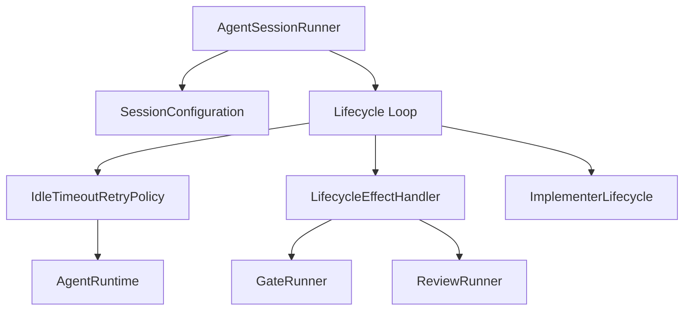

# Implementation Plan: AgentSessionRunner Refactor

## Context & Goals
- **Spec**: N/A - derived from architecture review findings (High severity: "AgentSessionRunner is a complex class mixing multiple concerns")
- **Prior work**: `mala-cavk.2` extracted helpers from `run_session` (675->~85 lines), but helper methods remain tightly coupled
- **Objective**: Further decompose AgentSessionRunner (~1535 LOC) to improve testability and separation of concerns
- **Target state**: AgentSessionRunner becomes orchestration-only, delegating retry logic, lifecycle effects, and configuration to extracted components

## Scope & Non-Goals

### In Scope
- **Priority 1**: Extraction of `IdleTimeoutRetryPolicy` (retry logic, backoff handling)
- **Priority 2**: Extraction of `LifecycleEffectHandler` (gate/review effect processing)
- **Priority 3**: Extraction of `SessionConfiguration` (config initialization - optional based on complexity)
- Updating `AgentSessionRunner` to delegate to these new components
- Unit tests for new components with isolated testing of policies
- Maintain existing public API (`run_session`, `AgentSessionInput`, `AgentSessionOutput`)
- Maintain existing behavior and test coverage

### Out of Scope (Non-Goals)
- Refactoring `MalaOrchestrator` (separate plan exists: `2026-01-04-orchestrator-refactor-plan.md`)
- Modifying `ImplementerLifecycle` state machine (already well-designed)
- Modifying `MessageStreamProcessor` or `ContextPressureHandler` (already extracted)
- Adding new features or changing behavior
- Changes to SDK client protocol
- Changing the public API of `run_session`

## Assumptions & Constraints

### Assumptions
- The logic within `_run_message_iteration` and `_prepare_idle_retry` is self-contained enough to be extracted without circular dependencies on the Runner itself
- The existing integration tests cover the main session flows sufficiently to detect regressions
- Helpers should generally be stateless regarding the session, receiving `state` as an argument or returning directives

### Implementation Constraints
- **Public API unchanged**: `run_session` signature and return type remain identical
- **Python 3.11+**: Use `dataclasses`, `asyncio`, and type annotations
- **Module location**: Separate files in `src/pipeline/` (not a subpackage)
- **Callback pattern**: Follow existing `SessionCallbacks` pattern for dependency injection
- **TYPE_CHECKING imports**: Use for circular import prevention as per existing patterns
- Ensure all logging and telemetry contexts are preserved during extraction
- The `AgentSessionRunner` must hold references to new components, initialized in `__init__` or `create` factory method

### Testing Constraints
- **Coverage**: 85% threshold maintained for new and modified files
- **Behavioral integration tests unchanged**: Tests that exercise `run_session` end-to-end must pass without modification
- **Unit test migration**: Tests for private methods (e.g., `TestHandleGateCheck`, `TestHandleReviewCheck`) that directly call `_handle_gate_check()`, `_handle_review_effect()`, etc. will be migrated to test the new extracted components (`test_idle_retry_policy.py`, `test_lifecycle_effect_handler.py`)
- **Unit test isolation**: Mock SDK dependencies when testing extracted components

## Prerequisites
- [x] Architecture review complete (source of this plan)
- [x] Prior extraction completed (`MessageStreamProcessor`, `ContextPressureHandler`)
- [ ] Verify `tests/integration/pipeline/test_agent_session_runner.py` passes before starting
- [ ] No blocking dependencies - this is a pure refactor

## High-Level Approach

**Phased PR approach with full decomposition goal:**

1. **Phase 1 - Extract Idle Retry Logic (Priority 1)**: Move `_run_message_iteration`, `_prepare_idle_retry`, and `_apply_retry_backoff` into a new `IdleTimeoutRetryPolicy` class. This class handles execution of agent iterations with retry semantics.

2. **Phase 2 - Extract Lifecycle Effects (Priority 2)**: Move `_handle_gate_check`, `_handle_review_check`, `_handle_gate_effect`, and `_handle_review_effect` into a `LifecycleEffectHandler`. This class interacts with `GateRunner` and `ReviewRunner` for side effect handling.

3. **Phase 3 - Extract Configuration (Priority 3, Optional)**: Move `_initialize_session` and config derivation into `SessionConfiguration` or factory function if it provides meaningful simplification after Phases 1-2.

4. **Refactor Orchestrator**: Update `AgentSessionRunner._run_lifecycle_loop` to use these collaborators instead of private methods. Target: AgentSessionRunner remains the entry point but delegates logic.

## Technical Design

### Architecture

The `AgentSessionRunner` transforms from a "God Object" into a coordinator:



### New Components

#### 1. `IdleTimeoutRetryPolicy`
Responsible for executing the agent loop iteration with idle timeout handling.
- **Inputs**: `SDKClientFactoryProtocol`, `MessageStreamProcessor`, `SessionCallbacks`, `RetryConfig` (max retries, backoff tuple)
- **Methods**:
  - `execute_iteration(query, options, state, lifecycle_ctx, lint_cache, idle_timeout_seconds, tracer) -> IterationResult`: Runs the iteration, catching idle timeouts, applying backoff, and determining if retry is needed
  - Encapsulates `_prepare_idle_retry`, `_apply_retry_backoff`, `_process_message_stream`, `_disconnect_client_safely`
- **Extracted from**: Lines 1202-1220 (`_disconnect_client_safely`), 1202-1240 (`_apply_retry_backoff`), 1234-1340 (`_prepare_idle_retry`), 1314-1340 (`_process_message_stream`), 1345+ (`_run_message_iteration`)

#### 2. `LifecycleEffectHandler`
Responsible for executing side effects triggered by state transitions.
- **Inputs**: `AgentSessionConfig` (for prompts, max retries), `SessionCallbacks`, `MalaEventSink`
- **Methods**:
  - `process_gate_check(...)`: Handles gate validation (from `_handle_gate_check`)
  - `process_review_check(...)`: Handles human review requests (from `_handle_review_check`)
  - `process_gate_effect(...)`: Routes gate results (from `_handle_gate_effect`)
  - `process_review_effect(...)`: Routes review results (from `_handle_review_effect`)
- **Extracted from**: Lines 718-775, 775-910, 913-1070, 1073-1200

#### 3. `SessionConfiguration` (Utility/Factory - Optional)
Responsible for setting up the environment.
- **Methods**:
  - `initialize_config(input: AgentSessionInput) -> SessionConfig`: Merges defaults and overrides
- **Decision criteria**: Extract if it provides meaningful simplification after Phases 1-2; defer if complexity reduction is minimal

### Data Model

New dataclasses for component return types:

```python
@dataclass
class IterationResult:
    """Result from IdleTimeoutRetryPolicy.execute_iteration().

    Allows the coordinator to update SessionExecutionState and decide next action.
    """
    success: bool
    session_id: str | None = None
    # True if iteration completed normally, False if max retries exceeded
    should_continue: bool = True
    # Error message if iteration failed
    error_message: str | None = None
```

Existing types preserved:
- `SessionConfig`, `SessionExecutionState`, `SessionPrompts` remain in `agent_session_runner.py`
- New components receive these via method parameters (stateless pattern)

### API/Interface Design

New component interfaces follow existing patterns:
- Components are initialized with dependencies (factory or constructor injection)
- Methods receive state as parameters rather than mutating internal state
- Return values allow the Runner to update `SessionExecutionState`

### File Impact Summary

| Path | Status | Description |
|------|--------|-------------|
| `src/pipeline/agent_session_runner.py` | Modify | Remove logic, inject/instantiate new components, delegate calls (~500+ LOC removed) |
| `src/pipeline/idle_retry_policy.py` | **New** | Contains retry loop and backoff logic (~200 LOC) |
| `src/pipeline/lifecycle_effect_handler.py` | **New** | Contains gate and review handling logic (~350 LOC) |
| `src/pipeline/session_configuration.py` | **New (Optional)** | Contains config initialization logic (~100 LOC) |
| `tests/unit/pipeline/test_idle_retry_policy.py` | **New** | Unit tests for retry logic/backoff |
| `tests/unit/pipeline/test_lifecycle_effect_handler.py` | **New** | Unit tests for side-effect routing |
| `tests/integration/pipeline/test_agent_session_runner.py` | Exists | Verify no regressions |
| `src/pipeline/message_stream_processor.py` | Exists | Already extracted (384 LOC) - no changes |
| `src/pipeline/context_pressure_handler.py` | Exists | Already extracted (253 LOC) - no changes |
| `src/domain/lifecycle.py` | Exists | State machine (687 LOC) - no changes |

## Risks, Edge Cases & Breaking Changes

### Risks
- **Regression in session behavior**: Complex async logic with error handling edge cases
  - *Mitigation*: Preserve exact behavior, existing tests as behavioral specification
- **Circular imports**: New modules may need types from agent_session_runner
  - *Mitigation*: Use TYPE_CHECKING imports; shared types stay in existing modules
- **State synchronization**: `AgentSessionRunner` owns the `SessionExecutionState`. Helpers must receive the state or return values that allow the Runner to update it
  - *Decision*: Helpers are stateless regarding session, receiving `state` as argument or returning directives

### Edge Cases
- **Deeply Nested Retries**: Ensure retry policy doesn't lose context or infinite loop
  - *Mitigation*: Unit tests for max-retry limits
- **Idle timeout during gate/review**: Session must be resumable after timeout
- **Context pressure during lifecycle loop**: Checkpoint must be fetchable
- **Concurrent cancellation**: CancelledError handling must remain correct

### Breaking Changes & Compatibility
- **None expected for public API**: Internal private methods will disappear, which is safe
- **Internal API only**: Helper methods are private; moving is safe
- **Test fixtures**: May need updating for new component boundaries

## Testing & Validation Strategy

### Unit Tests
- `test_idle_retry_policy.py`: Mock `SDKClientFactoryProtocol` and verify:
  - Normal execution (no timeout)
  - Timeout triggers backoff and retry
  - Max retries exceeded raises error
  - Backoff timing correct
- `test_lifecycle_effect_handler.py`: Mock `GateRunner`/`ReviewRunner` and verify:
  - Gate check routing
  - Review check routing
  - Effect handling produces correct transitions

### Integration Tests
- Existing `tests/integration/pipeline/test_agent_session_runner.py` must pass unchanged
- Full session run scenarios produce same outcomes
- These tests are critical to prove "No Regression"

### Regression Tests
- Run e2e tests to verify end-to-end behavior

### Manual Verification
- Not strictly required if integration tests pass, but running a sample session (e.g., via CLI) to ensure logs look correct is good practice

### Acceptance Criteria Coverage

| Architecture Review Finding | Covered By |
|-----------------------------|------------|
| Extract `IdleTimeoutRetryPolicy` | `src/pipeline/idle_retry_policy.py` implementation |
| Isolated unit testing of policies | `tests/unit/pipeline/test_idle_retry_policy.py` |
| Delegate more fully to MessageStreamProcessor | Already done in prior work |
| No regression in session execution | Integration tests, e2e tests |
| No public API changes | Code review of AgentSessionRunner interface |

**Behavioral Acceptance Criteria** (must all be true after refactor):
- [ ] `AgentSessionRunner` no longer contains exponential backoff calculation logic
- [ ] `AgentSessionRunner` no longer directly calls `asyncio.sleep()` for retry delays
- [ ] All gate/review side-effect routing is handled by `LifecycleEffectHandler`
- [ ] `IdleTimeoutRetryPolicy` can be unit tested with mock SDK client (no real subprocess)
- [ ] `LifecycleEffectHandler` can be unit tested with mock gate/review runners

## Open Questions

1. **SessionConfiguration extraction**: Defer decision to after Phases 1-2 completion - extract only if meaningful complexity reduction is achieved. Currently marked as optional/Phase 3.

2. **Internal import breakage**: Need to verify no other modules import internals from `agent_session_runner.py`. Quick grep suggests private methods (`_prepare_idle_retry`, etc.) are not imported externally - safe to proceed.

## Next Steps

After this plan is approved, run `/create-tasks` to generate:
- `--beads` to create Beads issues with dependencies for multi-agent parallelization
- (default) to generate TODO.md checklist for simpler tracking
