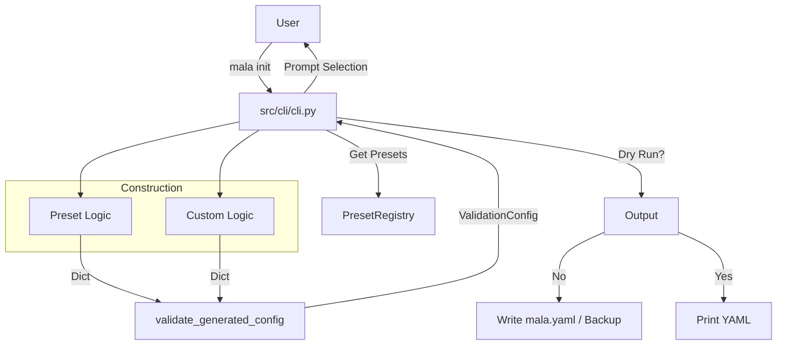

# Implementation Plan: mala init

## Context & Goals
- **Spec**: [docs/2026-01-10-mala-init-spec.md](../docs/2026-01-10-mala-init-spec.md)
- Add `mala init` command for interactive config generation
- Support preset selection (python-uv, node-npm, go, rust) or custom command entry
- Generate valid `mala.yaml` with backup/dry-run support

## Scope & Non-Goals
- **In Scope**
  - Numbered menu UI (1-5): options 1-4 select presets, option 5 selects custom mode
  - Custom command entry for 7 standard commands (setup, build, test, lint, format, typecheck, e2e)
  - File backup to `.bak` before overwrite
  - Validation via helper function before writing
  - `--dry-run` flag support
  - Success output with file contents and next steps tip

- **Out of Scope (Non-Goals)**
  - Auto-detection of project type from existing files
  - Monorepo configurations (multiple languages)
  - `validation_triggers` config generation
  - Coverage config generation
  - New dependencies (use existing typer/pyyaml only)
  - `--preset <name>` flag for non-interactive usage (deferred to future)

## Assumptions & Constraints
- `typer.prompt` returns string input; integer conversion and range validation handled manually via while-loop
- Target config file is always `mala.yaml` in current working directory
- `PresetRegistry` contains: python-uv, node-npm, go, rust (read-only, not modified)

### Implementation Constraints
- Must use existing typer framework - no new dependencies
- Single command architecture: one `@app.command()` function in `src/cli/cli.py`; private helpers (e.g., `_prompt_menu()`) within the same file are acceptable for testability
- Input validation via manual while-loop for numbered input (not click.IntRange or choices parameter)
- YAML output via PyYAML with `default_flow_style=False, sort_keys=True`
- Validation API sequence (confirmed from codebase):
  - `ValidationConfig.from_dict(data: dict) -> ValidationConfig` — structural validation
  - `_validate_config(config: ValidationConfig) -> None` — semantic validation (raises `ConfigError`)
  - New helper `validate_generated_config(data: dict) -> None` wraps both, raises `ConfigError` on failure

### Testing Constraints
- Primary focus: integration tests using `typer.testing.CliRunner`
- Minimal unit tests (validation helper only)
- Use `tmp_path` for filesystem effect verification
- Verify exit codes: 0 (success), 1 (error), 130 (Ctrl+C)

## Prerequisites
- [x] Spec approved (gate status: resolved/proceed)
- [x] Typer CLI framework in place
- [x] `PresetRegistry` available in codebase
- [x] Validation logic (`ValidationConfig`, `_validate_config`) available in `src/domain/validation/config_loader.py`

### Schema Confirmation
The existing `mala.yaml` schema (verified from codebase and docs) supports these top-level structures:
- **Preset form:** `{"preset": "python-uv"}` — valid, loads preset config
- **Commands form:** `{"commands": {"test": "pytest", "lint": "ruff check"}}` — valid, defines custom commands

Both forms are valid inputs to `ValidationConfig.from_dict()`. The generated YAML will match one of these shapes exactly. Confirmed by examining existing `mala.yaml` in repo root which uses `preset: python-uv` at top level.

## High-Level Approach

1. **Add Validation Helper**: Create `validate_generated_config(data: dict)` in `src/domain/validation/config_loader.py` that wraps `ValidationConfig.from_dict()` + `_validate_config()`.

2. **Implement CLI Command**: Add `init` command function to `src/cli/cli.py`:
   - Display numbered menu: `1) python-uv  2) node-npm  3) go  4) rust  5) custom`
   - While-loop for input validation until valid selection in range 1-5
   - If preset selected (1-4): construct `{"preset": name}` dict
   - If custom selected (5): prompt for 7 commands (setup, build, test, lint, format, typecheck, e2e), build `{"commands": {...}}` dict (omit empty)
   - Call validation helper (raises `ConfigError` on invalid config)

3. **Handle File Operations**:
   - If `--dry-run`: print YAML to stdout, do NOT write files or create backup
   - If not `--dry-run` and `mala.yaml` exists: backup via `shutil.copy()` first, then write
   - If not `--dry-run` and `mala.yaml` does not exist: write directly

4. **Verify**: Add integration tests covering all requirements (R1-R7).

## Technical Design

### Architecture
The feature is a CLI interaction layer that constructs a dictionary representing the config, validates it using the Domain layer, and persists it.



### Data Model
N/A - No new persistent data models. The command generates a YAML file matching the existing `ValidationConfig` schema.

- Input: User menu selection (1-5), optional custom command strings
- Output: YAML string with `preset: <name>` or `commands: {...}` structure

### Output Stream Contract
**Prompts route to stderr, YAML routes to stdout** for clean separation in tests.

- **Success (exit 0)** — both dry-run and non-dry-run (per spec R7):
  - stdout: YAML content + blank line + tip text ("Run `mala run` to start")
  - stderr: interactive prompts only (menu, command entry)
- **Validation error (exit 1)**:
  - stdout: empty
  - stderr: prompts + error message (e.g., "Error: At least one command must be defined")
- **File operation error (exit 1)**:
  - stdout: empty
  - stderr: prompts + error message with file paths
- **Ctrl+C interrupt (exit 130)**:
  - stdout/stderr: prompts up to interrupt point only

**Why print YAML on non-dry-run?** Spec R7 requires "display generated file contents and tip" on success. This provides user feedback that the file was written correctly.

### YAML Output Contract
- **Serialization**: `yaml.dump(data, default_flow_style=False, sort_keys=True)` with trailing newline
- **Stdout vs File**: Both print and write use the same YAML string (semantic equivalence)
- **Test assertions**: Parse YAML from output, don't match exact strings (per spec's semantic equivalence requirement)
- **Prompt handling in tests**: Interactive prompts may appear in stdout/stderr; tests should extract YAML content or read file, not match full prompt transcripts

### API/Interface Design
- CLI interface: `mala init [--dry-run]`
- **New helper in `src/domain/validation/config_loader.py`**:
```python
def validate_generated_config(data: dict[str, Any]) -> None:
    """
    Validates a dictionary against the config schema and semantic rules.

    Args:
        data: Config dictionary (e.g., {"preset": "python-uv"} or {"commands": {...}})

    Raises:
        ConfigError: If structural validation fails (from_dict) or semantic validation fails (_validate_config)

    Implementation:
        config = ValidationConfig.from_dict(data)  # raises ConfigError if invalid structure
        _validate_config(config)                   # raises ConfigError if semantic rules violated
    """
```

- **Private helpers in `src/cli/cli.py`** (optional, for testability):
  - `_prompt_menu_selection() -> int` — while-loop prompt returning 1-5
  - `_prompt_custom_commands() -> dict[str, str]` — prompt for 7 commands, return non-empty ones
  - `_write_with_backup(path: Path, content: str) -> None` — backup and write logic

### File Impact Summary

| Path | Status | Description |
|------|--------|-------------|
| `src/cli/cli.py` | Exists | Add `init` command with interaction loop |
| `src/domain/validation/config_loader.py` | Exists | Add `validate_generated_config` helper |
| `tests/integration/cli/test_init.py` | **New** | Integration tests using `CliRunner` |

## Risks, Edge Cases & Breaking Changes

### Exception Handling → Exit Codes
The `init` command must **explicitly catch and translate** all exceptions to ensure deterministic exit codes (not rely on Click/Typer defaults, which vary by context):

| Exception | Exit Code | Implementation |
|-----------|-----------|----------------|
| `ConfigError` | 1 | Catch, print to stderr, `raise typer.Exit(1)` |
| `OSError` (file ops) | 1 | Catch, print to stderr, `raise typer.Exit(1)` |
| `KeyboardInterrupt` | 130 | Catch explicitly, `raise typer.Exit(130)` |
| `click.exceptions.Abort` (EOF) | 1 | Catch explicitly, `raise typer.Exit(1)` |

**Implementation pattern:**
```python
@app.command()
def init(dry_run: bool = False) -> None:
    try:
        # ... prompts and logic ...
        validate_generated_config(data)
        # ... file operations ...
    except ConfigError as e:
        typer.echo(f"Error: {e}", err=True)
        raise typer.Exit(1)
    except OSError as e:
        typer.echo(f"Error writing file: {e}", err=True)
        raise typer.Exit(1)
    except KeyboardInterrupt:
        raise typer.Exit(130)
    except click.exceptions.Abort:
        raise typer.Exit(1)
```

**Test configuration:** Integration tests should use `CliRunner(mix_stderr=False)` to separate stdout/stderr, and keep default `catch_exceptions=True` to get exit codes via `result.exit_code`.

### Edge Cases & Failure Modes
- **Invalid menu selection**: User enters "0", "6", "abc", or other invalid input
  - *Handling*: While-loop re-prompts with "Invalid choice, please enter 1-5:" until valid integer 1-5 received
- **Empty custom config**: User presses Enter for all 7 commands (custom mode)
  - *Handling*: Validation fails with "At least one command must be defined". Exit code 1 with error to stderr.
- **Whitespace-only command**: User enters "   " for a command
  - *Handling*: Treat as empty after strip (command skipped)
- **File access issues**: Permissions error writing `mala.yaml`
  - *Handling*: Catch `OSError`, print friendly message to stderr, exit code 1
- **Existing backup**: `mala.yaml.bak` already exists
  - *Handling*: Overwrite `.bak` silently (per R4 spec - most recent backup wins)
- **Backup failure**: Cannot create `.bak` file (permissions, disk full)
  - *Handling*: Abort without modifying original `mala.yaml`, exit code 1
- **Write failure after backup**: Backup succeeded but new file write fails
  - *Handling*: Keep `.bak` intact, report error with both file paths, exit code 1
- **Dry-run with existing file**: `--dry-run` specified and `mala.yaml` exists
  - *Handling*: Do NOT create or modify `.bak`, do NOT modify `mala.yaml`, only print to stdout
- **Ctrl+C**: User interrupts at any point
  - *Handling*: Exit code 130 (SIGINT), no files modified
- **EOF (Ctrl+D)**: User sends EOF during prompt
  - *Handling*: Exit code 1, no files modified

### File Operation Ordering
1. Generate config dict from user input
2. Validate config (exit on error)
3. If `--dry-run`: print YAML to stdout → done
4. If `mala.yaml` exists: copy to `mala.yaml.bak` (overwriting existing .bak)
5. Write new `mala.yaml`
6. Print success output with YAML content and tip

**Note on atomicity (optional enhancement):** For extra robustness against partial writes, could write to a temp file first, then rename to `mala.yaml`. However, the spec does not require atomicity and the current approach is acceptable for MVP.

### Breaking Changes & Compatibility
- None. This is a new command that does not modify existing behavior.

## Testing & Validation Strategy

### Unit Tests
- **`tests/unit/domain/validation/test_config_loader.py`** (extend if exists):
  - `validate_generated_config` with valid preset dict
  - `validate_generated_config` with valid custom dict
  - `validate_generated_config` with empty commands dict (expect error)

### Integration Tests (`tests/integration/cli/test_init.py`)
Use `typer.testing.CliRunner` with simulated stdin input.

**Test setup:**
- Use `CliRunner(mix_stderr=False)` to separate stdout/stderr
- Use `catch_exceptions=True` (default) to capture exit codes

**Assertion strategy:**
- For YAML content: `yaml.safe_load(result.stdout)` — works cleanly since prompts route to stderr
- For file content: read `mala.yaml` from `tmp_path` and parse
- For exit codes: assert `result.exit_code == expected`
- For errors: assert error substring in `result.stderr`
- For prompts: don't assert on prompt text; only assert on final outcome (exit code, file content)

**Test scenarios:**
- **Scenario 1 - Dry Run Preset**: Input "1", use `--dry-run`. Assert exit 0, no file created, parse stdout YAML and verify `{"preset": "python-uv"}`.
- **Scenario 2 - Custom Flow**: Input "5", provide "pytest" for test and "ruff check" for lint, skip others. Assert exit 0, parse `mala.yaml` and verify commands dict.
- **Scenario 3 - Backup**: Create `mala.yaml` with `preset: go`. Run `init` with input "1". Assert `mala.yaml.bak` contains old content, `mala.yaml` has new preset.
- **Scenario 4 - Validation Fail**: Input "5", press Enter for all 7 commands. Assert exit 1, "at least one command" in stderr, no file written.
- **Scenario 5 - Invalid Input Loop**: Input "0\n6\nabc\n1". Assert exit 0, final file/output contains valid preset (don't assert on intermediate prompts).
- **Scenario 6 - Command Help**: Run `mala init --help`. Assert exit 0, "--dry-run" in output.
- **Scenario 7 - Dry Run No Backup**: Create existing `mala.yaml`. Run with `--dry-run` and input "1". Assert neither `mala.yaml` nor `mala.yaml.bak` modified (compare timestamps or content).

### Acceptance Criteria Coverage
| Spec Requirement | Covered By |
|------------------|------------|
| R1 — Command availability | `cli.py` decorator, Scenario 6 |
| R2 — Preset selection UI | `cli.py` menu loop, Scenario 1 |
| R3 — Custom command entry | `cli.py` custom branch, Scenario 2 |
| R4 — File backup | `cli.py` file ops, Scenario 3 |
| R5 — Output validation | `config_loader.py` helper, Scenario 4, unit tests |
| R6 — Dry-run support | `cli.py` flag check, Scenario 1 |
| R7 — Success output | `cli.py` print, Scenarios 1-3 (output assertions) |

## Open Questions
- **`--preset` flag**: Should wizard support `--preset <name>` to skip interactive selection for scripted usage? (Deferred per spec - future enhancement)

## Next Steps
After this plan is approved, run `/create-tasks` to generate:
- `--beads` → Beads issues with dependencies for multi-agent execution
- (default) → TODO.md checklist for simpler tracking
