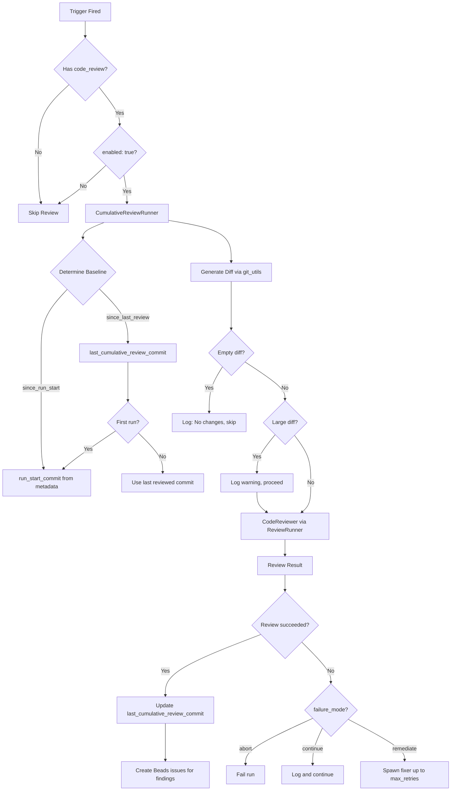

# Implementation Plan: Unified Code Review Configuration

## Context & Goals
- **Spec**: N/A — derived from user description
- Consolidate all code review settings into a unified `code_review` config block in `mala.yaml`
- Move CLI options (reviewer_type, retries, cerberus args) into config
- Support code_review at all trigger levels: `session_end` (per-issue), `epic_completion`, and `run_end`
- Same YAML shape for code_review regardless of trigger type
- Enable cumulative reviews at epic/run level to catch cross-issue integration bugs

## Scope & Non-Goals

### In Scope
- Unified `code_review` config block with same structure across all triggers
- Move all review CLI options into config: `reviewer_type`, `max_retries`, cerberus args
- Per-issue reviews via `session_end` trigger (replaces current implicit review)
- Cumulative reviews via `epic_completion` trigger
- Cumulative reviews via `run_end` trigger
- Baseline tracking for cumulative reviews (`since_run_start` or `since_last_review`)
- Deprecate CLI flags for review settings (keep compatibility during transition, remove in next major version)

### Out of Scope (Non-Goals)
- Replacing per-issue reviews (this supplements, not replaces)
- Chunking large diffs into multiple review calls (warn but proceed as single review)
- Interactive review resolution (findings go to beads, not blocking prompts)
- "Thinking mode" configuration (deprecated)

## Assumptions & Constraints
- Uses existing review infrastructure (Cerberus or AgentSDK, configurable via `reviewer_type`)
- Supplements per-issue reviews (does not replace them)
- `git` is available for diff generation
- `RunMetadata` is the source of truth for baseline tracking

### Implementation Constraints
- Must integrate with existing `validation_triggers` system
- Must work with existing `ReviewRunner` / review infrastructure
- No performance constraints beyond existing reviewer limits (warn on large diffs)
- Must use `frozen=True` for configuration dataclasses (follow codebase patterns)
- Must not break existing validation command execution
- Code review runs *in addition* to configured validation commands for a trigger

### Testing Constraints
- Unit tests for config parsing and baseline tracking
- Integration test for at least one trigger type (epic_completion or run_end)
- Follow existing test patterns in `tests/`

## Prerequisites
- [x] Existing `RunCoordinator` and `ValidationTriggers` infrastructure
- [x] Existing `ReviewRunner` and `CerberusReviewer`
- [x] Git utilities for diff generation (`src/infra/git_utils.py`)

## High-Level Approach

**Architecture: Extend validation_triggers with code_review as a trigger action**

Add `code_review` as a nested configuration block under existing triggers (`epic_completion`, `run_end`, `session_end`). This treats code review as a special trigger action rather than a validation command.

Key components:
1. **Config extension**: Add `CodeReviewConfig` and `CerberusConfig` dataclasses with baseline, failure_mode, max_retries
2. **Trigger integration**: When trigger fires, check for `code_review` config and invoke review
3. **Review execution**: Use existing `ReviewRunner` infrastructure with cumulative diff
4. **Baseline tracking**: Persist `last_cumulative_review_commit` in run metadata (per-trigger)
5. **Output**: Create beads issues for findings (like P2/P3 per-issue findings)

## Technical Design

### Architecture



**Data Flow:**
1. Trigger fires (epic completion, session end, or run end)
2. Check `validation_triggers.<trigger>.code_review` config
3. If `enabled: true`, compute baseline commit (run start HEAD or last reviewed commit)
4. Generate diff from baseline to current HEAD
5. If diff is empty, skip with log message (do NOT update baseline)
6. If diff is large (>threshold lines), warn but proceed
7. Invoke reviewer via existing ReviewRunner
8. On success: create beads issues for findings, update `last_cumulative_review_commit`
9. On failure: apply failure_mode (abort/continue/remediate)

### Trigger Integration

**How triggers are fired** (integration with existing orchestrator):

**`session_end`** (existing trigger, enhanced):
- Fires in `AgentSessionRunner` after agent session completes successfully
- Current context: `SessionInfo` with `issue_id` is available in memory
- Code review runs after validation commands, before session is finalized
- On failure: applies `code_review.failure_mode` (can retry via remediate)

**`epic_completion`** (existing trigger, enhanced):
- Fires in `MalaOrchestrator` when all issues in an epic are resolved
- Epic is considered complete when: all child issues have status `RESOLVED` or `WONT_FIX`
- **Important**: Epic completion requires ALL issues to complete (success or explicit skip); partial failure does not trigger
- Context: `epic_id` is passed from the orchestrator's epic tracking
- Code review runs after validation commands configured for the trigger

**`run_end`** (NEW trigger):
- Fires in `MalaOrchestrator.run()` after the main processing loop completes
- Fires regardless of success/failure; `fire_on` field filters:
  - `success`: Only if all processed issues succeeded
  - `failure`: Only if any issue failed
  - `both`: Always fires after run completes
- Fires after all `epic_completion` triggers have been processed
- Context: Final run state (success count, failure count) available

**Orchestrator changes required**:
```python
# In MalaOrchestrator.run():
async def run(self) -> tuple[int, int]:
    # Capture run_start_commit at beginning
    if not self.run_metadata.run_start_commit:
        self.run_metadata.run_start_commit = await get_current_head(self.repo_path)

    # ... existing processing loop ...

    # After all issues processed, before returning:
    await self._fire_run_end_trigger(success_count, total_count)

    return success_count, total_count
```

### Data Model

**New Config Classes** (in `src/domain/validation/config.py`):

```python
@dataclass(frozen=True)
class CerberusConfig:
    """Cerberus-specific settings (passed to review-gate CLI).

    Maps to existing DefaultReviewer interface in cerberus_review.py.
    Uses tuple[str, ...] for args to avoid shell parsing issues.
    """
    timeout: int = 300

    # Args passed to reviewer - use tuple[str, ...] to avoid shell quoting issues
    # These match the existing DefaultReviewer constructor signature
    spawn_args: tuple[str, ...] = field(default_factory=tuple)  # e.g., ("--verbose",)
    wait_args: tuple[str, ...] = field(default_factory=tuple)   # e.g., ("--timeout", "600")

    # Environment variables for reviewer process
    env: tuple[tuple[str, str], ...] = field(default_factory=tuple)  # e.g., (("DEBUG", "1"),)

    # Note: spawn_args/wait_args mirror existing DefaultReviewer interface
    # which already uses these two buckets for the spawn and wait phases


@dataclass(frozen=True)
class CodeReviewConfig:
    """Unified code review configuration - same shape at all trigger levels."""
    enabled: bool = False
    reviewer_type: Literal["cerberus", "agent_sdk"] = "cerberus"
    failure_mode: FailureMode = FailureMode.CONTINUE  # For execution_error only
    max_retries: int = 3  # Retries on execution_error

    # Threshold for failing on findings (separate from failure_mode)
    # "none" = never fail on findings, just create beads issues
    # "P0" = fail if any P0 finding, "P1" = fail if any P0 or P1 finding
    finding_threshold: Literal["P0", "P1", "P2", "P3", "none"] = "none"

    # Only for cumulative reviews (epic_completion, run_end)
    # session_end ignores this (always reviews current issue's commits)
    baseline: Literal["since_run_start", "since_last_review"] | None = None

    # Reviewer-specific config
    cerberus: CerberusConfig | None = None
```

**Updated Trigger Configs** (all use same CodeReviewConfig):

```python
@dataclass(frozen=True, kw_only=True)
class BaseTriggerConfig:
    """Base configuration for validation triggers."""
    failure_mode: FailureMode
    commands: tuple[TriggerCommandRef, ...]
    max_retries: int | None = None
    code_review: CodeReviewConfig | None = None  # NEW: unified code review config


@dataclass(frozen=True, kw_only=True)
class EpicCompletionTriggerConfig(BaseTriggerConfig):
    """Configuration for epic completion triggers."""
    epic_depth: EpicDepth
    fire_on: FireOn


@dataclass(frozen=True, kw_only=True)
class SessionEndTriggerConfig(BaseTriggerConfig):
    """Configuration for session end triggers."""
    pass


# NEW: Run end trigger for cumulative review at end of run
@dataclass(frozen=True, kw_only=True)
class RunEndTriggerConfig(BaseTriggerConfig):
    """Configuration for run end triggers.

    Fires when the entire mala run completes (all issues processed).
    fire_on controls whether to fire on success, failure, or both.
    """
    fire_on: FireOn = FireOn.SUCCESS
```

**`run_end` trigger schema and loader wiring**:

```yaml
# YAML key: validation_triggers.run_end
validation_triggers:
  run_end:
    commands: []
    failure_mode: continue
    fire_on: success  # Uses existing FireOn enum: success, failure, both
    code_review:
      enabled: true
      # ... rest of CodeReviewConfig
```

**Config loader changes** (in `config_loader.py`):
- Add `run_end` to the set of recognized trigger keys alongside `session_end`, `epic_completion`, `periodic`
- Parse `run_end` block into `RunEndTriggerConfig` (similar to existing trigger parsing)
- `fire_on` field uses existing `FireOn` enum (already defined for `epic_completion`)
- **Unknown keys handling**: Error on unknown trigger keys (fail-fast, prevent typos from silently being ignored)

**Run Metadata Fields** (in `src/infra/io/log_output/run_metadata.py`):

```python
# Baseline tracking for cumulative reviews
run_start_commit: str | None = None  # HEAD at run start (captured once, None if not set)
last_cumulative_review_commits: dict[str, str] = field(default_factory=dict)
# Key format:
#   - "run_end" for run-level reviews
#   - "epic_completion:<epic_id>" for epic-level reviews (e.g., "epic_completion:bd-abc123")
# Example: {"run_end": "abc123", "epic_completion:bd-xyz789": "def456"}

# Per-issue baseline: NOT stored in metadata
# Computed dynamically via get_baseline_for_issue(repo_path, issue_id) at review time
```

**Backward compatibility for new fields**:
- `run_start_commit`: Use `Optional[str]` with default `None`; `load()` uses `.get("run_start_commit")` with fallback
- `last_cumulative_review_commits`: Use `dict` with default `{}`; `load()` uses `.get("last_cumulative_review_commits", {})`
- Existing metadata files without these fields will load successfully with defaults

### Baseline Tracking

**Per-issue reviews (`session_end`)**:
- Uses existing `get_baseline_for_issue(repo_path, issue_id)` from `git_utils.py`
- This function finds the parent of the first commit with `bd-{issue_id}:` prefix
- The baseline is computed dynamically at review time (same as current per-issue review)
- Diff range: `baseline..HEAD` (two-dot, linear commits from baseline to HEAD)
- `session_end` trigger fires while the agent session is still active, so `issue_id` is available from the current `SessionInfo`
- **Fallback if baseline not found**: If no commits with `bd-{issue_id}:` exist (fresh issue, no commits yet), skip review and log "No commits for issue, skipping review"

**Cumulative reviews (`epic_completion`, `run_end`)**:
Two baseline modes supported (configurable per-trigger):

- **`since_run_start`**: Review all commits from `run_start_commit` to current HEAD
- **`since_last_review`**: Review commits from last reviewed commit to current HEAD

**`run_start_commit` capture**:
- Captured in `MalaOrchestrator.run()` at the start of the run, before any agent work begins
- Uses `git rev-parse HEAD` on the main repo path (not worktrees)
- Stored in `RunMetadata.run_start_commit`
- If run is resumed, reuse existing `run_start_commit` from metadata (don't recapture)

**Diff range semantics**:
- Uses two-dot diff (`baseline..HEAD`): linear range of commits reachable from HEAD but not from baseline
- This is correct for linear history (typical for mala runs with sequential commits)
- For merged branches: reviews all commits on HEAD's branch since divergence from baseline

Baseline commit persistence rules:
- **Advance on review completion**: `last_cumulative_review_commits[key]` updates after reviewer completes (regardless of findings)
  - Rationale: Rely on beads deduplication to prevent spam; don't re-review same diff repeatedly
  - Does NOT advance on execution_error (reviewer failed to run)
- **Per-trigger-instance tracking**: Each trigger instance maintains its own baseline:
  - `run_end` uses key `"run_end"`
  - `epic_completion` uses key `"epic_completion:<epic_id>"` (allows independent baselines per epic)
- **First run fallback**: If no previous baseline exists for `since_last_review`, fall back to `run_start_commit`
- **Persistence scope**: Stored in `RunMetadata`; survives session restarts within the same run

**Run identity and metadata lifecycle**:

- **Run identifier**: Each mala run has a unique `run_id` (UUID), stored in `RunMetadata.run_id`
- **Metadata storage**: `RunMetadata` is persisted to `<output_dir>/run_metadata.json` (existing pattern)
- **Run detection**:
  - Fresh run: No `run_metadata.json` exists, or `--fresh` flag passed → new `run_id`, clear all baselines
  - Resumed run: `run_metadata.json` exists and matches current issue set → reuse `run_id` and all baselines
- **Clearing behavior**:
  - `run_start_commit`: Set once at run start, preserved on resume, cleared on fresh run
  - `last_cumulative_review_commits`: Preserved on resume (allows incremental cumulative reviews), cleared on fresh run
- **Cross-invocation behavior**:
  - Same working directory, same issues, no `--fresh`: Considered resumed run, baselines preserved
  - Same directory but different issues or `--fresh`: New run, baselines cleared
  - Different directory: Always fresh run (separate metadata file)

**Baseline advancement summary**:

| Outcome | Advance Baseline? | Rationale |
|---------|-------------------|-----------|
| completed_no_findings | Yes | Normal success |
| completed_with_findings | Yes | Findings tracked in beads, dedupe handles future |
| execution_error | No | Review didn't complete, should retry on next trigger |
| skipped (empty diff) | No | Nothing reviewed, preserve baseline |
| skipped (baseline not found) | No | Error condition |

**Git edge case handling**:
- **Shallow clone**: If baseline commit is not reachable (`git rev-parse` fails), log error with message "Baseline commit {sha} not reachable (shallow clone?), skipping review" and skip review (do not fail run)
- **Detached HEAD**: Works normally; `git rev-parse HEAD` returns the detached commit
- **Missing run_start_commit on resume**: If metadata lacks `run_start_commit`, capture current HEAD as baseline (logs warning about late capture)

### Diff Generation

**Git commands used** (exact semantics):
```bash
# Patch diff for review content (what changed)
git diff <baseline> <head>  # Two-argument form, NOT range syntax

# Commit list for context (what commits are included)
git log --oneline <baseline>..<head>  # Range syntax for commit selection

# Diff stats for size warning
git diff --stat <baseline> <head>
```

Note: `git diff A B` produces a patch showing changes from A to B. This is correct for linear and non-linear history. The `A..B` range syntax is for commit selection (log), not diff.

- Compute diff from baseline commit to current HEAD using `git_utils`
- **Empty diffs**: Skip Cerberus call entirely, log "No changes since baseline, skipping review"
  - Do NOT update `last_cumulative_review_commit` (preserve baseline for next trigger)
- **Large diffs**: Warn in logs if diff exceeds threshold (default: 5000 lines), but proceed with full diff
  - Log: "WARNING: Large diff ({n} lines) may affect review quality"

### Review Invocation

- Configurable via `reviewer_type` setting: `cerberus` or `agent_sdk`
- Uses existing `ReviewRunner` / review infrastructure
- Outputs findings as beads issues with priorities (P0-P3, same scale as per-issue findings)
- One beads issue per finding (consistent with per-issue review behavior)

### Finding Deduplication

Findings from cumulative reviews may overlap with per-issue reviews. Deduplication uses existing beads fingerprinting:

**Dedupe key components**:
- `file_path`: Normalized file path
- `line_range`: Start and end line numbers
- `finding_hash`: Hash of finding title/description

**Beads issue metadata for cumulative reviews**:
```yaml
labels:
  - review-finding
  - cumulative-review          # Distinguishes from per-issue findings
  - trigger:<trigger_type>     # e.g., trigger:epic_completion
notes: |
  Source: cumulative_review
  Trigger: epic_completion
  Epic: bd-xyz789              # For epic_completion only
  Baseline: abc123..def456
  Priority: P1
```

**Attribution rules**:
- `session_end` findings: Linked to the specific issue being reviewed
- `epic_completion` findings: Linked to the epic issue (parent of reviewed issues)
- `run_end` findings: Linked to a synthetic "run summary" issue or the first epic in the run

**Duplicate handling**:
- If finding matches existing beads issue (same file/line/hash), skip creation
- Existing beads deduplication handles cross-trigger duplicates automatically
- Cumulative review findings do NOT override per-issue findings (both can coexist if slightly different)

### Failure Handling

**Precedence rules** (trigger `failure_mode` vs `code_review.failure_mode`):
- `BaseTriggerConfig.failure_mode` applies to **validation command failures** only
- `CodeReviewConfig.failure_mode` applies to **code review failures** only
- These are independent: a trigger can have `failure_mode: abort` for commands but `code_review.failure_mode: continue` for reviews
- `max_retries` fields are also independent: `BaseTriggerConfig.max_retries` for commands, `CodeReviewConfig.max_retries` for reviews
- Retries are per-trigger-fire (reset on each trigger invocation)

### Review Outcome Definitions

Three distinct outcomes from a code review:

| Outcome | Definition | Example |
|---------|------------|---------|
| **execution_error** | Reviewer could not produce a result | Timeout, process crash, non-zero exit, network error |
| **completed_with_findings** | Reviewer succeeded and returned findings | P0-P3 findings reported |
| **completed_no_findings** | Reviewer succeeded with no findings | Clean review, all checks pass |

**failure_mode applies to execution_error only**:
- **`abort`**: Fail run immediately on execution_error
- **`continue`**: Log error, skip review, continue run
- **`remediate`**: Retry reviewer up to `max_retries`, then behave like `continue`

**Findings are handled via finding_threshold** (separate from failure_mode):
```python
@dataclass(frozen=True)
class CodeReviewConfig:
    # ... existing fields ...
    finding_threshold: Literal["P0", "P1", "P2", "P3", "none"] = "none"
    # "none" = never fail on findings, just create beads issues
    # "P0" = fail if any P0 finding
    # "P1" = fail if any P0 or P1 finding (default for blocking reviews)
```

**Behavior matrix**:

| Outcome | failure_mode | finding_threshold | Result |
|---------|--------------|-------------------|--------|
| execution_error | abort | any | Fail run |
| execution_error | continue | any | Log, skip, continue |
| execution_error | remediate | any | Retry reviewer, then continue |
| completed_with_findings (P0) | any | P0 or P1 | Create beads, attempt remediation, then fail if unresolved |
| completed_with_findings (P1) | any | P1 | Create beads, attempt remediation, then fail if unresolved |
| completed_with_findings (P2/P3) | any | P1 | Create beads, continue (below threshold) |
| completed_with_findings | any | none | Create beads, continue |
| completed_no_findings | any | any | Success, continue |

**Remediation behavior** (clarified):

`failure_mode: remediate` applies to **execution_error** (retry the reviewer process).

When **findings exceed threshold**, remediation is automatic:
1. Create beads issues for all findings
2. For `session_end`: Resume current agent session with findings as context
3. For `epic_completion`/`run_end`: Spawn dedicated fixer session with findings
4. Fixer attempts to address findings (up to `max_retries` cycles)
5. Re-run review after each fix attempt
6. If findings still exceed threshold after retries: Fail run (per `finding_threshold`)
7. If findings resolved or drop below threshold: Continue

**Fixer session guards** (prevent infinite loops):
- Fixer sessions do NOT fire their own `run_end` or `epic_completion` triggers
- Fixer sessions skip `session_end` code review (only run validation commands)
- Maximum `max_retries` per trigger fire (not cumulative across runs)

### Trigger Configuration

**Unified code_review shape** (same structure at all trigger levels):

```yaml
validation_triggers:
  # Per-issue review (replaces current implicit review behavior)
  session_end:
    commands:
      - ref: test
    failure_mode: continue
    code_review:
      enabled: true
      reviewer_type: cerberus      # or agent_sdk
      failure_mode: remediate      # For execution_error: abort, continue, or remediate
      finding_threshold: P1        # Fail if P0 or P1 findings (or "none" to never fail on findings)
      max_retries: 3
      cerberus:                    # cerberus-specific args (when reviewer_type: cerberus)
        timeout: 300
        spawn_args: []             # tuple of strings, no shell parsing
        wait_args: []

  # Cumulative review after epic completes
  epic_completion:
    commands:
      - ref: test
    failure_mode: continue
    epic_depth: top_level
    fire_on: success
    code_review:
      enabled: true
      reviewer_type: cerberus
      baseline: since_last_review  # since_run_start or since_last_review
      failure_mode: continue
      max_retries: 3
      cerberus:
        timeout: 600               # longer timeout for cumulative

  # Cumulative review at end of run
  run_end:
    commands: []                   # No validation commands, just review
    failure_mode: continue
    fire_on: success               # Only on successful run completion
    code_review:
      enabled: true
      reviewer_type: cerberus
      baseline: since_run_start    # Review everything since run started
      failure_mode: continue
      max_retries: 3
```

**Key points:**
- `session_end`: No `baseline` field (always reviews current issue's commits)
- `epic_completion` / `run_end`: Has `baseline` field for cumulative review scope
- **No inheritance**: Each trigger has full config; no top-level defaults
- **Explicit opt-in**: Review only runs if `enabled: true`

**Config validation rules**:

| Condition | Behavior | Rationale |
|-----------|----------|-----------|
| `baseline` set for `session_end` | WARN, ignore field | Field is not applicable |
| `baseline` missing for `epic_completion`/`run_end` | WARN, default to `since_run_start` | Sensible default, but user should be explicit |
| `enabled: true` with invalid `reviewer_type` | ERROR, fail config load | Invalid config |
| `enabled: false` with other fields set | OK, no warning | Common pattern to disable temporarily |
| `reviewer_type: cerberus` with `cerberus: null` | OK, use defaults | CerberusConfig has sane defaults |
| `max_retries < 0` | ERROR, fail config load | Invalid value |
| `failure_mode: remediate` with `max_retries: 0` | WARN, behaves like `continue` | Technically valid but likely misconfiguration |

### Observability

**Structured log fields** for cumulative review events:

| Event | Log Level | Fields |
|-------|-----------|--------|
| Review started | INFO | `trigger_type`, `baseline_mode`, `baseline_sha`, `head_sha` |
| Empty diff skip | INFO | `trigger_type`, `baseline_sha`, `head_sha`, `skip_reason="empty_diff"` |
| Large diff warning | WARN | `trigger_type`, `diff_lines`, `threshold`, `baseline_sha`, `head_sha` |
| Missing baseline | WARN | `trigger_type`, `baseline_mode`, `skip_reason="baseline_not_found"` |
| Review completed | INFO | `trigger_type`, `status`, `finding_count`, `duration_ms` |
| Baseline advanced | DEBUG | `trigger_type`, `old_baseline`, `new_baseline` |
| Reviewer error | ERROR | `trigger_type`, `error_type`, `error_message` |

**Example log output**:
```
INFO  cumulative_review: Review started trigger_type=epic_completion baseline_mode=since_last_review baseline_sha=abc123 head_sha=def456
WARN  cumulative_review: Large diff warning trigger_type=epic_completion diff_lines=7500 threshold=5000
INFO  cumulative_review: Review completed trigger_type=epic_completion status=success finding_count=3 duration_ms=45000
DEBUG cumulative_review: Baseline advanced trigger_type=epic_completion old_baseline=abc123 new_baseline=def456
```

### API/Interface Design

**CumulativeReviewRunner Interface** (New: `src/pipeline/cumulative_review_runner.py`):

```python
class CumulativeReviewRunner:
    """Orchestrates cumulative code review execution."""

    def __init__(
        self,
        review_runner: ReviewRunner,
        git_utils: GitUtils,
        beads_client: BeadsClient,
        logger: Logger,
    ) -> None:
        ...

    async def run_review(
        self,
        trigger_type: TriggerType,
        config: CodeReviewConfig,
        run_metadata: RunMetadata,
        repo_path: Path,
        interrupt_event: asyncio.Event,
        *,
        issue_id: str | None = None,  # For session_end: used with get_baseline_for_issue()
        epic_id: str | None = None,   # For epic_completion: used in baseline key
    ) -> CumulativeReviewResult:
        """Execute code review for a trigger.

        Args:
            trigger_type: The trigger that fired (for baseline tracking)
            config: Code review configuration from trigger
            run_metadata: Current run metadata (for baseline lookup/update)
            repo_path: Path to the git repository
            interrupt_event: Signal to abort review
            issue_id: For session_end triggers, the issue being reviewed
            epic_id: For epic_completion triggers, the epic that completed

        Returns:
            CumulativeReviewResult with status, findings, and updated baseline

        Baseline determination:
            - session_end: Calls get_baseline_for_issue(repo_path, issue_id) dynamically
            - epic_completion: Uses last_cumulative_review_commits["epic_completion:<epic_id>"]
            - run_end: Uses last_cumulative_review_commits["run_end"]

        Error handling:
            - If baseline cannot be determined (no commits, shallow clone), returns
              CumulativeReviewResult(status="skipped", skip_reason="...")
        """
        ...

    def _get_baseline_commit(
        self,
        trigger_type: TriggerType,
        config: CodeReviewConfig,
        run_metadata: RunMetadata,
    ) -> str:
        """Determine baseline commit for diff generation."""
        ...

    def _generate_diff(
        self,
        baseline_commit: str,
        head_commit: str,
    ) -> DiffResult:
        """Generate diff between commits, with size warning."""
        ...


@dataclass(frozen=True)
class CumulativeReviewResult:
    """Result of a cumulative review execution."""
    status: Literal["success", "skipped", "failed"]
    findings: tuple[ReviewFinding, ...]
    new_baseline_commit: str | None  # Set on success, None on skip/failure
    skip_reason: str | None  # Set when status is "skipped"
```

**Updated git_utils** (in `src/infra/git_utils.py`):

```python
async def get_diff_stat(
    repo_path: Path,
    from_commit: str,
    to_commit: str = "HEAD",
) -> DiffStat:
    """Get diff statistics between commits.

    Returns:
        DiffStat with line counts and file list
    """
    ...

async def get_diff_content(
    repo_path: Path,
    from_commit: str,
    to_commit: str = "HEAD",
) -> str:
    """Get unified diff content for review."""
    ...
```

**Deprecated/Removed CLI flags**:
- `--reviewer-type` -> now in `code_review.reviewer_type`
- `--max-review-retries` -> now in `code_review.max_retries`
- Cerberus CLI args -> now in `code_review.cerberus.*`

**CLI Deprecation Strategy**: CLI flags continue to work with deprecation warning; config takes precedence. Remove in next major version.

### File Impact Summary

| Path | Status | Description |
|------|--------|-------------|
| `src/domain/validation/config.py` | Exists | Add `CodeReviewConfig`, `CerberusConfig`, `RunEndTriggerConfig`; update `BaseTriggerConfig` |
| `src/domain/validation/config_loader.py` | Exists | Parse `code_review` block in triggers; add `run_end` trigger parsing |
| `src/pipeline/cumulative_review_runner.py` | **New** | Implements cumulative review logic (baseline, diff, execution) |
| `src/pipeline/run_coordinator.py` | Exists | Call `CumulativeReviewRunner` in trigger validation loop |
| `src/pipeline/review_runner.py` | Exists | Accept `CodeReviewConfig` instead of individual CLI args |
| `src/infra/io/log_output/run_metadata.py` | Exists | Add `run_start_commit`, `last_cumulative_review_commits` dict |
| `src/infra/git_utils.py` | Exists | Add `get_diff_stat()`, `get_diff_content()` helpers |
| `src/infra/clients/cerberus_review.py` | Exists | Accept `CerberusConfig` instead of CLI args |
| `src/orchestration/orchestrator.py` | Exists | Capture `run_start_commit` at run start; fire `run_end` trigger |
| `src/cli/run.py` | Exists | Deprecate review CLI flags; read from config |
| `tests/unit/domain/validation/test_config.py` | Exists | Test new config types and parsing |
| `tests/unit/pipeline/test_cumulative_review_runner.py` | **New** | Test baseline logic and runner |
| `tests/integration/orchestration/test_cumulative_review.py` | **New** | Integration tests for cumulative review flow |
| `docs/validation.md` | Exists | Document unified `code_review` config |
| `docs/cli-reference.md` | Exists | Document deprecated flags |

## Risks, Edge Cases & Breaking Changes

### Risks
- **Large diffs may overwhelm reviewer**: Mitigated by warning logs; reviewer may truncate or summarize internally
- **Duplicate findings**: Cumulative review may find issues already caught per-issue; beads deduplication should handle this

### Edge Cases & Failure Modes

**Skip criteria** (apply to all triggers, checked in order):
1. **Baseline cannot be determined**: Log error, skip review
   - Shallow clone, baseline commit not reachable
   - `since_last_review` with no prior baseline AND no `run_start_commit`
2. **Diff is empty**: Log "No changes since baseline", skip review
   - No commits between baseline and HEAD

If neither skip condition is met, review runs regardless of issue success counts. The `fire_on` field controls whether the trigger fires at all, but once fired, skip criteria are the only gates.

**Additional edge cases**:
- **First run with `since_last_review`**: No previous baseline exists; fall back to `since_run_start` behavior
- **Epic partially failed**: N/A - epics only close when all issues pass, so cumulative review only triggers on full success
- **Concurrent reviews**: If multiple triggers fire simultaneously, each gets its own baseline tracking
- **Validation commands fail before review**: If `trigger.failure_mode: abort`, review does not run (run aborts). If `continue` or `remediate`, review still runs after commands complete.

### Breaking Changes & Compatibility

**CLI flags deprecated** (not removed):
- `--reviewer-type`, `--max-review-retries`, cerberus args move to config
- CLI flags continue to work with deprecation warning; config takes precedence
- Removal scheduled for next major version

**Versioned behavior** (explicit precedence rules):

**Current release (transition)**:
- **Legacy config location**: Top-level `reviewer_type` in `mala.yaml` (NOT CLI-only)
- If `validation_triggers.session_end.code_review` is present: Use new config, ignore legacy
- If `code_review` is absent BUT legacy `reviewer_type` is set: Run legacy reviews + emit deprecation warning
- If neither present: No reviews run (clean state)

**Precedence**: `code_review` config > legacy `reviewer_type` > no reviews

**Next major version**:
- Legacy `reviewer_type` ignored entirely
- Reviews only run if `code_review.enabled: true`
- No deprecation warnings (legacy path removed)

**Migration warning text**:
```
DEPRECATION: Top-level 'reviewer_type' is deprecated for per-issue reviews.
Add 'validation_triggers.session_end.code_review.enabled: true' to preserve current behavior.
Legacy implicit reviews will be removed in the next major version.
```

**No config inheritance**: Each trigger has full `code_review` config; no top-level defaults

### Migration Guide

**Before (current implicit behavior)**:
```yaml
# mala.yaml - reviews run automatically
reviewer_type: cerberus
```

**After (explicit opt-in)**:
```yaml
# mala.yaml - explicit review configuration
validation_triggers:
  session_end:
    commands:
      - ref: test
    failure_mode: continue
    code_review:
      enabled: true
      reviewer_type: cerberus
      failure_mode: remediate
      max_retries: 3
```

**What happens if you do nothing**:
1. **Immediate**: Deprecation warning logged on every run
2. **During transition**: Reviews continue to run (legacy behavior preserved)
3. **Next major version**: Reviews stop running; must add explicit config

**Quick migration** (preserve current behavior):
```yaml
validation_triggers:
  session_end:
    code_review:
      enabled: true
      reviewer_type: cerberus  # or agent_sdk
      failure_mode: remediate
      max_retries: 3
```

## Testing & Validation Strategy

### Unit Tests
- `test_config.py`: Verify YAML parsing for `CodeReviewConfig`, `CerberusConfig`, `RunEndTriggerConfig`
- `test_cumulative_review_runner.py`:
  - Mock `git_utils` and verify baseline selection logic
  - Test `since_run_start` vs `since_last_review` baseline modes
  - Test first-run fallback behavior
  - Test empty diff skip behavior
  - Test large diff warning threshold

### Integration Tests
- `tests/integration/orchestration/test_cumulative_review.py`:
  - Setup test repo with commits
  - Configure `epic_completion` trigger with `code_review` enabled
  - Verify `ReviewRunner` is called with correct diff range
  - Verify beads issues created for findings
  - Verify `last_cumulative_review_commit` updated on success

### Regression Tests
- Existing trigger validation behavior unchanged when `code_review` not configured
- CLI flags continue to work (with deprecation warning)

### Migration Tests
- Verify deprecation warning emitted when `reviewer_type` set but no `code_review` block
- Verify legacy behavior preserved during transition period (reviews still run)
- Verify config validation warnings for misplaced `baseline` field

### Manual Verification
- Run mala with `code_review` enabled at `epic_completion`, verify review triggers
- Verify beads issues created with correct file paths and priorities
- Verify skip behavior when no commits since last review
- Verify warning on large diffs

### Acceptance Criteria Coverage
| Spec AC | Covered By |
|---------|------------|
| Unified `code_review` config block | `config.py` / `config_loader.py` |
| Move CLI options to config | `config.py` / `cli.py` deprecation |
| Support `session_end` review | `RunCoordinator` integration |
| Support `epic_completion` cumulative review | `CumulativeReviewRunner` |
| Support `run_end` cumulative review | `CumulativeReviewRunner`, `RunEndTriggerConfig` |
| Baseline tracking (`since_last_review`) | `RunMetadata` updates, per-trigger tracking |
| Empty diff handling | `CumulativeReviewRunner._generate_diff()` |
| Large diff warning | `CumulativeReviewRunner` with configurable threshold |

## Open Questions

1. **Cerberus config fields**: Which cerberus args need to be exposed in `CerberusConfig`? Current approach uses `spawn_args`, `wait_args`, `env` for flexibility. Consider adding explicit fields (timeout, verbosity, model) in future iterations.

### Resolved Decisions (This Iteration)

- **Diff line threshold**: Fixed at 5000 lines for MVP. Rationale: Reduces config surface; most runs won't hit this threshold. Constant defined in `CumulativeReviewRunner.LARGE_DIFF_THRESHOLD = 5000`. Can be made configurable in future iteration if user feedback indicates need.

### Resolved Decisions

- **Finding priority tier**: Same P0-P3 scale as per-issue findings (consistency)
- **CLI deprecation timeline**: Warn now, remove in next major version
- **Run end trigger semantics**: `fire_on` field controls this (default: `success`)
- **Baseline tracking scope**: Per-trigger-instance (e.g., `epic_completion:<epic_id>`) for independent baselines
- **Failure mode precedence**: Trigger `failure_mode` for commands, `code_review.failure_mode` for reviews (independent)
- **Remediate mode behavior**: Creates beads issues, resumes agent session, does NOT auto-apply patches

## Next Steps

After this plan is approved, run `/create-tasks` to generate:
- `--beads` -> Beads issues with dependencies for multi-agent execution
- (default) -> TODO.md checklist for simpler tracking
