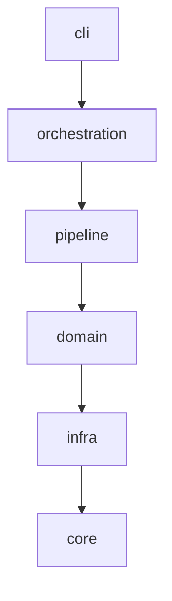
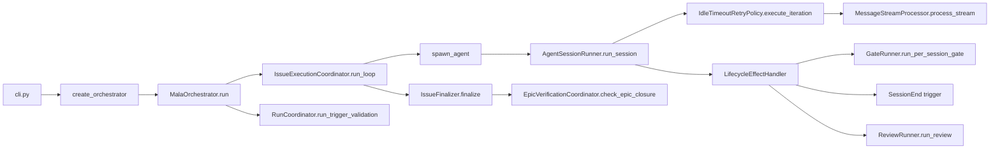
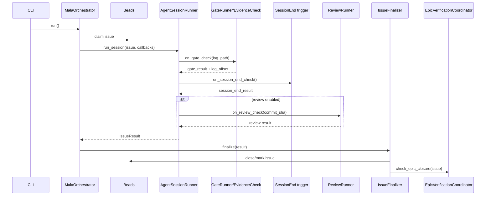
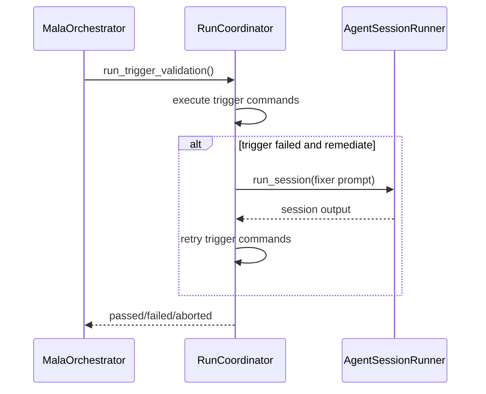
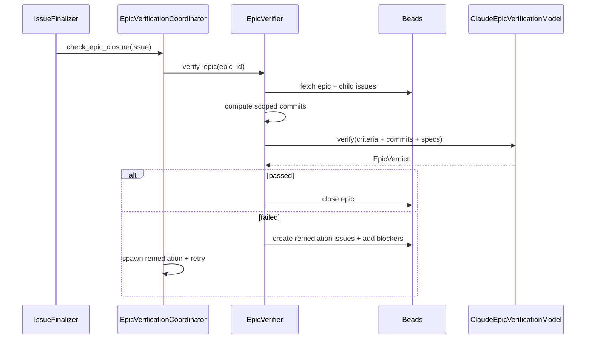

# Architecture

**mala** (Multi-Agent Loop Architecture) is an orchestrator for processing issues in parallel using Claude agents. This document describes its layered architecture, module responsibilities, key flows, and design decisions.

> **Source of truth**: Configuration values (thresholds, contracts) are documented here for convenience, but the canonical source is `pyproject.toml` and code under `src/domain/validation`.

## Executive Summary

- The codebase is a **layered, protocol-driven architecture** with explicit boundaries: `cli -> orchestration -> pipeline -> domain -> infra -> core`.
- Orchestration is split into **global coordination**, **per-session session execution**, and **finalization/epic verification** via dedicated coordinators (IssueExecutionCoordinator, IssueFinalizer, EpicVerificationCoordinator).
- Validation is **trigger-driven** (session_end/periodic/epic/run_end), with spec-driven evidence parsing from JSONL logs.
- Infrastructure code (clients, IO, hooks, tools) is isolated behind Protocols to keep core and domain logic testable.

## High-Level Overview

```
┌─────────────────────────────────────────────────────────────────┐
│                           CLI Layer                             │
│                         (src/cli)                               │
└──────────────────────────────┬──────────────────────────────────┘
                               │
┌──────────────────────────────▼──────────────────────────────────┐
│                     Orchestration Layer                         │
│                    (src/orchestration)                          │
│        Factory, Orchestrator, Wiring/Coordinators               │
└──────────────────────────────┬──────────────────────────────────┘
                               │
┌──────────────────────────────▼──────────────────────────────────┐
│                       Pipeline Layer                            │
│                      (src/pipeline)                             │
│    Agent Session Runner, Gate Runner, Review Runner             │
└──────────────────────────────┬──────────────────────────────────┘
                               │
┌──────────────────────────────▼──────────────────────────────────┐
│                        Domain Layer                             │
│                       (src/domain)                              │
│       Lifecycle, Quality Gate, Validation, Prompts              │
└──────────────────────────────┬──────────────────────────────────┘
                               │
┌──────────────────────────────▼──────────────────────────────────┐
│                      Infrastructure Layer                       │
│                        (src/infra)                              │
│   Clients, I/O, Tools, Hooks, Telemetry, Git Utils              │
└──────────────────────────────┬──────────────────────────────────┘
                               │
┌──────────────────────────────▼──────────────────────────────────┐
│                         Core Layer                              │
│                        (src/core)                               │
│              Models, Protocols, Log Events                      │
└─────────────────────────────────────────────────────────────────┘
```

## Layer Dependencies

Import boundaries are **enforced by import-linter** (see `pyproject.toml` for current contracts). The dependency graph follows:

| Layer | Can Import |
|-------|------------|
| `cli` | all lower layers (typically uses `orchestration`, `infra`) |
| `orchestration` | `pipeline`, `domain`, `infra`, `core` |
| `pipeline` | `infra` (except `infra.clients`), `domain`, `core` |
| `domain` | `core` only (not `infra`) |
| `infra` | `core` |
| `core` | (none - leaf layer) |

External dependencies are also constrained:
- **SDK packages** (anthropic): `pipeline`, `domain`, and `core` cannot import SDKs or their wrappers directly; only `cli`, `orchestration`, and `infra` may use them
- **typer**: confined to `cli` (enforced by `Only CLI imports typer` contract)

## Grimp Architecture Snapshot

Lightweight file scan for `src` (2026-01-11):

- Top-level directories: 8 (`cli`, `core`, `domain`, `infra`, `orchestration`, `pipeline`, `prompts`, `scripts`)
- Python packages: 14 (dirs with `__init__.py` under `src/`)
- Python modules: 106 (`*.py` files under `src/`)
- Import statements: 1018 (lines starting with `import` or `from`)

For an authoritative dependency graph and fan-in/out metrics, run the grimp workflow (see `CLAUDE.md`).

Child packages under `src`:
- `src.cli`
- `src.core`
- `src.domain`
- `src.infra`
- `src.orchestration`
- `src.pipeline`
Non-package directories under `src`:
- `src.prompts`
- `src.scripts`

Common fan-out hotspots (by convention, not exhaustive):
- `src.orchestration.orchestrator`
- `src.orchestration.factory`
- `src.orchestration.orchestration_wiring`
- `src.pipeline.run_coordinator`
- `src.pipeline.agent_session_runner`
- `src.pipeline.session_callback_factory`
- `src.pipeline.cumulative_review_runner`

Common fan-in modules (frequently referenced):
- `src.core.protocols`
- `src.infra.tools.command_runner`
- `src.infra.tools.env`
- `src.infra.tools.locking`
- `src.domain.validation.spec`
- `src.domain.validation.result`

Layer check via grimp: **no illegal dependencies found** for the ordered layers:
```
src.cli -> src.orchestration -> src.pipeline -> src.domain -> src.infra -> src.core
```

## Architecture Diagrams

Layered dependency view (conceptual):



Per-session call graph (main happy path):



Per-session sequence (orchestration -> gate -> session_end -> review):



Trigger validation + remediation:



Epic verification loop:



## Runtime Flow

High-level flow:

1. CLI parses arguments and bootstraps environment (config).
2. `create_orchestrator()` builds dependencies and configuration.
3. `MalaOrchestrator.run()`:
   - Delegates scheduling to `IssueExecutionCoordinator.run_loop`.
   - Spawns per-session agent sessions (parallel) via `spawn_agent()`.
   - Uses session callbacks to run per-session gate + session_end + review.
   - Finalizes outcomes via `IssueFinalizer` (close/mark followup).
4. Trigger validation (`periodic`, `epic_completion`, `run_end`) runs via `RunCoordinator`.
5. `EpicVerificationCoordinator` verifies and closes epics when children complete.

Per-session pipeline sequence:
```
Issue -> AgentSessionRunner (callbacks) -> GateRunner -> SessionEnd -> ReviewRunner -> IssueFinalizer
```

Trigger validation uses `RunCoordinator` to execute configured commands and optional remediation.

## Package Layout and Responsibilities

```
src/
  cli/              CLI entry points and CLI-only wiring
  orchestration/    Orchestrator + factory/DI + wiring + run config + review tracking
  pipeline/         Pipeline stages for agent sessions, gate, review, trigger validation
  domain/           Business logic: lifecycle, quality gate, validation, prompts
  infra/            External systems, IO, hooks, tools, telemetry
  core/             Minimal shared models, protocols, log event schema
  prompts/          Prompt templates
  scripts/          Shell utilities (locking helpers)
```

### `src/core` — Foundation Layer

Pure data structures and interfaces with **no internal dependencies**.

| Module | Purpose |
|--------|---------|
| `models.py` | Shared dataclasses (IssueResolution, ValidationArtifacts, EpicVerdict, RetryConfig) |
| `constants.py` | Shared constants used across layers |
| `protocols.py` | Protocol interfaces (IssueProvider, GateChecker, CodeReviewer, LogProvider, EpicVerificationModel) |
| `log_events.py` | JSONL log schema types and parsing helpers |
| `session_end_result.py` | Session_end trigger result and remediation state |
| `tool_name_extractor.py` | Normalize tool names from shell commands for logs/caching |

### `src/domain` — Business Logic

Orchestration-agnostic business rules.

| Module | Purpose |
|--------|---------|
| `lifecycle.py` | Issue lifecycle state machine and retry policy |
| `evidence_check.py` | Gate checking: commit exists, tests passed, evidence present |
| `prompts.py` | Prompt template loading |
| `deadlock.py` | Wait-for graph + deadlock detection domain model |
| `validation/` | Spec-based validation pipeline |

Validation subpackage:
- `config.py` / `config_loader.py` / `config_merger.py` — Validation config + overrides
- `spec.py` — Build validation specs from change classification
- `spec_runner.py` — Execute spec in worktree
- `spec_executor.py` — Run individual commands with caching
- `spec_result_builder.py` — Assemble ValidationResult summaries
- `spec_workspace.py` / `worktree.py` — Workspace + git worktree management
- `validation_gating.py` — Gate enable/disable policy
- `result.py` — Validation result types
- `coverage.py` / `coverage_args.py` — Coverage threshold checking and baselines
- `e2e.py` — End-to-end fixture repo tests
- `lint_cache.py` / `helpers.py` / `preset_registry.py` / `code_pattern_matcher.py` — Utilities

### `src/infra` — Infrastructure

External integrations and utilities.

| Subpackage | Purpose |
|------------|---------|
| `clients/` | SDK wrappers (Anthropic, Beads, Cerberus) |
| `io/` | Config loading, event sink (base_sink, console_sink), log parsing |
| `tools/` | Command runner, file locking, environment helpers |
| `hooks/` | Agent hooks (lint cache, file cache, lock enforcement) |

Key modules:
- `agent_runtime.py` — Agent runtime builder (hooks/env/options)
- `epic_verifier.py` — AI-powered epic acceptance verification
- `epic_scope.py` — Compute scoped commits for epic verification
- `git_utils.py` — Git helpers used across orchestration/pipeline
- `issue_manager.py` — Issue filtering, sorting, dependency resolution
- `sdk_adapter.py` — Claude SDK client factory (infra-only imports)
- `sdk_transport.py` — Claude SDK subprocess transport and SIGINT handling
- `sigint_guard.py` — Interrupt guard helpers for async operations
- `telemetry.py` — Telemetry provider protocols + null implementation
- `tool_config.py` — Disallowed tools list (used by hooks and SDK options)

### `src/pipeline` — Agent Execution

Pipeline components for running agent sessions.

| Module | Purpose |
|--------|---------|
| `agent_session_runner.py` | Main session loop (SDK stream handling + lifecycle) |
| `message_stream_processor.py` | SDK stream iteration + idle timeout handling |
| `idle_retry_policy.py` | Idle timeout retry/backoff policy for SDK streams |
| `lifecycle_effect_handler.py` | Gate/review side-effect handling + retry prompts |
| `gate_runner.py` | Quality gate execution |
| `gate_metadata.py` | Gate metadata extraction for finalization |
| `review_runner.py` | External review gate via CodeReviewer protocol |
| `review_formatter.py` | Formatting helpers for review findings |
| `cumulative_review_runner.py` | Trigger-based (cumulative) code review runner |
| `fixer_interface.py` | Fixer agent protocol for remediation loops |
| `run_coordinator.py` | Trigger validation and fixer agent orchestration |
| `issue_execution_coordinator.py` | Per-session pipeline: session → gate → session_end → review |
| `issue_finalizer.py` | Issue close/mark-needs-followup logic |
| `issue_result.py` | Issue result dataclass (per-session output) |
| `session_callback_factory.py` | SDK session callback construction |
| `epic_verification_coordinator.py` | Epic verification pipeline |

### `src/orchestration` — Coordination

High-level orchestration of the agent loop.

| Module | Purpose |
|--------|---------|
| `orchestrator.py` | Main loop: claim → spawn → gate → review → close |
| `factory.py` | Dependency injection and orchestrator construction |
| `deadlock_handler.py` | Deadlock resolution + abort coordination service |
| `orchestrator_state.py` | Per-run orchestration state container |
| `orchestration_wiring.py` | Pipeline wiring/builders for orchestrator components |
| `run_config.py` | Run metadata + event config builders |
| `review_tracking.py` | Create tracking issues from review findings |
| `types.py` | Orchestration-specific types |
| `cli_support.py` | CLI integration helpers |

### `src/cli` — Entry Point

| Module | Purpose |
|--------|---------|
| `cli.py` | Typer commands: `run`, `init`, `status`, `clean`, `logs`, `epic-verify` |
| `main.py` | App entry point |

### `src/prompts` — Prompt Templates

Markdown template files for agent prompts (implementer, fixer, gate followup, etc.). Referenced by `domain.prompts` and used directly by agents.

### `src/scripts` — Utility Scripts

Developer-facing shell scripts bundled with the package. Not part of the core runtime.

## Major Classes and Key Responsibilities

### Orchestration

- `MalaOrchestrator` (`src/orchestration/orchestrator.py`)
  - Central coordinator for parallel issue execution.
  - Owns run lifecycle, metadata tracking, and shutdown/cleanup behavior.
  - Key methods:
    - `run()` / `run_sync()`: public entrypoints for async/sync execution.
    - `_run_main_loop()`: main scheduler loop (delegates to IssueExecutionCoordinator).
    - `spawn_agent()`: claims issues and launches per-session worker tasks.
    - `run_implementer()`: per-session pipeline (session -> gate -> session_end -> review).
    - `_finalize_issue_result()`: delegates finalization to IssueFinalizer.
    - `_abort_active_tasks()`: delegates task abort handling to DeadlockHandler.
    - `_finalize_run()`: run_end trigger + summary + cleanup.

- `OrchestratorConfig`, `OrchestratorDependencies` (`src/orchestration/types.py`)
  - Split between simple config values and injected dependencies (DI).

- `create_orchestrator()` (`src/orchestration/factory.py`)
  - Factory that assembles dependencies (beads client, gate checker, reviewer, telemetry, event sink).

Supporting orchestration components:
- `DeadlockHandler` (`src/orchestration/deadlock_handler.py`) encapsulates deadlock resolution and task-abort coordination behind callbacks. Monitors lock events from MCP tools to detect wait-for cycles.
- `OrchestratorState` (`src/orchestration/orchestrator_state.py`) holds mutable state for a run (agent IDs, completed results, session log paths, deadlock cleanup tracking).
- `OrchestrationWiring` (`src/orchestration/orchestration_wiring.py`) builds pipeline runners and callback bundles for the orchestrator.

### Pipeline

- `AgentSessionRunner` (`src/pipeline/agent_session_runner.py`)
  - Wraps Claude SDK session lifecycle with streaming and idle-timeout recovery.
  - Uses tool hooks for locking enforcement, dangerous command blocking, and lint cache.
  - Configures MCP locking server via `AgentRuntimeBuilder.with_mcp()`.
  - Key methods:
    - `run_session()`: main session runner; streams SDK responses, drives lifecycle.
    - `_build_hooks()`: configures PreToolUse hooks (locking enforcement, lint cache, safety).
    - `_build_agent_env()`: per-agent env including lock/agent IDs.

- `MessageStreamProcessor` (`src/pipeline/message_stream_processor.py`)
  - Iterates SDK streams, tracks tool calls, and detects idle timeouts.

- `IdleTimeoutRetryPolicy` (`src/pipeline/idle_retry_policy.py`)
  - Handles idle timeout retries with backoff and session resume prompts.

- `LifecycleEffectHandler` (`src/pipeline/lifecycle_effect_handler.py`)
  - Encapsulates gate/review side effects (events, retry prompts, no-progress).

- `SessionCallbackFactory` (`src/pipeline/session_callback_factory.py`)
  - Builds per-session callbacks that wire gate/review/logging into AgentSessionRunner.

- `GateRunner` (`src/pipeline/gate_runner.py`)
  - Runs gate checks using a `GateChecker` protocol.
  - Tracks and applies retry/no-progress logic.
  - Key methods:
    - `run_per_session_gate()`: synchronous gate execution (used via `to_thread`).
    - `get_cached_spec()`: returns cached per-session `ValidationSpec`.

- `ReviewRunner` (`src/pipeline/review_runner.py`)
  - Executes external code review via `CodeReviewer` protocol.
  - Handles retry/no-progress checks and session log tracking.
  - Key methods:
    - `run_review()`: run reviewer (agent_sdk or cerberus) for a commit diff range.
    - `check_no_progress()`: avoids review retries when no new evidence.

- `RunCoordinator` (`src/pipeline/run_coordinator.py`)
  - Performs trigger validation and remediation (periodic/epic/run_end).
  - Key methods:
    - `run_trigger_validation()`: execute queued triggers; spawns fixer on failure when configured.

- `IssueExecutionCoordinator` (`src/pipeline/issue_execution_coordinator.py`)
  - Schedules and tracks per-session tasks; owns active task lifecycle.
  - Key methods:
    - `run_loop()`: spawn/wait/finalize loop for per-session tasks.

- `IssueFinalizer` (`src/pipeline/issue_finalizer.py`)
  - Finalizes per-session results: metadata, close/mark followup, and review tracking.
  - Key methods:
    - `finalize()`: orchestrate close/mark + metadata recording.

- `EpicVerificationCoordinator` (`src/pipeline/epic_verification_coordinator.py`)
  - Coordinates epic verification with remediation retries.
  - Key methods:
    - `check_epic_closure()`: verify epic after child closure.

### Domain / Policy

- `ImplementerLifecycle` (`src/domain/lifecycle.py`)
  - Pure state machine; defines transitions and effects for gate/review retry policy.
  - Key methods:
    - `start()`: initialize lifecycle at `INITIAL`.
    - `on_messages_complete()`: move from streaming to gate/log wait.
    - `on_log_ready()` / `on_log_timeout()`: log availability handling.
    - `on_gate_result()`: gate pass/fail transitions + retry decisions.
    - `on_session_end_result()`: session_end pass/fail transitions + retry decisions.
    - `on_review_result()`: review pass/fail transitions + retry decisions.
    - `on_timeout()` / `on_error()`: hard failure paths.

- `EvidenceCheck` (`src/domain/evidence_check.py`)
  - Checks for required commit + evidence of validation commands.
  - Evidence is spec-driven and parsed from JSONL logs.
  - Key methods:
    - `check_with_resolution()`: primary gate entry (commit + evidence + resolution markers).
    - `parse_validation_evidence_with_spec()`: spec-driven evidence extraction.
    - `check_commit_exists()`: verify `bd-<id>` commit in range.
    - `check_no_progress()`: detect unchanged commit + no new evidence.
    - `get_log_end_offset()`: log offset tracking for retry scoping.

- `DeadlockMonitor` / `WaitForGraph` (`src/domain/deadlock.py`)
  - Tracks lock waits/holds and detects deadlock cycles.

- Validation subsystem (`src/domain/validation/*`)
  - `ValidationSpec` defines commands and evidence requirements.
  - `SpecValidationRunner` executes commands and assembles results (programmatic/tests).
  - Worktrees are used to keep SpecValidationRunner validation isolated.
  - Key methods:
    - `build_validation_spec()` (`spec.py`): assemble commands + coverage/E2E policy.
    - `SpecValidationRunner.run_spec()`: run a spec with workspace isolation.
    - `SpecValidationRunner._run_validation_pipeline()`: commands -> coverage -> e2e.

### Infra / External Integrations

- `BeadsClient`: CLI wrapper for issue operations and filtering/sorting.
  - Key methods:
    - `get_ready_async()` / `get_ready_issues_async()`: fetch + filter ready issues.
    - `claim_async()`: claim a task for work.
    - `close_async()` / `mark_needs_followup_async()`: update issue state.
    - `close_eligible_epics_async()`: epic housekeeping at end of run.
    - `get_issue_description_async()`: fetch description for prompting/review.
- `DefaultReviewer` / `AgentSDKReviewer`: code review implementations (Cerberus or Agent SDK).
- `EpicVerifier`: runs acceptance verification across child issue commits.
  - Key methods:
    - `verify_and_close_eligible()`: main epic closure loop.
    - `verify_epic()` / `verify_epic_with_options()`: verify a specific epic.
    - `create_remediation_issues()`: open follow-up tasks for unmet criteria.
    - `add_epic_blockers()` / `request_human_review()`: enforcement actions.
- `EpicScopeAnalyzer`: computes scoped commit ranges for epic verification.
- `AgentRuntimeBuilder` / `AgentRuntime`: build per-agent runtime env, hooks, and SDK options.
- `SDKClientFactory`: isolates Claude SDK client creation in infra.
- `SessionLogParser` / `FileSystemLogProvider`: parsing and offset tracking for JSONL logs.
  - Key methods:
    - `iter_jsonl_entries()` / `get_log_end_offset()`: parser-level iteration + offsets.
    - `iter_events()` / `get_end_offset()`: provider-level streaming access + offsets.
    - `extract_*()` helpers: tool use, tool result, and assistant text parsing.
- `CommandRunner`: standardized subprocess execution with timeouts and process-group handling.
  - Key methods:
    - `run()` / `run_async()`: sync/async command execution with timeout semantics.
- `MalaEventSink`: event interface for CLI/log sinks (console is default implementation).

## Key Architectural Patterns

### 1) Event Sink

Decouples orchestration from presentation:
```
Orchestrator -> EventSink -> Console/Logs/Telemetry
```

The event sink enables testable orchestration and swappable output formats.

### 2) Layered Architecture (Enforced)

Import-linter contracts prevent layer violations:
- `layers` contract enforces the 6-layer hierarchy
- `forbidden` contracts isolate SDK access and leaf modules
- `independence` contract ensures pipeline modules are acyclic

#### Import-linter constraints (stricter)

These constraints are enforced via import-linter (canonical source: `pyproject.toml`).
They exist to keep the architecture layered, prevent cross-cutting dependencies,
and make refactors predictable.

Expected to pass (tighten invariants without refactors):
- **Domain purity:** `src.domain` must not import `src.infra`. Domain logic stays pure and testable.
- **Pipeline isolation from clients:** `src.pipeline` must not import `src.infra.clients`. Pipeline uses protocols; client implementations stay in infra.
- **IO isolation:** `src.infra.io` must not import `src.infra.clients` or `src.infra.hooks`. IO stays focused on config/logs/sinks.
- **Log event parsing boundary:** only `src.infra.io.session_log_parser` is allowed to import `src.core.log_events`, keeping log schema usage centralized.
- **Infra subpackage isolation:** Directional constraints prevent tight coupling: `src.infra.tools` cannot import `src.infra.clients`; `src.infra.telemetry` cannot import other infra subpackages. `src.infra.hooks` has a partial isolation contract (currently commented out due to transitive imports via `tools.env`→`io.config`). This keeps infra's internal boundaries clean and makes replacements/refactors easier.
- **Leaf modules:** `src.core.tool_name_extractor` and `src.infra.issue_manager` are leaf utilities with no internal dependencies (beyond stdlib).
- **External dependency confinement:**
  - `dotenv` is only allowed in `src.infra.tools.env`.
  - `yaml` is only allowed under `src.domain.validation`.
  - `anthropic` is only allowed in `src.infra.clients`.
  - These constraints target direct imports; indirect use via the approved wrappers is allowed.

Hardening constraints (aspirational; not yet enforced):
- **Single DI boundary for clients:** only `src.orchestration.factory` may import `src.infra.clients`. All other orchestration modules must rely on injected protocols.
- **Hooks are runtime-only:** `src.infra.hooks` must not import `src.infra.agent_runtime` (to maintain clean separation between hook logic and SDK-specific runtime code).
- **SDK boundary enforcement:** `claude_agent_sdk` must not appear outside infra's SDK boundary modules. This is expected to fail until hook/MCP wiring is fully separated from SDK-specific code.

### 3) Protocol-Based Interfaces

Core protocols define contracts between orchestration and infra:
- `IssueProvider`, `GateChecker`, `CodeReviewer`
- `LogProvider`, `EpicVerificationModel`, `TelemetryProvider`

### 4) Pipeline Decomposition

Orchestrator delegates specialized stages to pipeline runners. Each runner uses explicit input/output dataclasses for clarity and testability.

### 5) State Machine for Session Policy

`ImplementerLifecycle` encapsulates retry logic and effect decisions, separating policy from side effects.

### 6) Spec-Driven Validation and Evidence Parsing

Validation commands are defined in `ValidationSpec`. The quality gate derives evidence requirements from the spec to avoid hardcoded checks.

### 7) Filesystem Locking

Prevents edit conflicts between concurrent agents:
- Atomic hardlink-based locks in `/tmp/mala-locks/`
- Path canonicalization with repo namespace support
- MCP locking tools (`lock_acquire`, `lock_release`) for agent-side coordination
- Lock enforcement hook blocks writes to unlocked files (`infra.hooks.locking`)
- Per-run ownership tracking for clean shutdown
- Deadlock detection via `DeadlockHandler` with event-driven monitoring

### 8) Worktree Validation (Programmatic)

`SpecValidationRunner` performs clean-room validation in isolated git worktrees:
```
/tmp/mala-worktrees/{run_id}/{issue_id}/{attempt}/
```
Trigger validation in the orchestrator runs commands in the repository root.

### 9) Telemetry

Agent sessions emit spans through a `TelemetryProvider` abstraction:
- Protocol and `NullTelemetryProvider` in `infra.telemetry`

## Data Flow

```
┌───────────────┐     ┌─────────────────┐     ┌──────────────┐
│  bd ready     │────▶│   Orchestrator  │────▶│  bd close    │
│  (issues)     │     │    main loop    │     │  (on pass)   │
└───────────────┘     └────────┬────────┘     └──────────────┘
                               │
                    ┌──────────▼──────────┐
                    │   Agent Session     │
                    │   (Claude Code)     │
                    └──────────┬──────────┘
                               │
              ┌────────────────┼────────────────┐
              │                │                │
     ┌────────▼────────┐ ┌─────▼──────┐ ┌──────▼───────┐
     │  Quality Gate   │ │   Review   │ │ Trigger Val. │
     │ (commit+evidence│ │ (Reviewer) │ │ + remediation│
     └─────────────────┘ └────────────┘ └──────────────┘
```

## Extension Points

- **Issue provider**: Replace `BeadsClient` with any implementation of `IssueProvider`.
- **Review system**: Implement `CodeReviewer` for different review systems.
- **Event sink**: Add alternative sinks (JSON logs, telemetry).
- **Telemetry**: Implement a custom `TelemetryProvider` or span class.

## Configuration

| Source | Precedence |
|--------|------------|
| CLI flags | Highest |
| Environment vars | Medium |
| `~/.config/mala/.env` | Lowest |

Key directories:
- `~/.config/mala/logs/` — JSONL session logs
- `~/.config/mala/runs/` — Run metadata (repo-segmented, e.g., `~/.config/mala/runs/-home-user-repo/`)
- `/tmp/mala-locks/` — Filesystem locks
- `/tmp/mala-worktrees/` — Validation worktrees

## Testing Strategy

| Category | Marker | Purpose |
|----------|--------|---------|
| Unit | `@pytest.mark.unit` | Fast, isolated tests |
| Integration | `@pytest.mark.integration` | Multi-component tests |
| E2E | `@pytest.mark.e2e` | Full CLI + agent tests |

Coverage threshold: 72% (enforced via `--cov-fail-under=72`)

## Notes on Naming

- The top-level package is `src` (installed as `mala`), so imports reference `src.*` across the codebase.
- `__init__.py` exposes `MalaOrchestrator` via lazy import for reduced import cost.

## Codebase Statistics (Optional Snapshot)

These numbers were previously captured via static analysis; re-run `lizard` and `uv run import-linter` for current values.

| Metric | Value |
|--------|-------|
| Total Files | 63 |
| Architectural Contracts | 10 |

## Future Considerations

1. **Language Support**: Currently Python-only (pytest, ruff, ty). Other languages would need validation spec extensions.
2. **Multi-Repo**: Single-repo focus; multi-repo coordination not implemented.
3. **Complexity Reduction**: `run_session` and validation coverage paths are candidates for decomposition.
