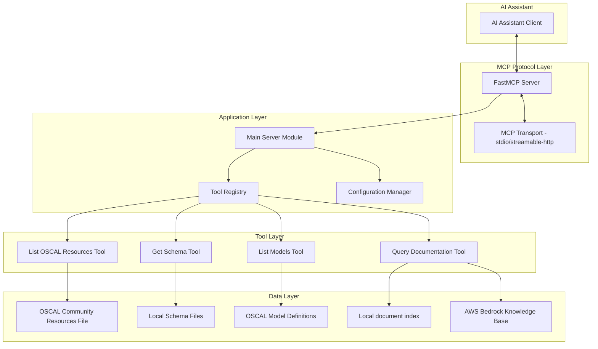

# Design Document: OSCAL MCP Server

## Overview

The OSCAL MCP Server is a Model Context Protocol (MCP) server that provides AI assistants with specialized tools for working with NIST's Open Security Controls Assessment Language (OSCAL). The server acts as a bridge between AI assistants and OSCAL resources, enabling intelligent querying of OSCAL documentation, schema retrieval, and model information access.

The system is built using Python with the FastMCP framework and integrates with AWS Bedrock Knowledge Base for documentation queries. It provides four primary tools: documentation querying, model listing, schema retrieval, and OSCAL community resources listing.

## Architecture

The system follows a layered architecture with clear separation of concerns:



### Key Architectural Principles

1. **Protocol Abstraction**: MCP protocol handling is abstracted through FastMCP framework
2. **Tool-Based Design**: Functionality is exposed as discrete, composable tools
3. **Configuration-Driven**: Behavior is controlled through environment variables and command line arguments
4. **Error Resilience**: Comprehensive error handling with graceful degradation
5. **Local-First Schema Access**: Schemas are stored locally for fast, reliable access

## Components and Interfaces

### Main Server Component (`main.py`)

**Responsibilities:**
- Initialize and configure the FastMCP server
- Register OSCAL tools with the MCP framework
- Handle command line argument parsing including transport selection
- Configure logging and error handling
- Manage server lifecycle with appropriate transport protocol
- Validate and configure transport method (stdio or streamable-http)

**Key Interfaces:**
```python
def main() -> None
    # Entry point for server execution

mcp: FastMCP
    # Global MCP server instance with registered tools
```

### Configuration Manager (`config.py`)

**Responsibilities:**
- Load configuration from environment variables
- Provide default values for all settings
- Support runtime configuration updates from command line arguments
- Manage AWS and Bedrock-specific settings

**Key Interfaces:**
```python
class Config:
    bedrock_model_id: str
    knowledge_base_id: str
    aws_profile: str | None
    aws_region: str | None
    log_level: str
    server_name: str
    transport: str  # "stdio" or "streamable-http"
    
    def update_from_args(self, **kwargs) -> None
```

### Query Documentation Tool (`query_documentation.py`)

**Responsibilities:**
- Interface with AWS Bedrock Knowledge Base
- Handle AWS authentication and session management
- Process documentation queries and return structured results
- Provide fallback behavior when knowledge base is unavailable

**Key Interfaces:**
```python
@tool
def query_oscal_documentation(query: str, ctx: Context) -> Any
    # Main tool function for MCP integration

def query_kb(query: str, ctx: Context) -> Any
    # Bedrock Knowledge Base query implementation

def query_local(query: str, ctx: Context) -> Any
    # Local fallback implementation (placeholder)
```

### List Models Tool (`list_models.py`)

**Responsibilities:**
- Provide comprehensive information about OSCAL model types
- Return structured data including descriptions, layers, and status
- Maintain authoritative list of supported OSCAL models

**Key Interfaces:**
```python
@tool
def list_oscal_models() -> dict
    # Returns structured model information
```

### Get Schema Tool (`get_schema.py`)

**Responsibilities:**
- Retrieve OSCAL schemas from local file system
- Support both JSON and XSD schema formats
- Handle model name validation and aliasing
- Manage schema file path resolution

**Key Interfaces:**
```python
@tool
def get_oscal_schema(ctx: Context, model_name: str, schema_type: str) -> str
    # Main schema retrieval function

def open_schema_file(file_name: str) -> Any
    # File system interface for schema access
```

### List OSCAL Resources Tool (`list_oscal_resources.py`)

**Responsibilities:**
- Read and return the contents of the awesome-oscal.md community resources file
- Handle file system access for local documentation files
- Preserve markdown formatting in returned content
- Provide error handling for file access issues

**Key Interfaces:**
```python
@tool
def list_oscal_resources(ctx: Context) -> str
    # Main tool function for returning OSCAL community resources

def read_resources_file() -> str
    # File system interface for reading awesome-oscal.md
```

### Utilities Module (`utils.py`)

**Responsibilities:**
- Define OSCAL model type enumeration
- Provide shared constants and helper functions
- Maintain type safety for model names

**Key Interfaces:**
```python
class OSCALModelType(StrEnum):
    # Enumeration of all supported OSCAL model types
```

## Data Models

### Configuration Data Model

```python
@dataclass
class ServerConfig:
    bedrock_model_id: str = "us.anthropic.claude-sonnet-4-20250514-v1:0"
    knowledge_base_id: str = ""
    aws_profile: str | None = None
    aws_region: str | None = None
    log_level: str = "INFO"
    server_name: str = "OSCAL MCP Server"
    transport: str = "stdio"  # Default to stdio transport
```

### OSCAL Model Information

```python
@dataclass
class OSCALModelInfo:
    description: str
    layer: Literal["Control", "Implementation", "Assessment"]
    status: Literal["GA", "PROTOTYPE"]
```

### Tool Response Models

```python
# Documentation Query Response (from Bedrock)
class DocumentationResponse(TypedDict):
    retrievalResults: List[RetrievalResult]
    ResponseMetadata: Dict[str, Any]

class RetrievalResult(TypedDict):
    content: Dict[str, str]
    score: float
    location: Dict[str, Any]

# Schema Response
class SchemaResponse(TypedDict):
    schema: str  # JSON-serialized schema content
    model_name: str
    schema_type: Literal["json", "xsd"]
```

## Correctness Properties

*A property is a characteristic or behavior that should hold true across all valid executions of a system-essentially, a formal statement about what the system should do. Properties serve as the bridge between human-readable specifications and machine-verifiable correctness guarantees.*

### Property Reflection

After reviewing the prework analysis, I identified several areas where properties can be consolidated:

- Properties 3.2 and 3.3 (JSON/XSD schema return) can be combined into a single property about schema format consistency
- Properties 2.4 and 2.5 (layer and status validation) can be combined into a single property about model metadata validation
- Properties 6.2, 6.3, 6.4, and 6.5 (various error handling scenarios) can be combined into a comprehensive error handling property
- Properties 7.2, 7.3, 7.4, and 7.6 (schema file management) can be combined into properties about file system consistency

### Correctness Properties

Property 1: Documentation Query Passthrough\
*For any* documentation query string, when the Bedrock Knowledge Base returns a response, the server should return that exact response without modification\
**Validates: Requirements 1.1, 1.2**

Property 2: AWS Profile Authentication\
*For any* configured AWS profile, the server should create authentication sessions using that specific profile\
**Validates: Requirements 1.5**

Property 3: Error Logging and Exception Handling\
*For any* error condition during tool execution, the server should both log detailed error information and raise an exception with descriptive details\
**Validates: Requirements 1.6, 6.2, 6.3, 6.4, 6.5**

Property 4: Model Information Completeness\
*For any* model returned by list_models, the response should include description, layer, and status fields with non-empty values\
**Validates: Requirements 2.2**

Property 5: Model Metadata Validation\
*For any* model in the list_models response, the layer should be one of "Control", "Implementation", or "Assessment" and status should be "GA" or "PROTOTYPE"\
**Validates: Requirements 2.4, 2.5**

Property 6: Schema Format Consistency\
*For any* valid model name and schema type combination, the returned schema should match the requested format (JSON for "json" type, XSD for "xsd" type)\
**Validates: Requirements 3.2, 3.3**

Property 7: Invalid Input Error Handling\
*For any* invalid model name or schema type, the server should return an error message that provides guidance on valid options\
**Validates: Requirements 3.5, 3.6**

Property 8: Configuration Override Precedence\
*For any* configuration parameter that can be set via both environment variable and command line argument, the command line value should take precedence\
**Validates: Requirements 4.6**

Property 9: Tool Context Propagation\
*For any* tool invocation, the MCP context including session parameters should be properly passed to the tool function\
**Validates: Requirements 5.6**

Property 10: MCP Protocol Error Handling\
*For any* MCP protocol error, the server should handle it gracefully and provide an appropriate response to the client\
**Validates: Requirements 5.7**

Property 11: Log Level Configuration\
*For any* supported log level (DEBUG, INFO, WARNING, ERROR), setting that level should affect logging behavior across all components\
**Validates: Requirements 6.1**

Property 12: Input Validation Consistency\
*For any* tool with invalid parameters, the server should validate inputs and return clear, descriptive error messages\
**Validates: Requirements 6.7**

Property 13: Schema File System Consistency\
*For any* supported model type and schema format, the corresponding schema file should exist in the expected location with the correct naming convention\
**Validates: Requirements 8.2, 8.3, 8.4**

Property 14: Schema JSON Format Validation\
*For any* schema returned by get_oscal_schema, the response should be a valid JSON string that can be parsed without errors\
**Validates: Requirements 8.6**

Property 15: File Error Handling\
*For any* file operation that fails (file not found, permission denied, etc.), the server should provide descriptive error messages\
**Validates: Requirements 8.5**

Property 16: Transport Protocol Support\
*For any* supported transport type ("stdio" or "streamable-http"), the server should start successfully and use the specified transport protocol\
**Validates: Requirements 5.4, 7.3, 7.4**

Property 17: Transport Configuration Override\
*For any* explicit transport configuration, the server should use that transport instead of the default stdio transport\
**Validates: Requirements 5.6**

Property 18: Command Line Transport Argument\
*For any* valid transport type provided via --transport argument, the server should parse and apply that configuration correctly\
**Validates: Requirements 7.1**

Property 19: Invalid Transport Error Handling\
*For any* invalid transport type specification, the server should return an error message listing the valid transport options\
**Validates: Requirements 7.5**

Property 20: Transport Validation Before Startup\
*For any* transport configuration, the server should validate the transport type before attempting to start the server\
**Validates: Requirements 7.6**

Property 21: Transport Method Logging\
*For any* server startup, the selected transport method should be logged during the initialization process\
**Validates: Requirements 7.7**

Property 22: OSCAL Resources File Content Return\
*For any* list_oscal_resources request, the server should return the complete contents of the awesome-oscal.md file from the oscal_docs directory with original markdown formatting preserved\
**Validates: Requirements 9.1, 9.2, 9.3, 9.6**

Property 23: OSCAL Resources Error Handling\
*For any* file access error (file not found, read failure), the server should log the error and raise an exception with descriptive information\
**Validates: Requirements 9.4, 9.5**

Property 24: OSCAL Resources Encoding Handling\
*For any* encoding issues when reading the awesome-oscal.md file, the server should handle them gracefully without crashing\
**Validates: Requirements 9.7**

## Error Handling

The system implements comprehensive error handling at multiple levels:

### Tool-Level Error Handling
- **Input Validation**: All tools validate parameters and return descriptive errors for invalid inputs
- **AWS Service Errors**: Boto3 exceptions are caught and handled gracefully with appropriate error messages
- **File System Errors**: Schema file operations include proper error handling for missing or inaccessible files
- **Context Reporting**: All errors are reported through MCP context for client visibility

### Configuration Error Handling
- **Missing Configuration**: Graceful degradation when optional configuration is missing
- **Invalid Values**: Validation of configuration values with clear error messages
- **Environment Variable Parsing**: Robust parsing of environment variables with fallback to defaults

### Protocol-Level Error Handling
- **MCP Protocol Errors**: Proper handling of MCP protocol-specific errors
- **Transport Errors**: Error handling for communication transport issues
- **Tool Registration Errors**: Validation of tool registration and schema compliance

### Logging Strategy
- **Structured Logging**: Consistent log format across all components
- **Configurable Levels**: Support for DEBUG, INFO, WARNING, and ERROR levels
- **Component-Specific Loggers**: Separate loggers for different system components
- **Error Context**: Rich error context including stack traces and relevant parameters

## Testing Strategy

The testing strategy employs both unit testing and property-based testing to ensure comprehensive coverage:

### Unit Testing Approach
- **Component Isolation**: Test individual components in isolation with mocked dependencies
- **Configuration Testing**: Verify configuration loading and precedence rules
- **Error Condition Testing**: Test specific error scenarios and edge cases
- **Integration Points**: Test integration between MCP framework and OSCAL tools
- **AWS Service Mocking**: Mock AWS Bedrock calls to test without external dependencies

### Property-Based Testing Configuration
The system uses **pytest** with **Hypothesis** for property-based testing. Each property test runs a minimum of 100 iterations to ensure comprehensive input coverage.

**Property Test Implementation Requirements:**
- Each correctness property must be implemented as a single property-based test
- Tests must be tagged with: **Feature: oscal-mcp-server, Property {number}: {property_text}**
- Property tests should generate realistic test data that exercises the full input space
- Mock external dependencies (AWS Bedrock, file system) to focus on system logic

### Test Data Generation Strategy
- **Query Strings**: Generate varied documentation queries including edge cases
- **Model Names**: Test with valid model names, invalid names, and edge cases
- **Configuration Values**: Generate various configuration combinations
- **Schema Types**: Test both supported and unsupported schema format requests
- **AWS Responses**: Generate realistic Bedrock Knowledge Base response structures

### Integration Testing
- **End-to-End Tool Testing**: Test complete tool execution paths
- **MCP Protocol Compliance**: Verify proper MCP protocol implementation
- **Configuration Integration**: Test configuration loading and application
- **Error Propagation**: Verify errors are properly propagated through all layers

The dual testing approach ensures both specific functionality (unit tests) and universal correctness properties (property tests) are validated, providing confidence in system reliability and correctness.