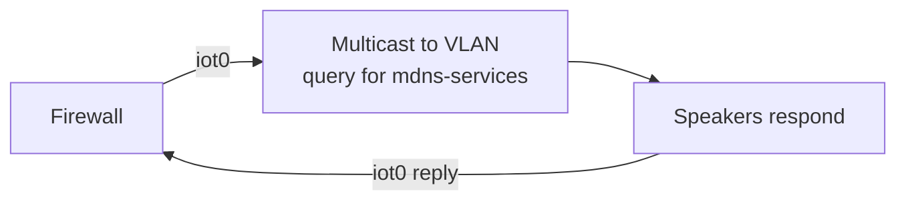
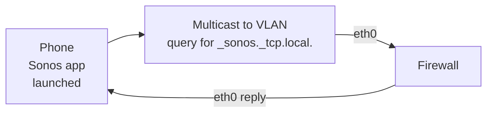

# mdns-filoxy

[](https://pypi.org/project/mdns-filoxy)
[](https://pypi.org/project/mdns-filoxy)

-----


This is mdns-filoxy, the mDNS filter proxy!

## Table of contents

<!-- TOC -->
* [mdns-filoxy](#mdns-filoxy)
  * [Table of contents](#table-of-contents)
  * [Introduction](#introduction)
    * [What is it for?](#what-is-it-for)
    * [But isn't that what avahi-daemon et al are for?!](#but-isnt-that-what-avahi-daemon-et-al-are-for)
    * [Draw me a picture](#draw-me-a-picture)
    * [What's with the name?!](#whats-with-the-name)
  * [Installation](#installation)
  * [License](#license)
<!-- TOC -->

## Introduction

Welcome to `mdns-filoxy`, the mDNS filter proxy.

### What is it for?

`mdns-filoxy` allows you to send configured mDNS service queries out a specified interface, cache the response, and
then listen for further queries and answer them on a different interface.

This is particularly useful when you (rather smartly) put your IoT devices in a different network/VLAN to your "main"
network. I have my Sonos speakers setup this way, and without some form of proxy, I simply cannot talk to them
anymore, because of their odd use of mDNS and SSDP, and 14,000 other convoluted methods to reach their ecosystem.

### But isn't that what avahi-daemon et al are for?!

`avahi-daemon` does have a reflector mode, and there are other packages like `mdns-repeater`. The issue is that they
both
listen for queries and then just re-send them out other interfaces. `avahi-daemon` even lets you filter reflections,
but they don't allow you to control the direction of the reflecting.

Furthermore, in the case where you have some other server on the same networks, with two or more interfaces bound to it,
`systemd` can have
a [rather major meltdown whilst it tries to think for you](https://github.com/home-assistant/supervisor/issues/5435) and
choose unique mDNS names. A good example of this is Home Assistant's HAOS.
`systemd` [behaves badly](https://github.com/systemd/systemd/issues/35780) with mdns repeaters too.

### Draw me a picture

Ok. Lets pretend you have a phone that sits in a VLAN, connected to a firewall interface called `eth0` (known as the
`dest-interface`). Lets further pretend your Sonos speaker is in another VLAN, connected to `iot0` (known as the
`--source-interface`).

When `mdns-filoxy` starts, it will bind to the specified interfaces, and on the source interface will query for the
chosen services (`--mdns-services`):



`mdns-filoxy` caches that response, and then lies in wait, ready to respond to any queries that arrive on `eth0`.

Once `mdns-filoxy` is up and listening, here's the sequence of events:



Notice that the queries and responses aren't bi-directional, and this is intentional. The software is meant to give
minimal assistance to mDNS/IoT devices to get bootstrapped and then on with whatever other evil protocol(s) they use.

### What's with the name?!

`filoxy` is my blend of "filter" and "proxy", as that's basically what this software does.

## Installation

The recommended way to install `mdns-filoxy` is to use [pipx](https://pipx.pypa.io/stable/).

After getting `pipx` installed, simply run:

```shell
username@host:~$ pipx install mdns-filoxy
```

> [!WARNING]
> Please [don't use pip system-wide](https://docs.python.org/3.11/installing/index.html#installing-into-the-system-python-on-linux).

You can of course also install it using classic virtualenvs.

## License

`mdns-filoxy` is distributed under the terms of the [MIT](https://spdx.org/licenses/MIT.html) license.
