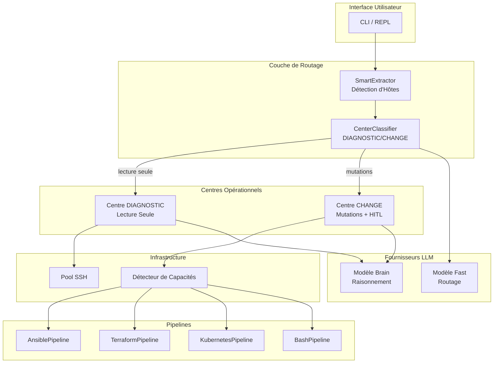

# Décisions Architecturales

Décisions architecturales clés et leur justification.

## Vue d'ensemble

Merlya est construit sur une architecture modulaire conçue pour l'extensibilité, la sécurité et la facilité d'utilisation. La version 0.8.0 introduit l'**architecture des centres DIAGNOSTIC/CHANGE** pour un routage intelligent entre l'investigation en lecture seule et les mutations contrôlées.



---

## ADR-001 : PydanticAI pour le Framework Agent

**Statut :** Accepté

**Contexte :** Nous avions besoin d'un framework pour construire des agents alimentés par LLM avec des capacités d'appel d'outils.

**Décision :** Utiliser PydanticAI comme framework d'agent.

**Justification :**
- Typage sûr avec les modèles Pydantic
- Support natif de l'async
- API propre pour la définition d'outils
- Support multi-fournisseurs
- Développement actif et communauté

**Conséquences :**
- Dépendance à PydanticAI
- Bénéficie des améliorations en amont
- Peut nécessiter une adaptation aux changements d'API

---

## ADR-002 : AsyncSSH pour les Connexions SSH

**Statut :** Accepté

**Contexte :** La connectivité SSH est au cœur des fonctionnalités de Merlya.

**Décision :** Utiliser asyncssh pour toutes les opérations SSH.

**Justification :**
- Python pur, pas de dépendances externes
- Natif async pour les connexions concurrentes
- Support complet du protocole SSH2
- Support intégré des jump hosts
- Maintenance active

**Conséquences :**
- API async uniquement
- Pooling de connexions nécessaire pour les performances
- Surcharge mémoire pour de nombreuses connexions

---

## ADR-003 : Pooling de Connexions

**Statut :** Accepté

**Contexte :** Les connexions SSH fréquentes sont lentes et consommatrices de ressources.

**Décision :** Implémenter un pooling de connexions avec nettoyage automatique.

**Justification :**
- Éviter la surcharge de connexion pour les commandes répétées
- Limiter les connexions concurrentes
- Nettoyage automatique des connexions inactives
- Gestion gracieuse de l'arrêt

**Implémentation :**
```python
class SSHPool:
    max_connections: int = 10
    idle_timeout: int = 300  # 5 minutes

    async def get_connection(host) -> SSHConnection
    async def release_connection(conn)
    async def cleanup_idle()
```

---

## ADR-004 : Keyring pour le Stockage des Identifiants

**Statut :** Accepté

**Contexte :** Les clés API et les identifiants nécessitent un stockage sécurisé.

**Décision :** Utiliser le keyring système (via la bibliothèque `keyring`).

**Justification :**
- Sécurité au niveau OS (Keychain, Secret Service, Credential Manager)
- Pas de secrets en clair dans les fichiers de configuration
- Solution standard multi-plateforme
- Fallback en mémoire avec avertissement

**Conséquences :**
- Nécessite un backend keyring sur Linux
- Peut nécessiter une interaction utilisateur pour la première configuration
- Les serveurs headless nécessitent une configuration alternative

---

## ADR-005 : Classification d'Intent Locale

**Statut :** Remplacé par ADR-013 (v0.8.0)

**Contexte :** Toutes les entrées utilisateur ne nécessitent pas un traitement LLM.

**Décision :** Utiliser un classificateur local basé sur des patterns pour le routage d'intent avec fallback LLM.

**Note :** Cet ADR a été remplacé par ADR-013 (Architecture des Centres DIAGNOSTIC/CHANGE) qui fournit un système de routage plus sophistiqué avec CenterClassifier.

---

## ADR-006 : Configuration YAML avec Stockage SQLite

**Statut :** Accepté

**Contexte :** La configuration doit être lisible et modifiable par l'humain. L'inventaire des hôtes nécessite un stockage structuré avec des capacités de requêtage.

**Décision :** Utiliser YAML pour les fichiers de configuration et SQLite pour l'inventaire des hôtes.

**Justification :**
- YAML : Syntaxe conviviale, largement utilisée en DevOps
- YAML : Support natif des structures complexes
- SQLite : Requêtage rapide pour la recherche d'hôtes
- SQLite : Support du tagging, filtrage et recherche
- SQLite : Fichier unique, pas de serveur nécessaire

**Emplacements des Fichiers :**
- `~/.merlya/config.yaml` - Configuration principale
- `~/.merlya/merlya.db` - Inventaire des hôtes (SQLite)
- `~/.merlya/logs/` - Fichiers de logs
- `~/.merlya/history` - Historique des commandes

**Exemple de Configuration :**
```yaml
general:
  language: fr
  log_level: info

model:
  provider: openrouter
  model: amazon/nova-2-lite-v1:free
```

---

## ADR-007 : Architecture de Plugins

**Statut :** Proposé

**Contexte :** Les utilisateurs ont besoin d'étendre Merlya avec des outils personnalisés.

**Décision :** Système de plugins basé sur les entry-points.

**Justification :**
- Approche standard du packaging Python
- Distribution facile via PyPI
- Isolation des espaces de noms
- Chargement paresseux

**Interface Proposée :**
```python
# pyproject.toml
[project.entry-points."merlya.tools"]
my_tool = "my_package:MyTool"

# Implémentation
class MyTool(MerlyaTool):
    name = "my_tool"
    description = "Fait quelque chose d'utile"

    async def execute(self, params: dict) -> ToolResult:
        ...
```

---

## ADR-008 : Loguru pour la Journalisation

**Statut :** Accepté

**Contexte :** Le débogage et la surveillance nécessitent une bonne journalisation avec une configuration minimale.

**Décision :** Utiliser [loguru](https://github.com/Delgan/loguru) pour la journalisation.

**Justification :**
- Zéro configuration prête à l'emploi
- Rotation et rétention automatiques
- Sortie colorée lisible pour le développement
- Capture d'exceptions avec traceback complet
- API facile à utiliser (`logger.info()`, `logger.error()`)
- Sûr pour l'async

**Implémentation :**
```python
from loguru import logger

logger.info("✅ Opération terminée avec succès")
logger.warning("⚠️ Nouvelle tentative de connexion requise")
logger.error("❌ Échec de la connexion SSH : {error}", error=e)
```

**Niveaux de Log :**
- DEBUG : Flux d'exécution détaillé
- INFO : Opérations clés et résultats
- WARNING : Problèmes récupérables
- ERROR : Échecs nécessitant une attention

**Convention des Emojis :**
Tous les messages de log utilisent des emojis pour la clarté visuelle (voir CONTRIBUTING.md).

---

## ADR-009 : Support Multi-Fournisseurs LLM

**Statut :** Accepté

**Contexte :** Les utilisateurs ont différentes préférences de fournisseurs LLM et contraintes de coûts.

**Décision :** Interface abstraite de fournisseur LLM avec plusieurs implémentations. OpenRouter par défaut pour l'accès au tier gratuit.

**Fournisseurs Supportés :**
- OpenRouter (défaut) - 100+ modèles, tier gratuit disponible
- OpenAI (GPT-4o, GPT-4o-mini)
- Anthropic (Claude 3.5 Sonnet, Haiku)
- Ollama (modèles locaux, pas de clé API nécessaire)

**Interface :**
```python
class LLMProvider(Protocol):
    async def generate(prompt: str) -> str
    async def generate_with_tools(prompt: str, tools: list) -> ToolCall
```

---

## ADR-010 : Modèle de Sécurité

**Statut :** Accepté

**Contexte :** Merlya exécute des commandes sur des systèmes distants.

**Décision :** Implémenter un modèle de sécurité en défense en profondeur.

**Couches :**
1. **Protection des Identifiants** - Stockage keyring
2. **Revue des Commandes** - Confirmation utilisateur pour les commandes destructives
3. **Validation des Entrées** - Modèles Pydantic pour toutes les entrées
4. **Journalisation d'Audit** - Toutes les commandes journalisées
5. **Principe du Moindre Privilège** - Permissions minimales

**Détection des Commandes Dangereuses :**
```python
DANGEROUS_PATTERNS = [
    r"rm\s+-rf",
    r"mkfs",
    r"dd\s+if=",
    r">\s*/dev/",
    r"chmod\s+777",
]
```

---

## ADR-011 : Gestion des Identifiants en Mode Non-Interactif

**Statut :** Accepté (v0.7.8)

**Contexte :** En mode non-interactif (`merlya run --yes`), l'agent ne peut pas demander d'identifiants aux utilisateurs. Auparavant, cela menait à des boucles de retry infinies quand les commandes sudo/su nécessitaient des mots de passe.

**Décision :** Échec rapide avec des messages d'erreur clairs quand les identifiants sont nécessaires mais ne peuvent pas être obtenus.

**Justification :**

- L'échec immédiat évite les appels API gaspillés et les timeouts
- Les messages d'erreur clairs guident les utilisateurs vers les bonnes solutions
- Trois chemins de résolution documentés : keyring, NOPASSWD, mode interactif
- Le flag `permanent_failure` indique à l'agent d'arrêter les retries

**Implémentation :**
```python
# Dans request_credentials() et ssh_execute()
if ctx.auto_confirm and missing_credentials:
    return CommandResult(
        success=False,
        message="Impossible d'obtenir les identifiants en mode non-interactif",
        data={
            "non_interactive": True,
            "permanent_failure": True,  # Signal : ne pas réessayer
        }
    )
```

**Solutions pour les utilisateurs :**

1. Stocker les identifiants dans le keyring : `merlya secret set sudo:host:password`
2. Configurer sudo NOPASSWD sur les hôtes cibles
3. Exécuter en mode interactif (sans `--yes`)

**Conséquences :**

- Échec clair au lieu de boucles de timeout
- Meilleure intégration CI/CD (échec rapide)
- Nécessite une pré-configuration pour les commandes élevées automatisées

---

## ADR-012 : Enum ElevationMethod pour la Configuration des Hôtes

**Statut :** Accepté (v0.7.8)

**Contexte :** La méthode d'élévation était stockée sous forme de chaînes avec une validation incohérente, causant des valeurs NULL et des erreurs de validation.

**Décision :** Utiliser l'enum `ElevationMethod` avec des valeurs explicites et une gestion appropriée des NULL.

**Valeurs de l'Enum :**
```python
class ElevationMethod(str, Enum):
    NONE = "none"              # Pas d'élévation
    SUDO = "sudo"              # sudo (NOPASSWD)
    SUDO_PASSWORD = "sudo_password"  # sudo avec mot de passe
    DOAS = "doas"              # doas (NOPASSWD)
    DOAS_PASSWORD = "doas_password"  # doas avec mot de passe
    SU = "su"                  # su avec mot de passe
```

**Gestion :**

- NULL dans la base de données → `ElevationMethod.NONE`
- Chaînes invalides → `ElevationMethod.NONE`
- `/hosts edit` utilise le mapping de l'enum
- L'import (TOML/CSV) mappe les chaînes vers les valeurs de l'enum

**Conséquences :**

- Configuration d'élévation type-safe
- Plus d'erreurs de validation sur NULL
- Comportement cohérent sur tous les chemins de code

---

## ADR-013 : Architecture des Centres DIAGNOSTIC/CHANGE

**Statut :** Accepté (v0.8.0)

**Contexte :** Merlya avait besoin d'une séparation claire entre l'investigation en lecture seule et les opérations modifiant l'état pour améliorer la sécurité et fournir des garde-fous appropriés pour chaque type d'opération.

**Décision :** Implémenter deux centres opérationnels avec des modèles de sécurité différents :

| Centre | Objectif | Niveau de Risque | HITL Requis |
|--------|----------|------------------|-------------|
| **DIAGNOSTIC** | Investigation en lecture seule | BAS | Non |
| **CHANGE** | Mutations contrôlées | ÉLEVÉ | Oui |

**Centre DIAGNOSTIC :**
```python
class DiagnosticCenter(AbstractCenter):
    """Centre d'investigation en lecture seule."""

    allowed_tools = [
        "ssh_execute",  # Avec validation lecture seule
        "kubectl_get", "kubectl_describe", "kubectl_logs",
        "read_file", "list_directory",
        "check_disk_usage", "check_memory",
        "analyze_logs", "tail_log",
    ]

    blocked_commands = [
        "rm ", "mv ", "chmod", "chown",
        "systemctl start/stop/restart",
        "kill", "reboot", "shutdown",
    ]
```

**Centre CHANGE :**
```python
class ChangeCenter(AbstractCenter):
    """Centre de mutations contrôlées via Pipelines."""

    async def execute(self, deps: CenterDeps) -> CenterResult:
        # 1. Détecter les capacités
        caps = await self.capabilities.detect_all(deps.target)

        # 2. Sélectionner le pipeline approprié
        pipeline = self._select_pipeline(caps, deps.task)

        # 3. Exécuter le pipeline (inclut le HITL obligatoire)
        return await pipeline.execute()
```

**Conséquences :**

- Séparation claire des préoccupations
- Sécurité appropriée pour chaque type d'opération
- Toutes les mutations passent par Pipeline + HITL
- Les opérations en lecture seule sont rapides (pas d'approbation nécessaire)

---

## ADR-014 : Système de Pipelines pour les Opérations CHANGE

**Statut :** Accepté (v0.8.0)

**Contexte :** Toutes les opérations modifiant l'état nécessitent une validation cohérente, un aperçu, une approbation et des capacités de rollback.

**Décision :** Implémenter des étapes de pipeline obligatoires pour toutes les opérations CHANGE :

```text
Plan → Diff/Dry-run → Résumé → HITL → Apply → Post-check → Rollback
```

**Types de Pipelines :**

| Pipeline | Commande Dry-run | Cas d'Usage |
|----------|------------------|-------------|
| **AnsiblePipeline** | `ansible-playbook --check --diff` | Configuration, packages, services |
| **TerraformPipeline** | `terraform plan` | Infrastructure cloud |
| **KubernetesPipeline** | `kubectl diff` | Orchestration de conteneurs |
| **BashPipeline** | Aperçu uniquement | Fallback pour commandes simples |

**Implémentation :**
```python
class AbstractPipeline(ABC):
    @abstractmethod
    async def plan(self) -> PlanResult: ...

    @abstractmethod
    async def diff(self) -> DiffResult: ...

    @abstractmethod
    async def apply(self) -> ApplyResult: ...

    @abstractmethod
    async def rollback(self) -> RollbackResult: ...

    async def execute(self) -> PipelineResult:
        """Exécute le pipeline complet avec HITL."""
        plan = await self.plan()
        diff = await self.diff()
        summary = self._generate_summary(plan, diff)

        if not await self._request_hitl(summary):
            return PipelineResult(aborted=True)

        result = await self.apply()
        post_check = await self._post_check()

        if not post_check.success:
            await self.rollback()

        return result
```

**Conséquences :**

- Gestion cohérente des changements sur tous les outils
- Aperçu obligatoire avant application
- Rollback automatique en cas d'échec
- Piste d'audit complète

---

## ADR-015 : CenterClassifier pour le Routage d'Intent

**Statut :** Accepté (v0.8.0)

**Contexte :** Les requêtes utilisateur doivent être routées vers le centre approprié (DIAGNOSTIC ou CHANGE) en fonction de l'intent.

**Décision :** Utiliser un classificateur hybride pattern-matching + LLM :

1. **Pattern Matching (Chemin Rapide)** : Patterns regex pour les intents clairs
2. **Fallback LLM** : Modèle fast pour les cas ambigus
3. **Clarification** : Prompt utilisateur quand la confiance < 0.7

**Implémentation :**
```python
class CenterClassifier:
    CONFIDENCE_THRESHOLD = 0.7

    async def classify(self, user_input: str) -> CenterClassification:
        # 1. Essayer la classification par patterns
        result = self._classify_patterns(user_input)

        # 2. Fallback LLM si confiance basse
        if result.confidence < self.CONFIDENCE_THRESHOLD:
            llm_result = await self._classify_with_llm(user_input)
            if llm_result.confidence > result.confidence:
                result = llm_result

        # 3. Demander clarification si toujours ambigu
        if result.confidence < self.CONFIDENCE_THRESHOLD:
            result.clarification_needed = True

        return result
```

**Exemples de Patterns :**

| Pattern | Centre |
|---------|--------|
| `vérifier statut`, `afficher logs`, `qu'est-ce que` | DIAGNOSTIC |
| `redémarrer`, `déployer`, `corriger`, `mettre à jour` | CHANGE |

**Conséquences :**

- Routage rapide pour les intents clairs (< 1ms)
- Classification précise via le fallback LLM
- Défaut sûr vers DIAGNOSTIC en cas d'incertitude
- La clarification utilisateur évite les erreurs de routage

---

## ADR-016 : Configuration des Modèles Brain/Fast

**Statut :** Accepté (v0.8.0)

**Contexte :** Différentes tâches nécessitent différentes capacités de modèle et compromis de coût.

**Décision :** Deux rôles de modèle avec configuration séparée :

| Rôle | Objectif | Exemples de Modèles |
|------|----------|---------------------|
| **brain** | Raisonnement complexe, planification, analyse | Claude Sonnet, GPT-4o |
| **fast** | Routage, fingerprinting, décisions rapides | Claude Haiku, GPT-4o-mini |

**Configuration :**
```yaml
model:
  provider: anthropic
  brain: claude-sonnet-4-5-20250514
  fast: claude-haiku-4-5-20250514
```

**Commandes CLI :**
```bash
/model brain claude-sonnet-4    # Définir le modèle brain
/model fast claude-haiku        # Définir le modèle fast
/model show                     # Afficher la config actuelle
```

**Utilisation dans le Code :**
```python
# CenterClassifier utilise le modèle fast
model = ctx.config.get_model("fast")

# Orchestrator utilise le modèle brain
model = ctx.config.get_model("brain")
```

**Conséquences :**

- Optimisation des coûts (modèle fast pour les tâches simples)
- Meilleures performances (routage rapide)
- Flexibilité (différents modèles par rôle)

---

## ADR-017 : Détection des Capacités

**Statut :** Accepté (v0.8.0)

**Contexte :** Le centre CHANGE a besoin de savoir quels outils sont disponibles sur les hôtes cibles pour sélectionner le pipeline approprié.

**Décision :** Implémenter un module de détection des capacités (`merlya/capabilities/`) :

```python
class CapabilityDetector:
    async def detect_host(self, host: Host) -> HostCapabilities:
        return HostCapabilities(
            ssh=await self._detect_ssh(host),
            tools=[
                await self._detect_ansible(),
                await self._detect_terraform(),
                await self._detect_kubectl(),
                await self._detect_git(),
            ],
            web_access=await self._detect_web_access(),
        )
```

**Capacités Détectées :**

| Outil | Détection | Validation de Config |
|-------|-----------|---------------------|
| Ansible | `which ansible` | L'inventaire existe |
| Terraform | `which terraform` | Fichiers `.tf` présents |
| kubectl | `which kubectl` | kubeconfig valide |
| git | `which git` | Répertoire `.git` |

**Cache :**
- Cache basé sur TTL (24h par défaut)
- Invalidé lors des changements d'hôte
- Stockage des capacités par hôte

**Conséquences :**

- Sélection automatique du pipeline
- Pas de configuration manuelle des outils
- Fallback gracieux vers BashPipeline

---

## Considérations Futures

### En Évaluation

- **Module Fingerprint** - Extraction de signature sémantique pour l'approbation des commandes
- **Base de Connaissances** - Système de connaissances à trois niveaux (général/validé/observé)
- **Refactoring ElevationManager** - Élévation explicite simplifiée (pas d'auto-détection)

### Implémenté (v0.8.0)

- ~~Intégration Kubernetes~~ → KubernetesPipeline
- ~~Intégration Terraform~~ → TerraformPipeline
- ~~Intégration Ansible~~ → AnsiblePipeline

### Rejeté

- **Application GUI** - Focus sur CLI/API pour l'automatisation
- **Entraînement LLM personnalisé** - Trop gourmand en ressources pour le scope
- **SaaS Multi-tenant** - Complexité de sécurité, hors scope
- **Embeddings ONNX** - Supprimé en v0.8.0 pour simplification (voir ADR-005)
