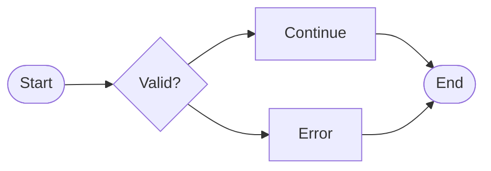

# mermaid-ascii-diagrams

Render Mermaid diagrams to terminal-friendly text (ASCII/Unicode). This tool extracts fenced ` ```mermaid ` blocks from Markdown and renders them as Unicode box-drawing diagrams.

## Features

- CLI to render Mermaid code blocks from Markdown
- Supports `flowchart`/`graph` and `sequenceDiagram`
- Parses `classDiagram` and `stateDiagram`/`stateDiagram-v2` into a generic graph renderer (limited)
- No browser / no JavaScript

## Installation

```bash
pip install mermaid-ascii-diagrams
```

Requires Python 3.10+.

## Command-line usage

Render all Mermaid blocks in a Markdown file:

```bash
mermaid-ascii diagram.md
```

Read Markdown from stdin:

```bash
cat diagram.md | mermaid-ascii -
```

Write output to a file:

```bash
mermaid-ascii diagram.md -o diagram.txt
```

Render only the first block:

```bash
mermaid-ascii --first diagram.md
```

Render a specific block (0-based index):

```bash
mermaid-ascii --index 1 diagram.md
```

Wrap each rendered diagram in a Markdown ` ```text ` fence:

```bash
mermaid-ascii --markdown diagram.md
```

Notes:

- When multiple Mermaid blocks are rendered, outputs are separated by a `--------------------` divider.
- If no Mermaid blocks are found (or `--index` is out of range), the CLI prints an error message and exits non-zero.

## Example

Input (Markdown):

````markdown

````

Output (text):

```text
╭───────╮       ╱──────╲   ┌──────────┐
│ Start ├──────► Valid? │──► Continue ├──┐
╰───────╯       ╲──────╱   └──────────┘  │
                                   ┌─────┴───╮
                                   │   End   │
                                   ╰─────────╯
                 ┌───────┐             ▲
                 │ Error │─────────────┘
                 └───────┘
```

(Exact output depends on terminal width and diagram complexity.)

## Supported syntax (current)

Flowcharts (`flowchart` / `graph`):

- Directions: `TB`, `BT`, `LR`, `RL`
- Edges: `-->`, `---`, `==>`
- Node shapes:
  - `A[Label]` box
  - `A{Label}` diamond
  - `A([Label])` rounded/terminator
- Edge labels like `A -->|yes| B` are currently ignored (the edge is still drawn).

Sequence diagrams (`sequenceDiagram`):

- `participant Name` and `participant Name as Label`
- Messages with arrows: `->`, `->>`, `-->`, `-->>`, and `--` (line without arrowhead)
- `activate Name` / `deactivate Name`
- `+` / `-` receiver flags on messages (activate/deactivate the receiver)

Class/state diagrams:

- `classDiagram`, `stateDiagram` / `stateDiagram-v2` are parsed into a generic graph and rendered with the flowchart renderer.
- Many Mermaid features (styling, subgraphs, notes, etc.) are ignored.

## Python usage

```python
from mermaid_ascii import parse_mermaid, render_ascii

src = """
flowchart LR
  A --> B
"""

diagram = parse_mermaid(src)
print(render_ascii(diagram))
```

## License

MIT License

## Contributing

Issues and pull requests are welcome.

If you're adding new syntax support or changing layout/routing, please include before/after rendered output examples (ideally from real Mermaid snippets).
