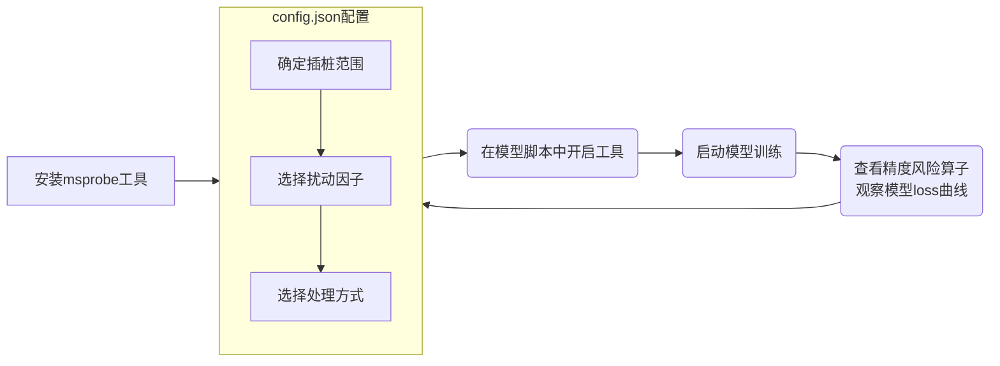

# PyTorch 场景的无标杆比对

## 1 简介
* 本工具的目标是在不依赖标杆数据的情况下，检测模型训练中可能存在的精度问题API级别算子，并提供升精度和tocpu接口快速验证。
* 工具基于**数值病态分析理论**：对算子的输入增加很小的扰动，从而放大输出值异常现象；检测算子原始输出和扰动后输出间误差是否符合精度标准。

* 该工具的**特点**有：
    * 不依赖标杆模型，不需要离线对比；
    * 提供接口，对可疑算子升精度，tocpu进行快速验证。
* 推荐使用场景（针对**算子精度问题**）：
    * **暂无标杆数据**，模型Loss异常，要做精度问题算子排查；
    * **验证可疑算子**，要做进一步确认，验证是否对模型Loss有影响；
    * 低精度模型效果不如高精度，要做精度问题算子排查。
* 该工具的约束
    * 仅支持Pytorch2.x场景；
    * 推荐限定算子范围使用（白名单，或脚本中工具启用范围），算子范围越大，性能和显存损耗越大；详情见[无标杆比对功能在 PyTorch 场景的性能基线报告](./S02.report_free_benchmarking_validation_performance_baseline.md)

## 2 工具实现原理
1. **扰动算子白名单**：根据算子名识别需要插桩算子范围。
2. **扰动因子**：基于torch.nn.Module的hook机制，在注册的hook函数中对算子输入进行特定类型扰动。
3. **误差分析**：
    * **check**: 在hook函数中二次执行算子得到扰动后的算子输出，计算扰动后输出与原始输出的相对误差，查看是否符合精度标准；
    * **fix**: 需要做验证时，可以选择将特定扰动类型（升精度，to cpu）的输出替换原始输出，观察对模型Loss是否有影响。
4. **精度风险算子**：不达标精度标准的，最终会在输出件中展示


## 3 操作指导


工具的推荐使用思路是：

1. 配置config.json开启精度风险算子的排查；
2. 根据精度风险算子输出件，修改config.json开启验证功能，观察模型loss曲线是否改善。

### 3.1 安装msprobe工具
参照[msprobe安装](./01.installation.md)
### 3.2 config.json配置
修改[config.json](../config.json) 的task类型为"**free_benchmark**"开启无标杆功能。支持的配置项详见[配置文件介绍](./02.config_introduction.md)，默认配置如下：
```json
{
    "task": "free_benchmark",
    "dump_path": "./dump_path", 
    "rank": [],  
    "step": [],  
    "level": "L1", 

    "free_benchmark": {
        "scope": [], 
        "list": [],
        "fuzz_device": "npu",
        "pert_mode": "improve_precision",
        "handler_type": "check",
        "fuzz_level": "L1",
        "fuzz_stage": "forward",
        "if_preheat": false,
        "preheat_step": 15,
        "max_sample": 20
    }
}
```
用户需根据自己的使用场景，对[工具实现原理](#2-工具实现原理)中几个关键步骤进行配置。
#### 3.2.1 扰动算子白名单（确定插桩范围）

<table>
    <tr><th>参数</th><th>是否必选</th><th>可配置项</th><th>适用场景</th></tr>
    <tr><td>scope</td><td>否</td><td>自定义</td><td>需要通过指定算子名来限制算子插桩范围 如：["Torch.matmul.0.forward", "Tensor.pow.4.forward"]。</td></tr>
    <tr><td>list</td><td>否</td><td>自定义</td><td>需要通过指定算子类型来限制算子插桩范围 如：["relu"] 会匹配所有算子名中包含relu的算子。</td></tr>
    <tr><td rowspan="2">fuzz_stage</td><td rowspan="2">否</td><td>"forward"（默认）</td><td>需要进行算子<b>前向</b>计算的精度问题排查或<b>验证可疑算子。</b></td></tr>
    <tr><td>"backward"</td><td>需要进行算子<b>反向</b>计算的精度问题排查，不支持仅反向验证，前向验证包括反向。必须设置list参数指定需要检测的算子（详见3.2 config.json配置章节）, 指定的算子会暂存前向激活值，增加内存的占用。</td><td></td></tr>
</table>

#### 3.2.2 选择扰动因子

<table>
    <tr><th>参数</th><th>是否必选</th><th>可配置项</th><th>适用场景</th></tr>
    <tr><td rowspan="6">pert_mode</td><td rowspan="6">否</td><td>"improve_precision" （默认）</td><td>（常用）(可做验证) 插桩算子可能在<b>低精度</b>下有精度问题，扰动因子会将输入的低精度向量升精度。</td></tr>
    <tr><td>"bit_noise"</td><td>（常用）插桩算子可能在<b>轻微扰动</b>下暴露精度问题，扰动因子会将输入向量最后一个比特位翻转。</td></tr>
    <tr><td>"add_noise"</td><td>插桩算子可能在<b>轻微扰动</b>下暴露精度问题，扰动因子会为输入向量增加一个极小值。</td></tr>
    <tr><td>"change_value"</td><td>插桩算子可能存在<b>大数吃小数</b>问题，扰动因子会交换输入向量的首尾值。</td></tr>
    <tr><td>"no_change"</td><td>插桩算子可能存在<b>数值稳定性</b>精度问题，扰动因子会复制原始输入。</td></tr>
    <tr><td>"to_cpu"</td><td>(可做验证) 插桩算子可能在<b>同 CPU </b>精度表现不一致，扰动因子会将输入转至 CPU，需要配合 fuzz_device="cpu"使用。</td></tr>
    <tr><td rowspan="2">fuzz_device</td><td rowspan="2">否</td><td>"npu" （默认）</td><td>pert_mode 不需要to cpu操作。</td></tr>
    <tr><td>"cpu"</td><td>pert_mode 须配置为"to_cpu"，目前仅支持"to cpu"扰动因子。</td></tr>
</table>


#### 3.2.3 选择处理方式

<table>
    <tr><th>参数</th><th>是否必选</th><th>可配置项</th><th>适用场景</th></tr>
    <tr><td rowspan="2">handler_type</td><td rowspan="2">否</td><td>"check"（默认）</td><td>要做精度问题算子排查，输出扰动前后不符合精度标准的算子，支持所有扰动因子。</td></tr>
    <tr><td>"fix"</td><td>要做可疑算子验证，用扰动后输出替换原始输出，支持"improve_precision"，"to_cpu"两种扰动因子。</td></tr>
</table>

### 3.3 在模型脚本中开启工具

通过PrecisionDebugger统一入口开启工具，示例如下：

```python
from msprobe.pytorch import PrecisionDebugger  

debugger = PrecisionDebugger(config_path='./config.json')
...
debugger.start() # 一般在训练循环开头启动工具
... # 循环体
debugger.stop() # 一般在训练循环末尾结束工具
debugger.step() # 在训练循环的最后需要重置工具，非循环场景不需要
```

### 3.4 启动模型训练
训练过程中出现以下日志，可以检查工具是否正常使用。

<table>
    <tr><th>日志级别</th><th>日志内容</th><th>检查说明</th></tr>
    <tr><td rowspan="3">INFO</td><td>[msprobe] Free Benchmark: Perturbation is {扰动因子} of {算子名}.</td><td>扰动因子与配置相符，算子名在插桩范围内。</td></tr>
    <tr><td>[msprobe] Free Benchmark: For {算子名},{原因}. Cancel perturbation.</td><td>算子名在插桩范围内，但当前算子由于{原因}不支持添加扰动。</td></tr>
    <tr><td>[msprobe] Free benchmark: preheat sample in step {step} api_name {算子名} curr_called_seq: {当前采样数}/{总采样数}"</td><td>仅开启预热，算子名在插桩范围内，在当前step的采样情况。</td></tr>
    <tr><td>WARNING</td><td>[msprobe] Free benchmark: 无标杆工具不支持当前算子的输入类型 {算子名}.</td><td>算子名在插桩范围内，但当前算子没有可操作的输入（不存在Tensor，list类型等）。</td></tr>
</table>

其余日志均说明当前算子未能正常添加扰动，请检查日志信息判断是否更换扰动因子或不考虑当前算子结果。


### 3.5 查看精度风险算子

check模式下，无标杆比对在dump_path目录下将扰动前后不符合精度标准的结果输出在文件 free_benchmark.csv，如下示例：


| 字段         | 说明                                                                                     |
| ------------ | ---------------------------------------------------------------------------------------- |
| rank         | Rank ID，int 类型。                                                                      |
| pert_mode    | 扰动因子的类型，string 类型。                                                            |
| stage        | 前向或反向，string 类型。                                                                |
| step         | 迭代数，int 类型。                                                                       |
| api_name     | API 名称，string 类型。                                                                  |
| max_rel      | 输出对比最大相对误差，float 类型。                                                       |
| dtype        | 输入的 dtype，string 类型。                                                              |
| shape        | 输入的 shape，tuple 类型。                                                               |
| output_index | 如果输出为列表或元组，其中一个元素检测不一致，则会有该元素的 index，否则为空，int 类型。 |

无标杆根据参照的精度标准如下：
| 输出dtype      | 相对误差阈值 |
| -------------- | ------------ |
| torch.float16  | 0.002        |
| torch.bfloat16 | 0.004        |
| torch.float32  | 0.0002       |
| 其他           | 0.0002       |
