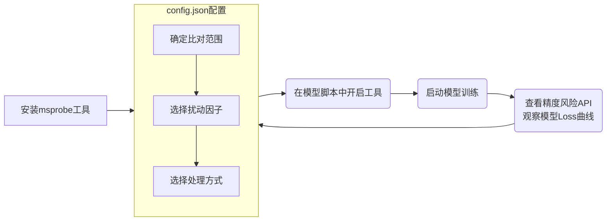

# MindSpore 场景的无标杆比对

## 1 简介
* 本工具的目标是在没有标杆数据的情况下，检测模型训练中可能存在精度问题的 API 级别算子，并提供升精度接口进行快速验证。
* 工具基于**数值病态分析理论**：对算子的输入增加很小的扰动、从而放大输出值异常现象；检测算子原始输出和扰动后输出间误差是否符合精度标准。

* 该工具的**特点**有：
    * 不依赖标杆模型，在线对比。
    * 提供升精度接口，对可疑算子进行快速验证。
* 推荐使用场景（针对**API 精度问题**）：
    * **暂无标杆数据**，模型 Loss 异常，要做精度问题 API 排查。
    * 低精度模型效果不如高精度，要做精度问题 API 排查。
    * **验证低精度可疑 API**，确认升精度后是否对模型 Loss 有影响。
* 该工具的约束
    * 仅支持 MindSpore 动态图场景。支持的 API 类型为 ops、Tensor、mint 和 mint.nn.functional 类的非 inplace 计算 API，不支持 Primitive 和 Jit 类 API。
    * 仅支持 输入输出向量为浮点数类型(BF16、FP16、FP32、FP64)的 API 比对。
    * 建议配置白名单（设置 list），控制对少量 API 进行无标杆比对。比对 API 越多，性能和显存损耗越大。

## 2 工具实现原理
1. **扰动算子白名单**：根据 API 名，控制需要进行无标杆比对的 API。

2. **扰动因子**：基于 mindspore.nn.Cell 的 hook 机制，在注册的 hook 函数中对算子输入进行特定类型扰动。

3. **误差分析**：
    * **check**: 在 hook 函数中二次执行算子得到扰动后的算子输出、计算扰动后输出与原始输出的相对误差，查看是否符合精度标准。
    * **fix**: 需要做验证时，可以将升精度的输出替换原始输出，观察对模型 Loss 是否有影响。

4. **精度风险算子**：不达标精度标准的，最终会在输出件中展示。

## 3 操作指导


工具的推荐使用思路是：

1. 配置 config.json，选择无标杆比对任务，进行精度风险 API 的排查。

2. 根据精度风险 API 输出件，修改 config.json 开启验证功能，观察模型loss曲线是否改善。

### 3.1 安装msprobe工具
参照 [msprobe安装](./01.installation.md)
### 3.2 config.json配置
修改 [config.json](../config.json) 的 task 类型为"**free_benchmark**"开启无标杆功能。支持的配置项详见[配置文件介绍](./02.config_introduction.md)，默认配置如下：
```json
{
    "task": "free_benchmark",
    "dump_path": "./dump_path", 
    "rank": [],  
    "step": [],  
    "level": "L1", 

    "free_benchmark": {
        "list": [],
        "fuzz_device": "npu",
        "pert_mode": "improve_precision",
        "handler_type": "check",
        "fuzz_level": "L1",
        "fuzz_stage": "forward"
    }
}
```
用户需根据自己的使用场景，对照[工具实现原理](#2-工具实现原理)中几个关键步骤进行配置
####  3.2.1 确定比对范围

<table>
    <tr><th>参数</th><th>是否必选</th><th>可配置项</th><th>适用场景</th></tr>
    <tr><td>list</td><td>否</td><td>自定义</td><td>需要通过指定 API 名来限制比对API个数 如：["mindspore.ops.bmm"] 会只对mindspore.ops.bmm API进行比对。</td></tr>
    <tr><td rowspan="2">fuzz_stage</td><td rowspan="2">否</td><td>"forward"（默认）</td><td>需要进行 API <b>前向</b>计算的精度问题排查或验证。</td></tr>
    <tr><td>"backward"</td><td>需要进行 API <b>反向</b>计算的精度问题排查，不支持反向验证（前向验证包括反向）。</td></tr>
</table>

####  3.2.2 选择扰动因子

<table>
    <tr><th>参数</th><th>是否必选</th><th>可配置项</th><th>适用场景</th></tr>
    <tr><td rowspan="5">pert_mode</td><td rowspan="5">否</td><td>"improve_precision" （默认）</td><td>（常用）(可做验证) API 可能在<b>低精度</b>下有精度问题，扰动因子会将输入的低精度向量升精度。</td></tr>
    <tr><td>"add_noise"</td><td>API 可能在<b>轻微扰动</b>下暴露精度问题，扰动因子会为输入向量增加一个极小值。</td></tr>
    <tr><td>"bit_noise"</td><td>API 可能在<b>轻微扰动</b>下暴露精度问题，扰动因子会翻转输入向量的最后一个比特位。不支持BF16类型向量。</td></tr>
    <tr><td>"no_change"</td><td>API 可能存在<b>数值稳定性</b>精度问题，扰动因子会复制原始输入。</td></tr>
    <tr><td>"change_value"</td><td>API 可能存在<b>大数吃小数</b>问题，扰动因子会交换输入向量的首尾值。</td></tr>
</table>

####  3.2.3 选择处理方式

<table>
    <tr><th>参数</th><th>是否必选</th><th>可配置项</th><th>适用场景</th></tr>
    <tr><td rowspan="2">handler_type</td><td rowspan="2">否</td><td>"check"（默认）</td><td>要做精度问题 API 排查，输出扰动前后不符合精度标准的 API，支持所有扰动因子。</td></tr>
    <tr><td>"fix"</td><td>要做可疑 API 验证，用扰动后输出替换原始输出，仅支持 "improve_precision" 扰动因子。</td></tr>
</table>

### 3.3 在模型脚本中开启工具

通过 PrecisionDebugger 统一接口开启工具，示例如下：

```python
import mindspore as ms
ms.set_context(mode=ms.PYNATIVE_MODE, device_target="Ascend")

# 其他模块的导入
# ...

from msprobe.mindspore import PrecisionDebugger
debugger = PrecisionDebugger(config_path='./config.json')

# 模型、损失函数的定义以及初始化等操作
# ...
model = Network()

# 数据集迭代的地方往往是模型开始训练的地方
for step, (input_ids, input_position, attention_mask) in enumerate(dataset.create_tuple_iterator()):
    debugger.start() # 一般在训练循环开头启动工具
    # 单步训练逻辑
    # ...
    debugger.stop() # 一般在训练循环末尾结束工具
    debugger.step() # 在训练循环的最后需要重置工具，非循环场景不需要
```

### 3.4 查看精度风险算子

check 模式下，若存在不符合精度标准的 API，则工具会在 dump_path 目录下将相应 API 信息输出在文件 free_benchmark.csv 中。csv 文件字段含义如下所示：

| 字段         | 说明                                                                                     |
| ------------ | ---------------------------------------------------------------------------------------- |
| rank         | Rank ID，int 类型。                                                                       |
| pert_mode    | 扰动因子的类型，string 类型。                                                              |
| stage        | 前/反向，string 类型。                                                                    |
| step         | 迭代数，int 类型。                                                                        |
| api_name     | API 名称，string 类型。                                                                   |
| max_rel      | 输出对比最大相对误差，float 类型。                                                         |
| dtype        | 输入的 dtype，string 类型。                                                               |
| shape        | 输入的 shape，tuple 类型。                                                                |
| output_index | 如果输出为列表或元组，其中一个元素检测不一致，则会有该元素的 index，否则为空，int 类型。        |

无标杆比对使用的精度标准如下：

| 输出dtype          | 相对误差阈值 |
| ------------------ | ------------ |
| mindspore.bfloat16 | 0.004        |
| mindspore.float16  | 0.002        |
| mindspore.float32  | 0.0002       |
| mindspore.float64  | 0.0002       |
