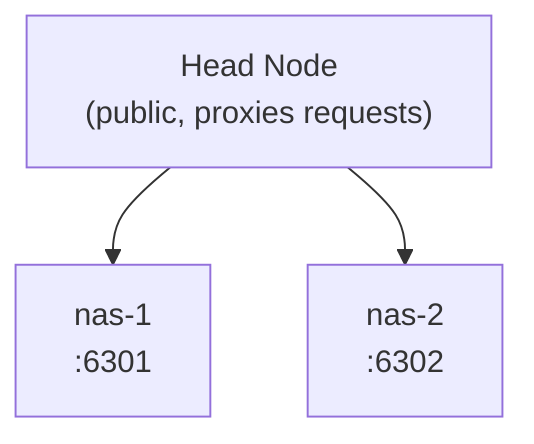

## Overview 

Prerequisites:

- Simple demo: [https://monitorat.brege.org/](https://monitorat.brege.org/)
- Advanced demo: [https://monitorat.brege.org/advanced/](https://monitorat.brege.org/advanced/)

Federation aggregates data from multiple monitorat instances into a unified view. This makes comparing metric data across two or more instances more continuous, allowing you to merge charts, mix reminders and service status, and pull documentation from multiple sources in one continuous display.

## How widgets can combine data in federation

Different widgets and widget features support different integrations.

| widget    | feature       | description |
|:--------- |:------------- |:----------- |
| wiki      | fragments     | pull markdown from multiple remotes |
| metrics   | charts/tables | combine metrics data; multi-plot over time; filter by source |
| services  | cards/compact | interleave status cards; sort by status |
| reminders | cards         | interleave reminders; sort by severity, date, name, source |
| speedtest | chart/table   | combine speedtest data; multi-plot over time; filter; run all |
| network   | outages       | interleave ouages; sort by status type, date, source |

Each federated widget declares its sources with, for example `federation.nodes: [nas-1, nas-2]`.

**Merging** is data-driven: it allows data from multiple hosts to be combined into a single chart.
Merging can be used to interleave alerts and services cards, giving you a multi-sourced mix of apps and network failures, and reminders from a central command.

## Architecture

## Configuration

{{ include:code path="snippets/federation.yaml" lang="yaml" }}
