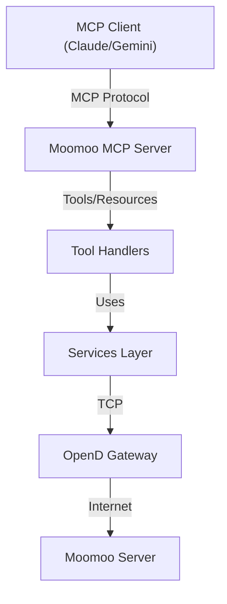

# Design

## Architecture

We will follow the **FastMCP** pattern as described in `openspec/project.md`.

### Component Diagram



### Components

1.  **Server (`server.py`)**:
    - Initializes `FastMCP`.
    - Manages lifecycle (`app_lifespan`) to connect/disconnect Moomoo contexts.
    - Injects dependencies (`QuoteContext`, `TradeContext`) into request context.

2.  **Services**:
    - Wrapper around `moomoo-api` contexts to handle connection state and error mapping.
    - `MoomooService`: Base class or shared service for managing `OpenQuoteContext` and `OpenSecTradeContext`.

3.  **Tools**:
    - `check_health`: simple tool to query basic info (e.g., `get_global_state` or just checking if context is open).

## Implementation Details

### Connection Management

The `app_lifespan` context manager will initialize the `OpenQuoteContext` and `OpenSecTradeContext` on startup and close them on shutdown. This ensures a persistent connection while the server is running.

```python
@asynccontextmanager
async def app_lifespan(server: FastMCP) -> AsyncIterator[AppContext]:
    # Initialize contexts
    quote_ctx = OpenQuoteContext(host='127.0.0.1', port=11111)

    # Simple check to see if connected (optional, or rely on lazy check)
    # ...

    try:
        yield AppContext(quote_ctx=quote_ctx)
    finally:
        quote_ctx.close()
```

### Health Check Tool

The `check_health` tool will attempt a lightweight API call, such as `get_global_state` (if available) or just verifying the socket connection status provided by the SDK.
