# MSN Weather Wrapper API

Flask REST API for fetching weather data from MSN Weather.

## API Request Flow

```mermaid
%%{init: {'theme': 'base', 'themeVariables': {'primaryColor': '#E3F2FD', 'primaryTextColor': '#0F172A', 'primaryBorderColor': '#1E88E5', 'lineColor': '#1E88E5', 'secondaryColor': '#BBDEFB', 'tertiaryColor': '#90CAF9', 'edgeLabelBackground': '#E3F2FD'}}}%%
sequenceDiagram
    actor Client
    participant API as API Gateway
    participant Valid as Validation
    participant Cache as LRU Cache
    participant MSN as MSN Service
    participant Response as Response

    Client->>API: GET /api/weather<br/>?city=Seattle&country=USA
    activate API

    API->>Valid: Sanitize input
    activate Valid
    Valid->>Valid: Check length < 100
    Valid->>Valid: Remove bad chars
    Valid->>Valid: Verify string type
    Valid-->>API: ✓ Valid
    deactivate Valid

    API->>Cache: Check cache<br/>TTL bucket
    activate Cache
    alt Cache Hit
        Cache-->>API: Return cached data
        API-->>Response: 200 OK (cached)
    else Cache Miss
        Cache-->>API: No cache entry
        deactivate Cache
        API->>MSN: Fetch from MSN
        activate MSN
        MSN-->>API: Weather data
        deactivate MSN
        API->>Cache: Store in cache
        API-->>Response: 200 OK (fresh)
    end

    deactivate API
    Response-->>Client: JSON response
```



## Interactive API Documentation

**Swagger UI** is available for interactive API exploration and testing:

- **Local Development**: [http://localhost:5000/apidocs/](http://localhost:5000/apidocs/)
- **Container Deployment**: [http://localhost:8080/apidocs/](http://localhost:8080/apidocs/)

The Swagger UI provides:
- 📖 Complete API documentation with request/response examples
- 🧪 Interactive endpoint testing directly from your browser
- 🔍 Request/response schema validation
- 🏷️ Organized endpoints by category (health, weather, searches)
- 🔐 Session-based authentication support for recent searches

**OpenAPI Specification**: Available at `/apispec.json` for API clients and tools

---

## API Endpoints

### Health Check

Check if the API is running.

**Endpoint:** `GET /api/health`

**Response:**
```json
{
  "status": "ok",
  "service": "MSN Weather Wrapper API"
}
```

### Weather by City (GET)

Fetch weather data for a specific location using query parameters.

**Endpoints:**
- `GET /api/weather` (legacy)
- `GET /api/v1/weather` (versioned)

**Query Parameters:**
- `city` (required): City name
- `country` (required): Country name

**Example Request:**
```bash
curl "http://localhost:5000/api/weather?city=Seattle&country=USA"
```

**Success Response (200):**
```json
{
  "location": {
    "city": "Seattle",
    "country": "USA",
    "latitude": null,
    "longitude": null
  },
  "temperature": 6.1,
  "condition": "Cloudy",
  "humidity": 97,
  "wind_speed": 1.6
}
```

**Error Response (400):**
```json
{
  "error": "Missing required parameters",
  "message": "Both 'city' and 'country' parameters are required"
}
```

### Weather by City (POST)

Fetch weather data for a specific location using JSON body.

**Endpoints:**
- `POST /api/weather` (legacy)
- `POST /api/v1/weather` (versioned)

**Request Body:**
```json
{
  "city": "London",
  "country": "UK"
}
```

**Example Request:**
```bash
curl -X POST http://localhost:5000/api/weather \
  -H "Content-Type: application/json" \
  -d '{"city": "London", "country": "UK"}'
```

**Success Response (200):**
```json
{
  "location": {
    "city": "London",
    "country": "UK",
    "latitude": null,
    "longitude": null
  },
  "temperature": 9.4,
  "condition": "Mostly sunny",
  "humidity": 83,
  "wind_speed": 9.7
}
```

**Error Response (400):**
```json
{
  "error": "Missing required fields",
  "message": "Both 'city' and 'country' fields are required"
}
```

**Error Response (500):**
```json
{
  "error": "Failed to fetch weather data",
  "message": "Error details here"
}
```

### Weather by Coordinates

Fetch weather data using geographic coordinates with reverse geocoding.

**Endpoint:** `GET /api/v1/weather/coordinates`

**Query Parameters:**
- `lat` (required): Latitude (-90 to 90)
- `lon` (required): Longitude (-180 to 180)

**Example Request:**
```bash
curl "http://localhost:5000/api/v1/weather/coordinates?lat=47.6062&lon=-122.3321"
```

**Success Response (200):**
```json
{
  "location": {
    "city": "Seattle",
    "country": "USA",
    "latitude": 47.6062,
    "longitude": -122.3321
  },
  "temperature": 15.5,
  "condition": "Partly Cloudy",
  "humidity": 65,
  "wind_speed": 12.5
}
```

**Error Response (400):**
```json
{
  "error": "Invalid coordinates",
  "message": "Latitude must be between -90 and 90"
}
```

**Python Example:**
```python
from msn_weather_wrapper import WeatherClient

client = WeatherClient()
weather = client.get_weather_by_coordinates(47.6062, -122.3321)
print(f"Weather in {weather.location.city}: {weather.temperature}°C")
```

**Frontend Example:**
```javascript
// Get user's location and fetch weather
navigator.geolocation.getCurrentPosition(async (position) => {
  const { latitude, longitude } = position.coords;
  const response = await fetch(
    `/api/v1/weather/coordinates?lat=${latitude}&lon=${longitude}`
  );
  const weather = await response.json();
  console.log(weather);
});
```

### Recent Searches

Manage recent search history (session-based, max 10 searches).

#### Get Recent Searches

**Endpoint:** `GET /api/v1/recent-searches`

**Response:**
```json
{
  "recent_searches": [
    {"city": "Seattle", "country": "USA"},
    {"city": "London", "country": "UK"},
    {"city": "Tokyo", "country": "Japan"}
  ]
}
```

#### Clear Recent Searches

**Endpoint:** `DELETE /api/v1/recent-searches`

**Response:**
```json
{
  "message": "Recent searches cleared"
}
```

**Example:**
```bash
# Get recent searches
curl http://localhost:5000/api/v1/recent-searches

# Clear recent searches
curl -X DELETE http://localhost:5000/api/v1/recent-searches
```

## Running the API

### Development Mode

```bash
python api.py
```

The API will be available at `http://localhost:5000`

### Production Mode (Recommended)

The project includes Gunicorn 23.0+ as a production WSGI server. Use it for production deployments:

```bash
# Gunicorn is already included in dependencies
gunicorn --bind 0.0.0.0:5000 --workers 4 --timeout 120 api:app
```

**Configuration:**
- `--workers 4`: Runs 4 worker processes for concurrent request handling
- `--timeout 120`: Sets 120-second timeout for slow weather API responses
- `--bind 0.0.0.0:5000`: Binds to all interfaces on port 5000

**Podman Deployment:**
The Podman container automatically uses Gunicorn with these production settings. No additional configuration needed.

## Features

### Rate Limiting
- **Weather endpoints**: 30 requests per minute per IP
- **Global limit**: 200 requests per hour total
- Protection against DoS attacks

### Caching
- Weather data cached for 5 minutes
- Significantly faster repeated requests
- Automatic cache invalidation

### Session Management
- Recent searches stored per session
- Session-based (cookies)
- For production with multiple instances, consider Redis

### Security
- Comprehensive input validation
- Protection against SQL injection, XSS, path traversal, command injection
- Rate limiting enabled
- CORS configured with credentials support

## CORS & Authentication

CORS is enabled with credentials support for session management:

## Example React Integration

```typescript
// Fetch weather data
async function getWeather(city: string, country: string) {
  const response = await fetch(
    `http://localhost:5000/api/weather?city=${encodeURIComponent(city)}&country=${encodeURIComponent(country)}`
  );

  if (!response.ok) {
    throw new Error('Failed to fetch weather');
  }

  return await response.json();
}

// Usage
getWeather('Seattle', 'USA')
  .then(data => {
    console.log(`Temperature: ${data.temperature}°C`);
    console.log(`Condition: ${data.condition}`);
  })
  .catch(error => console.error(error));
```

Or using POST:

```typescript
async function getWeather(city: string, country: string) {
  const response = await fetch('http://localhost:5000/api/v1/weather', {
    method: 'POST',
    headers: {
      'Content-Type': 'application/json',
    },
    credentials: 'include',  // Important for session cookies
    body: JSON.stringify({ city, country }),
  });

  if (!response.ok) {
    throw new Error('Failed to fetch weather');
  }

  return await response.json();
}
```

**Using Geolocation:**
```typescript
async function getWeatherByLocation() {
  return new Promise((resolve, reject) => {
    navigator.geolocation.getCurrentPosition(
      async (position) => {
        const { latitude, longitude } = position.coords;
        const response = await fetch(
          `/api/v1/weather/coordinates?lat=${latitude}&lon=${longitude}`,
          { credentials: 'include' }
        );
        const data = await response.json();
        resolve(data);
      },
      reject
    );
  });
}
```

## Testing

Run the API tests:

```bash
# All tests
pytest

# API tests only
pytest tests/test_api.py -v

# Integration tests (requires running API)
pytest tests/test_integration.py -v

# Security tests
pytest tests/test_security.py -v
```

## Production Deployment

### Environment Variables

```bash
# Session secret (required for production)
export SESSION_SECRET_KEY='your-secret-key-here'

# Flask configuration
export FLASK_ENV=production
export FLASK_DEBUG=0
```

### Security Considerations

1. **HTTPS Required**: Geolocation requires HTTPS in production
2. **Session Storage**: Use Redis for multi-instance deployments
3. **Rate Limiting**: Configure based on expected traffic
4. **CORS Origins**: Restrict to specific domains in production
5. **Secret Key**: Use strong random secret for sessions

### Docker/Podman

```bash
# Build and run
podman build -t msn-weather-wrapper .
podman run -p 8080:80 -e SESSION_SECRET_KEY='secret' msn-weather-wrapper

# Using compose
podman-compose up -d
```

## React Component Examples

Ready-to-use React components are provided in the repository:
- `WeatherWidget.jsx` - JavaScript version
- `WeatherWidget.tsx` - TypeScript version

Both demonstrate how to integrate the API with a Vite + React frontend. Features include:
- Loading states and error handling
- Input validation and URL encoding
- Clean UI with weather display

Simply copy the component into your React project and import it after starting the Flask API server.

## Complete Endpoint Summary

| Method | Endpoint | Description | Version |
|--------|----------|-------------|---------|
| GET | `/api/health` | Basic health check | Legacy |
| GET | `/api/v1/health` | Basic health check | v1 |
| GET | `/api/v1/health/live` | Liveness probe | v1 |
| GET | `/api/v1/health/ready` | Readiness probe | v1 |
| GET | `/api/weather` | Get weather by city | Legacy |
| GET | `/api/v1/weather` | Get weather by city | v1 |
| POST | `/api/weather` | Get weather by city | Legacy |
| POST | `/api/v1/weather` | Get weather by city | v1 |
| GET | `/api/v1/weather/coordinates` | Get weather by coordinates | v1 |
| GET | `/api/v1/recent-searches` | Get recent searches | v1 |
| DELETE | `/api/v1/recent-searches` | Clear recent searches | v1 |

## Error Codes

The API uses standard HTTP status codes and returns consistent error response format:

### HTTP Status Codes

| Code | Status | Description |
|------|--------|-------------|
| 200 | OK | Request successful |
| 400 | Bad Request | Invalid or missing parameters |
| 404 | Not Found | Endpoint not found |
| 429 | Too Many Requests | Rate limit exceeded |
| 500 | Internal Server Error | Server error occurred |
| 503 | Service Unavailable | Service temporarily unavailable |

### Error Response Format

All errors follow this JSON structure:

```json
{
  "error": "Short error category",
  "message": "Detailed explanation of the error"
}
```

### Common Error Examples

**Missing Parameters (400):**
```json
{
  "error": "Missing required parameters",
  "message": "Both 'city' and 'country' parameters are required"
}
```

**Invalid Input (400):**
```json
{
  "error": "city contains invalid characters",
  "message": "Only letters, spaces, hyphens, and Unicode characters are allowed"
}
```

**Rate Limit Exceeded (429):**
```json
{
  "error": "Rate limit exceeded",
  "message": "Too many requests. Please try again later."
}
```

**Geocoding Failed (400):**
```json
{
  "error": "Geocoding failed",
  "message": "Could not find location for coordinates"
}
```

**Server Error (500):**
```json
{
  "error": "Failed to fetch weather data",
  "message": "Connection timeout to weather service"
}
```

## Rate Limiting

The API implements rate limiting to prevent abuse and ensure fair usage:

### Limits

- **Per IP Address**: 30 requests per minute
- **Total Server**: 200 requests per hour
- **Recent Searches**: 10 searches maximum per session

### Rate Limit Headers

Check remaining quota using response headers:

```bash
curl -i "http://localhost:5000/api/weather?city=Seattle&country=USA"
```

```
HTTP/1.1 200 OK
X-RateLimit-Limit: 30
X-RateLimit-Remaining: 29
X-RateLimit-Reset: 1734045600
```

### Handling Rate Limits

When rate limited (429 response):

1. **Respect the limit**: Wait before retrying
2. **Check X-RateLimit-Reset**: Unix timestamp when limit resets
3. **Implement backoff**: Exponential backoff for retries
4. **Cache responses**: Store results locally (5 min cache recommended)

**Example with retry logic:**

```python
import time
import requests

def get_weather_with_retry(city, country, max_retries=3):
    for attempt in range(max_retries):
        response = requests.get(
            "http://localhost:5000/api/weather",
            params={"city": city, "country": country}
        )

        if response.status_code == 200:
            return response.json()

        if response.status_code == 429:
            reset_time = int(response.headers.get('X-RateLimit-Reset', 0))
            wait_time = max(reset_time - time.time(), 0) + 1
            print(f"Rate limited. Waiting {wait_time}s...")
            time.sleep(wait_time)
            continue

        response.raise_for_status()

    raise Exception("Max retries exceeded")
```

### Caching

The API caches responses for 5 minutes to improve performance:

- **Cache Key**: `{city}:{country}` or `{lat}:{lon}`
- **Cache Duration**: 300 seconds (5 minutes)
- **Cache Hit**: Returns cached data (90%+ faster)
- **Cache Miss**: Fetches fresh data from MSN Weather

**Benefits:**
- Reduces load on MSN Weather
- Faster responses for repeated requests
- Lower rate limit consumption

## Input Validation

All inputs are validated for security and data integrity:

### City/Country Names

- **Allowed**: Letters, spaces, hyphens, apostrophes, periods, Unicode characters
- **Max Length**: 100 characters
- **Blocked**: Special characters `<>;&|$\`
- **Trimmed**: Leading/trailing whitespace removed

### Coordinates

- **Latitude**: -90 to 90 (decimal degrees)
- **Longitude**: -180 to 180 (decimal degrees)
- **Format**: Float or integer

### Security Features

- ✅ SQL injection prevention
- ✅ XSS attack prevention
- ✅ Path traversal protection
- ✅ Command injection blocking
- ✅ Null byte filtering
- ✅ Input length limits
- ✅ Type validation

See [SECURITY.md](SECURITY.md) for complete security documentation.

## CORS Configuration

Cross-Origin Resource Sharing (CORS) is enabled for web applications with full support in both development and production environments:

```python
# CORS Headers (automatically added)
Access-Control-Allow-Origin: <requesting-origin>
Access-Control-Allow-Methods: GET, POST, DELETE, OPTIONS
Access-Control-Allow-Headers: Content-Type, Authorization
Access-Control-Allow-Credentials: true
Access-Control-Max-Age: 3600
```

**Key Features:**
- ✅ Dynamic origin handling (no wildcards in production)
- ✅ Credentials support for session-based authentication
- ✅ Preflight request (OPTIONS) handling
- ✅ Both Flask (dev) and Nginx (production) CORS support

**Environment Variables:**

```bash
# Restrict to specific origin (recommended for production)
CORS_ORIGINS=https://yourapp.com

# Allow multiple origins
CORS_ORIGINS=https://app1.com,https://app2.com

# Allow all origins (default for development, less secure)
CORS_ORIGINS=*
```

**Production Deployment:** When using the containerized deployment, Nginx automatically handles CORS headers at the proxy level while preserving Flask's CORS configuration for API-level control.

## Logging

Structured JSON logging with request tracking:

```json
{
  "timestamp": "2025-12-02T15:30:45.123Z",
  "level": "info",
  "event": "weather_request",
  "request_id": "abc123",
  "ip": "192.168.1.1",
  "city": "Seattle",
  "country": "USA",
  "duration_ms": 245
}
```

**Log Levels:**
- `INFO`: Normal requests
- `WARNING`: Rate limits, validation errors
- `ERROR`: Server errors, exceptions

**Configure logging:**

```bash
# Set log level
export LOG_LEVEL=INFO  # DEBUG, INFO, WARNING, ERROR

# Enable/disable logging
export ENABLE_LOGGING=true
```

## See Also

- [Security Documentation](SECURITY.md) - Input validation and security
- [Testing Guide](TESTING.md) - Comprehensive testing guide
- [Development Guide](DEVELOPMENT.md) - Local development setup

---

Last updated: December 2, 2025
