# Security

MSN Weather Wrapper implements comprehensive security measures to protect against common web vulnerabilities and attacks.

## Reporting Security Issues

If you discover a security vulnerability, please report it privately to:
- **Email**: the.jim.wyatt@outlook.com
- **Subject**: [SECURITY] MSN Weather Wrapper - Brief Description

Please do not open public issues for security vulnerabilities.

## Security Features

### Input Validation
- **Character Filtering**: Blocks dangerous characters (`;`, `<>`, `` ` ``, `$`, `|`, `&`, `/\`)
- **Length Limits**: 100 character maximum for city and country names
- **Type Checking**: Enforces string types, rejects integers/booleans/arrays
- **Whitespace Handling**: Trims and rejects empty/whitespace-only inputs

### Security Defense Layers

```mermaid
%%{init: {'theme': 'base', 'themeVariables': {'primaryColor': '#E3F2FD', 'primaryTextColor': '#0F172A', 'primaryBorderColor': '#1E88E5', 'lineColor': '#1E88E5', 'secondaryColor': '#BBDEFB', 'tertiaryColor': '#90CAF9', 'edgeLabelBackground': '#E3F2FD'}}}%%
graph TD
    subgraph Layer1["🔍 Layer 1: Input Reception"]
        L1["Input Received<br/>(user parameter)"]
    end

    subgraph Layer2["✂️ Layer 2: Data Cleaning"]
        L2["Trim Whitespace<br/>Normalize input"]
    end

    subgraph Layer3["📏 Layer 3: Validation"]
        L3["Empty Check<br/>Length Limit ≤ 100 chars<br/>Type Validation (string only)"]
    end

    subgraph Layer4["🔒 Layer 4: Sanitization"]
        L4["Block Dangerous Chars<br/>Remove: ; &lt;&gt; ` $ | &amp; /"]
    end

    subgraph Layer5["🛡️ Layer 5: Attack Prevention"]
        L5["SQL Injection<br/>XSS Prevention<br/>Path Traversal<br/>Command Injection<br/>Null Byte Blocking"]
    end

    subgraph Layer6["⛔ Layer 6: Rate Limiting"]
        L6["30 req/min per IP<br/>200 req/hour global<br/>DoS/DDoS Protection"]
    end

    subgraph Layer7["✅ Layer 7: Safe Execution"]
        L7["Process Request<br/>Return Response"]
    end

    L1 --> L2 --> L3 --> L4 --> L5 --> L6 --> L7

    %% Muted blues and ambers for web-friendly contrast
    style L1 fill:#E3F2FD,stroke:#1E88E5,stroke-width:1.5px,color:#0F172A
    style L2 fill:#D7E3FC,stroke:#1E88E5,stroke-width:1.5px,color:#0F172A
    style L3 fill:#C5CAE9,stroke:#1E88E5,stroke-width:1.5px,color:#0F172A
    style L4 fill:#BBDEFB,stroke:#1E88E5,stroke-width:1.5px,color:#0F172A
    style L5 fill:#90CAF9,stroke:#1E88E5,stroke-width:1.5px,color:#0F172A
    style L6 fill:#FFE082,stroke:#FBC02D,stroke-width:1.5px,color:#0F172A
    style L7 fill:#1E88E5,stroke:#0D47A1,stroke-width:1.5px,color:#fff
```



### Attack Prevention

| Attack Type | Protection | Status |
|------------|------------|--------|
| SQL Injection | Blocks SQL keywords and syntax | ✅ Blocked |
| XSS (Cross-Site Scripting) | Blocks HTML/JavaScript tags | ✅ Blocked |
| Path Traversal | Blocks directory traversal patterns | ✅ Blocked |
| Command Injection | Blocks shell command syntax | ✅ Blocked |
| Null Byte Injection | Blocks null characters | ✅ Blocked |
| Buffer Overflow | Enforces input length limits | ✅ Blocked |
| Type Confusion | Validates data types | ✅ Blocked |

### Rate Limiting
- **Weather Endpoints**: 30 requests per minute per IP
- **Global Limit**: 200 requests per hour total
- **Protection**: DoS and DDoS mitigation

## Security Testing

### Automated Security Scanning

The project uses a **comprehensive security scanning workflow** integrated into CI/CD:

**SAST (Static Application Security Testing):**
- **Bandit**: Detects hardcoded passwords, insecure patterns, common security issues
- **Semgrep**: Advanced pattern-based SAST with community security rules (main branch only)

**Dependency Vulnerability Scanning:**
- **Safety**: Checks PyPI known vulnerabilities database (main branch only)
- **pip-audit**: OSV database vulnerability checking (main branch only)
- **Dependency Tree**: Complete dependency mapping for audit trails

**Container Security:**
- **Trivy**: Multi-layer container image vulnerability scanning with SARIF upload to GitHub Security (main branch only)
- **Grype**: SBOM-based vulnerability detection and analysis (main branch only)

**License Compliance:**
- **pip-licenses**: Dependency license checking on all branches
- **Automated GPL/AGPL detection** for compliance violations

**Execution Strategy:**
- **Pull Requests**: Basic security checks (Bandit + licenses) - fast feedback
- **Main Branch & Tags**: Full comprehensive scanning (all 6 tools) - complete validation
- **Manual Trigger**: On-demand full scans via workflow dispatch

**Artifact Management:**
- 7-day retention for PR artifacts
- 30-day retention for main branch artifacts
- All reports uploaded to GitHub Security tab
- Automated markdown reports generated for documentation site

**CI/CD Integration:**
- Critical security checks run on every PR (fast)
- Full comprehensive scans on main branch and tags (thorough)
- Results uploaded to GitHub Security tab with SARIF format
- Automated reports generated in docs/reports/security-report.md

### Test Coverage
- **25 Security Tests**: All passing ✅
- **Fuzzing Coverage**: 23+ attack vectors tested
- **90% Code Coverage**: Including security validation paths
- **Integration Tests**: Security validation on live API
- **6 Security Tools**: Coverage across SAST, dependencies, and containers

### Test Methodology
1. **Unit Tests**: Validate input sanitization logic
2. **Integration Tests**: Test security on live API endpoints
3. **Fuzzing**: Test with malicious payloads
4. **Rate Limit Tests**: Verify DoS protection

### Example Security Tests

**SQL Injection Attempts:**
```bash
# Test 1: Classic SQL injection
curl "http://localhost:5000/api/weather?city='; DROP TABLE users--&country=USA"
# Response: {"error": "Invalid request", "message": "city contains invalid characters"}

# Test 2: UNION-based injection
curl "http://localhost:5000/api/weather?city=1' UNION SELECT * FROM users--&country=USA"
# Response: {"error": "Invalid request", "message": "city contains invalid characters"}
```

**XSS Attempts:**
```bash
# Test 1: Script tag injection
curl "http://localhost:5000/api/weather?city=<script>alert('xss')</script>&country=USA"
# Response: {"error": "Invalid request", "message": "city contains invalid characters"}

# Test 2: JavaScript protocol
curl "http://localhost:5000/api/weather?city=javascript:alert(1)&country=USA"
# Response: {"error": "Invalid request", "message": "city contains invalid characters"}
```

**Path Traversal Attempts:**
```bash
# Test 1: Directory traversal
curl "http://localhost:5000/api/weather?city=../../../etc/passwd&country=USA"
# Response: {"error": "Invalid request", "message": "city contains invalid characters"}

# Test 2: Encoded traversal
curl "http://localhost:5000/api/weather?city=..%2F..%2Fetc%2Fpasswd&country=USA"
# Response: {"error": "Invalid request", "message": "city contains invalid characters"}
```

**Command Injection Attempts:**
```bash
# Test 1: Shell command
curl "http://localhost:5000/api/weather?city=Seattle; cat /etc/passwd&country=USA"
# Response: {"error": "Invalid request", "message": "city contains invalid characters"}

# Test 2: Pipe command
curl "http://localhost:5000/api/weather?city=Seattle | whoami&country=USA"
# Response: {"error": "Invalid request", "message": "city contains invalid characters"}
```

## Security Best Practices

### For Developers
1. **Never disable input validation** - All user inputs must pass through sanitization
2. **Use parameterized queries** - Although we don't use SQL directly, maintain safe practices
3. **Keep dependencies updated** - Regularly update all dependencies
4. **Run security tests** - Execute `pytest tests/test_security.py` before each release
5. **Review security scans** - Run Bandit and Safety tools regularly

### For Deployment
1. **Use HTTPS** - Always deploy with TLS/SSL in production
2. **Set secure headers** - Configure CSP, X-Frame-Options, etc.
3. **Configure rate limiting** - Adjust limits based on expected traffic
4. **Monitor logs** - Watch for suspicious patterns
5. **Keep secrets safe** - Use environment variables for sensitive data

### For Users
1. **Use official sources** - Only download from official repositories
2. **Verify checksums** - Check SBOM and package integrity
3. **Report vulnerabilities** - Use responsible disclosure
4. **Keep updated** - Use latest stable versions

## Vulnerability Reporting

If you discover a security vulnerability:

1. **Do NOT** open a public issue
2. Email security concerns to: [your-security-email]
3. Include:
   - Description of the vulnerability
   - Steps to reproduce
   - Potential impact
   - Suggested fix (if any)
4. Allow 90 days for responsible disclosure

## Security Audit History

### December 2025
- ✅ Comprehensive security test suite added (25 tests)
- ✅ Input validation hardened
- ✅ Rate limiting implemented
- ✅ Security documentation completed
- ✅ All security tests passing
- ✅ 90% code coverage achieved

## Security Tools Integration

### Static Analysis
```bash
# Run Bandit security scanner
bandit -r src/

# Run Safety dependency checker
safety check
```

### Dynamic Testing
```bash
# Run security test suite
pytest tests/test_security.py -v

# Run all tests including security
pytest --cov=src --cov-report=html
```

### SBOM Generation
```bash
# Generate Software Bill of Materials
./tools/generate_sbom.sh

# View SBOM summary
cat sbom_output/SBOM_SUMMARY_*.md
```

## Compliance

### Standards
- ✅ OWASP Top 10 protections
- ✅ CWE Common Weakness Enumeration coverage
- ✅ NIST security guidelines

### Certifications
- MIT Licensed open source
- No known CVEs
- Regular security updates

## Security Checklist

Before each release:
- [ ] All security tests passing
- [ ] No new security warnings from Bandit
- [ ] All dependencies checked with Safety
- [ ] SBOM generated and verified
- [ ] Security documentation updated
- [ ] Rate limits configured appropriately
- [ ] Input validation reviewed
- [ ] No hardcoded secrets or credentials

## References

- [OWASP Top 10](https://owasp.org/www-project-top-ten/)
- [CWE Top 25](https://cwe.mitre.org/top25/)
- [Flask Security](https://flask.palletsprojects.com/en/latest/security/)
- [Pydantic Validation](https://docs.pydantic.dev/)

---

Last updated: December 2, 2025
