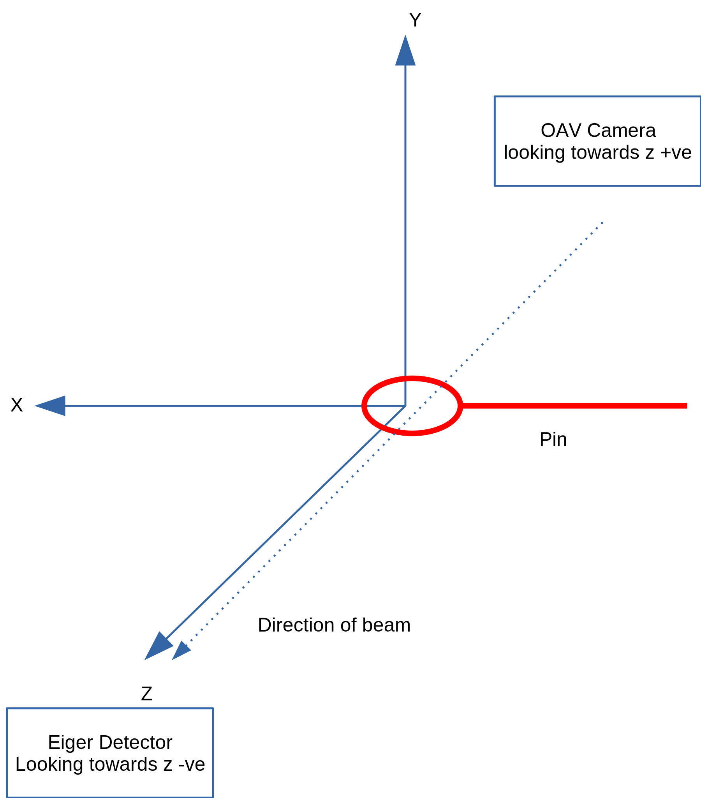
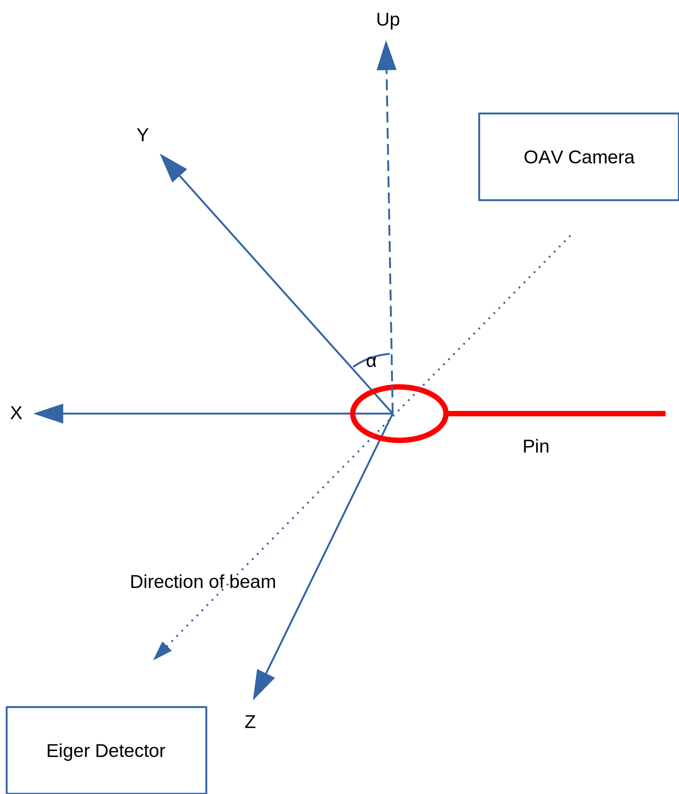

Hyperion Coordinate Systems
===========================

Rotation Coordinate Systems
---------------------------

Within hyperion coordinates are expressed both in requests to Hyperion, in commands issued to hardware, and in the 
output files sent to downstream analysis.

.. uml:: coordinate-systems.puml

Within requests to Hyperion, the requested rotations are defined with respect to a fixed coordinate system, that is 
defined to be the same for all installations and the intention is that this should be the same as that defined by the
nexus file format when all axes are in their positive orientations. Thus the same request made across different 
deployments of Hyperion should result in the same physical motion regardless of the coordinate space conventions of 
the underlying hardware.

In the ``RotationScan`` parameter class ``scan_width_deg`` is defined to always be positive and the direction is 
defined by ``rotation_direction`` which can be ``POSITIVE`` or ``NEGATIVE``

The coordinate systems of the underlying hardware may differ from the request. At Diamond traditionally the omega 
axis is implemented to be in the opposite direction, therefore the commands sent to the hardware are transformed and 
the ``omega_flip`` flag controls this behaviour, which by default is set to ``True`` as this is 
generally expected to be required for the beamlines here.

In the Nexus output file, there is provision for describing the choice of axis orientations in the nexus file, and 
the ``omega_flip`` parameter affects the omega axis description in ``/entry/sample/transformations/omega``. 
This is especially important as if PCAP position capture is enabled then referenced data files will contain positions
with respect to this axis.
 

Gridscan Coordinate System
--------------------------

The diagram below shows how the coordinate system used in the 3D gridscan relates to the beam and sample loop. The blue arrows indicate the direction of the beam. The red grids represent the grids used during the scan.

.. image:: ../../../images/176701633-b93bba62-b2e7-4740-a863-c6b388beb14f.png

Motors Coordinate System
------------------------

.. include:: <isogrk1.txt>

The diagram below shows the x,y,z directions of the smargon motor coordinate system. The smargon y, z axes change with the :math:`\omega`. x,y,z are measured in millimetres.

* The pin runs from -ve x to +ve x
* y is +ve towards the ceiling when :math:`\omega = 0`.
* z is +ve towards the detector/away from the oav and parallel to the beam when :math:`\omega = 0`.
* The x and y coordinates of the image are also shown, the image feed has x from left to right, y from top to bottom, with the pin to the right of the image.
* |ohgr| rotates from the y axis at :math:`\omega = 0` (the floor to ceiling).

:math:`\omega = 0`

:math:`\omega = \alpha`

OAV Image Coordinate System
---------------------------

In the OAV image the below coordinate system is used (with units in pixels). 

.. image:: ../../../images/207297611-f67dfc25-a3a5-4ade-a1e7-28b54a136fa6.png

Conversion Between OAV Image and Smargon
----------------------------------------

At :math:`\omega = 0`, :math:`x` and :math:`y` in the camera are antiparallel to :math:`x` and :math:`y` in the smargon. :math:`y` in the camera are is parallel to :math:`z` of the smargon at :math:`x` = :math:`\frac{\pi}{2}`. Then to convert from the camera to smargon coordinate systems we map

:math:`x_\text{smargon} = -x, \quad y_\text{smargon} = -y\cos(\omega),\quad z_\text{smargon} = y sin(\omega).`
