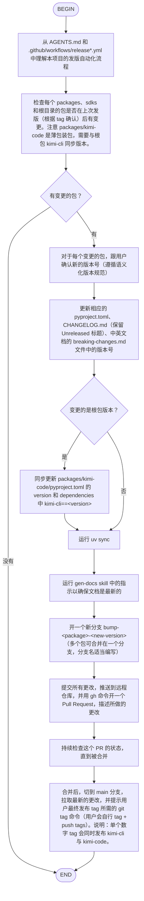

```mermaid
flowchart TB
    A(["BEGIN"]) --> B["从 AGENTS.md 和 .github/workflows/release*.yml 中理解本项目的发版自动化流程"]
    B --> C["检查每个 packages、sdks 和根目录的包是否在上次发版（根据 tag 确认）后有变更。注意 packages/kimi-code 是薄包装包，需要与根包 kimi-cli 同步版本。"]
    C --> D{"有变更的包？"}
    D -- 没有 --> Z(["END"])
    D -- 有 --> E["对于每个变更的包，跟用户确认新的版本号（遵循语义化版本规范）"]
    E --> F["更新相应的 pyproject.toml、CHANGELOG.md（保留 Unreleased 标题）、中英文档的 breaking-changes.md 文件中的版本号"]
    F --> G{"变更的是根包版本？"}
    G -- 是 --> H["同步更新 packages/kimi-code/pyproject.toml 的 version 和 dependencies 中 kimi-cli==&lt;version&gt;"]
    H --> I["运行 uv sync"]
    G -- 否 --> I
    I --> J["运行 gen-docs skill 中的指示以确保文档是最新的"]
    J --> K["开一个新分支 bump-&lt;package&gt;-&lt;new-version&gt;（多个包可合并在一个分支，分支名适当编写）"]
    K --> L["提交所有更改，推送到远程仓库，并用 gh 命令开一个 Pull Request，描述所做的更改"]
    L --> N["持续检查这个 PR 的状态，直到被合并"]
    N --> O["合并后，切到 main 分支，拉取最新的更改，并提示用户最终发布 tag 所需的 git tag 命令（用户会自行 tag + push tags）。说明：单个数字 tag 会同时发布 kimi-cli 与 kimi-code。"]
    O --> Z
```
