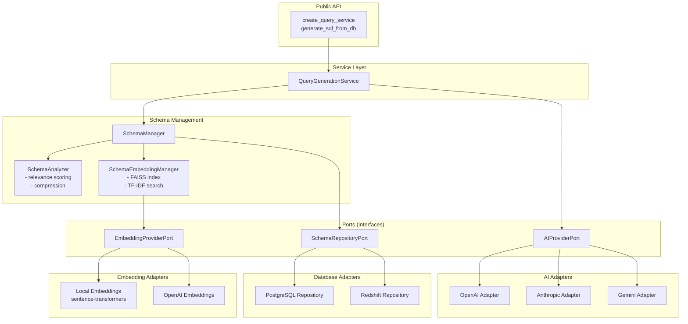

# Architecture

nlp2sql follows Clean Architecture (Hexagonal/Ports & Adapters) principles, enabling multi-provider support and maintainability at enterprise scale.

## Component Diagram



## Component Descriptions

### Public API

Entry points for the library. `generate_sql_from_db` provides one-line convenience, while `create_query_service` allows pre-initialization for better performance with multiple queries.

### Service Layer

**QueryGenerationService** orchestrates the entire query generation flow: schema retrieval, relevance scoring, AI provider invocation, and caching.

### Schema Management

| Component | Responsibility |
|-----------|----------------|
| **SchemaManager** | Coordinates filtering and retrieval strategies |
| **SchemaAnalyzer** | Scores table/column relevance, compresses schema within token limits |
| **SchemaEmbeddingManager** | Maintains FAISS vector index for semantic search |

### Ports (Interfaces)

Abstract contracts that define boundaries between layers:

- **AIProviderPort**: Contract for AI text generation
- **SchemaRepositoryPort**: Contract for database schema access
- **EmbeddingProviderPort**: Contract for vector embeddings

### Adapters

Concrete implementations of ports:

| Layer | Adapters |
|-------|----------|
| AI Providers | OpenAI GPT, Anthropic Claude, Google Gemini |
| Databases | PostgreSQL, Amazon Redshift |
| Embeddings | Local (sentence-transformers), OpenAI |

## Data Flow

```
User Query
    │
    ▼
QueryGenerationService
    │
    ├──► SchemaManager
    │       │
    │       ├──► SchemaRepository (fetch schema)
    │       │
    │       ├──► SchemaEmbeddingManager (semantic search)
    │       │       │
    │       │       └──► EmbeddingProvider
    │       │
    │       └──► SchemaAnalyzer (relevance scoring)
    │
    └──► AIProvider (generate SQL)
            │
            ▼
        SQL Result + Metadata
```

## Directory Structure

```
src/nlp2sql/
├── core/           # Business entities (pure Python)
├── ports/          # Interfaces/abstractions
├── adapters/       # External implementations
├── services/       # Application services
├── schema/         # Schema management
├── config/         # Configuration
└── exceptions/     # Custom exceptions
```

## Related Documentation

- [API Reference](API.md) - Python API and CLI
- [Configuration](CONFIGURATION.md) - Environment variables
- [Enterprise Guide](ENTERPRISE.md) - Large-scale deployment
