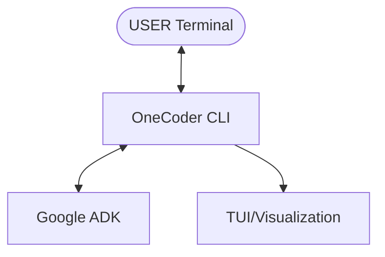

# Onecoder Project

This directory contains the `onecoder` project, an agentic context engineering system built with the Google Agent Development Kit (ADK).

## Quick Start

### Architecture Overview

```text
+----------------+       +-------------------+       +----------------+
|      USER      | <---> |   OneCoder CLI    | <---> |      ADK       |
|  (Terminal)    |       |  (Context Eng)    |       | (Agent Engine) |
+----------------+       +-------------------+       +----------------+
                                 |
                                 v
                         +-------------------+
                         |      TUI/UI       |
                         |  (Visualization)  |
                         +-------------------+
```



1.  **Set up the environment:**
    ```bash
    make -C onecoder setup
    ```
2.  **Configure your API key:**
    Create a `.env` file in the `onecoder` directory with your OpenRouter API key:
    ```
    OPENROUTER_API_KEY=your-api-key
    ```
3.  **Run the agent:**
    ```bash
    make -C onecoder run
    ```

## Documentation

The project's documentation is organized in the `docs` subdirectory.

| Directory | Description |
| :--- | :--- |
| `docs/vision/` | High-level strategic documents, including the project's vision and architecture. |
| `docs/adr/` | Architecture Decision Records (ADRs) for key technical decisions. |
| `docs/specs/` | Detailed specifications for features and agents. |
| `docs/guides/` | Tutorials, how-to guides, and technical deep dives. |
test
