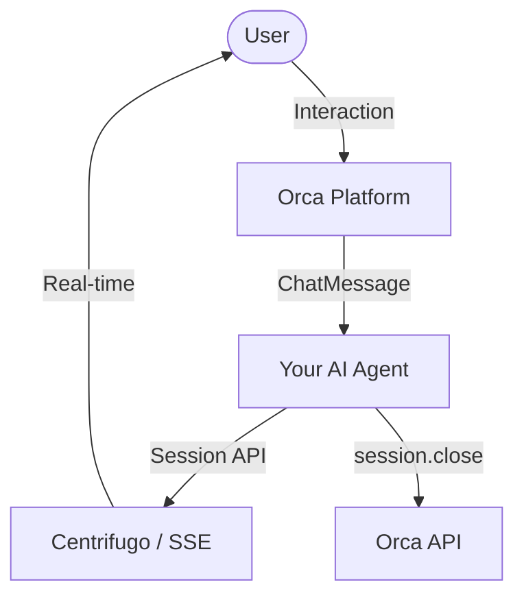

# Orca Python SDK - Developer Guide

**Official Python SDK for building AI agents on the Orca platform**

Version: 1.0.4 | Python: >=3.8 | License: MIT

---

## Table of Contents

- [Introduction](#introduction)
- [Installation](#installation)
- [Quick Start](#quick-start)
- [Simplified App Factories](#simplified-app-factories)
- [Core Concepts](#core-concepts)
- [API Reference](#api-reference)
- [Usage Examples](#usage-examples)
- [Dev Mode vs Production](#dev-mode-vs-production)
- [Working with Variables](#working-with-variables)
- [User Memory System](#user-memory-system)
- [Error Handling](#error-handling)
- [FastAPI Integration](#fastapi-integration)
- [Advanced Features](#advanced-features)
- [Best Practices](#best-practices)
- [Troubleshooting](#troubleshooting)

---

## Introduction

The Orca Python SDK (`orca-pip`) is a professional, production-ready package that enables developers to build AI agents that seamlessly integrate with the Orca platform. It provides a clean, intuitive interface for:

- ✅ **Real-time streaming** to Orca frontend
- ✅ **Backend communication** with Orca API
- ✅ **Data validation** with Pydantic models
- ✅ **Environment variable management**
- ✅ **User memory handling** for personalized responses
- ✅ **Error handling and logging** to Orca backend
- ✅ **Dev mode** for local development without Centrifugo
- ✅ **FastAPI integration** with standard endpoints

### Design Philosophy

The SDK follows these principles:

1. **Platform Agnostic** - Your AI logic stays independent of Orca internals
2. **Clean Interface** - Simple, intuitive methods that do one thing well
3. **Developer Friendly** - Works identically in dev and production modes
4. **Type Safe** - Pydantic models ensure data integrity
5. **Production Ready** - Comprehensive error handling and logging

---

## Quick Reference

### Essential Functions You'll Use

```python
from orca import OrcaHandler, ChatMessage, Variables, MemoryHelper

# 1. Initialize handler
orca = OrcaHandler()  # or OrcaHandler(dev_mode=True)

# 2. Start session
async def process_message(data: ChatMessage):
    session = orca.begin(data)  # ← Start here

    try:
        # 3. Access variables and memory
        vars = Variables(data.variables)
        memory = MemoryHelper(data.memory)
        api_key = vars.get("OPENAI_API_KEY")
        user_name = memory.get_name()

        # 4. Show loading
        session.loading.start("thinking")  # or "image", "code", "search"

        # 5. Stream content
        session.stream("Hello ")
        session.stream("World!")

        # 6. Hide loading
        session.loading.end("thinking")

        # 7. Send images (optional)
        session.image.send("https://example.com/image.png")

        # 8. Complete response
        usage = {'prompt_tokens': 100, 'completion_tokens': 50, 'total_tokens': 150}
        session.close(usage_info=usage)  # usage_info is optional

    except Exception as e:
        # 9. Handle errors
        session.error("Something went wrong", exception=e)
```

**That's it!** These are the main functions you'll use for 99% of use cases.

---

## Installation

### From PyPI (Recommended)

```bash
# Basic installation (core features only)
pip install orca

# With web dependencies (FastAPI + Uvicorn)
pip install orca[web]

# With development tools (pytest, black, flake8)
pip install orca[dev]

# With everything
pip install orca[web,dev]
```

### From Source

```bash
git clone https://github.com/Orcapt/orca-pip.git
cd orca-pip
pip install -e .
```

### Verify Installation

```python
import orca
print(f"Orca SDK version: {orca.__version__}")
# Output: Orca SDK version: 1.0.4
```

---

## Quick Start

### Minimal Example

```python
from orca import OrcaHandler, ChatMessage

# Initialize Orca handler
orca = OrcaHandler()

# Your AI processing function
async def process_message(data: ChatMessage):
    # Start a session
    session = orca.begin(data)

    try:
        # Your AI logic here
        response = f"Processed: {data.message}"

        # Stream and complete
        session.stream(response)
        session.close()

    except Exception as e:
        session.error(str(e), exception=e)
```

### Complete FastAPI Example

```python
from fastapi import FastAPI
from orca import (
    OrcaHandler,
    ChatMessage,
    Variables,
    create_orca_app,
    add_standard_endpoints
)

# Initialize Orca handler
orca = OrcaHandler()

# Create FastAPI app with Orca defaults
app = create_orca_app(
    title="My AI Agent",
    version="1.0.0"
)

# Your AI processing logic
async def process_message(data: ChatMessage):
    # Start session
    session = orca.begin(data)

    try:
        # Access environment variables
        vars = Variables(data.variables)
        api_key = vars.get("OPENAI_API_KEY")

        # Your AI processing here
        response = f"Hello! You said: {data.message}"

        # Stream and complete
        session.stream(response)
        session.close()

    except Exception as e:
        session.error(str(e), exception=e)

# Add standard Orca endpoints
add_standard_endpoints(
    app,
    orca_handler=orca,
    process_message_func=process_message
)

if __name__ == "__main__":
    import uvicorn
    uvicorn.run(app, host="0.0.0.0", port=8000)
```

Run it:

```bash
python main.py
```

Test it:

```bash
curl -X POST http://localhost:8000/api/v1/send_message \
  -H "Content-Type: application/json" \
  -d '{
    "message": "Hello AI!",
    "thread_id": "thread_123",
    "model": "gpt-4",
    "conversation_id": 1,
    "response_uuid": "resp_123",
    "message_uuid": "msg_123",
    "channel": "test_channel",
    "variables": [],
    "url": "http://localhost:8000/api/callback"
  }'
```

---

## Simplified App Factories

For the fastest development experience, Orca provides factory functions that handle logging, dev mode detection, and FastAPI/Lambda boilerplate automatically.

### 1. Web Agent Factory (`create_agent_app`)
Ideal for standalone servers or Docker containers using FastAPI.

```python
from orca import create_agent_app, ChatMessage

async def process_message(data: ChatMessage):
    session = orca.begin(data)
    try:
        session.stream(f"Echo: {data.message}")
        session.close()
    except Exception as e:
        session.error("Failed to process message", exception=e)

# Bootstraps FastAPI, OrcaHandler, and Registration
app, orca = create_agent_app(process_message)
```

### 2. AWS Lambda Factory (`create_hybrid_handler`)
Creates a single entry point for AWS Lambda that supports HTTP, SQS (async), and Cron events.

```python
from orca import create_hybrid_handler

# This single handler works for API Gateway, SQS triggers, and EventBridge
handler = create_hybrid_handler(process_message_func=process_message)
```

---

## Core Concepts

### Architecture Overview



```
┌─────────────────┐
│   Your AI Agent │  ← Your custom logic
│   (OpenAI, etc) │
└────────┬────────┘
         │
         ▼
┌─────────────────┐
│  Orca Handler  │  ← This SDK
│  (orca-pip)    │
└────────┬────────┘
         │
    ┌────┴────┐
    │         │
    ▼         ▼
┌────────┐ ┌──────────┐
│Centrifugo│ │Orca API │  ← Orca Platform
│(Stream)│ │(Backend) │
└────────┘ └──────────┘
```

### Key Components

| Component            | Purpose                                    |
| -------------------- | ------------------------------------------ |
| **OrcaHandler**      | Main interface for all Orca communication  |
| **ChatMessage**      | Pydantic model for incoming requests       |
| **ChatResponse**     | Pydantic model for responses               |
| **Variables**        | Helper for accessing environment variables |
| **MemoryHelper**     | Helper for accessing user memory data      |
| **DevStreamClient**  | Dev mode streaming (no Centrifugo)         |
| **CentrifugoClient** | Production real-time streaming             |
| **APIClient**        | HTTP communication with Orca backend       |

---

## API Reference

### OrcaHandler

The main interface for all Orca communication. Use the **Session API** for building AI agents.

#### Constructor

```python
OrcaHandler(dev_mode: bool = None)
```

**Parameters:**

- `dev_mode` (bool, optional): Enable dev mode. If None, checks `ORCA_DEV_MODE` environment variable.

**Example:**

```python
# Production mode (uses Centrifugo)
orca = OrcaHandler(dev_mode=False)

# Dev mode (uses in-memory streaming)
orca = OrcaHandler(dev_mode=True)

# Auto-detect from environment
orca = OrcaHandler()
```

---

### Session API (Recommended)

Start a session with `orca.begin(data)` and use these methods:

#### `begin(data)` - Start Session

Create a streaming session for handling a request.

```python
session = orca.begin(data: ChatMessage)
```

**Returns:** Session object with the following methods:

#### `session.stream(content)` - Stream Content

Stream a chunk of AI response in real-time.

```python
session.stream(content: str) -> None
```

**Parameters:**

- `content`: Text chunk to stream

**Example:**

```python
session = orca.begin(data)

# Stream chunks as they're generated
for chunk in ai_stream:
    session.stream(chunk)
```

#### `session.close(usage_info=None)` - Complete Response

Finalize the response and send to Orca platform. Automatically aggregates all streamed content.

```python
full_text = session.close(
    usage_info: dict = None,
    file_url: str = None
) -> str
```

**Parameters:**

- `usage_info` (optional): Token usage statistics
  ```python
  {
      'prompt_tokens': 100,
      'completion_tokens': 50,
      'total_tokens': 150
  }
  ```

**Returns:** The complete aggregated response text

**Example:**

```python
session = orca.begin(data)

for chunk in ai_stream:
    session.stream(chunk)

# Close with usage info
usage = {
    'prompt_tokens': 100,
    'completion_tokens': 50,
    'total_tokens': 150
}
full_text = session.close(usage_info=usage)
```

#### `session.error(error_message, exception=None, trace=None)` - Send Error

Send error notification to Orca platform with automatic logging.

```python
session.error(
    error_message: str,
    exception: Exception = None,
    trace: str = None
) -> None
```

**Parameters:**

- `error_message`: Human-readable error message
- `exception` (optional): Exception object (trace will be extracted automatically)
- `trace` (optional): Stack trace as string

**Example:**

```python
session = orca.begin(data)

try:
    # Your AI processing
    result = process_ai(data)
    session.stream(result)
    session.close()

except Exception as e:
    session.error("Processing failed", exception=e)
```

#### `session.loading.start(kind)` - Show Loading Indicator

Display a loading indicator to the user.

```python
session.loading.start(kind: str = "thinking") -> None
```

**Parameters:**

- `kind`: Loading type - `"thinking"`, `"image"`, `"code"`, or `"search"`

**Example:**

```python
session = orca.begin(data)

# Show thinking indicator
session.loading.start("thinking")

# Process...
result = complex_computation()

# Hide indicator
session.loading.end("thinking")

session.stream(result)
session.close()
```

#### `session.loading.end(kind)` - Hide Loading Indicator

Hide a loading indicator.

```python
session.loading.end(kind: str = "thinking") -> None
```

**Parameters:**

- `kind`: Loading type - `"thinking"`, `"image"`, `"code"`, or `"search"`

#### `session.image.send(url)` - Send Image

Send an image URL with Orca-specific markers for proper display.

```python
session.image.send(url: str) -> None
```

**Parameters:**

- `url`: Image URL

**Example:**

```python
session = orca.begin(data)

# Show loading
session.loading.start("image")

# Generate image
image_url = generate_image(data.message)

# Hide loading
session.loading.end("image")

# Send image
session.image.send(image_url)

session.close()
```

#### `session.image.image(url)` - Send Image (Alias)

Alias for `session.image.send()`. Use whichever feels more natural.

```python
session.image.image(url: str) -> None
```

#### `session.video.send(url)` - Send Video

Send a video URL for playback.

```python
session.video.send(url: str) -> None
```

**Parameters:**

- `url`: Video URL (MP4, WebM, etc.)

**Example:**

```python
session.video.send("https://example.com/video.mp4")
```

#### `session.video.youtube(url)` - Send YouTube Video

Send a YouTube video URL for embedded playback.

```python
session.video.youtube(url: str) -> None
```

**Parameters:**

- `url`: YouTube video URL (any format: watch, embed, short, etc.)

**Example:**

```python
session.video.youtube("https://www.youtube.com/watch?v=dQw4w9WgXcQ")
```

#### `session.location.send(coordinates)` - Send Location

Send location coordinates for map display.

```python
session.location.send(coordinates: str) -> None
```

**Parameters:**

- `coordinates`: Location string in format `"lat, lng"` (e.g., `"35.6892, 51.3890"`)

**Example:**

```python
session.location.send("35.6892, 51.3890")
```

#### `session.location.send_coordinates(lat, lng)` - Send Location (Coordinates)

Send location using latitude and longitude.

```python
session.location.send_coordinates(lat: float, lng: float) -> None
```

**Parameters:**

- `lat`: Latitude
- `lng`: Longitude

**Example:**

```python
session.location.send_coordinates(35.6892, 51.3890)
```

#### `session.card.send(cards)` - Send Card List

Send a list of cards for display.

```python
session.card.send(cards: List[Dict[str, Any]]) -> None
```

**Parameters:**

- `cards`: List of card dictionaries with keys:
  - `photo`: Image URL (optional)
  - `header`: Card title (optional)
  - `subheader`: Card description (optional)
  - `text`: Additional content (optional)

**Example:**

```python
cards = [
    {
        "photo": "https://example.com/card1.jpg",
        "header": "Card Title",
        "subheader": "Card Subtitle",
        "text": "Card description text"
    },
    {
        "photo": "https://example.com/card2.jpg",
        "header": "Another Card",
        "text": "Simple card with just header and text"
    }
]
session.card.send(cards)
```

#### `session.audio.send(tracks)` - Send Audio Tracks

Send audio tracks for playback.

```python
session.audio.send(tracks: List[Dict[str, str]]) -> None
```

**Parameters:**

- `tracks`: List of track dictionaries with keys:
  - `url`: Audio URL (required)
  - `label`: Track label (optional)
  - `type`: MIME type (optional, e.g., `"audio/mpeg"`)

**Example:**

```python
tracks = [
    {
        "url": "https://example.com/audio1.mp3",
        "label": "Track 1",
        "type": "audio/mpeg"
    },
    {
        "url": "https://example.com/audio2.mp3",
        "label": "Track 2"
    }
]
session.audio.send(tracks)
```

#### `session.audio.send_single(url, label, mime_type)` - Send Single Audio Track

Send a single audio track.

```python
session.audio.send_single(
    url: str,
    label: str = None,
    mime_type: str = None
) -> None
```

**Parameters:**

- `url`: Audio URL (required)
- `label`: Track label (optional)
- `mime_type`: MIME type (optional)

**Example:**

```python
session.audio.send_single(
    "https://example.com/audio.mp3",
    label="My Audio Track",
    mime_type="audio/mpeg"
)
```

---

### Complete Session Example

Here's a full example using all session methods:

```python
from orca import OrcaHandler, ChatMessage
from openai import OpenAI

orca = OrcaHandler()

async def process_message(data: ChatMessage):
    session = orca.begin(data)

    try:
        # Show thinking indicator
        session.loading.start("thinking")

        # Process with AI
        client = OpenAI(api_key=api_key)
        stream = client.chat.completions.create(
            model=data.model,
            messages=[{"role": "user", "content": data.message}],
            stream=True
        )

        # Hide thinking indicator
        session.loading.end("thinking")

        # Stream chunks
        for chunk in stream:
            if chunk.choices[0].delta.content:
                session.stream(chunk.choices[0].delta.content)

        # Check if image generation requested
        if "generate image" in data.message.lower():
            session.loading.start("image")
            image_url = client.images.generate(prompt=data.message)
            session.loading.end("image")
            session.image.send(image_url)

        # Complete (with usage info)
        usage = {
            'prompt_tokens': 100,
            'completion_tokens': 50,
            'total_tokens': 150
        }
        session.close(usage_info=usage)

    except Exception as e:
        session.error(f"Failed to process: {str(e)}", exception=e)
```

---

### Low-Level Methods (Advanced)

For advanced use cases, these low-level methods are available, but **Session API is recommended**:

<details>
<summary>Click to expand low-level methods</summary>

#### `stream_chunk(data, content)` ⚠️ Use `session.stream()` instead

```python
orca.stream_chunk(data: ChatMessage, content: str) -> None
```

#### `complete_response(data, full_response, usage_info=None)` ⚠️ Use `session.close()` instead

```python
orca.complete_response(
    data: ChatMessage,
    full_response: str,
    usage_info: dict = None
) -> None
```

#### `send_error(data, error_message, exception=None)` ⚠️ Use `session.error()` instead

```python
orca.send_error(
    data: ChatMessage,
    error_message: str,
    exception: Exception = None
) -> None
```

</details>

---

### Data Models

#### ChatMessage

Request model for incoming messages from Orca.

```python
class ChatMessage(BaseModel):
    thread_id: str                    # Conversation thread ID
    model: str                        # AI model to use (e.g., "gpt-4")
    message: str                      # User's message
    conversation_id: int              # Conversation ID
    response_uuid: str                # Unique response identifier
    message_uuid: str                 # Unique message identifier
    channel: str                      # Centrifugo channel for streaming
    file_type: str = ""              # Uploaded file type (if any)
    file_url: str = ""               # Uploaded file URL (if any)
    variables: List[Variable]         # Environment variables
    url: str                          # Callback URL for completion
    url_update: str = ""             # Update URL (if different)
    url_upload: str = ""             # Upload URL (if needed)
    force_search: bool = False       # Force web search
    force_code: Optional[bool] = None # Force code mode
    system_message: Optional[str]     # Custom system message
    memory: Union[Memory, Dict, List] # User memory data
    project_system_message: Optional[str] # Project-level system message
    first_message: bool = False      # Is this the first message?
    project_id: str = ""             # Project identifier
    project_files: Optional[Any]      # Project files (if any)
    stream_url: Optional[str]         # Centrifugo URL
    stream_token: Optional[str]       # Centrifugo token
    headers: Optional[Dict[str, str]] # Request headers (e.g., x-tenant)
```

#### Variable

Model for environment variables.

```python
class Variable(BaseModel):
    name: str   # Variable name (e.g., "OPENAI_API_KEY")
    value: str  # Variable value
```

#### Memory

Model for user memory data.

```python
class Memory(BaseModel):
    name: str = ""                    # User's name
    goals: List[str] = []            # User's goals
    location: str = ""               # User's location
    interests: List[str] = []        # User's interests
    preferences: List[str] = []      # User's preferences
    past_experiences: List[str] = [] # User's past experiences
```

#### ChatResponse

Response model for API responses.

```python
class ChatResponse(BaseModel):
    status: str          # Response status ("success" or "error")
    message: str         # Response message
    response_uuid: str   # Unique response identifier
    thread_id: str       # Thread identifier
```

---

### Variables Helper

Easy access to environment variables from requests.

```python
class Variables:
    def __init__(self, variables_list: List[Variable])
    def get(self, variable_name: str) -> Optional[str]
    def has(self, variable_name: str) -> bool
    def list_names(self) -> List[str]
    def to_dict(self) -> Dict[str, str]
```

**Example:**

```python
vars = Variables(data.variables)

# Get any variable
api_key = vars.get("OPENAI_API_KEY")
db_url = vars.get("DATABASE_URL")

# Check if exists
if vars.has("ANTHROPIC_API_KEY"):
    key = vars.get("ANTHROPIC_API_KEY")

# List all variable names
all_vars = vars.list_names()
# ['OPENAI_API_KEY', 'ANTHROPIC_API_KEY', 'DATABASE_URL']

# Convert to dictionary
vars_dict = vars.to_dict()
# {'OPENAI_API_KEY': 'sk-...', 'ANTHROPIC_API_KEY': 'sk-ant-...'}
```

---

### MemoryHelper

Easy access to user memory data.

```python
class MemoryHelper:
    def __init__(self, memory_data: Union[Memory, Dict, List])

    # Getters
    def get_name(self) -> str
    def get_goals(self) -> List[str]
    def get_location(self) -> str
    def get_interests(self) -> List[str]
    def get_preferences(self) -> List[str]
    def get_past_experiences(self) -> List[str]

    # Checkers
    def has_name(self) -> bool
    def has_goals(self) -> bool
    def has_location(self) -> bool
    def has_interests(self) -> bool
    def has_preferences(self) -> bool
    def has_past_experiences(self) -> bool

    # Utilities
    def to_dict(self) -> Dict[str, Any]
    def is_empty(self) -> bool
```

**Example:**

```python
memory = MemoryHelper(data.memory)

# Get user information
name = memory.get_name()
goals = memory.get_goals()
location = memory.get_location()

# Check before using
if memory.has_name():
    greeting = f"Hello {memory.get_name()}!"
else:
    greeting = "Hello!"

# Create personalized response
if memory.has_goals():
    response += f"\nYour goals: {', '.join(memory.get_goals())}"

# Check if memory is empty
if not memory.is_empty():
    # Use memory for personalization
    pass
```

---

## Usage Examples

All examples below use the **Session API** which is the recommended approach for building AI agents with Orca.

### Key Session Methods

- `session = orca.begin(data)` - Start a session
- `session.stream(content)` - Stream content chunk
- `session.close(usage_info=None)` - Complete response
- `session.error(message, exception=None)` - Handle errors
- `session.loading.start(kind)` / `session.loading.end(kind)` - Loading indicators
- `session.image.send(url)` - Send images
- `session.video.send(url)` / `session.video.youtube(url)` - Send videos
- `session.location.send(coordinates)` / `session.location.send_coordinates(lat, lng)` - Send locations
- `session.card.send(cards)` - Send card lists
- `session.audio.send(tracks)` / `session.audio.send_single(url, label, mime_type)` - Send audio

---

### Example 1: Basic OpenAI Integration

```python
from openai import OpenAI
from orca import OrcaHandler, ChatMessage, Variables

orca = OrcaHandler()

async def process_message(data: ChatMessage):
    session = orca.begin(data)

    try:
        # Get OpenAI API key from variables
        vars = Variables(data.variables)
        api_key = vars.get("OPENAI_API_KEY")

        if not api_key:
            session.error("OPENAI_API_KEY not found in variables")
            return

        # Initialize OpenAI client
        client = OpenAI(api_key=api_key)

        # Call OpenAI API
        response = client.chat.completions.create(
            model=data.model,
            messages=[{"role": "user", "content": data.message}]
        )

        # Get response text
        ai_response = response.choices[0].message.content

        # Extract usage info
        usage_info = {
            'prompt_tokens': response.usage.prompt_tokens,
            'completion_tokens': response.usage.completion_tokens,
            'total_tokens': response.usage.total_tokens
        }

        # Stream and complete with usage info
        session.stream(ai_response)
        session.close(usage_info=usage_info)

    except Exception as e:
        session.error(f"OpenAI API error: {str(e)}", exception=e)
```

### Example 2: Streaming Response

```python
from openai import OpenAI
from orca import OrcaHandler, ChatMessage, Variables

orca = OrcaHandler()

async def process_message(data: ChatMessage):
    session = orca.begin(data)

    try:
        vars = Variables(data.variables)
        api_key = vars.get("OPENAI_API_KEY")

        client = OpenAI(api_key=api_key)

        # Stream response from OpenAI
        stream = client.chat.completions.create(
            model=data.model,
            messages=[{"role": "user", "content": data.message}],
            stream=True
        )

        # Stream each chunk (automatically aggregated)
        for chunk in stream:
            if chunk.choices[0].delta.content:
                session.stream(chunk.choices[0].delta.content)

        # Complete (uses aggregated content)
        session.close()

    except Exception as e:
        session.error(f"Error: {str(e)}", exception=e)
```

### Example 3: Using Session API

```python
from openai import OpenAI
from orca import OrcaHandler, ChatMessage, Variables

orca = OrcaHandler()

async def process_message(data: ChatMessage):
    # Start a session
    session = orca.begin(data)

    try:
        vars = Variables(data.variables)
        api_key = vars.get("OPENAI_API_KEY")

        client = OpenAI(api_key=api_key)

        # Show loading indicator
        session.loading.start("thinking")

        # Stream response
        stream = client.chat.completions.create(
            model=data.model,
            messages=[{"role": "user", "content": data.message}],
            stream=True
        )

        for chunk in stream:
            if chunk.choices[0].delta.content:
                session.stream(chunk.choices[0].delta.content)

        # Hide loading indicator
        session.loading.end("thinking")

        # Close session (automatically aggregates streamed content)
        session.close()

    except Exception as e:
        session.error(f"Error: {str(e)}", exception=e)
```

### Example 4: Personalized Response with Memory

```python
from orca import OrcaHandler, ChatMessage, Variables, MemoryHelper

orca = OrcaHandler()

async def process_message(data: ChatMessage):
    session = orca.begin(data)

    try:
        vars = Variables(data.variables)
        memory = MemoryHelper(data.memory)

        # Create personalized greeting
        if memory.has_name():
            greeting = f"Hello {memory.get_name()}!"
        else:
            greeting = "Hello!"

        # Add context from user's goals
        context = ""
        if memory.has_goals():
            goals = memory.get_goals()
            context = f"\nI remember your goals: {', '.join(goals)}"

        # Add location-specific info
        if memory.has_location():
            location = memory.get_location()
            context += f"\nYou're in {location}"

        # Build personalized response
        response = f"{greeting}{context}\n\nYou asked: {data.message}"

        # Stream and complete
        session.stream(response)
        session.close()

    except Exception as e:
        session.error(str(e), exception=e)
```

### Example 5: Multi-Provider Support

```python
from openai import OpenAI
from anthropic import Anthropic
from orca import OrcaHandler, ChatMessage, Variables

orca = OrcaHandler()

async def process_message(data: ChatMessage):
    session = orca.begin(data)

    try:
        vars = Variables(data.variables)

        # Determine which provider to use
        if "gpt" in data.model.lower():
            # Use OpenAI
            api_key = vars.get("OPENAI_API_KEY")
            if not api_key:
                session.error("OPENAI_API_KEY not found")
                return

            client = OpenAI(api_key=api_key)
            response = client.chat.completions.create(
                model=data.model,
                messages=[{"role": "user", "content": data.message}]
            )
            ai_response = response.choices[0].message.content

        elif "claude" in data.model.lower():
            # Use Anthropic
            api_key = vars.get("ANTHROPIC_API_KEY")
            if not api_key:
                session.error("ANTHROPIC_API_KEY not found")
                return

            client = Anthropic(api_key=api_key)
            response = client.messages.create(
                model=data.model,
                max_tokens=1024,
                messages=[{"role": "user", "content": data.message}]
            )
            ai_response = response.content[0].text

        else:
            session.error(f"Unsupported model: {data.model}")
            return

        # Stream and complete
        session.stream(ai_response)
        session.close()

    except Exception as e:
        session.error(str(e), exception=e)
```

### Example 6: File Processing

```python
import requests
from openai import OpenAI
from orca import OrcaHandler, ChatMessage, Variables

orca = OrcaHandler()

async def process_message(data: ChatMessage):
    session = orca.begin(data)

    try:
        vars = Variables(data.variables)
        api_key = vars.get("OPENAI_API_KEY")

        # Check if file was uploaded
        if data.file_url:
            # Download file
            file_response = requests.get(data.file_url)
            file_content = file_response.text

            # Process based on file type
            if data.file_type == "pdf":
                # Extract text from PDF
                text = extract_pdf_text(file_content)
            elif data.file_type == "txt":
                text = file_content
            else:
                text = f"File type: {data.file_type}"

            # Create prompt with file content
            prompt = f"File content:\n{text}\n\nUser question: {data.message}"
        else:
            prompt = data.message

        # Call AI with prompt
        client = OpenAI(api_key=api_key)
        response = client.chat.completions.create(
            model=data.model,
            messages=[{"role": "user", "content": prompt}]
        )

        ai_response = response.choices[0].message.content

        # Stream and complete
        session.stream(ai_response)
        session.close()

    except Exception as e:
        session.error(str(e), exception=e)
```

### Example 7: Image Generation

```python
from openai import OpenAI
from orca import OrcaHandler, ChatMessage, Variables

orca = OrcaHandler()

async def process_message(data: ChatMessage):
    session = orca.begin(data)

    try:
        vars = Variables(data.variables)
        api_key = vars.get("OPENAI_API_KEY")

        client = OpenAI(api_key=api_key)

        # Show image generation loading
        session.loading.start("image")

        # Generate image
        response = client.images.generate(
            model="dall-e-3",
            prompt=data.message,
            size="1024x1024",
            quality="standard",
            n=1
        )

        image_url = response.data[0].url

        # Hide loading
        session.loading.end("image")

        # Send image with Orca markers
        session.image.send(image_url)

        # Also send text response
        session.stream(f"\n\nGenerated image for: {data.message}")

        session.close()

    except Exception as e:
        session.error(f"Image generation failed: {str(e)}", exception=e)
```

---

## Dev Mode vs Production

The SDK supports two modes: **Development** and **Production**. Your code works identically in both modes!

### Production Mode

Uses **Centrifugo** for real-time WebSocket streaming.

```python
orca = OrcaHandler(dev_mode=False)  # or just OrcaHandler()
```

**Flow:**

```
AI Agent → OrcaHandler → Centrifugo → WebSocket → Frontend
                      ↓
                  Orca API (Backend)
```

**Features:**

- Real-time WebSocket streaming via Centrifugo
- Production-grade reliability
- Scales to many concurrent users
- Requires Centrifugo server

### Dev Mode

Uses **in-memory storage** and **Server-Sent Events (SSE)** for streaming.

```python
orca = OrcaHandler(dev_mode=True)
```

**Flow:**

```
AI Agent → OrcaHandler → DevStreamClient → SSE → Frontend
                      ↓
              Console Output (for debugging)
```

**Features:**

- No external dependencies (no Centrifugo needed)
- Real-time console output for debugging
- SSE streaming to frontend
- Simpler local development

### Enabling Dev Mode

**Option 1: Direct Parameter**

```python
from orca import OrcaHandler

orca = OrcaHandler(dev_mode=True)
```

**Option 2: Environment Variable**

```bash
export ORCA_DEV_MODE=true
python main.py
```

```python
from orca import OrcaHandler

orca = OrcaHandler()  # Auto-detects ORCA_DEV_MODE
```

**Option 3: Command Line Flag**

```python
import sys
import os

if '--dev' in sys.argv:
    os.environ['ORCA_DEV_MODE'] = 'true'

from orca import OrcaHandler

orca = OrcaHandler()
```

Run with:

```bash
python main.py --dev
```

### Dev Mode Endpoints

When in dev mode, these endpoints are available:

#### SSE Stream Endpoint

```
GET /api/v1/stream/{channel}
```

**Frontend JavaScript:**

```javascript
const eventSource = new EventSource(
  "http://localhost:8000/api/v1/stream/your-channel-id"
);

eventSource.addEventListener("message", (event) => {
  const data = JSON.parse(event.data);

  switch (data.event) {
    case "delta":
      console.log("Chunk:", data.content);
      break;
    case "complete":
      console.log("Complete:", data.content);
      eventSource.close();
      break;
    case "error":
      console.error("Error:", data.content);
      eventSource.close();
      break;
  }
});
```

#### Polling Endpoint (Alternative)

```
GET /api/v1/poll/{channel}
```

**Frontend JavaScript:**

```javascript
async function pollStream(channel) {
  const response = await fetch(`http://localhost:8000/api/v1/poll/${channel}`);
  const data = await response.json();

  console.log("Full response so far:", data.full_response);
  console.log("Finished:", data.finished);

  if (!data.finished) {
    setTimeout(() => pollStream(channel), 100);
  }
}
```

### Console Output in Dev Mode

When dev mode is active, you'll see real-time output:

```
🔧 OrcaHandler initialized in DEV MODE (no Centrifugo)
📝 Dev stream delta added to channel-123: 15 chars
This is streaming...
✅ Dev stream completed for channel-123
```

### Comparison

| Feature               | Production            | Dev Mode          |
| --------------------- | --------------------- | ----------------- |
| Streaming Protocol    | Centrifugo WebSocket  | SSE / Polling     |
| External Dependencies | Centrifugo Server     | None              |
| Console Output        | No                    | Yes (real-time)   |
| Setup Complexity      | Medium                | Low               |
| Real-time Performance | Excellent             | Good              |
| Best For              | Production deployment | Local development |

### Your Code Works in Both!

```python
# This EXACT code works in both dev and production mode
async def process_message(data: ChatMessage):
    session = orca.begin(data)

    try:
        # Stream chunks
        for chunk in ai_stream:
            session.stream(chunk)

        # Complete response (auto-aggregated)
        session.close()

    except Exception as e:
        # Handle errors
        session.error(str(e), exception=e)
```

The only difference is the `dev_mode` flag during initialization!


**Session API methods work identically in both modes:**

- `session.stream()` - Streams to frontend in both modes
- `session.close()` - Completes response in both modes
- `session.error()` - Handles errors in both modes
- `session.loading.start()` / `session.loading.end()` - Loading indicators
- `session.image.send()` - Image handling
- `session.video.send()` / `session.video.youtube()` - Video handling
- `session.location.send()` / `session.location.send_coordinates()` - Location handling
- `session.card.send()` - Card list handling
- `session.audio.send()` / `session.audio.send_single()` - Audio handling

### Finalizing and Cleanup
At the end of your processing logic, always call `session.close()` to ensure all buffers are flushed and the final response is persisted to the database.

---

## 🧪 Testing & Simulation

Testing Lambda functions locally can be difficult. Orca provides a built-in simulation utility that mocks API Gateway, SQS, and Cron events to verify your `hybrid_handler`.

### Using `simulate_lambda_handler`

Create a `simulate_lambda.py` file in your agent's root:

```python
import os
# Force DEV MODE to see streaming in console
os.environ["ORCA_DEV_MODE"] = "true"

from orca import simulate_lambda_handler
from lambda_handler import handler

if __name__ == "__main__":
    # Tests HTTP, SQS, and Cron flows in one go
    simulate_lambda_handler(handler, message="Tell me a joke!")
```

Run it with:
```bash
python3 simulate_lambda.py
```

This utility will:
1.  **Simulate HTTP**: Sends a mock POST request to `/api/v1/send_message`.
2.  **Simulate SQS**: Triggers the handler with a mock SQS record.
3.  **Simulate Cron**: Triggers the handler with a mock scheduled event.
4.  **Live Output**: In `dev_mode`, it prints LLM streaming chunks directly to your terminal.

---

## Working with Variables

Orca sends environment variables (API keys, configs, etc.) with each request. The SDK provides easy access.

### Variables Helper Class

```python
from orca import Variables, ChatMessage

async def process_message(data: ChatMessage):
    # Create Variables helper
    vars = Variables(data.variables)

    # Get any variable
    openai_key = vars.get("OPENAI_API_KEY")
    anthropic_key = vars.get("ANTHROPIC_API_KEY")
    db_url = vars.get("DATABASE_URL")
    custom_var = vars.get("MY_CUSTOM_VAR")

    # Check if exists
    if vars.has("OPENAI_API_KEY"):
        # Use it
        pass

    # List all variable names
    all_names = vars.list_names()
    print(f"Available variables: {all_names}")

    # Convert to dictionary
    vars_dict = vars.to_dict()
```

### Common Patterns

#### Pattern 1: Multiple Providers

```python
vars = Variables(data.variables)

# Try multiple providers
openai_key = vars.get("OPENAI_API_KEY")
anthropic_key = vars.get("ANTHROPIC_API_KEY")
groq_key = vars.get("GROQ_API_KEY")

if openai_key:
    # Use OpenAI
    client = OpenAI(api_key=openai_key)
elif anthropic_key:
    # Use Anthropic
    client = Anthropic(api_key=anthropic_key)
elif groq_key:
    # Use Groq
    client = Groq(api_key=groq_key)
else:
    orca.send_error(data, "No AI API key provided")
    return
```

#### Pattern 2: Database Configuration

```python
vars = Variables(data.variables)

# Get database config
db_host = vars.get("DB_HOST")
db_port = vars.get("DB_PORT")
db_name = vars.get("DB_NAME")
db_user = vars.get("DB_USER")
db_pass = vars.get("DB_PASSWORD")

# Build connection string
conn_string = f"postgresql://{db_user}:{db_pass}@{db_host}:{db_port}/{db_name}"
```

#### Pattern 3: Feature Flags

```python
vars = Variables(data.variables)

# Feature flags
enable_search = vars.get("ENABLE_SEARCH") == "true"
enable_image_gen = vars.get("ENABLE_IMAGE_GEN") == "true"
max_tokens = int(vars.get("MAX_TOKENS") or "1000")

if enable_search and data.force_search:
    # Perform web search
    pass
```

### Legacy Function (Still Supported)

```python
from orca import get_variable_value, get_openai_api_key

# Get specific variable
api_key = get_variable_value(data.variables, "OPENAI_API_KEY")

# Convenience function for OpenAI key
openai_key = get_openai_api_key(data.variables)
```

**Note:** Using the `Variables` helper class is recommended for better ergonomics.

---

## User Memory System

Orca provides user memory for personalized AI responses.

### Memory Structure

```python
{
    "name": "John Doe",
    "goals": ["Learn Python", "Build AI apps"],
    "location": "San Francisco, CA",
    "interests": ["AI", "Programming", "Music"],
    "preferences": ["Prefers code examples", "Likes detailed explanations"],
    "past_experiences": ["Built a web scraper", "Completed ML course"]
}
```

### MemoryHelper Class

```python
from orca import MemoryHelper, ChatMessage

async def process_message(data: ChatMessage):
    # Create memory helper
    memory = MemoryHelper(data.memory)

    # Get user information
    name = memory.get_name()                    # "John Doe"
    goals = memory.get_goals()                  # ["Learn Python", "Build AI apps"]
    location = memory.get_location()            # "San Francisco, CA"
    interests = memory.get_interests()          # ["AI", "Programming", "Music"]
    preferences = memory.get_preferences()      # ["Prefers code examples", ...]
    experiences = memory.get_past_experiences() # ["Built a web scraper", ...]

    # Check if data exists
    if memory.has_name():
        greeting = f"Hello {name}!"
    else:
        greeting = "Hello!"

    # Check if memory is empty
    if memory.is_empty():
        response = "This is a new user with no memory"
    else:
        response = f"Welcome back, {name}!"
```

### Personalized Responses

```python
async def process_message(data: ChatMessage):
    memory = MemoryHelper(data.memory)

    # Build personalized context
    context_parts = []

    if memory.has_name():
        context_parts.append(f"User: {memory.get_name()}")

    if memory.has_goals():
        goals = ", ".join(memory.get_goals())
        context_parts.append(f"Goals: {goals}")

    if memory.has_interests():
        interests = ", ".join(memory.get_interests())
        context_parts.append(f"Interests: {interests}")

    if memory.has_preferences():
        prefs = ", ".join(memory.get_preferences())
        context_parts.append(f"Preferences: {prefs}")

    # Add to system message
    if context_parts:
        user_context = "\n".join(context_parts)
        system_message = f"""You are a helpful AI assistant.

User Context:
{user_context}

Please personalize your responses based on this context."""
    else:
        system_message = "You are a helpful AI assistant."

    # Use in AI call
    client = OpenAI(api_key=api_key)
    response = client.chat.completions.create(
        model=data.model,
        messages=[
            {"role": "system", "content": system_message},
            {"role": "user", "content": data.message}
        ]
    )
```

### Memory Utilities

```python
memory = MemoryHelper(data.memory)

# Convert to dictionary
memory_dict = memory.to_dict()
# {
#     "name": "John Doe",
#     "goals": ["Learn Python"],
#     "location": "San Francisco",
#     ...
# }

# Check if completely empty
if not memory.is_empty():
    # User has some memory data
    pass
```

### Supported Memory Formats

The SDK handles various memory formats gracefully:

```python
# Empty array (treated as empty memory)
"memory": []

# Empty object (treated as empty memory)
"memory": {}

# Structured memory object
"memory": {
    "name": "John",
    "goals": ["Learn AI"],
    ...
}

# Null (treated as empty memory)
"memory": null
```

---

## Error Handling

Comprehensive error handling ensures errors are logged and reported to Orca.

### Basic Error Handling

```python
from orca import OrcaHandler, ChatMessage

orca = OrcaHandler()

async def process_message(data: ChatMessage):
    try:
        # Your AI processing
        result = process_ai_request(data)
        orca.complete_response(data, result)

    except Exception as e:
        # Send error to Orca
        orca.send_error(data, str(e), exception=e)
```

### Error with Stack Trace

```python
import traceback

async def process_message(data: ChatMessage):
    try:
        result = risky_operation()
        orca.complete_response(data, result)

    except Exception as e:
        # Get stack trace
        trace = traceback.format_exc()

        # Send with trace
        orca.send_error(data, f"Operation failed: {str(e)}", trace=trace)
```

### Error with Exception Object

```python
async def process_message(data: ChatMessage):
    try:
        result = process_data()
        orca.complete_response(data, result)

    except ValueError as e:
        # SDK automatically extracts trace from exception
        orca.send_error(data, "Invalid input value", exception=e)

    except KeyError as e:
        orca.send_error(data, "Missing required key", exception=e)

    except Exception as e:
        orca.send_error(data, "Unexpected error occurred", exception=e)
```

### Validation Errors

```python
from orca import Variables

async def process_message(data: ChatMessage):
    vars = Variables(data.variables)

    # Validate required variables
    api_key = vars.get("OPENAI_API_KEY")
    if not api_key:
        orca.send_error(data, "OPENAI_API_KEY is required but not provided")
        return

    # Validate message
    if not data.message.strip():
        orca.send_error(data, "Message cannot be empty")
        return

    # Proceed with processing
    try:
        result = call_ai(api_key, data.message)
        orca.complete_response(data, result)
    except Exception as e:
        orca.send_error(data, str(e), exception=e)
```

### Graceful Degradation

```python
async def process_message(data: ChatMessage):
    vars = Variables(data.variables)

    # Try primary provider
    try:
        openai_key = vars.get("OPENAI_API_KEY")
        if openai_key:
            result = call_openai(openai_key, data.message)
            orca.complete_response(data, result)
            return
    except Exception as e:
        logger.warning(f"OpenAI failed: {e}")

    # Fallback to secondary provider
    try:
        anthropic_key = vars.get("ANTHROPIC_API_KEY")
        if anthropic_key:
            result = call_anthropic(anthropic_key, data.message)
            orca.complete_response(data, result)
            return
    except Exception as e:
        logger.warning(f"Anthropic failed: {e}")

    # No providers available
    orca.send_error(data, "All AI providers failed or no API keys provided")
```

### Error Logging to Orca Backend

When you call `send_error()`, the SDK automatically:

1. Streams error to frontend (visible to user)
2. Persists error to Orca backend API
3. Sends detailed error log to `api/internal/v1/logs` with:
   - Error message (max 1000 chars)
   - Stack trace (max 5000 chars)
   - Error level (error, warning, info, critical)
   - Additional context (UUID, conversation_id, etc.)

```python
# This single call does all the above
orca.send_error(data, "Processing failed", exception=e)
```

---

## FastAPI Integration

The SDK provides utilities for easy FastAPI integration.

### Quick Start with FastAPI

```python
from fastapi import FastAPI
from orca import (
    OrcaHandler,
    ChatMessage,
    create_orca_app,
    add_standard_endpoints
)

# Create Orca handler
orca = OrcaHandler()

# Create FastAPI app with defaults
app = create_orca_app(
    title="My AI Agent",
    version="1.0.0",
    description="Custom AI agent powered by Orca"
)

# Define your processing logic
async def process_message(data: ChatMessage):
    # Your AI logic here
    orca.complete_response(data, "Response")

# Add standard endpoints
add_standard_endpoints(
    app,
    orca_handler=orca,
    process_message_func=process_message
)

if __name__ == "__main__":
    import uvicorn
    uvicorn.run(app, host="0.0.0.0", port=8000)
```

### Standard Endpoints

When you call `add_standard_endpoints()`, these endpoints are added:

| Endpoint                   | Method | Description                     |
| -------------------------- | ------ | ------------------------------- |
| `/`                        | GET    | Root endpoint with service info |
| `/api/v1/health`           | GET    | Health check                    |
| `/api/v1/send_message`     | POST   | Main chat endpoint              |
| `/api/v1/stream/{channel}` | GET    | SSE stream (dev mode)           |
| `/api/v1/poll/{channel}`   | GET    | Polling endpoint (dev mode)     |
| `/api/v1/test_stream`      | GET    | Test streaming functionality    |
| `/docs`                    | GET    | Auto-generated API docs         |

### Custom Endpoints

```python
from fastapi import FastAPI
from orca import OrcaHandler, create_orca_app, add_standard_endpoints

app = create_orca_app(title="My AI Agent")
orca = OrcaHandler()

# Add standard endpoints
add_standard_endpoints(app, orca_handler=orca, process_message_func=process_message)

# Add custom endpoints
@app.get("/api/v1/custom")
async def custom_endpoint():
    return {"message": "Custom endpoint"}

@app.post("/api/v1/analyze")
async def analyze_text(text: str):
    # Custom analysis logic
    result = perform_analysis(text)
    return {"analysis": result}
```

### CORS Configuration

```python
from fastapi import FastAPI
from fastapi.middleware.cors import CORSMiddleware
from orca import create_orca_app

app = create_orca_app(title="My AI Agent")

# Add CORS middleware
app.add_middleware(
    CORSMiddleware,
    allow_origins=["*"],  # In production, specify actual origins
    allow_credentials=True,
    allow_methods=["*"],
    allow_headers=["*"],
)
```

### With Conversation Manager

If you have a custom conversation manager:

```python
from orca import add_standard_endpoints

# Your custom conversation manager
class ConversationManager:
    def get_history(self, thread_id: str):
        # Return conversation history
        pass

    def clear_history(self, thread_id: str):
        # Clear conversation history
        pass

conversation_manager = ConversationManager()

# Add endpoints with conversation manager
add_standard_endpoints(
    app,
    orca_handler=orca,
    process_message_func=process_message,
    conversation_manager=conversation_manager
)
```

This adds:

- `GET /api/v1/conversation/{thread_id}/history` - Get history
- `DELETE /api/v1/conversation/{thread_id}/history` - Clear history

---

## Advanced Features

### Loading Indicators

Show loading states to users during processing.

```python
session = orca.begin(data)

try:
    # Show thinking indicator
    session.loading.start("thinking")

    # AI processing...
    result = think_hard(data.message)

    # Hide thinking indicator
    session.loading.end("thinking")

    # Show image generation indicator
    session.loading.start("image")

    # Generate image...
    image_url = generate_image(result)

    # Hide image indicator
    session.loading.end("image")

    # Send image
    session.image.send(image_url)

    session.close()

except Exception as e:
    session.error("Failed", exception=e)
```

**Supported loading types:**

- `"thinking"` - General thinking/processing
- `"image"` - Image generation/processing
- `"code"` - Code generation/execution
- `"search"` - Web search operation

### Image Handling

Send images with Orca-specific markers.

```python
from orca import OrcaHandler

orca = OrcaHandler()
session = orca.begin(data)

# Generate or get image URL
image_url = "https://example.com/image.png"

# Send with Orca markers (auto-wrapped)
session.image.send(image_url)

# Alternative method name
session.pass_image(image_url)

# Multiple images
for url in image_urls:
    session.image.send(url)

session.close()
```

### Manual Markers

Use Orca markers directly if needed.

````python
# Image markers
session.stream("[orca.image.start]https://example.com/image.png[orca.image.end]")

# Loading markers
session.stream("[orca.loading.thinking.start]\n\n")
# ... processing ...
session.stream("[orca.loading.thinking.end]\n\n")

# Code markers (for code blocks)
session.stream("[orca.loading.code.start]\n\n")
session.stream("```python\nprint('hello')\n```")
session.stream("[orca.loading.code.end]\n\n")
````

### Streaming with Aggregation

The Session API automatically aggregates streamed content.

```python
session = orca.begin(data)

# Stream chunks (automatically aggregated internally)
for chunk in ai_stream:
    session.stream(chunk)

# Close without passing full_response (uses aggregated content)
full_text = session.close()  # Returns the aggregated text

# You can now use full_text for logging, storage, etc.
logger.info(f"Complete response: {full_text}")
```

### Header Forwarding

Request headers (like `x-tenant`) are automatically forwarded to Orca API.

```python
# Headers from ChatMessage are automatically extracted and forwarded
# No additional code needed!

# If you need to access them:
if data.headers:
    tenant_id = data.headers.get('x-tenant')
    logger.info(f"Processing for tenant: {tenant_id}")
```

### Dynamic Configuration

Centrifugo config can be updated per-request (production mode).

```python
# Automatic update from request data
# If data.stream_url and data.stream_token are present,
# they're automatically used

# Manual update (if needed)
orca.update_centrifugo_config(
    stream_url="https://centrifugo.example.com/api",
    stream_token="your-api-key"
)
```

---

## Best Practices

### 1. Always Use Try-Except with Session API

```python
async def process_message(data: ChatMessage):
    session = orca.begin(data)

    try:
        # Your processing
        result = process(data)
        session.stream(result)
        session.close()
    except Exception as e:
        session.error(str(e), exception=e)
```

### 2. Validate Inputs

```python
async def process_message(data: ChatMessage):
    session = orca.begin(data)

    try:
        vars = Variables(data.variables)

        # Validate API keys
        api_key = vars.get("OPENAI_API_KEY")
        if not api_key:
            session.error("OPENAI_API_KEY is required")
            return

        # Validate message
        if not data.message.strip():
            session.error("Message cannot be empty")
            return

        # Continue processing...
        result = process(data, api_key)
        session.stream(result)
        session.close()

    except Exception as e:
        session.error(str(e), exception=e)
```

### 3. Use Session API for All Flows

```python
# ✅ RECOMMENDED: Session API
session = orca.begin(data)
try:
    session.stream(chunk1)
    session.stream(chunk2)
    session.close()  # Auto-aggregates chunks
except Exception as e:
    session.error(str(e), exception=e)

# ⚠️ NOT RECOMMENDED: Low-level API
# (Only for advanced use cases)
orca.stream_chunk(data, chunk1)
orca.stream_chunk(data, chunk2)
orca.complete_response(data, full_response)
```

### 4. Personalize with Memory

```python
async def process_message(data: ChatMessage):
    memory = MemoryHelper(data.memory)

    # Build context
    context = []
    if memory.has_name():
        context.append(f"User: {memory.get_name()}")
    if memory.has_goals():
        context.append(f"Goals: {', '.join(memory.get_goals())}")

    # Use in system message
    if context:
        system_msg = f"User context:\n" + "\n".join(context)
    else:
        system_msg = "Default system message"
```

### 5. Provide Usage Info

```python
session = orca.begin(data)

try:
    response = client.chat.completions.create(...)

    # Extract usage info
    usage_info = {
        'prompt_tokens': response.usage.prompt_tokens,
        'completion_tokens': response.usage.completion_tokens,
        'total_tokens': response.usage.total_tokens
    }

    # Complete with usage info
    session.stream(response.choices[0].message.content)
    session.close(usage_info=usage_info)

except Exception as e:
    session.error(str(e), exception=e)
```

### 6. Use Dev Mode for Development

```python
# Development
orca = OrcaHandler(dev_mode=True)

# Production
orca = OrcaHandler(dev_mode=False)

# Or use environment variable
# export ORCA_DEV_MODE=true
orca = OrcaHandler()
```

### 7. Log Important Events

```python
import logging

logger = logging.getLogger(__name__)

async def process_message(data: ChatMessage):
    logger.info(f"Processing message for thread: {data.thread_id}")

    try:
        result = process(data)
        logger.info(f"Successfully processed message")
        orca.complete_response(data, result)
    except Exception as e:
        logger.error(f"Error processing message: {e}")
        orca.send_error(data, str(e), exception=e)
```

### 8. Use Type Hints

```python
from orca import ChatMessage, OrcaHandler, Variables, MemoryHelper
from typing import Optional

orca: OrcaHandler = OrcaHandler()

async def process_message(data: ChatMessage) -> None:
    vars: Variables = Variables(data.variables)
    memory: MemoryHelper = MemoryHelper(data.memory)

    api_key: Optional[str] = vars.get("OPENAI_API_KEY")
    if not api_key:
        orca.send_error(data, "API key not found")
        return

    # Continue...
```

### 9. Implement Graceful Fallbacks

```python
async def process_message(data: ChatMessage):
    session = orca.begin(data)

    try:
        vars = Variables(data.variables)

        # Try primary provider
        if vars.has("OPENAI_API_KEY"):
            try:
                result = use_openai(vars.get("OPENAI_API_KEY"), data)
                session.stream(result)
                session.close()
                return
            except Exception as e:
                logger.warning(f"OpenAI failed, trying fallback: {e}")

        # Fallback to secondary
        if vars.has("ANTHROPIC_API_KEY"):
            try:
                result = use_anthropic(vars.get("ANTHROPIC_API_KEY"), data)
                session.stream(result)
                session.close()
                return
            except Exception as e:
                logger.error(f"Anthropic also failed: {e}")

        # No providers available
        session.error("No AI providers available")

    except Exception as e:
        session.error(str(e), exception=e)
```

### 10. Clean Up Resources

```python
async def process_message(data: ChatMessage):
    client = None
    session = orca.begin(data)

    try:
        client = OpenAI(api_key=api_key)
        result = client.chat.completions.create(...)
        session.close()

    except Exception as e:
        session.error(str(e), exception=e)

    finally:
        # Clean up if needed
        if client:
            # Close connections, etc.
            pass
```

---

## Troubleshooting

### Common Issues

#### 1. ModuleNotFoundError: No module named 'orca'

**Solution:**

```bash
pip install orca
```

Verify installation:

```bash
pip list | grep orca
```

#### 2. ImportError: No module named 'fastapi'

You're trying to use web features without web dependencies.

**Solution:**

```bash
pip install orca[web]
```

#### 3. Streaming Not Working in Dev Mode

**Issue:** Frontend not receiving chunks in real-time.

**Solution:** Use SSE endpoint:

```javascript
const eventSource = new EventSource(
  `http://localhost:8000/api/v1/stream/${channel}`
);
eventSource.addEventListener("message", (event) => {
  const data = JSON.parse(event.data);
  console.log(data);
});
```

#### 4. CORS Errors

**Issue:** Browser blocking requests due to CORS policy.

**Solution:** Add CORS middleware:

```python
from fastapi.middleware.cors import CORSMiddleware

app.add_middleware(
    CORSMiddleware,
    allow_origins=["*"],
    allow_credentials=True,
    allow_methods=["*"],
    allow_headers=["*"],
)
```

#### 5. Variables Not Found

**Issue:** `vars.get("OPENAI_API_KEY")` returns `None`.

**Solution:** Ensure variables are sent in request:

```json
{
  "variables": [{ "name": "OPENAI_API_KEY", "value": "sk-..." }]
}
```

Check variable names (case-sensitive):

```python
vars = Variables(data.variables)
print(f"Available variables: {vars.list_names()}")
```

#### 6. Memory Data Empty

**Issue:** `memory.get_name()` returns empty string.

**Solution:** Check memory format in request:

```python
memory = MemoryHelper(data.memory)

if memory.is_empty():
    print("Memory is empty")
else:
    print(f"Memory data: {memory.to_dict()}")
```

#### 7. Dev Mode Not Activating

**Issue:** Dev mode features not working.

**Solution:** Verify dev mode is enabled:

```python
orca = OrcaHandler(dev_mode=True)
print(f"Dev mode: {orca.dev_mode}")  # Should print: True
```

Or check environment variable:

```bash
export ORCA_DEV_MODE=true
echo $ORCA_DEV_MODE
```

#### 8. Orca API Errors

**Issue:** `ORCA API ERROR: 500`

**Solution:** Check logs:

```python
import logging
logging.basicConfig(level=logging.INFO)

# Logs will show full request/response details
```

Verify URL is correct:

```python
print(f"Callback URL: {data.url}")
```

#### 9. Headers Not Forwarded

**Issue:** Tenant headers not reaching Orca API.

**Solution:** Headers are automatically forwarded from `data.headers`. Verify they're in the request:

```python
if data.headers:
    print(f"Headers: {data.headers}")
else:
    print("No headers in request")
```

#### 10. Session Errors with Multiple Responses

**Issue:** Multiple `begin()` calls interfering.

**Solution:** One session per response:

```python
# Correct
async def process_message(data: ChatMessage):
    session = orca.begin(data)  # One session
    # ... use session ...
    session.close()

# Incorrect
session1 = orca.begin(data)
session2 = orca.begin(data)  # Don't do this!
```

### Debug Mode

Enable detailed logging:

```python
import logging

# Set logging level
logging.basicConfig(
    level=logging.DEBUG,
    format='%(asctime)s - %(name)s - %(levelname)s - %(message)s'
)

# Enable orca debug logs
logging.getLogger('orca').setLevel(logging.DEBUG)
```

### Getting Help

1. **Check Documentation**: Review this guide
2. **Enable Debug Logs**: See what's happening internally
3. **Verify Request Data**: Print `data.dict()` to see what's coming in
4. **Test Endpoints**: Use `/api/v1/health` and `/api/v1/test_stream`
5. **Check Examples**: Review usage examples above
6. **GitHub Issues**: Report bugs or ask questions

---

## Package Information

- **Package Name**: `orca-platform-sdk-ui`
- **Current Version**: 1.0.5
- **Python Support**: >=3.8, <4.0
- **License**: MIT
- **Repository**: https://github.com/Orcapt/orca-pip
- **PyPI**: https://pypi.org/project/orca-platform-sdk-ui/

### Dependencies

**Core:**

- `requests>=2.25.0` - HTTP client
- `pydantic>=2.0.0` - Data validation

**Optional (web):**

- `fastapi>=0.100.0` - Web framework
- `uvicorn>=0.20.0` - ASGI server

**Optional (dev):**

- `pytest>=6.0` - Testing
- `pytest-asyncio>=0.18.0` - Async testing
- `black>=21.0` - Code formatting
- `flake8>=3.8` - Linting
- `mypy>=0.800` - Type checking

### Installation Options

```bash
# Basic
pip install orca-sdk

# With web support
pip install orca-sdk[web]

# With dev tools
pip install orca-sdk[dev]

# Everything
pip install orca-sdk[web,dev]
```

---

## Summary

The Orca Python SDK provides a clean, professional interface for building AI agents on the Orca platform. Key benefits:

✅ **Simple API** - Intuitive methods that just work  
✅ **Platform Agnostic** - Your AI logic stays independent  
✅ **Dev & Production** - Same code works in both modes  
✅ **Type Safe** - Pydantic models ensure data integrity  
✅ **Feature Rich** - Variables, memory, streaming, errors, etc.  
✅ **Well Documented** - Comprehensive examples and guides  
✅ **Production Ready** - Used in real Orca deployments

Get started in minutes, scale to production with confidence.

---

**Happy Building! 🚀**

For questions or support, visit: https://github.com/Orcapt/orca-pip
