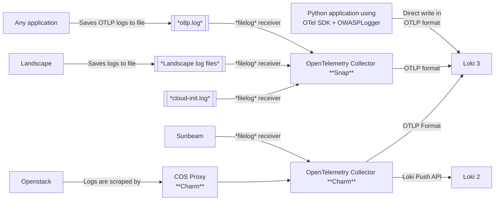

# OWASP Logger

[](https://pypi.org/project/owasp-logger/)
[](https://github.com/lucabello/owasp-logger/releases)
[](https://github.com/lucabello/owasp-logger/actions/workflows/publish.yaml)


OWASP Logger is a Python library that provides structured, [OWASP-compliant](https://cheatsheetseries.owasp.org/cheatsheets/Logging_Vocabulary_Cheat_Sheet.html) security logging.

It enables consistent and machine-readable logs for authentication, authorization, session management, and sensitive data access - built directly on top of the standard logging module.

## 📦 Installation

You can install the library with `uv` or `pip`:

```bash
# Standalone logger (without OpenTelemetry dependencies)
uv pip install owasp-logger
# With OpenTelemtry integration
uv pip install owasp-logger[otel]
```

---

## 🚀 Usage

### Quick Start

```python
from owasp_logger import OWASPLogger

# Initialize
owasp_log = OWASPLogger(appid="coconut.app")

# Log a security event
owasp_log.authn_login_fail(userid="banana-bob", description="Invalid password attempt")
```

Output (JSON structured log):
```json
{
  "datetime": "2025-09-26T12:37:37.886421+02:00",
  "appid": "coconut.app",
  "event": "authn_login_fail:banana-bob",
  "level": "WARNING",
  "description": "Invalid password attempt"
}
```

Normal logging methods (e.g., `.info()`, `.warning()`, etc.) are all available and won't follow the OWASP format.
All logs emitted via the other functions are OWASP-structured.

See the [`examples/`](https://github.com/lucabello/owasp-logger/tree/main/examples) folder for more demos:
- [`nested_json.py`](https://github.com/lucabello/owasp-logger/blob/main/examples/nested_json.py) - structured JSON logging
- [`dedicated_audit_logs.py`](https://github.com/lucabello/owasp-logger/blob/main/examples/dedicated_audit_logs.py) - dedicated audit log file
- [`otel.py`](https://github.com/lucabello/owasp-logger/blob/main/examples/otel.py) - logs with the OpenTelemetry instrumentation
- [`random_otel.py`](https://github.com/lucabello/owasp-logger/blob/main/examples/random_otel.py) - synthetic OpenTelemetry logs for testing

### OpenTelemetry Integration

Installing the package with the extra OpenTelemetry dependency (i.e., `owasp-logger[otel]`) allows you to emit OWASP-compliant logs in the OpenTelemetry format.

```python
# Assuming you already instrumented your app with an OpenTelemetry logger
...

logger = getLogger("otel")  # OpenTelemetry logger

owasp_log = OWASPLogger(appid="secure-app", logger=logger)
owasp_log.authz_admin(
    userid="ananas-alex",
    admin_activity="watered_plants",
    description="Admin ananas-alex watered their plants",
))
```

Output (JSON structured log, in the OpenTelemetry format):
```json
{
    "body": "Admin ananas-alex watered their plants",
    "severity_number": 13,
    "severity_text": "WARN",
    "attributes": {
        "owasp_event": {
            "datetime": "2025-10-12T18:24:33.887582+02:00",
            "appid": "example.appid",
            "event": "authz_admin:ananas-alex,watered_plants",
            "level": "WARNING",
            "description": "Admin ananas-alex watered their plants"
        },
        "code.file.path": "/home/aegis/Repositories/Canonical/owasp-logger/src/owasp_logger/logger.py",
        "code.function.name": "_log_event",
        "code.line.number": 35
    },
    "dropped_attributes": 0,
    "timestamp": "2025-10-12T16:24:33.887697Z",
    "observed_timestamp": "2025-10-12T16:24:33.887714Z",
    "trace_id": "0x00000000000000000000000000000000",
    "span_id": "0x0000000000000000",
    "trace_flags": 0,
    "resource": {
        "attributes": {
            "telemetry.sdk.language": "python",
            "telemetry.sdk.name": "opentelemetry",
            "telemetry.sdk.version": "1.33.1",
            "service.name": "example-service"
        },
        "schema_url": ""
    }
}
```

To learn how to instrument your Python application with OpenTelemetry, check out the official documentation:
- [Instrumentation (Logs) | OpenTelemetry](https://opentelemetry.io/docs/languages/python/instrumentation/#logs)
- [Logs Auto-Instrumentation Example | OpenTelemetry](https://opentelemetry.io/docs/zero-code/python/logs-example/)

---

## 🧾 Log Model

Each OWASP log event conforms to the structure presented in the OWASP [Logging Vocabulary Cheat Sheet]([https://cheatsheetseries.owasp.org/cheatsheets/Logging_Vocabulary_Cheat_Sheet.html](https://cheatsheetseries.owasp.org/cheatsheets/Logging_Vocabulary_Cheat_Sheet.html#format)):

```python
{
    # Required fields
    "datetime": "2021-01-01T01:01:01-0700",
    "appid": "foobar.netportal_auth",
    "event": "AUTHN_login_success:joebob1",
    "level": "INFO",
    # Optional fields
    "description": "User joebob1 login successfully",
    "useragent": "Mozilla/5.0 (Macintosh; Intel Mac OS X 10_14_6) AppleWebKit/537.36 (KHTML, like Gecko) Chrome/78.0.3904.108 Safari/537.36",
    "source_ip": "165.225.50.94",
    "host_ip": "10.12.7.9",
    "hostname": "portalauth.foobar.com",
    "protocol": "https",
    "port": "440",
    "request_uri": "/api/v2/auth/",
    "request_method": "POST",
    "region": "AWS-US-WEST-2",
    "geo": "USA"
}
```

This model is accurately reflected in the [`model.py`](https://github.com/lucabello/owasp-logger/blob/main/src/owasp_logger/model.py) file.

When an OWASP log is emitted as part of a structured log which is either OpenTelemetry format or an arbitrary JSON, its information will be nested under the `owasp_event` key.

---

## 🧭 Getting OWASP logs into Grafana Loki

OWASPLogger's logs can be sent to a Loki instance through OpenTelemetry Collector, which acts as a normalization and enrichment layer.
The collector itself is available both as a [charm](https://charmhub.io/opentelemetry-collector-operator) and [snap](https://snapcraft.io/opentelemetry-collector).



The preferred backend is **Loki 3**, which preserves structured attributes for consistent search and dashboards.

### Why an OpenTelemetry Collector?

Using an OpenTelemetry Collector ensures all logs share a consistent structure and labels, simplifying queries and dashboards. As mentioned in the log model, the OWASP information must be a nested attribute under the `owasp_event` key:

```json
{
    "body": "Administrator banana-bob has updated privileges of user coconut-charlie from user to admin",
    "severity_number": 13,
    "severity_text": "WARN",
    "attributes": {
        "owasp_event": {
            "datetime": "2025-09-19T14:31:58.140099+02:00",
            "type": "security",
            "appid": "example.appid",
            "event": "authz_admin:coconut-charlie,user_privilege_change",
            "level": "WARNING",
            "description": "Administrator banana-bob has updated privileges of user coconut-charlie from user to admin"
        },
        "code.file.path": "/home/aegis/Repositories/Canonical/owasp-logger/src/owasp_logger/logger.py",
        "code.function.name": "_log_event",
        "code.line.number": 26
    },
    "dropped_attributes": 0,
    "timestamp": "2025-09-19T12:31:58.140189Z",
    "observed_timestamp": "2025-09-19T12:31:58.140207Z",
    "trace_id": "0x00000000000000000000000000000000",
    "span_id": "0x0000000000000000",
    "trace_flags": 0,
    "resource": {
        "attributes": {
            "telemetry.sdk.language": "python",
            "telemetry.sdk.name": "opentelemetry",
            "telemetry.sdk.version": "1.33.1",
            "service.name": "example-service"
        },
        "schema_url": ""
    }
}
```

The attributes will be mapped as-is to **structured metadata** in Loki.

Given that logs can have various formats depending on the application, the easiest way to get those attributes in place is to configure some *custom processors* to parse the OWASP information from your log line. The following sections explain how to do so.

### How to configure OpenTelemetry Collector

Logs can arrive in different formts - this section explains how to parse them into OpenTelemetry attributes.

> This README classifies logs according to the [OpenTelemetry documentation](https://opentelemetry.io/docs/concepts/signals/logs/).  
> Note that all configuration snippets are not *complete configuration files*, but only show the relevant sections for the sake of simplicity.

#### Structured logs

A structured log is a log whose textual format follows a consistent, machine-readable format. For applications, one of the most common formats is JSON.

##### OpenTelemetry format

If the application is already using the OpenTelemetry format for logs, `OWASPLogger` will make sure the OWASP information is in the correct place. Assuming you have a dedicated file for these JSON logs, you can use the `filelog` receiver to parse them:

```yaml
receivers:
  filelog:
    include:
      - /path/to/your/file.log

processors:
  # Parse the OTel format from the JSON log lines in the file
  transform/parse-json:
    log_statements:
      - context: log
        error_mode: ignore  # Log the error and continue (ignore|silent|propagate)
        statements:
          - merge_maps(log.cache, ParseJSON(log.body), "upsert") where IsMatch(log.body, "^\\{")
          - set(log.body, log.cache["body"])
          - set(log.severity_number, Int(log.cache["severity_number"]))
          - set(log.severity_text, log.cache["severity_text"])
          - merge_maps(log.attributes, log.cache["attributes"], "upsert")
          - set(log.dropped_attributes_count, Int(log.cache["dropped_attributes"]))
          - set(log.time, Time(log.cache["timestamp"], "%FT%T.%fZ"))
          - merge_maps(resource.attributes, log.cache["resource"]["attributes"], "upsert")

service:
  pipelines:
    logs:
      receivers: [filelog]
      processors: [transform/parse-json]
```

More information on the OpenTelemetry log data model can be found here:
- [Logs Data Model | OpenTelemetry](https://opentelemetry.io/docs/specs/otel/logs/data-model/)
- [Internal Log Context (representation) | OpenTelemetry](https://github.com/open-telemetry/opentelemetry-collector-contrib/tree/main/pkg/ottl/contexts/ottllog)


##### Generic JSON

If you have generic, arbitrarily-nested JSON logs in a file, you'll have to configure the transform processor accordingly in order to parse the relevant information.

```yaml
transform/parse-json:
  log_statements:
    - context: log
      statements:
        - merge_maps(log.cache, ParseJSON(log.body), "upsert") where IsMatch(log.body, "^\\{")
        - # parse the relevant fields as needed
```


#### Semistructured Logs

A semistructured log is a log that does use some self-consistent patterns to distinguish data so that it’s machine-readable, but may not use the same formatting and delimiters between data across different systems. One example of this is `juju debug-log`.

You have to add some custom processors to the OpenTelemetry Collector configuration to parse the OWASP json blob from your logs.

> [!NOTE]
> **How do I configure custom processors?**  
> In the **charm**, use the `custom_processors` Juju config option.
> In the **snap**, add the processors config under the `processors:` top-level key, then add the processor name in the related logs pipeline.

##### juju debug-log

`juju debug-log` embeds the OWASP event blob as a JSON in the Juju logs. Parsing its values into attributes is simple:

```yaml
transform/parse-juju:
  log_statements:
    - context: log
      error_mode: ignore  # switch to ignore
      statements:
        - merge_maps(log.cache, ExtractPatterns(body, "^(?P<prefix>.*?)(?P<json>\\{.*\\}?)$"), "upsert")
        - merge_maps(log.attributes, ParseJSON(log.cache["json"]), "upsert")
```


#### Unstructured logs

Unstructured logs don't follow a consistent structure, and are thus more difficult to parse and analyze at scale. You need to **write your own custom parsing logic** in some processor in order to extract the *attributes* and fields you need.

---

## 📊 Visualizing OWASP Logs in Grafana


When OWASP logs reach Loki via the OpenTelemetry Collector used as a *normalization point*, they will contain the `owasp_event` as structured metadata.
Looking at the data via the Grafana datasource UI, this is how an example OWASP log looks like:


Here is an example query to count OWASP events by type:

```
sum by (owasp_event_name) (label_replace(count_over_time({service_name="example-service"}[$__auto] | owasp_event_event=~".+"), "owasp_event_name", "$1", "owasp_event_event", "^([^:]+):.*$"))
```

Using this query in a Grafana dashboard allows us to build a nice panel:


---

## 🔗 References

- [OWASP Logging Vocabulary Cheat Sheet](https://cheatsheetseries.owasp.org/cheatsheets/Logging_Vocabulary_Cheat_Sheet.html)
- [OpenTelemetry Logs Data Model](https://opentelemetry.io/docs/specs/otel/logs/data-model/)
- [Grafana Loki documentation](https://grafana.com/docs/loki/latest/)
