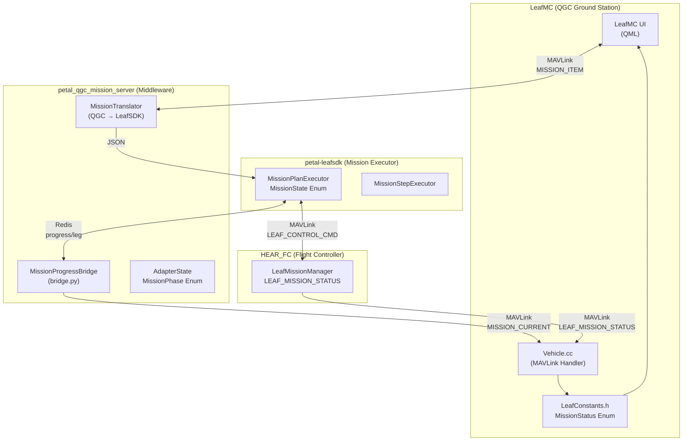

# Mission State Architecture Analysis

## Overview

This document summarizes the mission state options and organization across the interconnected DroneLeaf projects.

---

## Project Interconnections



---

## State Enums by Component

### MAVLink Protocol (Authoritative Source)

Source: `LeafMC/libs/mavlink/include/mavlink/v2.0/message_definitions/v1.0/droneleaf_mav_msgs.xml`

#### `LEAF_MISSION_STATUS` (4 values only)
| Value | State | Description |
|-------|-------|-------------|
| 0 | `IDLE` | Mission manager is idle |
| 1 | `READY` | Mission loaded, ready to start |
| 2 | `EXECUTING` | Mission is executing |
| 3 | `PAUSED` | Mission is paused |

> **WARNING**: No terminal states (COMPLETED, CANCELED, ABORTED, FAILED) exist in MAVLink protocol!

#### `LEAF_CONTROL_COMMAND`
| Value | Command | Description |
|-------|---------|-------------|
| 0 | `PAUSE` | Pause mission |
| 1 | `RESUME` | Resume mission |
| 2 | `CANCEL` | Cancel mission |
| 3 | `ABORT` | Abort mission |

#### `LEAF_CONTROL_COMMAND_ACTION`
| Value | Action | Description |
|-------|--------|-------------|
| 0 | `NONE` | No action (hover) |
| 1 | `STOP` | Stop trajectory |
| 2 | `RTL` | Return to launch |
| 3 | `LIP` | Land in place |

---

### petal-leafsdk (Mission Executor)

Source: `petal_leafsdk/mission_plan_executor.py`

```python
class MissionState(Enum):
    IDLE = "IDLE"
    RUNNING = "RUNNING"
    PAUSED = "PAUSED"
    CANCELLED = "CANCELLED"
    COMPLETED = "COMPLETED"
    FAILED = "FAILED"
```

---

### petal_qgc_mission_server (Middleware)

Source: `petal_qgc_mission_server/core/state.py`

```python
class MissionPhase(Enum):
    IDLE = "idle"
    UPLOADING = "uploading"
    READY = "ready"
    EXECUTING = "executing"
    PAUSED = "paused"
    COMPLETED = "completed"
```

**State Mapping (bridge.py)**:

| LeafSDK State | AdapterState.mission_state |
|---------------|----------------------------|
| `RUNNING` | `ACTIVE` |
| `PAUSED` | `PAUSED` |
| `COMPLETED` | `IDLE` |
| `CANCELLED` | `IDLE` |
| `FAILED` | `IDLE` |

---

### LeafMC (GCS)

Source: `LeafMC/src/Vehicle/LeafConstants.h`

```cpp
enum class MissionStatus {
    Idle,       // LEAF_MISSION_STATUS_IDLE
    Ready,      // LEAF_MISSION_STATUS_READY
    Executing,  // LEAF_MISSION_STATUS_EXECUTING
    Paused,     // LEAF_MISSION_STATUS_PAUSED
    Canceled,   // UI only - not in MAVLink protocol
    Aborted     // UI only - not in MAVLink protocol
};
```

---

## MAVLink Mission Messages

| ID | Message | Purpose |
|----|---------|---------|
| 77015 | `LEAF_CONTROL_CMD` | Control command (pause/resume/cancel/abort) |
| 77032 | `LEAF_DO_MISSION_RUN` | Run mission command |
| 77034 | `LEAF_DONE_MISSION_RUN` | Mission completion notification |
| 77035 | `LEAF_MISSION_STATUS` | Current mission status |
| 77042 | `LEAF_QGC_ABORT` | QGC abort command |

---

## Key Observations

1. **Missing Terminal States**: MAVLink `LEAF_MISSION_STATUS` lacks COMPLETED, CANCELLED, ABORTED, FAILED - all terminal conditions return to IDLE.

2. **State Collapse**: Both petal_qgc_mission_server and petal-leafsdk have richer state enums but collapse terminal states to IDLE when propagating to MAVLink.

3. **UI-Only States**: LeafMC has `Canceled` and `Aborted` in its enum but these cannot be received from the FC.

4. **Abort vs Cancel**: HEAR_FC handles QGC abort by calling `cancel_mission(ACTION_STOP)` internally.
