# pgdbm Architecture Decision Tree

## 🎯 Quick Decision Guide

Follow this decision tree to choose the right pgdbm pattern for your application:

```mermaid
flowchart TD
    Start([Start: I need to build...]) --> Q1{How many services?}

    Q1 -->|One| Single[Single Service]
    Q1 -->|Multiple| Q2{Services share data?}

    Q2 -->|No| Isolated[Isolated Services]
    Q2 -->|Yes| Q3{Same database?}

    Q3 -->|No| MultiDB[Multiple Databases]
    Q3 -->|Yes| SharedPool[Shared Pool Pattern ✅]

    Single --> Q4{Future growth?}
    Q4 -->|Will stay simple| Simple[Simple Setup]
    Q4 -->|Might grow| SharedPoolSingle[Use Shared Pool Anyway ✅]

    Isolated --> Q5{Deployment type?}
    Q5 -->|Separate containers| SeparateDB[Separate Databases]
    Q5 -->|Same container| SharedPoolIsolated[Shared Pool + Schemas ✅]

    Simple --> Code1[/Simple Pattern/]
    SharedPoolSingle --> Code2[/Shared Pool Pattern/]
    SharedPool --> Code2
    SharedPoolIsolated --> Code2
    SeparateDB --> Code3[/Multiple DB Pattern/]
    MultiDB --> Code3

    style SharedPool fill:#90EE90
    style SharedPoolSingle fill:#90EE90
    style SharedPoolIsolated fill:#90EE90
    style Code2 fill:#FFE4B5
```



## 📊 Pattern Selection Matrix

| Your Scenario | Services | Database | Pattern | Why? |
|--------------|----------|----------|---------|------|
| **Simple CRUD API** | 1 | 1 | [Simple](#simple-pattern) | No overhead needed |
| **API with workers** | 2+ | 1 | [Shared Pool](#shared-pool-pattern) | Efficient connection use |
| **Microservices** | Many | 1 | [Shared Pool + Schemas](#shared-pool-with-schemas) | Isolation + efficiency |
| **Multi-tenant SaaS** | 1 | 1 | [Schema per Tenant](#schema-per-tenant) | Data isolation |
| **Distributed system** | Many | Many | [Multiple Databases](#multiple-databases) | True separation |
| **Library/Package** | 1 | Varies | [Dual-Mode](#dual-mode-pattern) | Flexible deployment |

## 🚀 Pattern Implementations

### Simple Pattern

**When to use:** Single service, no growth expected, <100 requests/second

```python
# main.py
from pgdbm import AsyncDatabaseManager, DatabaseConfig

async def main():
    config = DatabaseConfig(
        connection_string="postgresql://localhost/myapp",
        min_connections=2,
        max_connections=10,
    )
    db = AsyncDatabaseManager(config)
    await db.connect()

    # Use the database
    await db.execute("INSERT INTO users ...")

    await db.disconnect()
```

### Shared Pool Pattern ⭐ (RECOMMENDED)

**When to use:** Multiple services, same database, production applications

```python
# database.py - Shared infrastructure
from pgdbm import AsyncDatabaseManager, DatabaseConfig

class DatabaseInfrastructure:
    _instance = None

    @classmethod
    async def initialize(cls, connection_string: str):
        if cls._instance is None:
            config = DatabaseConfig(
                connection_string=connection_string,
                min_connections=20,
                max_connections=100,
            )
            cls._instance = {
                'pool': await AsyncDatabaseManager.create_shared_pool(config),
                'managers': {}
            }
        return cls._instance

    @classmethod
    def get_manager(cls, service_name: str, schema: str):
        if service_name not in cls._instance['managers']:
            cls._instance['managers'][service_name] = AsyncDatabaseManager(
                pool=cls._instance['pool'],
                schema=schema
            )
        return cls._instance['managers'][service_name]

# service1.py
db_infra = await DatabaseInfrastructure.initialize("postgresql://...")
users_db = db_infra.get_manager('users', 'users_schema')

# service2.py
db_infra = await DatabaseInfrastructure.initialize("postgresql://...")
orders_db = db_infra.get_manager('orders', 'orders_schema')
```

### Shared Pool with Schemas

**When to use:** Microservices architecture, service isolation needed

```python
# app.py
@asynccontextmanager
async def lifespan(app: FastAPI):
    config = DatabaseConfig(connection_string="postgresql://localhost/myapp")
    shared_pool = await AsyncDatabaseManager.create_shared_pool(config)

    # Each service gets its own schema
    app.state.services = {
        'auth': AsyncDatabaseManager(pool=shared_pool, schema='auth'),
        'users': AsyncDatabaseManager(pool=shared_pool, schema='users'),
        'billing': AsyncDatabaseManager(pool=shared_pool, schema='billing'),
        'notifications': AsyncDatabaseManager(pool=shared_pool, schema='notifications'),
    }

    # Run migrations for each service
    for name, db in app.state.services.items():
        migrations = AsyncMigrationManager(db, f"migrations/{name}", name)
        await migrations.apply_pending_migrations()

    yield
    await shared_pool.close()
```

### Schema per Tenant

**When to use:** Multi-tenant SaaS with data isolation requirements

```python
class TenantManager:
    def __init__(self, shared_pool):
        self.pool = shared_pool
        self.tenants = {}

    async def provision_tenant(self, tenant_id: str):
        """Create a new tenant with isolated schema."""
        schema = f"tenant_{tenant_id}"

        # Create schema
        admin_db = AsyncDatabaseManager(pool=self.pool, schema='public')
        await admin_db.execute(f"CREATE SCHEMA IF NOT EXISTS {schema}")

        # Create tenant manager
        tenant_db = AsyncDatabaseManager(pool=self.pool, schema=schema)

        # Run tenant migrations
        migrations = AsyncMigrationManager(
            tenant_db,
            "migrations/tenant",
            f"tenant_{tenant_id}"
        )
        await migrations.apply_pending_migrations()

        self.tenants[tenant_id] = tenant_db
        return tenant_db

    def get_tenant_db(self, tenant_id: str):
        return self.tenants.get(tenant_id)
```

### Multiple Databases

**When to use:** True service separation, different databases per service

```python
# Each service has its own database
user_config = DatabaseConfig(connection_string="postgresql://localhost/users_db")
order_config = DatabaseConfig(connection_string="postgresql://localhost/orders_db")
billing_config = DatabaseConfig(connection_string="postgresql://localhost/billing_db")

users_db = AsyncDatabaseManager(user_config)
await users_db.connect()

orders_db = AsyncDatabaseManager(order_config)
await orders_db.connect()

billing_db = AsyncDatabaseManager(billing_config)
await billing_db.connect()
```

### Dual-Mode Pattern

**When to use:** Building reusable libraries that can run standalone or embedded

```python
# mylib/__init__.py
def create_app(
    db_manager: Optional[AsyncDatabaseManager] = None,
    standalone: bool = True,
):
    """Library that can use its own DB or an external one."""

    if standalone:
        # Create own pool and lifecycle
        app = FastAPI(lifespan=lifespan)
    else:
        # Use provided database
        app = FastAPI()
        if not db_manager:
            raise ValueError("db_manager required when standalone=False")
        app.state.db = db_manager

    return app

# Standalone usage
app = create_app(standalone=True)

# Embedded usage
shared_pool = await AsyncDatabaseManager.create_shared_pool(config)
lib_db = AsyncDatabaseManager(pool=shared_pool, schema='mylib')
app = create_app(db_manager=lib_db, standalone=False)
main_app.mount("/lib", app)
```

## ❓ Decision Questions

Ask yourself these questions to choose the right pattern:

### 1. **How many services will access the database?**
- **One** → Consider Simple Pattern (but Shared Pool is still better)
- **Multiple** → Use Shared Pool Pattern

### 2. **Will services share tables?**
- **Yes** → Use same schema
- **No** → Use different schemas

### 3. **Do you need tenant isolation?**
- **Yes** → Use Schema per Tenant
- **No** → Use service-based schemas

### 4. **What's your expected load?**
- **< 100 req/s** → 10-20 connections
- **100-1000 req/s** → 20-50 connections
- **> 1000 req/s** → 50-100 connections

### 5. **Will this grow into microservices?**
- **Yes** → Start with Shared Pool now
- **No** → Simple Pattern is fine

### 6. **Do you need to support both standalone and embedded deployment?**
- **Yes** → Use Dual-Mode Pattern
- **No** → Use standard patterns

## 🚫 Anti-Patterns to Avoid

### ❌ Multiple Pools to Same Database
```python
# WRONG - Creates multiple pools
users_db = AsyncDatabaseManager(DatabaseConfig(...))
orders_db = AsyncDatabaseManager(DatabaseConfig(...))
```

### ❌ Schema Switching
```python
# WRONG - Never change schema at runtime
db.schema = "different_schema"
```

### ❌ Pool per Request
```python
# WRONG - Never create pools in request handlers
@app.get("/users")
async def get_users():
    db = AsyncDatabaseManager(config)  # NO!
```

### ❌ Forgetting to Close Pools
```python
# WRONG - Always clean up
db = AsyncDatabaseManager(config)
await db.connect()
# ... use db ...
# Forgot: await db.disconnect()
```

## 📈 Scaling Guidelines

| Stage | Users | Pattern | Pool Size | Notes |
|-------|-------|---------|-----------|-------|
| **Prototype** | < 100 | Simple | 2-10 | Quick start |
| **MVP** | < 1K | Shared Pool | 10-20 | Better structure |
| **Growth** | < 10K | Shared + Schemas | 20-50 | Service isolation |
| **Scale** | < 100K | Shared + Monitoring | 50-100 | Add monitoring |
| **Enterprise** | > 100K | Multiple DBs | 100+ per DB | True separation |

## 🎯 Quick Recommendations

1. **Default choice**: Always use Shared Pool Pattern unless you have a specific reason not to
2. **Use schemas**: They're free, provide isolation, and prevent conflicts
3. **Start right**: It's easier to start with Shared Pool than to migrate later
4. **Monitor early**: Add monitoring before you need it
5. **Test with load**: Use realistic connection pool sizes based on load testing

## 📚 Next Steps

Based on your chosen pattern:

- **Shared Pool Pattern** → See [Production Patterns Guide](./production-patterns.md#shared-pool-pattern)
- **Schema Isolation** → See [Production Patterns Guide](./production-patterns.md#schema-isolation-pattern)
- **Multi-tenant** → See [SaaS Example](../examples/saas-app/)
- **Microservices** → See [Microservices Example](../examples/microservices/)
- **Testing** → See [Testing Guide](./testing.md)

---

*Remember: When in doubt, use the Shared Pool Pattern. It's the most flexible and scalable approach.*
