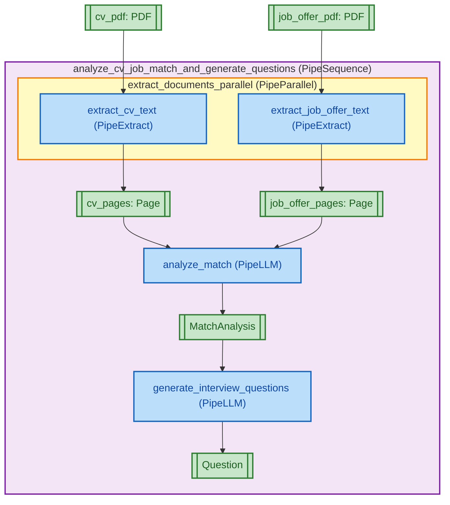

<div align="center">
  <a href="https://www.pipelex.com/"></a>

  <br/>
  <br/>
  <!-- PRERELEASE_LINK -->
  <a href="https://github.com/Pipelex/pipelex/tree/pre-release/v0.18.0b1">
    
  </a>

  <br/>
  <br/>

  <h2 align="center">AI Workflows That Agents Build & Run</h2>
  <p align="center">Pipelex is developing the open standard for repeatable AI workflows.<br/>
Write business logic, not API calls.</p>

  <div>
    <a href="https://go.pipelex.com/demo"><strong>Demo</strong></a> -
    <a href="https://docs.pipelex.com/"><strong>Documentation</strong></a> -
    <a href="https://github.com/Pipelex/pipelex/issues"><strong>Report Bug</strong></a> -
    <a href="https://github.com/Pipelex/pipelex/discussions"><strong>Feature Request</strong></a>
  </div>
  <br/>

  <p align="center">
    <a href="LICENSE"></a>
    <a href="https://github.com/Pipelex/pipelex/tree/main/tests"></a>
    <a href="https://pypi.org/project/pipelex/"></a>
    <br/>
    <a href="https://go.pipelex.com/discord"></a>
    <a href="https://www.youtube.com/@PipelexAI"></a>
    <a href="https://pipelex.com"></a>
    <!-- PRERELEASE_LINK --><a href="https://github.com/Pipelex/pipelex-cookbook/tree/feature/Chicago"></a>
    <a href="https://docs.pipelex.com/"></a>
    <a href="https://docs.pipelex.com/changelog/"></a>
    <br/>
    <br/>
</div>


# 🚀 Quick start

## 1. Install Pipelex

```bash
pip install pipelex
pipelex init
```

## 2. Configure AI Access

To run pipelines with AI models, choose one of these options:

### Option A: Pipelex Gateway (Recommended)

Get **free credits** with a single API key for LLMs, document extraction, and image generation across all major providers (OpenAI, Anthropic, Google, Azure, and more). New models added constantly.

1. Get your API key at [app.pipelex.com](https://app.pipelex.com/)
2. Add it to your `.env` file: `PIPELEX_GATEWAY_API_KEY=your-key-here`
3. Run `pipelex init` and accept the Gateway terms of service

> **Migrating from pipelex_inference?** The old `pipelex_inference` backend is deprecated. Get your new Gateway key at [app.pipelex.com](https://app.pipelex.com/).

### Option B: Bring Your Own Keys

Use your existing API keys from OpenAI, Anthropic, Google, Mistral, etc. See [Configure AI Providers](https://docs.pipelex.com/home/5-setup/configure-ai-providers/) for setup.

### Option C: Local AI

Run models locally with Ollama, vLLM, LM Studio, or llama.cpp - no API keys required. See [Configure AI Providers](https://docs.pipelex.com/home/5-setup/configure-ai-providers/) for details.

## 3. Generate Your First Workflow

Create a complete AI workflow with a single command:

```bash
pipelex build pipe "Take a CV and Job offer in PDF, analyze if they match and generate 5 questions for the interview" --output results/cv_match.plx
```

This command generates a production-ready `.plx` file with domain definitions, concepts, and multiple processing steps that analyzes CV-job fit and prepares interview questions.

**cv_match.plx**
```toml
domain = "cv_match"
description = "Matching CVs with job offers and generating interview questions"
main_pipe = "analyze_cv_job_match_and_generate_questions"

[concept.MatchAnalysis]
description = """
Analysis of alignment between a candidate and a position, including strengths, gaps, and areas requiring further exploration.
"""

[concept.MatchAnalysis.structure]
strengths = { type = "text", description = "Areas where the candidate's profile aligns well with the requirements", required = true }
gaps = { type = "text", description = "Areas where the candidate's profile does not meet the requirements or lacks evidence", required = true }
areas_to_probe = { type = "text", description = "Topics or competencies that need clarification or deeper assessment during the interview", required = true }

[concept.Question]
description = "A single interview question designed to assess a candidate."
refines = "Text"

[pipe.analyze_cv_job_match_and_generate_questions]
type = "PipeSequence"
description = """
Main pipeline that orchestrates the complete CV-job matching and interview question generation workflow. Takes a candidate's CV and a job offer as PDF documents, extracts their content, performs a comprehensive match analysis identifying strengths, gaps, and areas to probe, and generates exactly 5 targeted interview questions based on the analysis results.
"""
inputs = { cv_pdf = "PDF", job_offer_pdf = "PDF" }
output = "Question[5]"
steps = [
    { pipe = "extract_documents_parallel", result = "extracted_documents" },
    { pipe = "analyze_match", result = "match_analysis" },
    { pipe = "generate_interview_questions", result = "interview_questions" },
]
```

<details>
<summary><b>📄 Click to view the supporting pipes implementation</b></summary>

```toml
[pipe.extract_documents_parallel]
type = "PipeParallel"
description = """
Executes parallel extraction of text content from both the CV PDF and job offer PDF simultaneously to optimize processing time.
"""
inputs = { cv_pdf = "PDF", job_offer_pdf = "PDF" }
output = "Dynamic"
parallels = [
    { pipe = "extract_cv_text", result = "cv_pages" },
    { pipe = "extract_job_offer_text", result = "job_offer_pages" },
]
add_each_output = true

[pipe.extract_cv_text]
type = "PipeExtract"
description = """
Extracts text content from the candidate's CV PDF document using OCR technology, converting all pages into machine-readable text format for subsequent analysis.
"""
inputs = { cv_pdf = "PDF" }
output = "Page[]"
model = "extract_basic_from_pdf"

[pipe.extract_job_offer_text]
type = "PipeExtract"
description = """
Extracts text content from the job offer PDF document using OCR technology, converting all pages into machine-readable text format for subsequent analysis.
"""
inputs = { job_offer_pdf = "PDF" }
output = "Page[]"
model = "extract_basic_from_pdf"

[pipe.analyze_match]
type = "PipeLLM"
description = """
Performs comprehensive analysis comparing the candidate's CV against the job offer requirements. Identifies and structures: (1) strengths where the candidate's profile aligns well with requirements, (2) gaps where the profile lacks evidence or doesn't meet requirements, and (3) specific areas requiring deeper exploration or clarification during the interview process.
"""
inputs = { cv_pages = "Page[]", job_offer_pages = "Page[]" }
output = "MatchAnalysis"
model = "llm_to_answer_questions"
system_prompt = """
You are an expert HR analyst and recruiter specializing in candidate-job fit assessment. Your task is to generate a structured MatchAnalysis comparing a candidate's CV against job requirements.
"""
prompt = """
Analyze the match between the candidate's CV and the job offer requirements.

Candidate CV:
@cv_pages

Job Offer:
@job_offer_pages

Perform a comprehensive comparison and provide a structured analysis.
"""

[pipe.generate_interview_questions]
type = "PipeLLM"
description = """
Generates exactly 5 targeted, relevant interview questions based on the match analysis results. Questions are designed to probe identified gaps, clarify areas of uncertainty, validate strengths, and assess competencies that require deeper evaluation to determine candidate-position fit.
"""
inputs = { match_analysis = "MatchAnalysis" }
output = "Question[5]"
model = "llm_for_writing_cheap"
system_prompt = """
You are an expert HR interviewer and talent assessment specialist. Your task is to generate structured interview questions based on candidate-position match analysis.
"""
prompt = """
Based on the following match analysis between a candidate and a position, generate exactly 5 targeted interview questions.

@match_analysis

The questions should:
- Probe the identified gaps to assess if they are deal-breakers or can be mitigated
- Clarify areas that require deeper exploration
- Validate the candidate's strengths with concrete examples
- Be open-ended and behavioral when appropriate
- Help determine overall candidate-position fit

Generate exactly 5 interview questions.
"""
```
</details>


**View the pipeline flowchart:**


## 4. Run Your Pipeline

**Via CLI:**

```bash
# Run with input file
pipelex run results/cv_match.plx --inputs inputs.json
```

Create an `inputs.json` file with your PDF URLs:

```json
{
  "cv_pdf": {
    "concept": "PDF",
    "content": {
      "url": "https://pipelex-web.s3.amazonaws.com/demo/John-Doe-CV.pdf"
    }
  },
  "job_offer_pdf": {
    "concept": "PDF",
    "content": {
      "url": "https://pipelex-web.s3.amazonaws.com/demo/Job-Offer.pdf"
    }
  }
}
```

**Via Python:**

```python
import asyncio
import json
from pipelex.pipeline.execute import execute_pipeline
from pipelex.pipelex import Pipelex

async def run_pipeline():
    with open("inputs.json", encoding="utf-8") as f:
        inputs = json.load(f)

    pipe_output = await execute_pipeline(
        pipe_code="cv_match",
        inputs=inputs
    )
    print(pipe_output.main_stuff_as_str)

Pipelex.make()
asyncio.run(run_pipeline())
```

## 5. Iterate with AI Assistance

Install AI assistant rules to easily modify your pipelines:

```bash
pipelex kit rules
```

This installs rules for Cursor, Claude, OpenAI Codex, GitHub Copilot, Windsurf, and Blackbox AI. Now you can refine pipelines with natural language:

- "Include confidence scores between 0 and 100 in the match analysis"
- "Write a recap email at the end"

<div>
  <h2 align="center">🚀 See Pipelex in Action</h2>
  
  <table align="center">
    <tr>
      <td align="center" width="50%">
        <h3>From Whiteboard to AI Workflow in less than 5 minutes with no hands (2025-07)</h3>
        <a href="https://go.pipelex.com/demo">
          
        </a>
      </td>
      <td align="center" width="50%">
        <h3>The AI workflow that writes an AI workflow in 64 seconds (2025-09)</h3>
        <a href="https://go.pipelex.com/Demo-Live">
          
        </a>
      </td>
    </tr>
  </table>
  
</div>

## 💡 What is Pipelex?

Pipelex is an open-source language that enables you to build and run **repeatable AI workflows**. Instead of cramming everything into one complex prompt, you break tasks into focused steps, each pipe handling one clear transformation.

Each pipe processes information using **Concepts** (typing with meaning) to ensure your pipelines make sense. The Pipelex language (`.plx` files) is simple and human-readable, even for non-technical users. Each step can be structured and validated, giving you the reliability of software with the intelligence of AI.

## 📖 Next Steps

**Learn More:**
- [Design and Run Pipelines](https://docs.pipelex.com/home/6-build-reliable-ai-workflows/pipes/) - Complete guide with examples
- [Kick off a Pipeline Project](https://docs.pipelex.com/home/6-build-reliable-ai-workflows/kick-off-a-pipelex-workflow-project/) - Deep dive into Pipelex
- [Configure AI Providers](https://docs.pipelex.com/home/5-setup/configure-ai-providers/) - Set up AI providers and models

## 🔧 IDE Extension

We **highly** recommend installing our extension for `.plx` files into your IDE. You can find it in the [Open VSX Registry](https://open-vsx.org/extension/Pipelex/pipelex). It's coming soon to VS Code marketplace too. If you're using Cursor, Windsurf or another VS Code fork, you can search for it directly in your extensions tab.

## 📚 Examples & Cookbook

Explore real-world examples in our **Cookbook** repository:

<!-- PRERELEASE_LINK -->
[](https://github.com/Pipelex/pipelex-cookbook/tree/feature/Chicago)

Clone it, fork it, and experiment with production-ready pipelines for various use cases.

## 🎯 Optional Features

The package supports the following additional features:

- `anthropic`: Anthropic/Claude support for text generation
- `google`: Google models (Vertex) support for text generation
- `mistralai`: Mistral AI support for text generation and OCR
- `bedrock`: Amazon Bedrock support for text generation
- `fal`: Image generation with Black Forest Labs "FAL" service

Install all extras:

Using `pip`:
```bash
pip install "pipelex[anthropic,google,google-genai,mistralai,bedrock,fal]"
```

## Privacy & Telemetry

Pipelex supports two independent telemetry streams:

- **Gateway Telemetry**: When using Pipelex Gateway, telemetry must be enabled (tied to your hashed API key) to monitor service quality and enforce fair usage. [Learn more](https://docs.pipelex.com/home/5-setup/telemetry/#gateway-telemetry-pipelex-controlled)
- **Custom Telemetry**: User-controlled via `.pipelex/telemetry.toml` for your own observability systems (Langfuse, PostHog, OTLP). [Learn more](https://docs.pipelex.com/home/5-setup/telemetry/#custom-telemetry-user-controlled)

**We only collect technical data** (model names, token counts, latency, error rates) - never your prompts, completions, or business data. Set `DO_NOT_TRACK=1` to disable all telemetry (note: Gateway requires telemetry to function).

For more details, see the [Telemetry Documentation](https://docs.pipelex.com/home/5-setup/telemetry/) or read our [Privacy Policy](https://go.pipelex.com/privacy-policy).

## 🤝 Contributing

We welcome contributions! Please see our [Contributing Guidelines](CONTRIBUTING.md) for details on how to get started, including development setup and testing information.

## 👥 Join the Community

Join our vibrant Discord community to connect with other developers, share your experiences, and get help with your Pipelex projects!

[](https://go.pipelex.com/discord)

## 💬 Support

- **GitHub Issues**: For bug reports and feature requests
- **Discussions**: For questions and community discussions
- [**Documentation**](https://docs.pipelex.com/)

## ⭐ Star Us!

If you find Pipelex helpful, please consider giving us a star! It helps us reach more developers and continue improving the tool.

## 📝 License

This project is licensed under the [MIT license](LICENSE). Runtime dependencies are distributed under their own licenses via PyPI.

---

"Pipelex" is a trademark of Evotis S.A.S.

© 2025 Evotis S.A.S.
