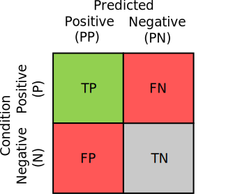
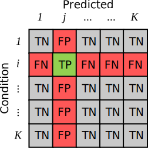

# Generating Confusion Matrices

Classifiers, or classification models, are everywhere in machine-learning. Specifically, we consider models, denoted $f$, which map some set of input features $X$ to a condition[^1] $Y$: $\hat{y}=f(x),~\mathcal{X}\rightarrow \mathcal{Y}$.

[^1]: I use the word 'condition' here, because it seems to be the convention in the (bio)statistics literature. The word 'class', 'label', 'target' are all equivalent.

The goal of a machine-learning algorithm is typically to optimize the classifier over some training data where labels are available, $(x_{n},y_{n})\in\mathcal{D}^{\text{(train)}}$, in order to perform well on data where labels are **not** available. Since we want to deploy the classifier on unseen data, but since we do not have access to deployment data distribution, we instead estimate the model's 'performance' on a held-out subset of our data $\mathcal{D}^{\text{(test)}}$, such that $\mathcal{D}^{\text{(train)}}\cup \mathcal{D}^{\text{(test)}}=\varnothing$.

The confusion matrix, $\mathbf{C}$, is a $\left|\mathcal{Y}\right|\times\left|\mathcal{Y}\right|$ matrix that summarizes the model's performance on the test set. Each entry contains the count of a $(y_{n}, \hat{y}_{n})$ pair. In other words, element $\mathbf{C}_{i,j}$ denotes the number of times the model predict class $j$, when the sample's condition is actually $i$.

In a binary classification scenario ($|\mathcal{Y}|=2$), each element of the confusion matrix has a simple interpretation. Assuming the positive class is index $1$:

* $\mathbf{C}_{1,1}$ contains the number of True Positives (TP), where the model correctly predicts the condition is present
* $\mathbf{C}_{1,2}$ contains the count of False Negatives (FN), where the model predicted the condition is *not* present, when in truth it was
* $\mathbf{C}_{2,1}$, the False Positives (FP), where the model predicts the condition is present, when in truth it is not
* $\mathbf{C}_{2,2}$, the True Negatives (TN), contains the count of all predictions for which the model correctly estimated that the condition was not present

Visually, this looks like:


</img>

## Sampling Confusion Matrices

With `prob_conf_mat`, we want to be able to quantify the uncertainty present in our metric estimates stemming from the size and composition of the test data. To achieve this, we generate synthetic confusion matrices by sampling from the product of two [Dirichlet-Categorical posteriors](https://en.wikipedia.org/wiki/Dirichlet_distribution#Bayesian_models).

This approach is directly inspired by two papers [Caelen (2017)](https://link.springer.com/article/10.1007/s10472-017-9564-8)[^caelen] and [Tötsch et al. (2020)](https://peerj.com/articles/cs-398.pdf)[^totsch]. The former treats the entire confusion matrix as a single Dirichlet-Categorical model, whereas the latter computes a [Beta-Binomial distribution](https://en.wikipedia.org/wiki/Beta-binomial_distribution) for three distinct quantities, and reconstructs the confusion matrix through their product. In either approach, however, the posterior is 'learned' by taking into account the various different counts of prediction-condition pairs.

[^caelen]: [Caelen, O. (2017). A Bayesian interpretation of the confusion matrix. Annals of Mathematics and Artificial Intelligence, 81(3), 429-450.](https://link.springer.com/article/10.1007/s10472-017-9564-8)

[^totsch]: [Tötsch, N., & Hoffmann, D. (2021). Classifier uncertainty: evidence, potential impact, and probabilistic treatment. PeerJ Computer Science, 7, e398.](https://peerj.com/articles/cs-398.pdf)

Most important to `prob_conf_mat` is the Tötsch model. In their paper[^totsch], they show that the confidence intervals they produce are consistently closer to the truth than those produced by Caelen (2017)[^caelen], despite the simpler model used in the latter.

Specifically, Tötsch et al. (2020)[^totsch] model the binary confusion matrix as products of the following probabilities:

- The prevalence $\phi$, or how often each condition occurs

$$
\phi=\dfrac{\text{TP}+\text{FN}}{\text{TP}+\text{FN}+\text{FP}+\text{TN}}
$$

- The True Positive Rate (TPR), or the proportion of times the model predicts the condition is present, conditioned on the fact that the condition is actually present

$$\text{TPR}=\dfrac{\text{TP}}{\text{TP}+\text{FN}}$$

- The True Negative Rate (TNR), or the proportion of times the model predicts the condition is not present, conditioned on the fact that the condition is actually *not* present

$$\text{TNR}=\dfrac{\text{TN}}{\text{TN}+\text{FP}}$$

With these 3 proportions, it is possible to reconstruct the entire confusion matrix as:

$$
\mathbf{C}=\begin{bmatrix}
    \phi\cdot\text{TPR} & \phi\cdot(1-\text{TPR}) \\
    (1-\phi)\cdot(1-\text{TNR}) & (1-\phi)\cdot\text{TNR} \\
\end{bmatrix}
$$

To generate counterfactual confusion matrices, they model each probability as a [Beta-Binomial distribution](https://en.wikipedia.org/wiki/Beta-binomial_distribution), with the following posteriors:

$$
\begin{align*}
    \phi&\sim \text{Beta}\left(\alpha+\text{TP}+\text{FP},\beta+\text{FN}+\text{TN}\right) \\
    \text{TPR}&\sim \text{Beta}\left(\alpha+\text{TP},\beta+\text{FP}\right) \\
    \text{TNR}&\sim \text{Beta}\left(\alpha+\text{TN},\beta+\text{FN}\right)
\end{align*}
$$

Here, $\alpha$ and $\beta$ are different prior hyperparameters.

With the Tötsch model, it's possible to produce plausible synthetic confusion matrices by sampling a prevalence, true positive rate and true negative rate independently, and computing four products. At least for their purposes, this model proved highly effective at generating counterfactual confusion matrices, and allowed the authors to provide confidence intervals for any metric.

One difference between the Tötsch model and convention, however, is that their approach only generates *normalized* confusion matrices, i.e., $\sum_{i,j}\mathbf{C}_{i,j}=1$. As we'll see in [another explainer](./metric_computation.md), this has no effect on the value of the computed metrics.

## Multi-Class Confusion Matrices

While the Tötsch model is applicable to binary confusion matrices, they did not make the extension to multi-class confusion matrices. In a multi-class confusion matrix, each condition has its own set of TP, FN, FP, and TN. Specifically, all the elements on the same row or column form the FN and FP, respectively, and the TN are all elements which share neither the same row or column. This is pictured in the following figure:


</img>

Luckily, an extension is easily made. Given that the method presently only produces normalized confusion matrices, we can essentially view this as a joint probability distribution: $p(Y, \hat{Y})$. Then, by the definition of the conditional probability distribution, we can rewrite this as,

$$
p(Y, \hat{Y})=p(\hat{Y}|Y)p(Y)
$$

Here $p(Y)$ is the probability of a particular condition occurring, and $p(\hat{Y}|Y)$ is the probability of a model making a certain prediction, given that the ground-truth condition is $Y=y$. The former is simply the multi-class prevalence, and the latter we call the confusion conditional. The $\text{TPR}$ and $\text{TNR}$ rates are essentially just different elements of that confusion conditional:

$$
\begin{align*}
\text{TPR}=p(Y=2|\hat{Y}=1),&\quad (1-\text{TPR})=p(Y=1|\hat{Y}=1)\\
\text{TNR}=p(Y=1|\hat{Y}=2),&\quad (1-\text{TNR})=p(Y=2|\hat{Y}=2) \\
\end{align*}
$$

So in practice, the Tötsch model is just computing the product between the prevalence of a class $p(Y)$, and the confusion conditional, $p(\hat{Y}|Y)$.

This is easy to replicate in a multi-class setting. We sample each row of the confusion conditional and the prevalence marginal from a [Dirichlet-Multinomial model](https://en.wikipedia.org/wiki/Dirichlet-multinomial_distribution). Then, to construct a confusion matrix, we compute the product between the two. Specifically, we generate each synthetic confusion matrix, $\tilde{\mathbf{C}}$ as the Hadamard product between the sampled conditional confusion matrix, and the sampled prevalence vector:

$$
\begin{align*}
\tilde{\mathbf{C}}=~~&\text{Diag}(\phi)
\begin{bmatrix}
    \tilde{C}_{1}   \\
    \vdots          \\
    \tilde{C}_{|\mathcal{Y}|}
\end{bmatrix} \\
&\phi\sim\text{Dirichlet}(\alpha_{1}+\sum_{j}^{|\mathcal{Y}|}\mathbf{C}_{1,j},\ldots \alpha_{|\mathcal{Y}|}+\sum_{j}^{|\mathcal{Y}|}\mathbf{C}_{|\mathcal{Y}|,j}) \\
&\tilde{C}_{1}\sim \text{Dirichlet}(\alpha_{1,1}+\mathbf{C}_{1,1},\ldots, \alpha_{1,|\mathcal{Y}|}+\mathbf{C}_{1,|\mathcal{Y}|}) \\
&\qquad\qquad\vdots \\
&\tilde{C}_{|\mathcal{Y}|}\sim \text{Dirichlet}(\alpha_{|\mathcal{Y}|,1}+\mathbf{C}_{|\mathcal{Y}|,1},\ldots, \alpha_{|\mathcal{Y}|,|\mathcal{Y}|}+\mathbf{C}_{|\mathcal{Y}|,|\mathcal{Y}|})
\end{align*}
$$

where $\alpha$ are again various prior hyperparameters. In total, we learn $\mathcal{Y}+1$ Dirichlet-Multinomial posteriors, and sample from each independently to produce a synthetic confusion matrix. The output of the product is a $\mathcal{Y}\times \mathcal{Y}$ matrix, normalized such that $\sum_{i,j}\tilde{\mathbf{C}}_{i,j}=1$.

Sounds complicated, but it's NumPy implementation is dead simple[^jaxtyping][^extra_dimension]:

```python
condition_counts, condition_prior: Float[ndarray, "num_classes"]
confusion_matrix, confusion_prior: Float[ndarray, "num_classes num_classes"]

p_condition = dirichlet_sample(
    rng=self.rng,
    alphas=condition_counts + condition_prior,
    num_samples=num_samples,
)

p_pred_given_condition = dirichlet_sample(
    rng=self.rng,
    alphas=confusion_matrix + confusion_prior,
    num_samples=num_samples,
)

norm_confusion_matrix = p_pred_given_condition * p_condition[:, :, np.newaxis]
```

[^jaxtyping]: This uses the array annotation syntax introduced by [`jaxtyping`](https://docs.kidger.site/jaxtyping/api/array/). A `Float[ndarray, "num_classes"]` is a one-dimensioanl numpy array float, with length 'num_classes'

[^extra_dimension]: The output of the `dirichlet_sample` method is batched, hence the extra dimension in the multiplication

To see the `prob_conf_mat` implementation in action, check out [the `Experiment._sample` source code](https://github.com/ioverho/prob_conf_mat/blob/main/src/prob_conf_mat/experiment.py#L186).
