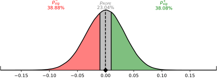

# Statistical Inference with Metric Distributions

In frequentist statistics, when we want to make inferences about parameters, we typically do not have access to the distribution of the estimators, and are forced to make assumptions. This is not the case for us. Since we have generated/bootstrapped the distribution of likely confusion matrices, we can take a much more direct approach in comparing metric distributions.

In that case, a Bayesian approach to generating inferences is likely more suitable. An excellent resource for this, and key inspiration for `prob_conf_mat`, is the documentation for the [`bayestestR`](https://easystats.github.io/bayestestR/) package[^1][^2], which was largely inspired by the works of Kruschke et al. on Bayesian hypothesis testing[^3][^4].

[^1]: [Makowski, D., Ben-Shachar, M. S., & Lüdecke, D. (2019). *bayestestR: Describing Effects and their Uncertainty, Existence and Significance within the Bayesian Framework.* Journal of Open Source Software, 4(40), 1541. 10.21105/joss.01541](https://dominiquemakowski.github.io/publication/makowski2019bayestestr/makowski2019bayestestr.pdf)

[^2]: [Makowski, D., Ben-Shachar, M. S., Chen, S. H. A., & Lüdecke, D. (2019). *Indices of Effect Existence and Significance in the Bayesian Framework.* Frontiers in Psychology 2019;10:2767. 10.3389/fpsyg.2019.02767](https://pubmed.ncbi.nlm.nih.gov/31920819/)

[^3]: [Kruschke, J. K. (2018). *Rejecting or accepting parameter values in Bayesian estimation.* Advances in Methods and Practices in Psychological Science, 1(2), 270–280.](https://journals.sagepub.com/doi/full/10.1177/2515245918771304)

[^4]: [Kruschke, J. K., & Liddell, T. M. (2018). *The bayesian new statistics: Hypothesis testing, estimation, meta-analysis, and power analysis from a bayesian perspective.* Psychonomic Bulletin & Review, 25(1), 178–206.](https://link.springer.com/article/10.3758/s13423-016-1221-4)

In short, given that we have access to the metric distributions, when making statistical inference, we are likely interested in 4 things:

1. point estimate summaries
2. a quantification of the amount of uncertainty present
3. a quantification of statistical significance
4. a quantification of practical significance

The first two points are relatively easily covered. For point estimates, we can use any of a number of estimators for central tendency, although the median is typically considered a safe and reasonably robust choice. Otherwise, we can use the mode (i.e., the most probable point), but this is much harder to compute from samples alone.

To measure the amount of uncertainty present, we can simply compute a credible interval, and measure its width at a certain level of credibility. [Tötsch et al. (2020)](https://peerj.com/articles/cs-398.pdf)[^5] specifically use the width of the 95% HDI credible interval as the 'metric uncertainty' (MU). The smaller this width is, the more certain we can be about the true metric value.

[^5]: [Tötsch, N., & Hoffmann, D. (2021). Classifier uncertainty: evidence, potential impact, and probabilistic treatment. PeerJ Computer Science, 7, e398.](https://peerj.com/articles/cs-398.pdf)

</img>

Estimating statistical significance is a little more involved. A common sanity check with machine learning models is comparing performance against the expected metric score of a random classifier. The further the classifier's score deviates from the random score, the more certain we can be that the model is actually 'learning'.

What constitutes random performance, however, depends on the metric used, and typically the number of classes, and the class prevalence. Furthermore, the number of samples in the test set will also influence the width/uncertainty present in the classifier and random performance metric distributions; when there is more evidence available, we can more easily accept a smaller difference between distributions than when less evidence is available.

To simplify this process, we can simply repeat the analysis, except with confusion matrix that might have been produced by a random classifier, and compare the metric distributions against each other.

</img>

We can generate synthetic confusions matrices imitating a random classifier by providing a confusion matrix that has the same class prevalence, but a uniform confusion conditional (i.e., the confusion matrix produced by predicting each class with equal probability, regardless of the true condition).

Since we have access to samples from both distributions, we can also create an approximation of the difference distribution, simply by subtracting one set of samples from the other: $\Delta(\mu|\mathbf{C}, \bar{\mathbf{C}})$, where $\bar{\mathbf{C}}$ is the confusion matrix of the random classifier.

The output difference distribution is just another distribution, which we can summarize as before. In the depicted example above, the median difference is $0.1670$, with an HDI of $[0.0798, 0.2531]$. In other words, we can be fairly certain that the classifier outperforms a random classifier.

A quantity that encapsulates this, is the [**probability of direction**](https://easystats.github.io/bayestestR/articles/probability_of_direction.html#relationship-with-the-p-value), which serves as the Bayesian equivalent of the (complement of the) frequentist p-value. In this case, the probability of direction would be the area under the difference PDF, for which the difference is positive:

$$p_{\text{dir}}=\int_{0}^{\infty} \Delta(\mu|\mathbf{C}, \bar{\mathbf{C}}) d\mu$$

We can be estimate this by simply taking the ratio of samples of the difference distribution which are smaller than 0: $\frac{\#p(\mu|\mathbf{C})\geq p(\mu|\bar{\mathbf{C}})}{N}$. For the above depicted example, this is $99.99\%$, meaning there is a $0.01%$ chance that the model achieves random performance.

While this tells us something about statistical significance, it says nothing about *practical significance*. An arbitrarily small difference can still be statistically significant, as long as the metric uncertainty is small enough (e.g., the sample size is large enough).

This is where the [**Region of Practical Equivalence (ROPE)**](https://easystats.github.io/bayestestR/articles/region_of_practical_equivalence.html) comes in. It is the region around the null effect, 0, bounded by the value which we consider *practically* equivalent to the null effect. For example, for F1, we might consider any scores within $0.01$ of each other to be practically the same.

</img>

Using the ROPE, which we symbolically denote as $[-\epsilon, \epsilon]$, we can define four quantities of interest to describe practical significance:

1. $p_{\text{ROPE}}=\int_{-\epsilon}^{\epsilon} \Delta(\mu|\mathbf{C}, \bar{\mathbf{C}}) d\mu$: the area within the ROPE, which essentially confirms the null hypothesis
2. $p_{\text{sig}}=1-p_{\text{ROPE}}$: the area outside the ROPE, where the values are deemed bidirectionally significant (i.e., the probability the probability that the effect is not null)
3. $p_{\text{sig}, +}=\int_{0}^{\epsilon} \Delta(\mu|\mathbf{C}, \bar{\mathbf{C}}) d\mu$: the area outside the ROPE, and greater than 0, where values are *positively* significant
4. $p_{\text{sig}, -}=\int_{-\epsilon}^{0} \Delta(\mu|\mathbf{C}, \bar{\mathbf{C}}) d\mu$: the area outside the ROPE, and lesser than 0, where values are *negatively* significant

In the case where a model is being compared to a random model, quantity $p_{\text{sig}, +}$ is most relevant, as it directly tells us how probable it is that the model is better.

So far, we've only considered comparing a model's performance, represented by a confusion matrix, to a virtual random model's performance. The same methodology, however, is applicable to comparing two different models against each other. In that case, we can also compare the achieved $p_{\text{sig}}$ values to those achieved by two random models. This gives us a quantity similar to a [**Bayes Factor**](https://en.wikipedia.org/wiki/Bayes_factor):

$$\text{BF}_{\text{sig}}=\dfrac{\mathtt{odds}(p_{\text{sig}}(\mu|\mathbf{C}_{A}, \mathbf{C}_{B}))}{\mathtt{odds}( p_{\text{sig}}(\mu|\bar{\mathbf{C}}_{A}, \bar{\mathbf{C}}_{B}))}$$

The larger this value is, the more evidence there is that the achieved $p_{\text{sig}}$ is not a statistical aberration.
