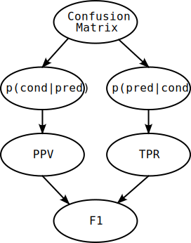

# Computing Metrics

Within the context of a classification experiment, a metric is some function that a confusion matrix as argument, and yields a single value that summarizes the classifier's performance or quality. Typically, the larger a metric value, the better the classifier performed on the evaluation data.

Metrics come in two flavors:

1. **Binary**: the metric computes a single value for each class in isolation. As a result, a single $|\mathcal{Y}\times\mathcal{Y}|$ confusion matrix produces $\mathcal{Y}$ values; one for each condition class
2. **Multi-Class**: the metric computes a single value for the whole confusion matrix, holistically combining the performance on individual classes into a single value.

While binary metrics are invaluable when comparing performance across different classes, with multi-class metrics it's substantially easier to interpret the model's performance. When a single value is preferred, it's possible to construct a multi-class metric from a binary one by adding a metric averaging method.

This process is shown in the figure below. To compute the F1 score for each class, we first split up the multi-class confusion matrix into virtual binary confusion matrices, then we compute the F1 score in isolation, and finally we average the scores across the different classes to produce a single F1-macro score.

</img>

In practice, the decomposition of the multi-class confusion matrix only happens virtually, to leverage vectorized metric computations in NumPy.

With `prob_conf_mat`, all binary metrics can be combined with a metric averaging method using metric syntax strings.

## Computing Metrics in Order

Many of the more [complex classification metrics](https://en.wikipedia.org/wiki/Confusion_matrix#Table_of_confusion) are dependent on other metrics. For example, the most common definition of the F1-score is as the harmonic average of the precisions and recall:

$$\text{F1}=2\frac{\text{PPV}\times \text{TPR}}{\text{PPV} + \text{TPR}}$$

To ensure no metric is computed before its dependencies, and to limit the amount of repeated work, we can create a computation schedule by generating a topological sort of the metric dependency tree.

</img>

The figure above displays such a computation schedule for F1. It depends on the PPV and TPR, which in turn depend on the two conditional distributions, each of which is computed from the (normalized) confusion matrix.
