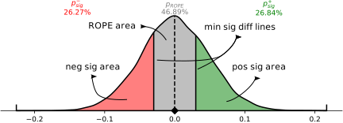
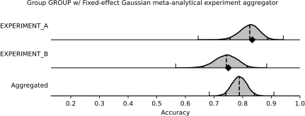

<!-- LTeX: enabled=false -->
# Study

::: prob_conf_mat.study.Study
    options:
        heading_level: 2
        members:
            - num_classes
            - num_experiment_groups
            - num_experiments

### Configuration

::: prob_conf_mat.study.Study.to_dict
    options:
        heading_level: 4

::: prob_conf_mat.study.Study.from_dict
    options:
        heading_level: 4

::: prob_conf_mat.study.Study.add_experiment
    options:
        heading_level: 4

::: prob_conf_mat.study.Study.__getitem__
    options:
        heading_level: 4

::: prob_conf_mat.study.Study.add_metric
    options:
        heading_level: 4

### Estimating Uncertainty

::: prob_conf_mat.study.Study.get_metric_samples
    options:
        heading_level: 4

::: prob_conf_mat.study.Study.report_metric_summaries
    options:
        heading_level: 4

::: prob_conf_mat.study.Study.report_random_metric_summaries
    options:
        heading_level: 4

::: prob_conf_mat.study.Study.plot_metric_summaries
    options:
        heading_level: 4

<span class="doc-section-title">Examples:</span>

Plot a distribution of metric values

```python
study.plot_metric_summaries(
    metric="acc",
    class_label=0,
)
```


</img>

### Comparing 2 Experiments

::: prob_conf_mat.study.Study.get_pairwise_comparison
    options:
        heading_level: 4

::: prob_conf_mat.study.Study.report_pairwise_comparison
    options:
        heading_level: 4

::: prob_conf_mat.study.Study.report_pairwise_comparison_to_random
    options:
        heading_level: 4

::: prob_conf_mat.study.Study.plot_pairwise_comparison
    options:
        heading_level: 4

<span class="doc-section-title">Examples:</span>

Plot the distribution of the difference of two metrics

```python
study.plot_pairwise_comparison(
    metric="acc",
    class_label=0,
    experiment_a="GROUP/EXPERIMENT_A",
    experiment_b="GROUP/EXPERIMENT_B",
    min_sig_diff=0.03,
)
```


</img>

### Comparing Many Experiments

::: prob_conf_mat.study.Study.get_listwise_comparsion_result
    options:
        heading_level: 4

::: prob_conf_mat.study.Study.report_listwise_comparison
    options:
        heading_level: 4

::: prob_conf_mat.study.Study.report_expected_reward
    options:
        heading_level: 4

### Aggregating Experiments

::: prob_conf_mat.study.Study.report_aggregated_metric_summaries
    options:
        heading_level: 4

::: prob_conf_mat.study.Study.plot_experiment_aggregation
    options:
        heading_level: 4

<span class="doc-section-title">Examples:</span>

Plot the distributions and the aggregated distribution for ExperimentGroup 'GROUP'.

```python
study.plot_experiment_aggregation(
    metric="acc",
    class_label=0,
    experiment_group="GROUP",
)
```


</img>

::: prob_conf_mat.study.Study.plot_forest_plot
    options:
        heading_level: 4

<span class="doc-section-title">Examples:</span>

Plot the distributions and the aggregated distribution for all ExperimentGroups as a forest plot.

```python
study.plot_forest_plot(
    metric="acc",
    class_label=0,
)
```


</img>

::: prob_conf_mat.config.Config
    options:
        heading_level: 2
        members:
            - fingerprint
            - seed
            - num_samples
            - ci_probability
            - experiments
            - metrics
