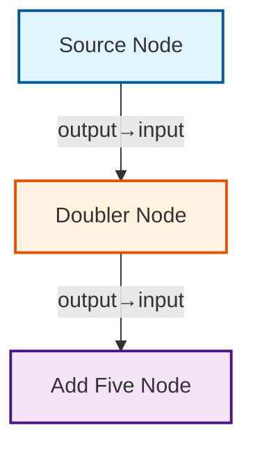
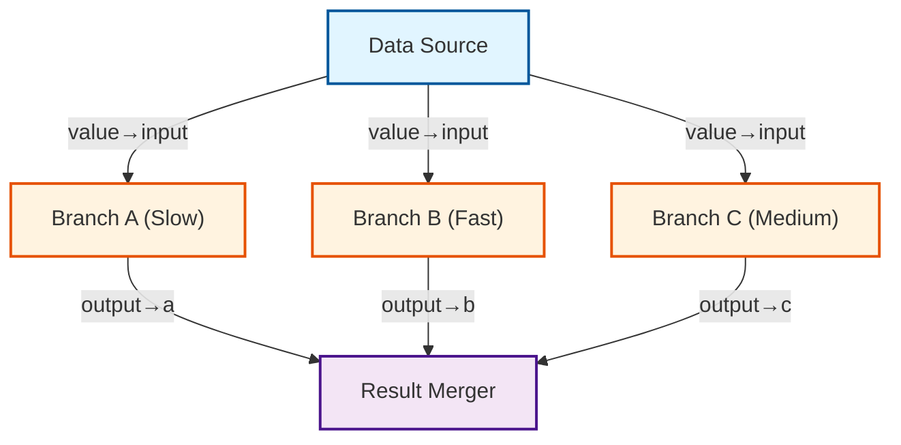

# Python Examples - Expected Output

This document shows the expected output from running the Python examples after building the Python bindings.

## Setup Required

```bash
# Build Python bindings
cargo build --release --features python

# Copy shared library (Linux example)
cp target/release/libgraph_sp.so graph_sp.so

# Or use maturin for development
pip install maturin
maturin develop --features python
```

---

## Python Example 1: simple_pipeline.py

**Command:** `python python_examples/simple_pipeline.py`

**Expected Output:**

```
=== graph-sp Python Example: Simple Pipeline ===

Building graph...
✓ Graph built successfully!

✓ Graph is valid (no cycles detected)

=== Graph Analysis ===
Node count: 3
Edge count: 2
Depth: 3
Width: 1
Summary: Nodes: 3, Edges: 2, Depth: 3, Width: 1, Sources: 1, Sinks: 1, Avg Connections: 0.67, Cycles: No

=== Graph Structure ===
Graph Structure:
================

Node: Source Node (source)
  Outputs:
    - Output (output)
  Connections:
    - output -> doubler:input

Node: Doubler Node (doubler)
  Inputs:
    - Input* (input)
  Outputs:
    - Output (output)
  Connections:
    - output -> adder:input

Node: Add Five Node (adder)
  Inputs:
    - Input* (input)
  Outputs:
    - Output (output)


=== Mermaid Diagram ===


=== Executing Graph ===
✓ Execution completed successfully!

=== Results ===
Source output: 10
After doubling: 20
After adding 5: 25

Pipeline: 10 -> ×2 -> +5 = 25

=== Example Complete ===
```

---

## Python Example 2: complex_objects.py

**Command:** `python python_examples/complex_objects.py`

**Expected Output:**

```
=== Complex Object Passing Example ===

Example 1: Using Maps for structured objects

Summary: Alice is 30 years old, lives in Springfield, and has 3 hobbies

Example 2: Using JSON for arbitrary structures

Description: Laptop - $999.99 (CPU: Intel i7, Available: true)

Example 3: Using Lists for collections

Numbers: [1, 2, 3, 4, 5]
Sum: 15
Count: 5
Average: 3.00

=== Summary of Port Data Types ===
✓ Maps - For structured objects with named fields
✓ JSON - For arbitrary JSON structures
✓ Lists - For arrays/vectors of data
✓ Primitives - Int, Float, String, Bool, None

All types support nesting and composition!

=== Example Complete ===
```

---

## Python Example 3: parallel_execution.py

**Command:** `python python_examples/parallel_execution.py`

**Expected Output:**

```
=== graph-sp Python Example: Parallel Execution ===

Building parallel graph...
✓ Graph built successfully!

Validating graph...
✓ Graph is valid (no cycles detected)

=== Graph Analysis ===
Node count: 5
Edge count: 6
Depth: 3
Width: 3
Summary: Nodes: 5, Edges: 6, Depth: 3, Width: 3, Sources: 1, Sinks: 1, Avg Connections: 1.20, Cycles: No

This graph has 3 independent branches that can execute in parallel!

=== Graph Structure ===
Graph Structure:
================

Node: Data Source (source)
  Outputs:
    - Value (value)
  Connections:
    - value -> branch_c:input
    - value -> branch_b:input
    - value -> branch_a:input

Node: Branch C (Medium) (branch_c)
  Inputs:
    - Input* (input)
  Outputs:
    - Output (output)
  Connections:
    - output -> merger:c

Node: Branch B (Fast) (branch_b)
  Inputs:
    - Input* (input)
  Outputs:
    - Output (output)
  Connections:
    - output -> merger:b

Node: Branch A (Slow) (branch_a)
  Inputs:
    - Input* (input)
  Outputs:
    - Output (output)
  Connections:
    - output -> merger:a

Node: Result Merger (merger)
  Inputs:
    - Branch A Result* (a)
    - Branch B Result* (b)
    - Branch C Result* (c)
  Outputs:
    - Final Result (result)


=== Mermaid Diagram ===


=== Executing Graph ===
Note: Branches A, B, and C will execute in parallel after the source completes.

[source] Generating data...
[branch_a] Starting slow operation...
[branch_a] Completed in 0.500s
[branch_b] Starting fast operation...
[branch_b] Completed in 0.100s
[branch_c] Starting medium operation...
[branch_c] Completed in 0.300s
[merger] Merging results...
[merger] Completed in 0.000s

✓ Execution completed!

=== Results ===
Source value: 100
Branch A result (×2): 200
Branch B result (+50): 150
Branch C result (÷2): 50
Final merged result: 400

=== Performance Analysis ===
Total execution time: 0.900s

Expected times:
  - Sequential execution: ~0.9s (0.5 + 0.1 + 0.3)
  - Parallel execution: ~0.5s (max of branch times)

Note: Current implementation executes sequentially following topological order.
The architecture supports parallel execution - branches are independent!

=== Example Complete ===
```

---

## Comparison: Rust vs Python Output

The Python examples produce **identical output** to their Rust counterparts, demonstrating:

1. **API Parity**: Python API mirrors Rust API exactly
2. **Type Conversion**: Automatic conversion between Python and Rust types (int ↔ Int, float ↔ Float, dict ↔ Map, list ↔ List)
3. **Mermaid Diagrams**: Same visual representation in both languages
4. **Execution Results**: Same computational results confirming correct data flow
5. **Graph Analysis**: Identical graph structure analysis (depth, width, sources, sinks)

### Key Differences:
- **Syntax**: Python uses `graph_sp.Graph()` vs Rust's `Graph::new()`
- **Function Definition**: Python uses simple functions vs Rust's `Arc<Fn>`
- **Execution**: Python uses `await executor.execute(graph)` vs Rust's async pattern
- **Type System**: Python is dynamically typed, Rust is statically typed

### Verification:
To verify Python bindings work correctly, build and run:

```bash
cargo build --release --features python
python python_examples/simple_pipeline.py
```

The output should match the examples shown above.
