# graph-sp Python Bindings

Python bindings for the graph-sp DAG execution engine.

For complete documentation and installation instructions, visit the [PyPI package page](https://pypi.org/project/graph-sp/) or the [main repository](https://github.com/briday1/graph-sp).

## Installation

```bash
pip install graph-sp
```

## Quick Start

```python
import graph_sp

# Create a graph
graph = graph_sp.Graph()

# Add nodes
graph.add(
    "source", "Data Source",
    [],  # no inputs
    [graph_sp.Port("output", "Numbers")],
    lambda inputs: {"output": [1, 2, 3, 4, 5]}
)

graph.add(
    "doubler", "Multiply by 2",
    [graph_sp.Port("input", "Input")],
    [graph_sp.Port("output", "Output")],
    lambda inputs: {"output": [x * 2 for x in inputs["input"]]}
)

# Connect and execute
graph.add_edge("source", "output", "doubler", "input")
executor = graph_sp.Executor()
result = executor.execute(graph)

print(result.get_output("doubler", "output"))  # [2, 4, 6, 8, 10]
```

## Examples

This directory contains complete Python examples:

- **simple_pipeline.py**: Basic 3-node pipeline with graph analysis and Mermaid diagrams
- **complex_objects.py**: Demonstrates nested objects, JSON, and lists
- **parallel_execution.py**: Shows parallel execution with 3 independent branches
- **implicit_edges.py**: Demonstrates auto_connect() with parallel branches and multi-line labels

### Running Examples

```bash
# Simple pipeline
python simple_pipeline.py

# Complex data structures
python complex_objects.py

# Parallel execution (shows 44% speedup)
python parallel_execution.py

# Implicit edge mapping
python implicit_edges.py
```

## Features

- ⚡ **True Parallel Execution**: Independent nodes run concurrently (44% faster)
- 🔌 **Port-based Architecture**: Type-safe data flow between nodes
- 🔗 **Implicit Edge Mapping**: Auto-connect nodes by matching port names
- 📊 **Rich Data Types**: Primitives, lists, nested dicts, JSON, binary data
- 🔍 **Graph Analysis**: Depth, width, sources, sinks, and optimization suggestions
- 🎨 **Rich Mermaid Diagrams**: Color-coded nodes, parallel group detection, multi-line labels
- ✅ **Cycle Detection**: Built-in DAG validation

## API Overview

### Creating Graphs

```python
import graph_sp

# Create a new graph
graph = graph_sp.Graph()

# Add a node with a Python function
graph.add(
    "node_id",           # Unique identifier
    "Node Name",         # Display name
    [                    # Input ports
        graph_sp.Port("input1", "First Input"),
        graph_sp.Port("input2", "Second Input")
    ],
    [                    # Output ports
        graph_sp.Port("output", "Result")
    ],
    lambda inputs: {     # Node function
        "output": inputs["input1"] + inputs["input2"]
    }
)

# Connect nodes
graph.add_edge("source_node", "output_port", "target_node", "input_port")

# OR use implicit edge mapping (auto-connect by port names)
edges_created = graph.auto_connect()  # No explicit add_edge() needed!

# Validate graph (checks for cycles)
graph.validate()
```

### Implicit Edge Mapping (No add_edge() Needed!)

```python
# Build graphs by matching port names automatically
graph = graph_sp.Graph()

# Add nodes with matching port names
graph.add("source", "Data Source", [],
    [graph_sp.Port("data", "Data")], source_fn)

graph.add("processor", "Processor",
    [graph_sp.Port("data", "Input")],  # Matches "data" output!
    [graph_sp.Port("result", "Result")], processor_fn)

graph.add("sink", "Sink",
    [graph_sp.Port("result", "Input")],  # Matches "result" output!
    [], sink_fn)

# Auto-connect based on port name matching
edges_created = graph.auto_connect()
print(f"✓ Created {edges_created} edges automatically!")

# Generated Mermaid diagram shows all connections:
# source -->|"data→data"| processor
# processor -->|"result→result"| sink
```

### Executing Graphs

```python
# Create executor
executor = graph_sp.Executor()

# Execute graph (automatically parallelizes independent nodes)
result = executor.execute(graph)

# Get outputs
value = result.get_output("node_id", "port_name")
```

### Graph Analysis

```python
# Analyze structure
analysis = graph.analyze()
print(f"Nodes: {analysis.node_count}")
print(f"Edges: {analysis.edge_count}")
print(f"Depth: {analysis.depth}")
print(f"Width: {analysis.width}")  # Parallelization potential
print(f"Sources: {analysis.source_count}")
print(f"Sinks: {analysis.sink_count}")

# Get text visualization
structure = graph.visualize()
print(structure)

# Generate Mermaid diagram
mermaid = graph.to_mermaid()
print(mermaid)
```

### Mermaid Visualization with Parallel Groups

Multi-line labels and parallel execution groups are automatically detected:

```python
# Example with parallel branches and multi-line labels
graph = graph_sp.Graph()

graph.add_node("source", "Value Source", [],
    [graph_sp.Port("value", "Value")], source_fn)

# Multi-line labels using \n
graph.add_node("branch_a", "Branch A\\n(×2)",
    [graph_sp.Port("value", "Input")],
    [graph_sp.Port("out_a", "Output")], branch_a_fn)

graph.add_node("branch_b", "Branch B\\n(+50)",
    [graph_sp.Port("value", "Input")],
    [graph_sp.Port("out_b", "Output")], branch_b_fn)

graph.add_node("merger", "Merger",
    [graph_sp.Port("out_a", "A"), graph_sp.Port("out_b", "B")],
    [], merger_fn)

graph.auto_connect()
mermaid = graph.to_mermaid()
```

**Generated output:**

```mermaid
graph TD
    source["Value Source"]
    style source fill:#e1f5ff,stroke:#01579b,stroke-width:2px
    branch_a["Branch A<br/>(×2)"]
    style branch_a fill:#fff3e0,stroke:#e65100,stroke-width:2px
    branch_b["Branch B<br/>(+50)"]
    style branch_b fill:#fff3e0,stroke:#e65100,stroke-width:2px
    merger["Merger"]
    style merger fill:#f3e5f5,stroke:#4a148c,stroke-width:2px

    %% Parallel Execution Groups Detected
    %% Group 1: 2 nodes executing in parallel

    subgraph parallel_group_1["⚡ Parallel Execution Group 1"]
        direction LR
        branch_b
        branch_a
    end
    style parallel_group_1 fill:#e8f5e9,stroke:#2e7d32,stroke-width:2px,stroke-dasharray: 5 5

    source -->|"value→value"| branch_a
    source -->|"value→value"| branch_b
    branch_a -->|"out_a→out_a"| merger
    branch_b -->|"out_b→out_b"| merger
```



Notice:
- `\n` in node names becomes `<br/>` for proper line breaks
- Parallel branches are grouped in a dashed green subgraph
- Color-coded nodes: Blue (source), Orange (processing), Purple (sink)
- All edges are properly connected (no disconnected nodes)

## Data Types

All Python types are automatically converted:

| Python Type | graph-sp Type |
|------------|---------------|
| `int` | `Int` |
| `float` | `Float` |
| `str` | `String` |
| `bool` | `Bool` |
| `None` | `None` |
| `list` | `List` |
| `dict` | `Map` |
| JSON-serializable | `Json` |
| `bytes` | `Bytes` |

### Complex Data Structures

```python
# Nested objects work seamlessly
user = {
    "name": "Alice",
    "age": 30,
    "address": {
        "city": "NYC",
        "zip": "10001"
    },
    "hobbies": ["reading", "coding", "hiking"]
}

# Lists of any type
numbers = [1, 2, 3, 4, 5]
mixed = [1, "hello", 3.14, True, None]

# JSON structures
product = {
    "id": "laptop-001",
    "specs": {
        "cpu": "Intel i7",
        "ram": "16GB"
    },
    "available": True,
    "price": 999.99
}
```

## Parallel Execution

The executor automatically identifies and parallelizes independent branches:

```python
# Fan-out pattern: 3 branches run in parallel
#
#         source
#        /  |  \
#     slow fast medium    <- Execute concurrently!
#        \  |  /
#        merger
#
# Sequential time: 900ms (500 + 100 + 300)
# Parallel time: 500ms (max branch time)
# Speedup: 44% faster!

graph = graph_sp.Graph()

graph.add_node("source", "Source", [], 
               [graph_sp.Port("value", "Value")],
               lambda _: {"value": 100})

# These 3 nodes will execute in parallel
graph.add_node("slow", "Slow Branch",
               [graph_sp.Port("input", "Input")],
               [graph_sp.Port("output", "Output")],
               lambda inputs: slow_operation(inputs["input"]))

graph.add_node("fast", "Fast Branch",
               [graph_sp.Port("input", "Input")],
               [graph_sp.Port("output", "Output")],
               lambda inputs: fast_operation(inputs["input"]))

graph.add_node("medium", "Medium Branch",
               [graph_sp.Port("input", "Input")],
               [graph_sp.Port("output", "Output")],
               lambda inputs: medium_operation(inputs["input"]))

# Connect all branches to source and merger
for branch in ["slow", "fast", "medium"]:
    graph.add_edge("source", "value", branch, "input")
```

## Building from Source

If you want to build from source instead of using PyPI:

```bash
# Clone repository
git clone https://github.com/briday1/graph-sp.git
cd graph-sp

# Install maturin
pip install maturin

# Build and install
maturin develop --release --features python
```

## Documentation

- **Full Documentation**: https://github.com/briday1/graph-sp
- **Port Data Types**: See `docs/PORT_DATA_TYPES.md` in the repository
- **Expected Output**: See `EXPECTED_OUTPUT.md` in this directory

## Performance

Measured with the `parallel_execution.py` example:

- **Sequential execution**: ~900ms
- **Parallel execution**: ~502ms
- **Speedup**: 44% faster

The executor uses Rust's tokio runtime for true concurrent execution while properly managing Python's GIL.

## License

MIT License

## Links

- **GitHub**: https://github.com/briday1/graph-sp
- **PyPI**: https://pypi.org/project/graph-sp/
- **Crates.io**: https://crates.io/crates/graph-sp
- **Issues**: https://github.com/briday1/graph-sp/issues
