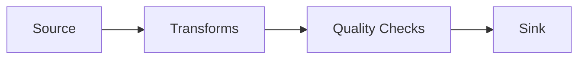

# Quality Checks

Quality checks validate your data after transforms are applied. QuickETL provides 5 built-in check types.

## Overview

Checks run after transforms, before writing to the sink:



If any check fails, the pipeline can either:
- **Fail** (default) - Stop execution, don't write output
- **Continue** - Log warning, write output anyway

## Check Types

| Check | Purpose |
|-------|---------|
| [`not_null`](checks.md#not_null) | Ensure no null values |
| [`unique`](checks.md#unique) | Verify uniqueness |
| [`row_count`](checks.md#row_count) | Validate row count bounds |
| [`accepted_values`](checks.md#accepted_values) | Check against whitelist |
| [`expression`](checks.md#expression) | Custom SQL validation |

## Basic Usage

```yaml
checks:
  - type: not_null
    columns: [id, name, amount]

  - type: unique
    columns: [id]

  - type: row_count
    min: 1
    max: 1000000

  - type: accepted_values
    column: status
    values: [pending, active, completed]

  - type: expression
    expr: amount >= 0
```

## Failure Behavior

### Fail on Check Failure (Default)

```bash
quicketl run pipeline.yml --fail-on-checks
```

If any check fails, the pipeline stops and no output is written.

### Continue on Check Failure

```bash
quicketl run pipeline.yml --no-fail-on-checks
```

Checks are logged but pipeline continues.

### Python API

```python
result = pipeline.run(fail_on_check_failure=False)

if not result.check_results["all_passed"]:
    print("Some checks failed:", result.check_results)
```

## Check Results

Pipeline results include check details:

```python
result = pipeline.run()

# Check overall status
if result.check_results["all_passed"]:
    print("All checks passed!")
else:
    # Examine individual results
    for check in result.check_results["results"]:
        print(f"{check['check_type']}: {'PASS' if check['passed'] else 'FAIL'}")
        print(f"  {check['message']}")
```

## Common Patterns

### Data Quality Gates

```yaml
checks:
  # Mandatory columns
  - type: not_null
    columns: [id, customer_id, amount, created_at]

  # Primary key
  - type: unique
    columns: [id]

  # Business rules
  - type: expression
    expr: amount > 0

  - type: accepted_values
    column: status
    values: [pending, processing, completed, failed]
```

### Anomaly Detection

```yaml
checks:
  # Ensure reasonable data volume
  - type: row_count
    min: 1000    # At least 1000 rows expected
    max: 100000  # No more than 100K

  # Ensure no extreme values
  - type: expression
    expr: amount BETWEEN 0 AND 10000
```

### Referential Checks

```yaml
checks:
  # After join, ensure matches exist
  - type: expression
    expr: customer_name IS NOT NULL

  # Check join success rate
  - type: row_count
    min: 1
```

## Python API

```python
from quicketl.config.checks import (
    NotNullCheck,
    UniqueCheck,
    RowCountCheck,
    AcceptedValuesCheck,
    ExpressionCheck,
)

pipeline = (
    Pipeline("example")
    .source(source)
    .transforms([...])
    .check(NotNullCheck(columns=["id", "amount"]))
    .check(UniqueCheck(columns=["id"]))
    .check(RowCountCheck(min=1))
    .check(ExpressionCheck(expr="amount >= 0"))
    .sink(sink)
)
```

## Best Practices

### Check Critical Columns

Always check columns that downstream processes depend on:

```yaml
checks:
  - type: not_null
    columns: [id, customer_id]  # Join keys
```

### Set Reasonable Bounds

```yaml
checks:
  - type: row_count
    min: 100      # Alert if too few rows
    max: 10000000 # Alert if suspiciously many
```

### Use Multiple Check Types

Combine checks for comprehensive validation:

```yaml
checks:
  - type: not_null
    columns: [id]

  - type: unique
    columns: [id]

  - type: expression
    expr: id > 0
```

## Next Steps

- [All Quality Checks](checks.md) - Complete reference for all 5 check types
