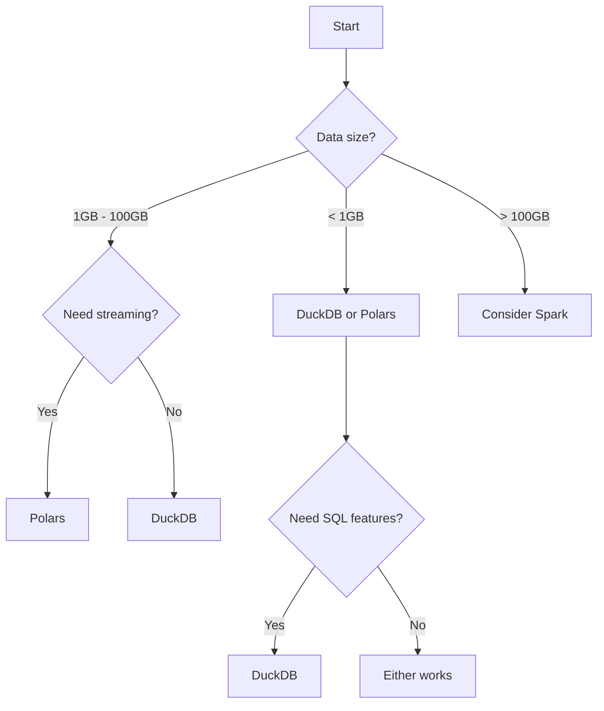

# Local Backends

Local backends run on a single machine and are ideal for development, small-to-medium datasets, and quick data exploration.

## Quick Comparison

| Backend | Install | Speed | Memory | SQL | Best For |
|---------|---------|-------|--------|-----|----------|
| **DuckDB** | Default | Fast | Efficient | Full | Analytics, default choice |
| **Polars** | Default | Very Fast | Excellent | Via Ibis | Large DataFrames |
| **DataFusion** | Optional | Fast | Excellent | Full | Arrow-native |
| **pandas** | Default | Moderate | Higher | No | Legacy compatibility |

---

## DuckDB {#duckdb}

DuckDB is the **default backend** in QuickETL. It's a fast, embedded analytical database that requires no setup.

### When to Use

- Local development and testing
- Small-to-medium datasets (up to ~100GB)
- Analytics and reporting
- Quick data exploration

### Configuration

```yaml
engine: duckdb  # Default, can be omitted
```

### Features

- **File Support**: Parquet (fastest), CSV, JSON
- **Cloud Storage**: S3, GCS, Azure via fsspec
- **SQL Support**: Full SQL with window functions, CTEs
- **Parallelism**: Multi-core execution

### Example

```yaml
name: sales_analysis
engine: duckdb

source:
  type: file
  path: data/sales.parquet

transforms:
  - op: filter
    predicate: amount > 100
  - op: aggregate
    group_by: [region]
    aggs:
      total: sum(amount)

sink:
  type: file
  path: output/summary.parquet
```

### Performance Tips

- Use Parquet format (columnar, compressed)
- Filter early to reduce data volume
- Select only needed columns

---

## Polars {#polars}

Polars is a blazing-fast DataFrame library written in Rust with excellent streaming support.

### Installation

```bash
pip install quicketl[polars]
```

### When to Use

- Large files that don't fit in memory (streaming)
- CPU-intensive transformations
- Maximum single-machine performance

### Configuration

```yaml
engine: polars

source:
  type: file
  path: data/large_dataset.parquet

transforms:
  - op: filter
    predicate: amount > 100
```

### Features

- **Streaming**: Can process files larger than memory
- **Performance**: Multi-threaded, Rust-level speed
- **Memory**: Lazy evaluation reduces memory usage

### Comparison with DuckDB

| Feature | Polars | DuckDB |
|---------|--------|--------|
| In-memory speed | Excellent | Excellent |
| SQL support | Via Ibis | Native |
| Streaming | Built-in | Limited |
| Database connectivity | No | Yes |

---

## DataFusion {#datafusion}

Apache DataFusion is a fast query engine written in Rust, Arrow-native.

### Installation

```bash
pip install quicketl[datafusion]
```

### When to Use

- Rust-powered performance
- SQL-based analytics on files
- Arrow-native workflows

### Configuration

```yaml
engine: datafusion

source:
  type: file
  path: data/events/*.parquet

transforms:
  - op: filter
    predicate: event_date >= '2025-01-01'
```

### Features

- **Arrow Native**: First-class Arrow support
- **SQL**: Full SQL support
- **File Formats**: Parquet, CSV, JSON

---

## pandas {#pandas}

pandas is the most widely-used Python data analysis library, supported for compatibility.

### When to Use

- Compatibility with existing pandas code
- Quick prototyping
- Extensive pandas ecosystem needed

### When NOT to Use

- Large datasets (use DuckDB or Polars instead)
- Production workloads requiring performance

### Configuration

```yaml
engine: pandas

source:
  type: file
  path: data/sales.csv

transforms:
  - op: filter
    predicate: amount > 0
```

### Limitations

- **Memory**: Loads entire dataset into memory
- **Performance**: Single-threaded for most operations
- **Scale**: Not suitable for files larger than RAM

### Migration

When pandas is too slow or runs out of memory, migration is easy:

```yaml
# Before
engine: pandas

# After - just change the engine
engine: duckdb  # or polars
```

---

## Choosing a Local Backend



### Recommendation Summary

| Scenario | Recommended |
|----------|-------------|
| **Default choice** | DuckDB |
| **Maximum speed on DataFrames** | Polars |
| **Large files with streaming** | Polars |
| **Complex SQL queries** | DuckDB |
| **Existing pandas code** | pandas (then migrate) |
| **Arrow-native workflows** | DataFusion |

## Related

- [Distributed Backends](distributed.md) - For larger datasets
- [Cloud Warehouses](cloud-warehouses.md) - Snowflake, BigQuery
