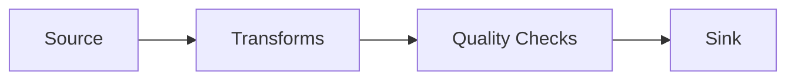

# Quality Check Types

This page documents all 5 quality check types available in QuickETL.

## Quick Reference

| Check | Purpose | Example |
|-------|---------|---------|
| [`not_null`](#not_null) | Ensure no null values | `columns: [id, name]` |
| [`unique`](#unique) | Verify uniqueness | `columns: [id]` |
| [`row_count`](#row_count) | Validate row count bounds | `min: 1, max: 100000` |
| [`accepted_values`](#accepted_values) | Check against whitelist | `values: [a, b, c]` |
| [`expression`](#expression) | Custom SQL validation | `expr: amount >= 0` |

## Usage Overview

Checks run after transforms, before writing to the sink:



```yaml
checks:
  - type: not_null
    columns: [id, name, amount]

  - type: unique
    columns: [id]

  - type: row_count
    min: 1

  - type: expression
    expr: amount >= 0
```

---

## not_null {#not_null}

Verify that specified columns contain no null values.

### Usage

```yaml
- type: not_null
  columns: [id, name, amount]
```

### Parameters

| Parameter | Required | Type | Description |
|-----------|----------|------|-------------|
| `columns` | Yes | `list[str]` | Columns that must not contain nulls |

### Examples

```yaml
# Single column
- type: not_null
  columns: [id]

# Multiple columns
- type: not_null
  columns: [id, customer_id, amount, created_at]

# Check join results
- type: not_null
  columns: [customer_name]  # Verify join found matches
```

### Pass/Fail

- **Pass**: All values in specified columns are non-null
- **Fail**: Any null value found in specified columns

### Python API

```python
from quicketl.config.checks import NotNullCheck
check = NotNullCheck(columns=["id", "name", "amount"])
```

---

## unique {#unique}

Verify that column values are unique (no duplicates).

### Usage

```yaml
- type: unique
  columns: [id]
```

### Parameters

| Parameter | Required | Type | Description |
|-----------|----------|------|-------------|
| `columns` | Yes | `list[str]` | Columns that must be unique |

### Examples

```yaml
# Primary key
- type: unique
  columns: [id]

# Composite key
- type: unique
  columns: [customer_id, order_date]

# Verify after dedup
- type: unique
  columns: [id]
```

### Pass/Fail

- **Pass**: All combinations of specified columns are unique
- **Fail**: Duplicate values found

### Null Handling

Nulls are treated as equal for uniqueness - two rows with `NULL` in `id` are considered duplicates.

### Python API

```python
from quicketl.config.checks import UniqueCheck
check = UniqueCheck(columns=["id"])
check = UniqueCheck(columns=["customer_id", "order_date"])
```

---

## row_count {#row_count}

Verify that the row count is within expected bounds.

### Usage

```yaml
- type: row_count
  min: 1
  max: 1000000
```

### Parameters

| Parameter | Required | Default | Description |
|-----------|----------|---------|-------------|
| `min` | No | None | Minimum row count |
| `max` | No | None | Maximum row count |

At least one of `min` or `max` must be specified.

### Examples

```yaml
# Non-empty output
- type: row_count
  min: 1

# Maximum only
- type: row_count
  max: 1000000

# Expected range
- type: row_count
  min: 1000
  max: 10000

# With variables
- type: row_count
  min: ${MIN_ROWS:-1}
  max: ${MAX_ROWS:-1000000}
```

### Pass/Fail

- **Pass**: Row count is within specified bounds
- **Fail**: Row count is outside bounds

### Python API

```python
from quicketl.config.checks import RowCountCheck
check = RowCountCheck(min=1)
check = RowCountCheck(min=100, max=10000)
```

---

## accepted_values {#accepted_values}

Verify that all values in a column are from an allowed list.

### Usage

```yaml
- type: accepted_values
  column: status
  values: [pending, active, completed]
```

### Parameters

| Parameter | Required | Type | Description |
|-----------|----------|------|-------------|
| `column` | Yes | `str` | Column to check |
| `values` | Yes | `list[any]` | Allowed values |

### Examples

```yaml
# Status field
- type: accepted_values
  column: status
  values: [pending, active, completed, cancelled]

# Region codes
- type: accepted_values
  column: region
  values: [north, south, east, west]

# Numeric values
- type: accepted_values
  column: priority
  values: [1, 2, 3, 4, 5]

# Boolean-ish fields
- type: accepted_values
  column: is_verified
  values: [true, false, "Y", "N", 1, 0]
```

### Pass/Fail

- **Pass**: All values in the column are in the allowed list
- **Fail**: Any value not in the allowed list

### Null Handling

By default, nulls are considered invalid. To allow nulls, include `null` in values:

```yaml
values: [pending, active, null]
```

### Case Sensitivity

Values are case-sensitive. Standardize case before checking if needed:

```yaml
transforms:
  - op: derive_column
    name: status_lower
    expr: lower(status)

checks:
  - type: accepted_values
    column: status_lower
    values: [pending, active, completed]
```

### Python API

```python
from quicketl.config.checks import AcceptedValuesCheck
check = AcceptedValuesCheck(column="status", values=["pending", "active", "completed"])
```

---

## expression {#expression}

Validate data using a custom SQL expression.

### Usage

```yaml
- type: expression
  expr: amount >= 0
```

### Parameters

| Parameter | Required | Type | Description |
|-----------|----------|------|-------------|
| `expr` | Yes | `str` | SQL expression that must be true for all rows |

### Examples

```yaml
# Positive values
- type: expression
  expr: amount >= 0

# Range check
- type: expression
  expr: amount BETWEEN 0 AND 10000

# Non-empty string
- type: expression
  expr: name IS NOT NULL AND length(name) > 0

# Date validation
- type: expression
  expr: created_at <= current_date()

# Multiple conditions
- type: expression
  expr: amount > 0 AND quantity > 0 AND price > 0

# Business rules
- type: expression
  expr: discount <= amount

# End date after start date
- type: expression
  expr: end_date >= start_date

# Valid email format (basic)
- type: expression
  expr: email LIKE '%@%.%'
```

### Multiline Expressions

```yaml
- type: expression
  expr: |
    amount > 0
    AND quantity > 0
    AND status IN ('pending', 'active', 'completed')
```

### Complex Logic

```yaml
- type: expression
  expr: |
    CASE
      WHEN order_type = 'refund' THEN amount < 0
      ELSE amount > 0
    END
```

### Pass/Fail

- **Pass**: Expression is true for all rows
- **Fail**: Expression is false for any row

### Python API

```python
from quicketl.config.checks import ExpressionCheck
check = ExpressionCheck(expr="amount >= 0")
```

---

## Check Results

Pipeline results include check details:

```python
result = pipeline.run()

# Check overall status
if result.check_results["all_passed"]:
    print("All checks passed!")
else:
    # Examine individual results
    for check in result.check_results["results"]:
        print(f"{check['check_type']}: {'PASS' if check['passed'] else 'FAIL'}")
        print(f"  {check['message']}")
```

## Failure Behavior

### Fail on Check Failure (Default)

```bash
quicketl run pipeline.yml --fail-on-checks
```

If any check fails, the pipeline stops and no output is written.

### Continue on Check Failure

```bash
quicketl run pipeline.yml --no-fail-on-checks
```

Checks are logged but pipeline continues.

### Python API

```python
result = pipeline.run(fail_on_check_failure=False)

if not result.check_results["all_passed"]:
    print("Some checks failed:", result.check_results)
```

---

## Common Patterns

### Data Quality Gate

```yaml
checks:
  # Mandatory columns
  - type: not_null
    columns: [id, customer_id, amount]

  # Primary key
  - type: unique
    columns: [id]

  # Business rules
  - type: expression
    expr: amount > 0

  - type: accepted_values
    column: status
    values: [pending, processing, completed, failed]
```

### Anomaly Detection

```yaml
checks:
  # Reasonable data volume
  - type: row_count
    min: 1000
    max: 100000

  # No extreme values
  - type: expression
    expr: amount BETWEEN 0 AND 10000
```

### After Join Validation

```yaml
transforms:
  - op: join
    right: customers
    on: [customer_id]
    how: left

checks:
  # Verify join found matches
  - type: not_null
    columns: [customer_name]

  # Check join success
  - type: row_count
    min: 1
```

## Related

- [Expression Language](../../reference/expressions.md) - Full expression syntax
- [Transform Operations](../transforms/operations.md) - Prepare data before checks
