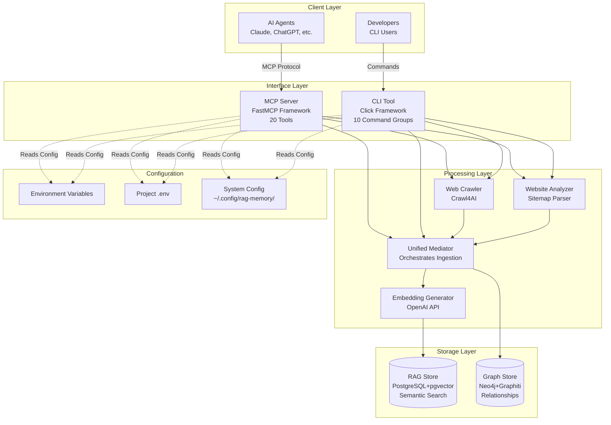
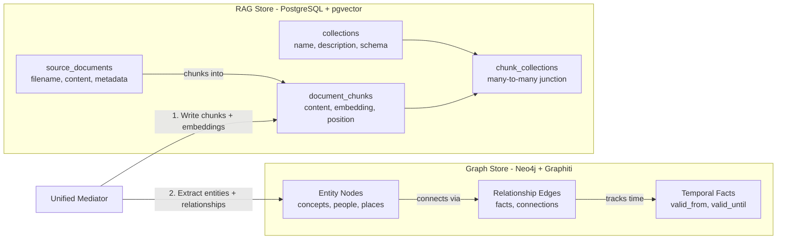
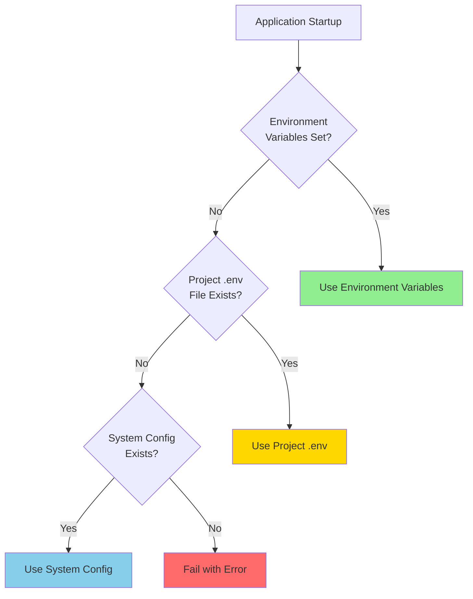
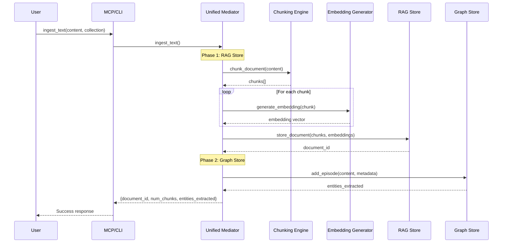
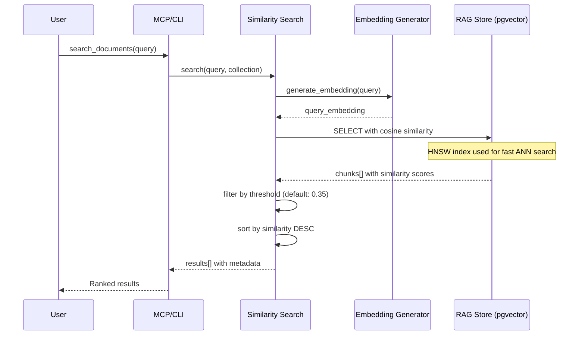
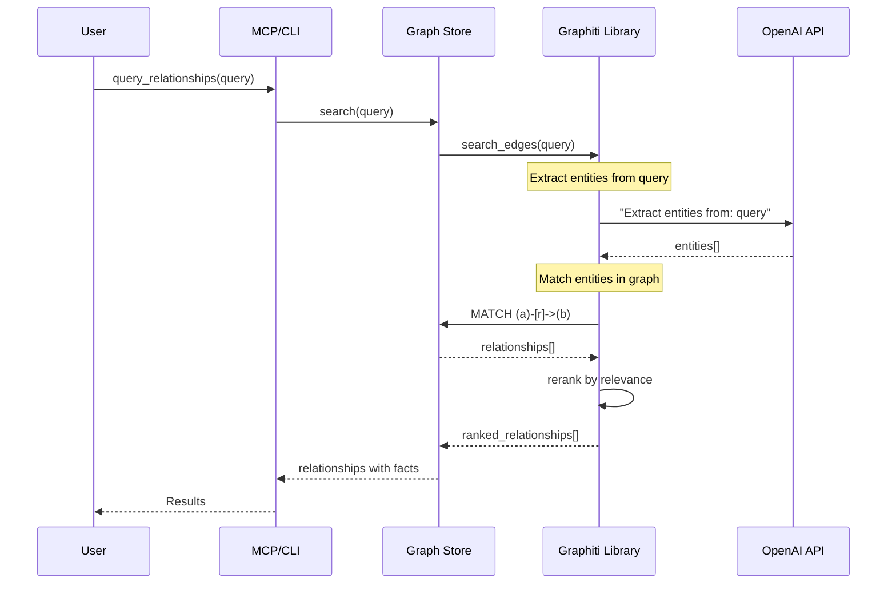

# RAG Memory Architecture

**Last Updated:** January 2026
**Status:** Current and accurate

---

## Table of Contents

- [System Overview](#system-overview)
- [High-Level Architecture](#high-level-architecture)
- [Dual Storage Architecture](#dual-storage-architecture)
- [Module Organization](#module-organization)
- [Configuration System](#configuration-system)
- [Data Flow](#data-flow)
- [Component Details](#component-details)

---

## System Overview

RAG Memory is a production-ready knowledge management system that combines **semantic search** (vector embeddings) with **knowledge graphs** (entity relationships) to provide comprehensive retrieval capabilities for AI agents and developers.

**Key Characteristics:**
- **Dual Storage:** PostgreSQL+pgvector for semantic search + Neo4j+Graphiti for knowledge graphs
- **Unified Ingestion:** Single entry point ensures both stores stay synchronized
- **Multiple Interfaces:** MCP server for AI agents, CLI for developers/automation
- **Deployment:** Health checks, migrations, Docker support, cloud-ready

---

## High-Level Architecture



**Layer Responsibilities:**

1. **Client Layer** - Users and AI agents interact with the system
2. **Interface Layer** - MCP server and CLI provide programmatic/command-line access
3. **Processing Layer** - Business logic for ingestion, crawling, embeddings
4. **Storage Layer** - Persistent data in PostgreSQL (vectors) and Neo4j (graphs)
5. **Configuration** - 3-tier priority system for flexible deployment

---

## Dual Storage Architecture

RAG Memory uses **two complementary storage systems** to provide both semantic search and relationship queries.



### Why Dual Storage?

**PostgreSQL + pgvector (RAG Store):**
- **Purpose:** Semantic similarity search over document content
- **Strength:** Find relevant passages by meaning, not just keywords
- **Use Case:** "What does the documentation say about authentication?"
- **Technology:** HNSW index for fast approximate nearest neighbor search

**Neo4j + Graphiti (Graph Store):**
- **Purpose:** Discover relationships between concepts and track evolution
- **Strength:** Connect entities, understand how knowledge changes over time
- **Use Case:** "How does authentication relate to user management?" or "How has the API evolved?"
- **Technology:** Graphiti library for LLM-powered entity extraction

**Together:** Users get both relevant content (RAG) and contextual relationships (Graph).

---

## Module Organization

```
mcp-server/
└── src/
    ├── core/                       # Core infrastructure
    │   ├── database.py            # PostgreSQL connection + health checks
    │   ├── embeddings.py          # OpenAI embedding generation
    │   ├── collections.py         # Collection management
    │   ├── chunking.py            # Hierarchical document splitting
    │   ├── config_loader.py       # 3-tier configuration system
    │   └── first_run.py           # Interactive setup wizard
    │
    ├── ingestion/                 # Content ingestion
    │   ├── document_store.py      # RAG store write operations
    │   ├── web_crawler.py         # Crawl4AI-based web scraping
    │   ├── website_analyzer.py    # Sitemap + URL pattern discovery
    │   └── metadata_validator.py  # Schema validation for metadata
    │
    ├── retrieval/                 # Content retrieval
    │   └── search.py              # Vector similarity search
    │
    ├── unified/                   # Unified ingestion orchestration
    │   ├── mediator.py            # Orchestrates RAG + Graph writes
    │   └── graph_store.py         # Neo4j + Graphiti integration
    │
    ├── mcp/                       # MCP server
    │   ├── server.py              # FastMCP server entry point
    │   ├── tools.py               # 20 MCP tool implementations
    │   └── deduplication.py       # Prevents concurrent duplicate operations
    │
    ├── cli_commands/              # CLI command groups
    │   ├── service.py             # start/stop/status/logs
    │   ├── collection.py          # create/list/info/delete
    │   ├── ingest.py              # text/file/directory/url
    │   ├── document.py            # list/view/update/delete
    │   ├── search.py              # semantic search
    │   ├── graph.py               # relationship + temporal queries
    │   ├── analyze.py             # website structure analysis
    │   └── config.py              # show/edit configuration
    │
    └── cli.py                     # CLI entry point (Click framework)
```

**Design Patterns:**

- **Thin Orchestrator:** `cli.py` and `server.py` are lightweight entry points that delegate to modules
- **Dependency Injection:** Components passed as constructor args, not global singletons
- **Single Responsibility:** Each module has one clear purpose
- **DRY:** Shared logic (validation, deletion) centralized in helper functions

---

## Configuration System

RAG Memory uses a **3-tier priority system** for configuration, enabling flexible deployment across local development, Docker, and cloud environments.



### Priority Order (Highest to Lowest)

1. **Environment Variables** (highest priority)
   - Set in shell: `export DATABASE_URL="postgresql://..."`
   - Docker: Set in `docker-compose.yml` or Dockerfile
   - Cloud: Set in Render secrets, Railway env vars, etc.
   - **Use Case:** Production deployments, CI/CD, Docker

2. **Project .env File** (development)
   - Location: `./deploy/docker/compose/.env` (in repo root)
   - Checked in current working directory only
   - **Use Case:** Local development with Docker

3. **System Config** (lowest priority)
   - Location: OS-standard paths via `platformdirs`
     - macOS: `~/Library/Application Support/rag-memory/config.yaml`
     - Linux: `~/.config/rag-memory/config.yaml`
     - Windows: `%LOCALAPPDATA%\rag-memory\config.yaml`
   - Created by setup wizard on first run
   - **Use Case:** CLI tool usage, end-user installations

**Key Module:** `mcp-server/src/core/config_loader.py`

---

## Data Flow

### Ingestion Flow (Unified)



**Important Notes:**
- Ingestion is **sequential** (RAG first, then Graph), not atomic
- If Graph extraction fails, RAG data remains (potential inconsistency)
- Future enhancement: Two-phase commit for true atomicity

### Search Flow (Vector)



### Graph Query Flow (Relationships)



**Note:** Graph queries use LLM for entity matching

---

## Component Details

### Unified Ingestion Mediator

**Module:** `mcp-server/src/unified/mediator.py`

**Purpose:** Single entry point for all content ingestion that ensures both RAG and Graph stores are updated.

**Key Methods:**
- `ingest_text()` - Ingest text content
- `ingest_file()` - Ingest file from filesystem
- `ingest_directory()` - Batch ingest multiple files
- `ingest_url()` - Crawl and ingest web pages

**Current Implementation:** Sequential writes (Phase 1)
1. Write to RAG store (chunks + embeddings)
2. Extract entities to Graph store

**Future Enhancement:** Two-phase commit for atomicity

---

### RAG Store (PostgreSQL + pgvector)

**Module:** `mcp-server/src/ingestion/document_store.py`, `mcp-server/src/retrieval/search.py`

**Database Schema:**

```sql
-- Collections: Organize documents by domain/topic
CREATE TABLE collections (
    id SERIAL PRIMARY KEY,
    name VARCHAR(255) UNIQUE NOT NULL,
    description TEXT NOT NULL CHECK (length(trim(description)) > 0),
    metadata_schema JSON NOT NULL DEFAULT '{"custom": {}, "system": []}',
    created_at TIMESTAMP DEFAULT NOW()
);

-- Source Documents: Full documents before chunking
CREATE TABLE source_documents (
    id SERIAL PRIMARY KEY,
    filename VARCHAR(500) NOT NULL,
    content TEXT NOT NULL,
    file_type VARCHAR(50),
    file_size INTEGER,
    metadata JSON DEFAULT '{}',
    created_at TIMESTAMP DEFAULT NOW(),
    updated_at TIMESTAMP DEFAULT NOW()
);

-- Document Chunks: Searchable chunks with embeddings
CREATE TABLE document_chunks (
    id SERIAL PRIMARY KEY,
    source_document_id INTEGER REFERENCES source_documents(id) ON DELETE CASCADE,
    chunk_index INTEGER NOT NULL,
    content TEXT NOT NULL,
    char_start INTEGER,
    char_end INTEGER,
    metadata JSON DEFAULT '{}',
    embedding VECTOR(1536),  -- pgvector type, OpenAI embedding dimension
    created_at TIMESTAMP DEFAULT NOW(),
    UNIQUE(source_document_id, chunk_index)
);

-- Chunk Collections: Many-to-many junction table
CREATE TABLE chunk_collections (
    chunk_id INTEGER REFERENCES document_chunks(id) ON DELETE CASCADE,
    collection_id INTEGER REFERENCES collections(id) ON DELETE CASCADE,
    PRIMARY KEY (chunk_id, collection_id)
);

-- HNSW Index for fast approximate nearest neighbor search
CREATE INDEX document_chunks_embedding_idx ON document_chunks
USING hnsw (embedding vector_cosine_ops)
WITH (m = 16, ef_construction = 64);
```

**Vector Search:** Cosine similarity with HNSW index for fast approximate nearest neighbor search

---

### Graph Store (Neo4j + Graphiti)

**Module:** `mcp-server/src/unified/graph_store.py`

**Technology:** Graphiti library (graphiti-core) for LLM-powered entity extraction

**Data Model:**
- **Entity Nodes:** Concepts, people, places, things extracted from content
- **Relationship Edges:** Facts connecting entities (e.g., "API USES authentication")
- **Temporal Facts:** Each fact has `valid_from` and `valid_until` timestamps

**Query Types:**
1. **Relationship Queries:** `query_relationships()` - "How does X relate to Y?"
2. **Temporal Queries:** `query_temporal()` - "How has X changed over time?"

**Collection Scoping:** Each collection has an isolated graph (no cross-collection relationships)

---

### MCP Server

**Module:** `mcp-server/src/mcp/server.py`, `mcp-server/src/mcp/tools.py`

**Framework:** FastMCP (Python MCP library)

**Lifecycle:**
1. **Startup:** Lifespan manager initializes all components
2. **Health Checks:** Validates PostgreSQL and Neo4j schemas
3. **Fail-Fast:** Server won't start if databases unavailable
4. **Tool Execution:** Routes requests to implementation functions

**20 MCP Tools Exposed:**
- 6 Collection tools (create, list, info, schema, update, delete, manage_link)
- 7 Document tools (ingest text/file/dir/url, list, update, delete)
- 2 Search tools (semantic search, get document by ID)
- 2 Graph tools (query relationships, query temporal)
- 3 Analysis tools (website analyzer, list_directory)

**Design Pattern:** Tools are lightweight wrappers that call `*_impl()` functions

---

### CLI Tool

**Module:** `mcp-server/src/cli.py`, `mcp-server/src/cli_commands/*`

**Framework:** Click (Python CLI library)

**10 Command Groups:**
1. `rag instance` - Multi-instance management (start/stop/delete/list/status/logs)
2. `rag service` - Docker management (start/stop/status/logs) - shortcuts for default instance
3. `rag collection` - Collection management
4. `rag ingest` - Content ingestion
5. `rag document` - Document management
6. `rag search` - Semantic search
7. `rag graph` - Graph queries
8. `rag analyze` - Website analysis
9. `rag config` - Configuration management
10. `rag logs` - Service logs

**Design Pattern:** Thin orchestrator - `cli.py` registers command groups, actual logic in `cli_commands/`

---

### Web Crawler

**Module:** `mcp-server/src/ingestion/web_crawler.py`

**Technology:** Crawl4AI library with Playwright backend

**Features:**
- Link following (configurable depth, max pages)
- Content filtering (removes nav, footer, etc.)
- Metadata tracking (crawl session, URL, timestamp)
- Duplicate prevention (via `mcp-server/src/mcp/deduplication.py`)

**Modes:**
- `mode="ingest"` - New crawl, errors if URL already exists
- `mode="reingest"` - Update existing, deletes old pages first

---

### Website Analyzer

**Module:** `mcp-server/src/ingestion/website_analyzer.py`

**Purpose:** Discover URL patterns before multi-page ingests

**Strategy:**
1. Check for sitemap.xml (both provided URL and root domain)
2. Fall back to Common Crawl index if no sitemap
3. Return up to 150 URLs grouped by path patterns

**Timeout:** Hard 50-second limit (large sites may timeout → analyze subsections instead)

---

## Related Documentation

- **[FLOWS.md](./FLOWS.md)** - Detailed sequence diagrams for key operations
- **[DATABASE_MIGRATION_GUIDE.md](./DATABASE_MIGRATION_GUIDE.md)** - Schema migration process
- **[ENVIRONMENT_VARIABLES.md](./ENVIRONMENT_VARIABLES.md)** - Configuration reference

For user-facing documentation (installation, MCP setup, usage), see **[`.reference/`](../.reference/README.md)**
