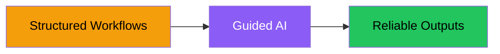
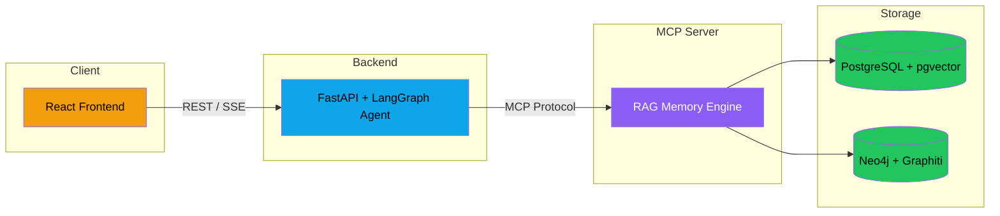

# RAG Memory Architecture

## Structured Workflows for AI

> **Goal:** Apply structured workflows to guide AI behavior

| Principle | What It Means |
|-----------|---------------|
| **Reliability** | AI produces correct results, not hallucinations |
| **Consistency** | Same input yields same quality output every time |
| **Repeatability** | Workflows can be reproduced across teams and projects |
| **Productivity** | Engineers ship faster with AI as a force multiplier |

---

## System Architecture

## Layer Overview

| Layer | Technology | Purpose |
|-------|------------|---------|
| **Frontend** | React + Mantine | Chat UI, document browser, search interface |
| **Backend** | FastAPI + LangGraph | REST API, AI agent with 20 tools, SSE streaming |
| **MCP Server** | Python MCP SDK | Ingestion, semantic search, knowledge graph queries |
| **Storage** | PostgreSQL + Neo4j | Vectors & documents (PG) / Knowledge graph (Neo4j) |

## Data Flow

1. **User interacts** with React frontend
2. **Backend routes** requests - either direct proxy or through AI agent
3. **MCP Server** handles all RAG operations via standardized tools
4. **Dual storage** - vectors in PostgreSQL, relationships in Neo4j
