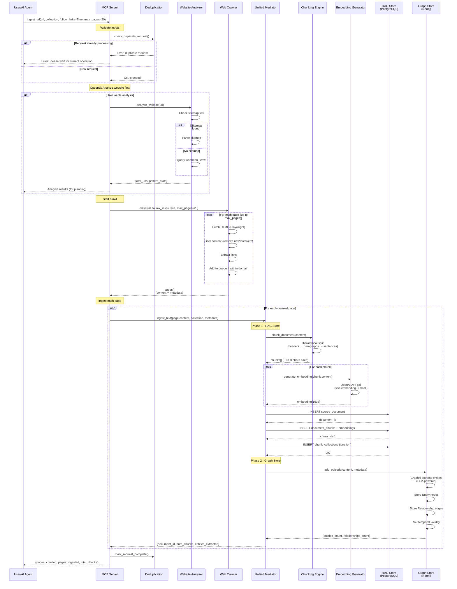
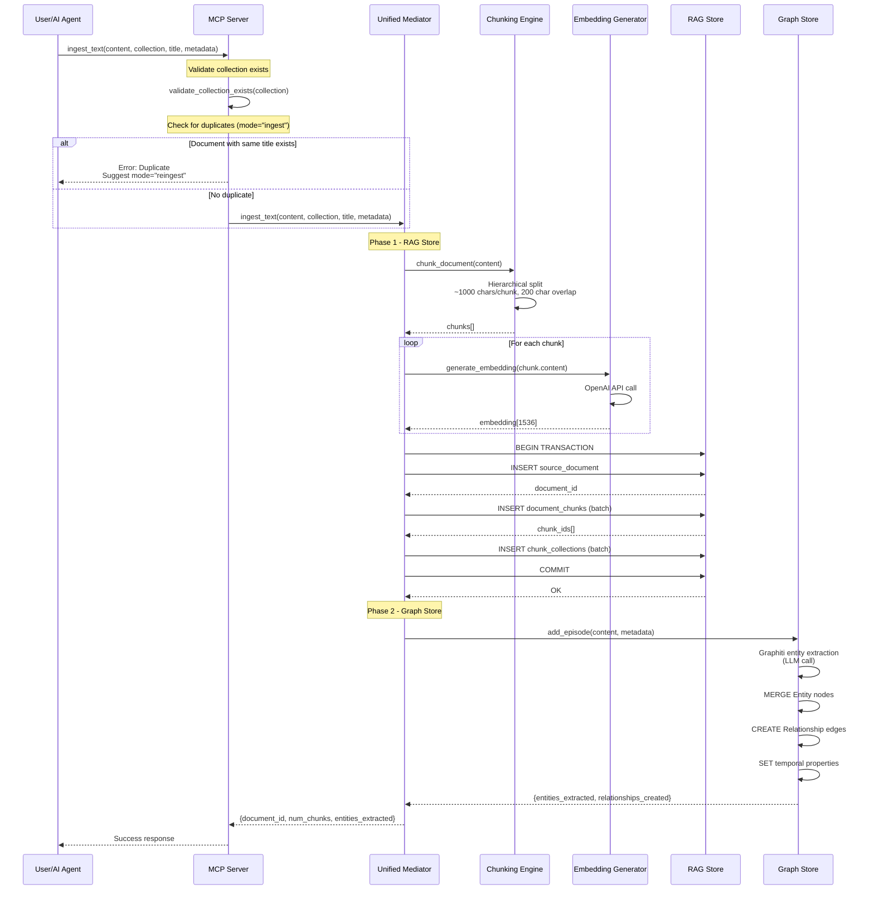
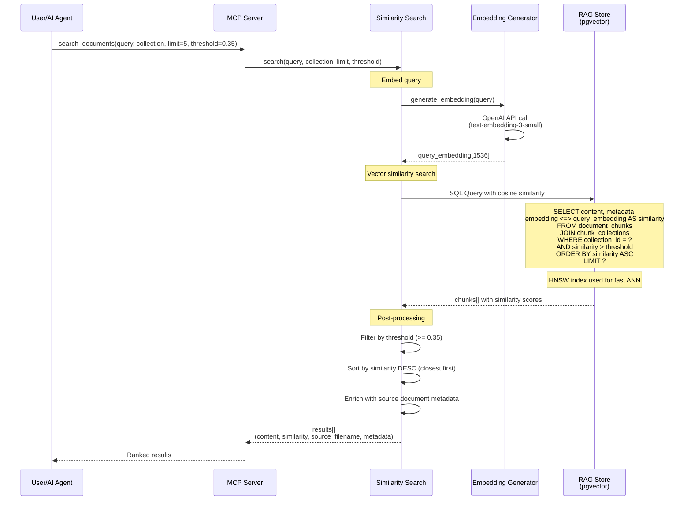
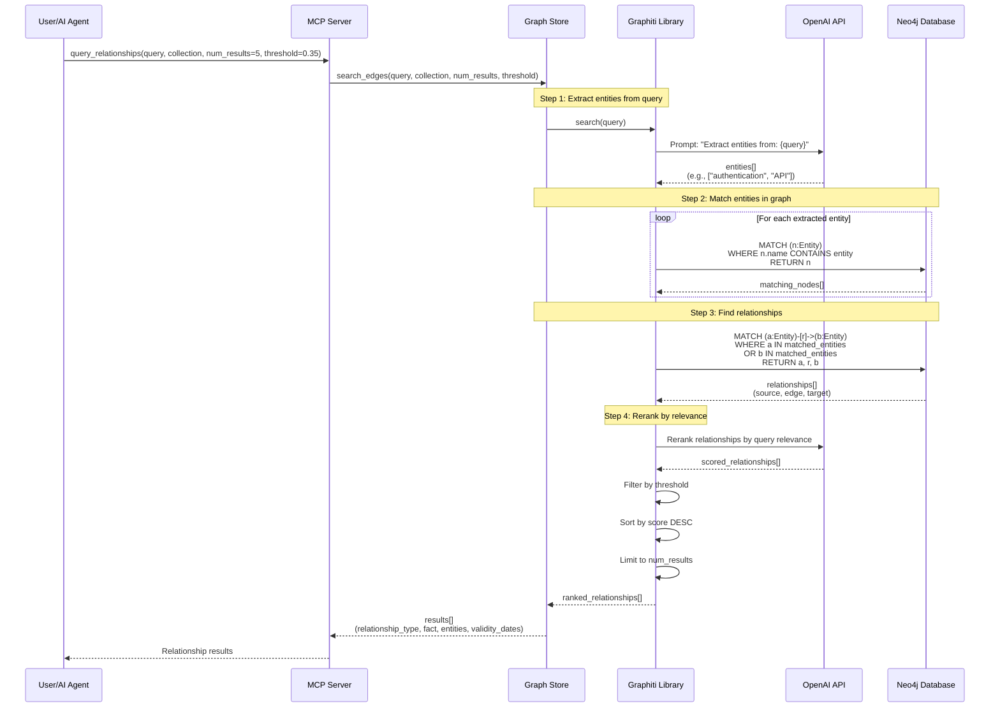
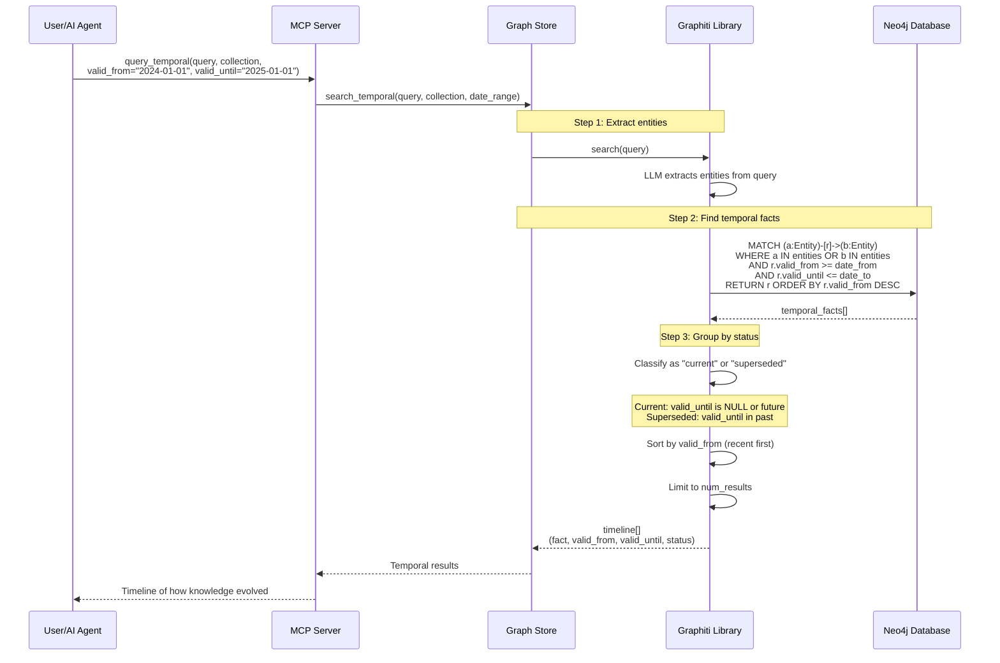
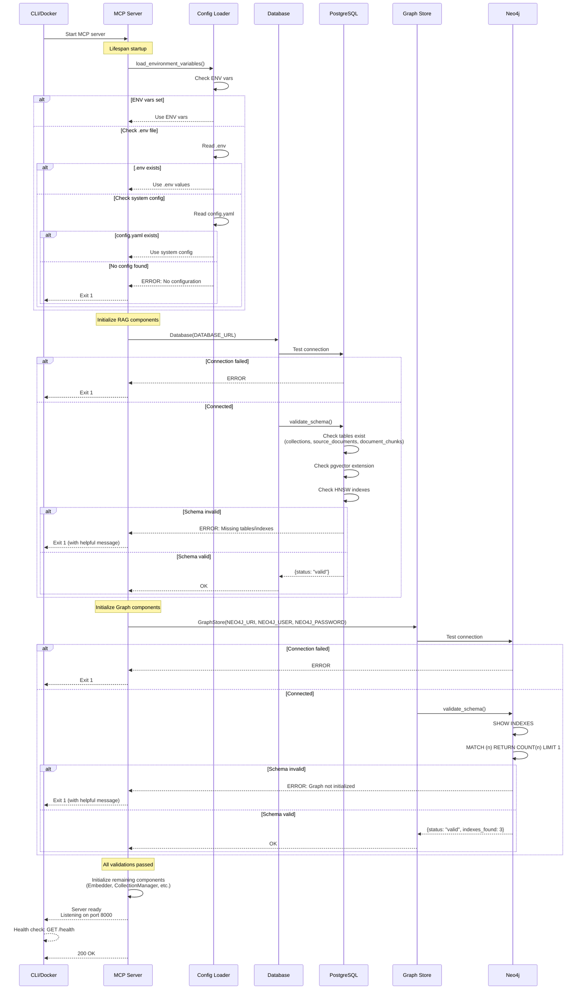
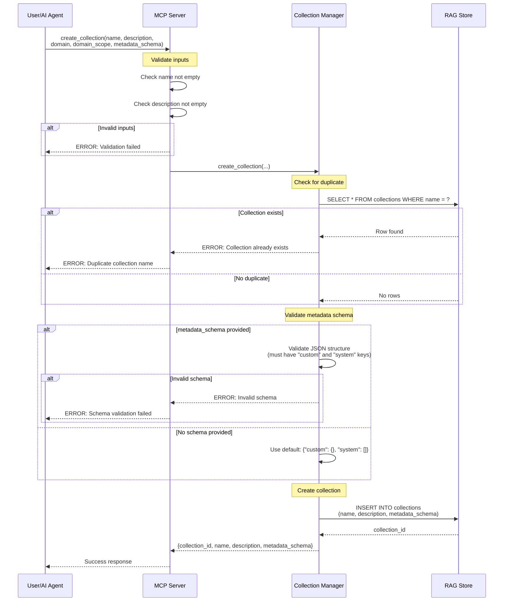

# RAG Memory Operational Flows

**Last Updated:** November 9, 2025
**Status:** Current and accurate

---

## Table of Contents

- [Ingest URL Flow](#ingest-url-flow)
- [Ingest Text Flow](#ingest-text-flow)
- [Search Documents Flow](#search-documents-flow)
- [Query Relationships Flow](#query-relationships-flow)
- [Query Temporal Flow](#query-temporal-flow)
- [Startup Validation Flow](#startup-validation-flow)
- [Collection Creation Flow](#collection-creation-flow)

---

## Ingest URL Flow

Complete flow for ingesting web pages with link following, content filtering, and dual-store ingestion.

**Key Points:**

1. **Deduplication:** Prevents concurrent identical requests
2. **Web Crawling:** Playwright-based, respects max_pages limit
3. **Content Filtering:** Removes navigation noise before ingestion
4. **Sequential Dual Storage:** RAG first, then Graph (not atomic yet)
5. **Progress Tracking:** MCP can send progress notifications during long crawls

**Note:**
- Processing time varies by content size and complexity
- Multi-page ingests can take extended time depending on page count and content

---

## Ingest Text Flow

Simplified flow for ingesting text content directly (no web crawling).

**Important Notes:**

- **Not Atomic:** RAG and Graph writes are sequential, not in a distributed transaction
- **Failure Scenario:** If Graph extraction fails, RAG data persists (potential inconsistency)
- **Future Enhancement:** Two-phase commit for true atomicity

---

## Search Documents Flow

Vector similarity search over document chunks.

**Note:**
- HNSW index provides fast approximate nearest neighbor search
- Results ranked by cosine similarity (higher scores indicate better matches)
- Default threshold: 0.35 (configurable by user)

---

## Query Relationships Flow

Knowledge graph query with LLM-powered entity matching.

**Note:** Graph queries include LLM calls for entity matching and reranking

**Key Features:**
- **LLM-Powered Matching:** Handles synonyms and variations (e.g., "auth" matches "authentication")
- **Collection Scoping:** Only searches within specified collection's graph
- **Relevance Scoring:** Reranks results by semantic relevance to query

---

## Query Temporal Flow

Track how knowledge evolves over time.

**Use Cases:**
- "How has the authentication system evolved since 2024?"
- "What changed in the API between January and March?"
- "Show me the history of the deployment process"

**Temporal Fields:**
- `valid_from`: When this fact became true
- `valid_until`: When this fact was superseded (NULL = still current)
- `status`: "current" or "superseded"

---

## Startup Validation Flow

MCP server startup with fail-fast health checks.

**Fail-Fast Design:**
- Server won't start if PostgreSQL OR Neo4j unavailable
- Startup validations are lightweight
- Clear error messages guide users to fix configuration issues

**Health Check Endpoint:** `/health` returns 200 OK when all systems operational

---

## Collection Creation Flow

Create a new collection with metadata schema validation.

**Important Constraints:**
- `description` is REQUIRED (NOT NULL constraint in database)
- `name` must be unique
- `metadata_schema` is optional but must be valid JSON if provided

---

## Related Documentation

- **[ARCHITECTURE.md](./ARCHITECTURE.md)** - System components and data models
- **[DATABASE_MIGRATION_GUIDE.md](./DATABASE_MIGRATION_GUIDE.md)** - Schema migration process

For user-facing documentation (installation, MCP setup, usage), see **[`.reference/`](../.reference/README.md)**
