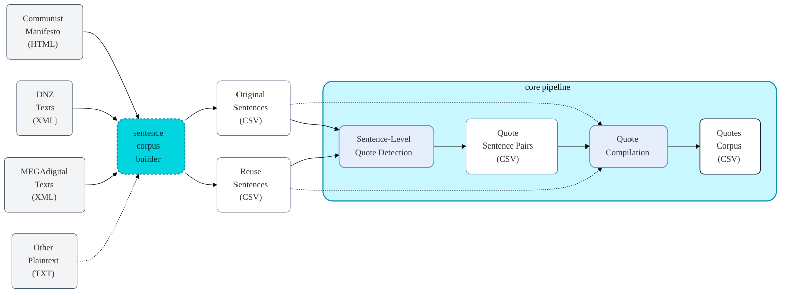

# System Architecture Diagram

```mermaid

%%{init: {
  "theme": "base",
  "themeVariables": { "fontFamily": "Inter, ui-sans-serif, system-ui" },
  "flowchart": { "curve": "basis", "nodeSpacing": 40, "rankSpacing": 60 }
}}%%
flowchart LR
  classDef source  fill:#f3f4f6,stroke:#475569,stroke-width:1px,rx:6,ry:6;
  classDef builder fill:#00d5e0,stroke:#0891b2,stroke-width:2px,stroke-dasharray:4 3,rx:14,ry:14,color:#00323a;
  classDef process fill:#e6eefc,stroke:#6b8bd6,stroke-width:1.5px,rx:12,ry:12;
  classDef corpus  fill:#ffffff,stroke:#64748b,stroke-width:1px,rx:8,ry:8;
  classDef output  fill:#ffffff,stroke:#111827,stroke-width:1.5px,rx:8,ry:8;
  classDef invis   fill:transparent,stroke:transparent;


  B["Communist<br/>Manifesto<br/>(HTML)"]:::source --> E
  C["DNZ<br/>Texts<br/>(XML)"]:::source --> E
  A["MEGAdigital<br/>Texts<br/>(XML)"]:::source --> E
  D["Other<br/>Plaintext<br/>(TXT)"]:::source -.-> E

  E["sentence<br/>corpus<br/>builder"]:::builder
  E --> F["Original<br/>Sentences<br/>(CSV)"]:::corpus
  E --> G["Reuse<br/>Sentences<br/>(CSV)"]:::corpus

  F -.-> K

  subgraph CP["core pipeline"]
    direction LR
    I["Sentence-Level<br/>Quote Detection"]:::process
    J["Quote<br/>Sentence Pairs<br/>(CSV)"]:::corpus
    K["Quote<br/>Compilation"]:::process
    L["Quotes<br/>Corpus<br/>(CSV)"]:::output
    I --> J --> K --> L
  end
  style CP fill:#c8f7ff,stroke:#0891b2,stroke-width:2px,rx:18,ry:18;

  F --> I
  G --> I

  G -.-> K

```
