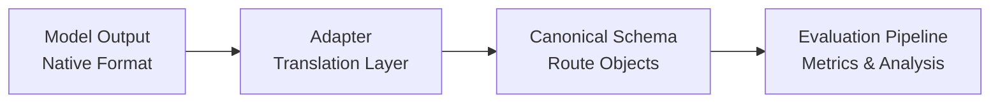
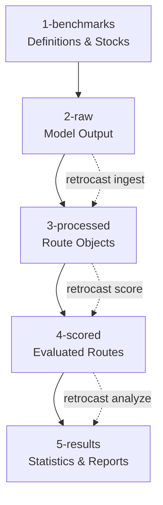

# Concepts and Architecture

RetroCast provides a standardized framework for evaluating retrosynthesis models. It addresses the fragmentation of output formats in the field by *decoupling* the model's internal representation from the evaluation logic.

!!! abstract "Core idea"

    **Adapters** translate diverse model outputs into a canonical schema, enabling apples-to-apples comparison across any retrosynthesis algorithm. We decouple the model's internal representation from the evaluation logic.

## The Core Philosophy: Adapters as an Air Gap

Retrosynthesis models produce diverse output formats. Some output bipartite graphs (AiZynthFinder), others output precursor maps (Retro\*), and some output recursive dictionaries (DirectMultiStep). Comparing these directly requires writing bespoke evaluation code for every model, which leads to bugs and inconsistent metrics.

RetroCast introduces an **adapter layer** between the model and the evaluation pipeline:



**The flow:**

1. **The Model** runs independently and saves output in its native format
2. **The Adapter** reads this format and transforms it into the canonical RetroCast schema
3. **The Pipeline** performs scoring and analysis on canonical objects, unaware of the original format

!!! success "Why this matters"

    This architecture ensures that metrics like stock-termination rate and route length are calculated identically for every model.

## The Canonical Data Model

RetroCast defines a strict, recursive object model in `retrocast.models.chem`. Structurally, this model is a **directed acyclic bipartite graph** consisting of alternating molecule nodes and reaction nodes.

### A Resolved AND/OR Tree

Many retrosynthesis frameworks (e.g., Syntheseus, AiZynthFinder) utilize an *AND/OR graph* to represent the entire search space. In these graphs, a Molecule node (OR) may have multiple child Reaction nodes (AND), representing competing choices.

The RetroCast `Route` object represents a *resolved instance* of this graph: a single, specific pathway, with a Molecule node having at most one child Reaction node.

### Schema Definition

The schema enforces the minimal information required for rigorous evaluation while allowing for extensibility via metadata dictionaries.


=== "Route"

    ```python title="retrocast.models.chem.Route"
    class Route(BaseModel):
        """The root container for a single prediction."""
        target: Molecule
        rank: int  # (1)!

        # Provenance
        metadata: dict[str, Any]
        retrocast_version: str

        # Computed Properties
        @property
        def length(self) -> int: ...  # (2)!
        @property
        def leaves(self) -> set[Molecule]: ...  # (3)!
        @property
        def signature(self) -> str: ...  # (4)!
    ```

    1. Model's preference order (populated by adapter)
    2. Longest path from target to any leaf
    3. All starting materials in the route
    4. Cryptographic hash for deduplication


=== "Molecule"

    ```python title="retrocast.models.chem.Molecule"
    class Molecule(BaseModel):
        """Represents a chemical node (OR node)."""
        # Core Identity
        smiles: SmilesStr
        inchikey: InchiKeyStr  # (1)!

        # Tree Structure: 0 or 1 reaction step
        synthesis_step: ReactionStep | None  # (2)!

        # Extensibility
        metadata: dict[str, Any]

        # Computed Properties
        @property
        def is_leaf(self) -> bool: ...
    ```

    1. Primary ID for hashing/equality
    2. `None` for leaf molecules (starting materials)


=== "ReactionStep"

    ```python title="retrocast.models.chem.ReactionStep"
    class ReactionStep(BaseModel):
        """Represents a reaction node (AND node)."""
        # Tree Structure: N reactant children
        reactants: list[Molecule]  # (1)!

        # Chemical Details (Optional)
        mapped_smiles: str | None
        template: str | None
        reagents: list[str] | None
        solvents: list[str] | None

        # Extensibility
        metadata: dict[str, Any]

        # Computed Properties
        @property
        def is_convergent(self) -> bool: ...  # (2)!
    ```

    1. Must have ≥1 reactant molecules
    2. Returns `True` if ≥2 reactants are non-leaves


### Rationale: Why Bipartite?

We deem the bipartite structure, explicitly separating `Molecule` and `ReactionStep`, natural for representing multistep routes and it allows precise attribution of data:

- **Molecule properties** (e.g., "is purchasable", molecular weight) belong to the `Molecule` node
- **Reaction properties** (e.g., template scores, probability, patent IDs) belong to the `ReactionStep` node

### Interchange Format

!!! info "You don't need to change your model"

    Model developers are **not required** to use this schema internally. RetroCast treats it as an interchange format: the adapter casts your native output into this structure. Extra data (attention weights, search trees, etc.) can be preserved in `metadata` dictionaries if you need them for downstream analysis.

## Data Organization and Lifecycle

RetroCast enforces a structured directory layout to manage the transformation of data from raw predictions to final statistics. This structure ensures ==reproducibility and traceability==.



All paths below are relative to your **data directory**, which defaults to `data/retrocast/` but can be customized via:

- CLI flag: `retrocast --data-dir /custom/path`
- Environment variable: `RETROCAST_DATA_DIR=/custom/path`
- Config file: `data_dir: /custom/path`

Run `retrocast config` to see your resolved paths.

### 1. Benchmarks (`1-benchmarks/`)

**Immutable** evaluation task definitions.

- `definitions/`: Gzipped JSON files defining targets (IDs and SMILES)
- `stocks/`: Text files with available building blocks (one SMILES per line)

### 2. Raw Data (`2-raw/`)

**Read-only** artifacts generated by models.

- Structure: `2-raw/<model>/<benchmark>/<filename>`

### 3. Processed Data (`3-processed/`)

Generated by: `retrocast ingest`

- **Format:** Dictionary mapping `target_id` → list of `Route` objects
- **Operations:** Deduplication, optional sampling (keep first *n* routes)

### 4. Scored Data (`4-scored/`)

Generated by: `retrocast score`

- **Metrics:** Routes annotated with boolean flags (e.g., `is_solved`) and ground truth comparisons
- **Independence:** Same routes can be scored against multiple stocks without re-processing

### 5. Results (`5-results/`)

Generated by: `retrocast analyze`

- **Statistics:** Bootstrap confidence intervals for metrics like Top-K accuracy
- **Artifacts:** JSON statistics, Markdown reports, HTML visualizations

## Provenance and Verification

Reproducibility is a primary design goal. RetroCast tracks the lineage of every data artifact using **Manifests**.

!!! info "Cryptographic audit trail"

    Every generated file (e.g., `routes.json.gz`) has a companion manifest (`routes.manifest.json`) containing SHA256 hashes of inputs and outputs.

A manifest records:

1. **Action:** The command or script that generated the file
2. **Inputs:** Paths and SHA256 hashes of all source files
3. **Parameters:** Configuration arguments (stock name, random seed, etc.)
4. **Outputs:** Paths and hashes of generated files

### Verification

The `retrocast verify` command audits the data pipeline with a two-phase check:

!!! example "Verification phases"

    **Phase 1: Logical Consistency**  
    Ensures the input hash in a child manifest matches the output hash of the parent manifest
    
    **Phase 2: Physical Integrity**  
    Ensures the file on disk matches the hash recorded in its manifest

This system detects:

- :warning: Data corruption
- :warning: Manual tampering  
- :warning: Out-of-order execution steps
