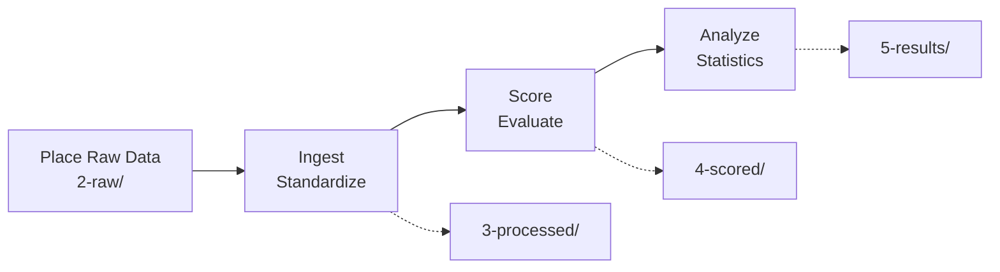

# Quick Start

This guide gets you from raw model output to a rigorous statistical report in under 5 minutes.

!!! tip "What you'll learn"

    - Install RetroCast and initialize a project
    - Configure an adapter for your model's output format  
    - Run the `ingest` → `score` → `analyze` pipeline
    - Generate statistical reports with confidence intervals

## 1. Install

=== "uv (recommended)"

    We recommend installing RetroCast as a standalone tool using `uv`:

    ```bash
    uv tool install retrocast
    ```

    If you don't have `uv`, you can install it in one minute:

    ```bash
    curl -LsSf https://astral.sh/uv/install.sh | sh
    ```

=== "pip"

    ```bash
    pip install retrocast
    ```

Verify installation:

```bash
retrocast --version
```

## 2. Initialize Project

Go to your working directory and create the default configuration and directory structure:

```bash
retrocast init
```

This creates:

- `retrocast-config.yaml` - Configuration file
- `data/retrocast/` - Structured data directories (1-benchmarks, 2-raw, 3-processed, 4-scored, 5-results)

!!! tip "Custom data directory"

    You can customize the data directory location via:
    
    - CLI flag: `retrocast --data-dir ./my-data <command>`
    - Environment variable: `export RETROCAST_DATA_DIR=./my-data`
    - Config file: Add `data_dir: ./my-data` to `retrocast-config.yaml`
    
    Run `retrocast config` to see the resolved paths.

### Configure Your Model

Open `retrocast-config.yaml` and register your model. You need to tell RetroCast which **adapter** to use to parse your files.

```yaml title="retrocast-config.yaml" hl_lines="3 5 7"
models:
  # The name you will use in CLI commands
  my-new-model: # (1)!
    # The parser logic (see docs/developers/adapters.md)
    adapter: aizynth # (2)!
    # The filename RetroCast looks for in 2-raw/
    raw_results_filename: predictions.json # (3)!
    sampling: # (4)!
      strategy: top-k
      k: 10
```

1. Choose a descriptive name (lowercase with hyphens)
2. See [supported adapters](concepts.md#the-core-philosophy-adapters-as-an-air-gap) - includes AiZynthFinder, Retro\*, DMS, SynPlanner, Syntheseus, ASKCOS, and more
3. Must match the filename you'll place in `2-raw/` within your data directory
4. Optional: Limit routes per target (omit to keep all routes)

## 3. The Workflow (Ingest → Score → Analyze)

RetroCast enforces a structured workflow to ensure reproducibility:



All paths are relative to your data directory (default: `data/retrocast/`).

### Step A: Place Raw Data

Put your model's raw output file in the `2-raw/` directory (within your data directory) following this structure:

```
<data-dir>/2-raw/<model-name>/<benchmark-name>/<filename>
```

**Example:**

```bash
mkdir -p data/retrocast/2-raw/my-new-model/mkt-cnv-160
cp predictions.json data/retrocast/2-raw/my-new-model/mkt-cnv-160/
```

!!! info "Available benchmarks"

    See [Benchmarks Guide](guides/benchmarks.md) for details on evaluation sets:
    
    - **Market Series** (`mkt-*`): Practical utility with commercial stock
    - **Reference Series** (`ref-*`): Algorithm comparison with ground-truth stock

### Step B: Ingest

Convert raw output into the canonical RetroCast `Route` format. This standardizes data and removes duplicates.

```bash
retrocast ingest --model my-new-model --dataset mkt-cnv-160
```

**Output:** `data/retrocast/3-processed/my-new-model/mkt-cnv-160/routes.json.gz`

### Step C: Score

Evaluate routes against the benchmark's defined stock.

```bash
retrocast score --model my-new-model --dataset mkt-cnv-160
```

**Output:** `data/retrocast/4-scored/my-new-model/mkt-cnv-160/scores.json.gz`

### Step D: Analyze

Generate final report with bootstrapped confidence intervals and visualization plots.

```bash
retrocast analyze --model my-new-model --dataset mkt-cnv-160
```

**Output:** `data/retrocast/5-results/mkt-cnv-160/my-new-model/`

- `report.md` - Statistical summary
- `*.html` - Interactive plots (add `--make-plots` arg and make sure to install `viz` dep group, i.e. `uv tool install "retrocast[viz]"`)

!!! success "You're done!"

    Check `data/retrocast/5-results/mkt-cnv-160/my-new-model/report.md` for your results!

## Alternative: Quick Evaluation

!!! tip "Just want to score one file?"

    If you don't want to set up a full project structure, use the `score-file` command:

    ```bash
    retrocast score-file \
      --benchmark data/retrocast/1-benchmarks/definitions/mkt-cnv-160.json.gz \
      --routes my_predictions.json.gz \
      --stock data/retrocast/1-benchmarks/stocks/buyables-stock.txt \
      --output scores.json.gz \
      --model-name "Quick-Check"
    ```

    This skips the config setup and directly evaluates a single predictions file.

## Next Steps

**Learn the Concepts**  
Read [Concepts](concepts.md) to understand why we use adapters and manifests.

**Use the Python API**  
Want to use RetroCast inside your own scripts? See the [Library Guide](guides/library.md).

**Write Custom Adapters**  
Need to support a new output format? Learn how to write an [Adapter](developers/adapters.md).

**Full CLI Reference**  
See all available commands in the [CLI Reference](guides/cli.md).

**Explore Benchmarks**  
Learn about stratified evaluation sets in the [Benchmarks Guide](guides/benchmarks.md).
