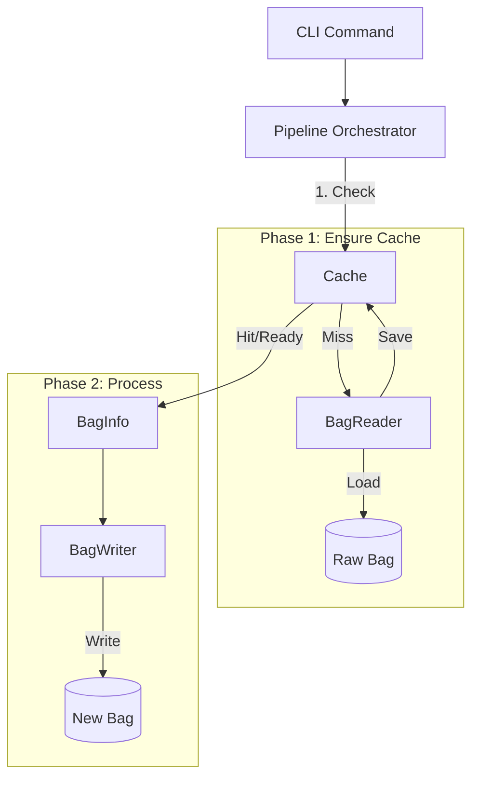

# Rose System Architecture

## 1. Core Philosophy: Cache-First
Rose follows a strict **"Load → Cache → Process"** philosophy to ensure high performance and consistency.

- **Single Source of Truth**: All operations (`inspect`, `extract`, `compress`) operate on the **Cached Metadata** (`BagInfo`), not directly on raw files.
- **Decoupled Loading**: Loading (Parsing) is a distinct prerequisite step. Processing logic never implicitly loads a bag; it requests data from the cache.

## 2. Key Components

### A. BagReader (`core/parser.py`)
*   **Role**: The "Loader". Responsible for reading raw bag files and populating the cache.
*   **Input**: `path: str`, `level: AnalysisLevel`
*   **Output**: `BagInfo` (Populated into Cache)
*   **Key Method**: 
    ```python
    async def load_bag_async(self, path: str, level: AnalysisLevel) -> BagInfo
    ```

### B. BagWriter (`core/writer.py`)
*   **Role**: The "Processor". Responsible for checking cached metadata and writing new outputs (Extraction, Compression).
*   **Input**: `source_info: BagInfo`, `output_path: str`, `options: WriterOption`
*   **Output**: New Bag File
*   **Key Method**:
    ```python
    def write(self, source_info, output_bag, options) -> Tuple[str, float]
    ```

### C. Cache (`core/cache.py`)
*   **Role**: Manages persistence of analysis results.
*   **Storage**: filesystem-based (pickled `BagInfo`).
*   **Validation**: Validation via file hash/size/mtime to ensure cache freshness.

### D. Pipeline Orchestrators (`core/pipeline.py`)
*   **Role**: The glue between CLI and Core logic. Enforces the workflow.
*   **Pattern**:
    1.  **Check Cache**: Ask `CacheManager` for existing analysis.
    2.  **Load (If Missing)**: If not found, invoke `BagReader` to load it.
    3.  **Process**: Pass the valid `BagInfo` to `BagWriter` or consume it for `inspect`.

## 3. Data Model (`core/model.py`)
The system centers around the `BagInfo` data structure, optimized for memory and access speed.

### BagInfo
The master object containing all known data about a bag file.
- **Metadata**: `file_path`, `file_size`, `analysis_level`, `last_updated`
- **Topic Data**: `topics: List[TopicInfo]`, `message_types: List[MessageTypeInfo]`
- **Time Data**: `start_time`, `end_time`, `duration`
- **Optimization**: Uses simple lists instead of heavy dictionaries where possible to reduce memory footprint.

### Analysis Levels
- **NONE**: No analysis.
- **QUICK**: Basic metadata (topics, counts, duration). Sufficient for `compress` and basic `inspect`.
- **INDEX**: Full message indexing (DataFrames). Required for complex analysis.

## 4. Workflows

### Standard Process Flow


### Command Specifics

#### `rose load`
- **Goal**: Populate Cache.
- **Flow**: `Orchestrator` -> `BagReader` -> `Cache`.

#### `rose inspect`
- **Goal**: View Metadata.
- **Flow**: `Orchestrator` -> `Cache` -> (Print Results).
- *Note*: If uncached, prompts user or auto-loads via `BagReader`.

#### `rose extract / compress`
- **Goal**: Create new dataset.
- **Flow**: `Orchestrator` -> `Cache` -> `BagWriter`.

## 5. Directory Structure
```
roseApp/
├── cli/            # Interface Layer (Typer)
│   ├── main.py
│   ├── load.py
│   ├── inspect.py
│   └── ...
├── core/           # Business Logic
│   ├── parser.py   # BagReader
│   ├── writer.py   # BagWriter
│   ├── cache.py    # Caching System
│   ├── pipeline.py # Orchestrators
│   └── model.py    # Data Structures
└── ...
```
