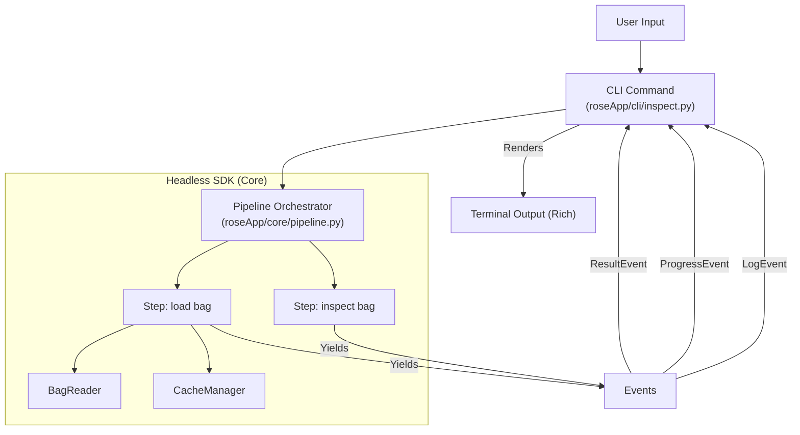

# Rose Headless SDK Architecture

## Overview

The Rose "Headless SDK" architecture is designed to strictly separate **Business Logic (Core)** from **User Interface (CLI/TUI)**. This decoupling ensures that core functionality can be reused across different interfaces (CLI, TUI, Web, Scripts) without modification, and enables a responsive, event-driven user experience.

## Core Concepts

### 1. The Pipeline (`roseApp/core/pipeline.py`)

The `pipeline.py` module is the central orchestrator of the SDK. It defines **Generators** that yield events describing the status of an operation. It does not print to `stdout`/`stderr` directly.

-   **Orchestrators**: High-level functions (e.g., `inspect_orchestrator`, `load_orchestrator`) that manage a complete workflow.
-   **Steps**: Atomic units of work (e.g., `step_load_bag`, `step_inspect_bag`). Orchestrators call steps using `yield from`.

### 4. Deep Dive: Generators and `yield` for Inversion of Control

The core technical principle enabling this "Headless" architecture is the use of Python **Generators**.

Traditionally, a function `load_bag()` might look like this:
```python
def load_bag(path):
    print(f"Loading {path}...")  # Side effect! Hard dependency on stdout
    # ... logic ...
    print("Done")
```

In the Rose SDK, we use **Inversion of Control (IoC)** via `yield`. The SDK function does *not* print; it yields data objects (Events) to the caller.

```python
def step_load_bag(path):
    yield LogEvent(f"Loading {path}...")  # No side effect, just data
    # ... logic ...
    yield LogEvent("Done")
```

**How it works:**
1.  **State Suspension**: When `step_load_bag` hits `yield`, its execution is suspended. Using `yield from` allows nested functions (orchestrators calling steps) to transparently pass these events up the chain.
2.  **Caller Control**: The CLI (the caller) iterates over this generator. It receives the event, decides *how* to show it (spinner, log line, or progress bar update), and then asks the generator for the next item.
3.  **UI Agnostic**: Because the SDK only emits data, the same generator can be consumed by:
    -   **CLI**: Renders `rich` spinners.
    -   **Web Server**: Streams events to a frontend via Server-Sent Events (SSE).
    -   **Test Suite**: Collects events in a list to verify sequence and messages.


### 3. TUI Integration (CLI)

The CLI commands (e.g., `inspect.py`, `load.py`) act as **Consumers** of the pipeline. They are responsible for:

-   **Initializing** the TUI elements (Spinners, Progress Bars via `rich`).
-   **Iterating** over the pipeline generator.
-   **Rendering** updates based on received events.
-   **Handling** user interaction (prompts) when necessary (e.g., uncached bags).

## Architecture Diagram



## Detailed Flow: `inspect` Command

Taking the `inspect` command as a prime example of this architecture:

### 1. CLI Layer (`roseApp/cli/inspect.py`)
-   **Setup**: Initializes `StepManager` and `out` (Output).
-   **Execution**: Calls `inspect_orchestrator(bag_path, ...)` to get a generator.
-   **Consumption Loop**:
    ```python
    with out.live_status("Processing") as live_status:
        for event in pipeline:
            if isinstance(event, LogEvent):
                # Update spinner text or log to console
            elif isinstance(event, ProgressEvent):
                # Update progress percentage
            elif isinstance(event, ResultEvent):
                # Store data, mark step as Done
    ```
-   **Final Output**: Once the pipeline is exhausted, the CLI formats the collected `bag_info` using `rich.table` and prints it to stdout.

### 2. Pipeline Layer (`roseApp/core/pipeline.py`)
-   **`step_inspect_bag`**:
    -   Checks `CacheManager` for existing analysis.
    -   **Yields** `LogEvent("Checking cache...")`.
    -   If valid: **Yields** `ResultEvent` with data.
    -   If invalid/missing:
        -   **Yields** `LogEvent("Bag not in cache")`.
        -   Returns status `not_cached`.

### 3. Interactive Loop (Handling "Headless" in Interactive CLI)
The "Headless" SDK simply reports status. The CLI decides how to handle non-ideal states:
1.  SDK reports `status: not_cached`.
2.  CLI detects this status via `ResultEvent`.
3.  CLI pauses (exits spinner context).
4.  **CLI prompts user**: `Load options: [l]oad quick, [i]ndex?`
5.  CLI calls SDK again: `inspect_orchestrator(..., load_if_missing=True)`.

## Key Benefits

1.  **UI Agnostic**: The exact same `inspect_orchestrator` can be used by a Web API (streaming Server-Sent Events) or a GUI app.
2.  **Testability**: Tests can consume the generator and assert that specific events are emitted without parsing stdout string output.
3.  **Responsiveness**: The generator pattern allows the UI to update immediately when a sub-step completes, rather than waiting for the entire function to return.
### 4. Deep Dive: Execution Flow & Control Suspension

To understand how `inspect` can "pause" and ask for input, we must look at the **Generator Lifecycle** and the **Call Stack**.

#### Call Stack & Control Flow

1.  **CLI Entry**: `inspect()` function in `cli/inspect.py` is called by Typer.
2.  **Pipeline Initialization**:
    ```python
    pipeline = inspect_orchestrator(bag_path, ...) 
    ```
    *Crucial Point*: Calling `inspect_orchestrator` **DOES NOT** execute any code inside it yet. It immediately returns a **Generator Object**. This is "lazy execution".

3.  **Consumption Loop 1 (`process_events`)**:
    -   The CLI enters a `with out.live_status(...)` context (starts the spinner).
    -   It calls `next(pipeline)` (implicit in `for event in pipeline`).
    -   **Control transfers to SDK**: `inspect_orchestrator` starts running -> calls `step_inspect_bag`.
    -   **SDK Yields**: `step_inspect_bag` checks cache -> `yield LogEvent("Checking...")`.
    -   **Control transfers to CLI**: The loop receives the event, updates the spinner.
    -   **SDK Continues**: `step_inspect_bag` finds bag is missing -> returns `not_cached` status in a `ResultEvent`.
    -   **SDK Returns**: The generator raises `StopIteration` (finishes).
    -   **Loop Ends**: The `process_events` function returns.
    -   **Spinner Context Exits**: The `LiveStatus` context manager exits, cleaning up the terminal line.

4.  **The "Pause" (Interactive Prompt)**:
    -   Back in the main `inspect()` function scope.
    -   The code checks `if not_cached and not should_load:`.
    -   Since the generator is finished and the spinner is gone, standard `stdout` is free.
    -   **CLI Prompts User**: `input("Load options...")`. The program waits here. This is not "pausing the generator" (which is dead); it's pausing the *CLI application*.

5.  **Restart with New Context**:
    -   If user says "Yes":
    -   **New Pipeline**: `pipeline_retry = inspect_orchestrator(..., load_if_missing=True)`. A *brand new* generator instance is created.
    -   **Consumption Loop 2**: `process_events(pipeline_retry)` is called again.
    -   New spinner starts, new events flow, but this time logic takes the `load` path.

#### Why this works properly

Because the **UI rendering** (Spinner context) is tightly coupled to the **Event Consumption Loop**, exiting the loop automatically clears the UI state. This allows clean interleaving of:
1.  Rich TUI (Spinner)
2.  Standard Input (Blocking IO)
3.  Rich TUI (Spinner)

Without this separation, printing a prompt while a spinner is active would result in garbled terminal output.
