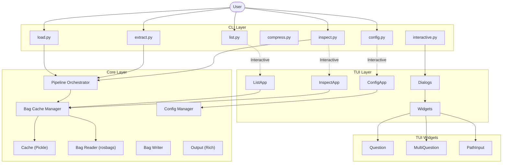
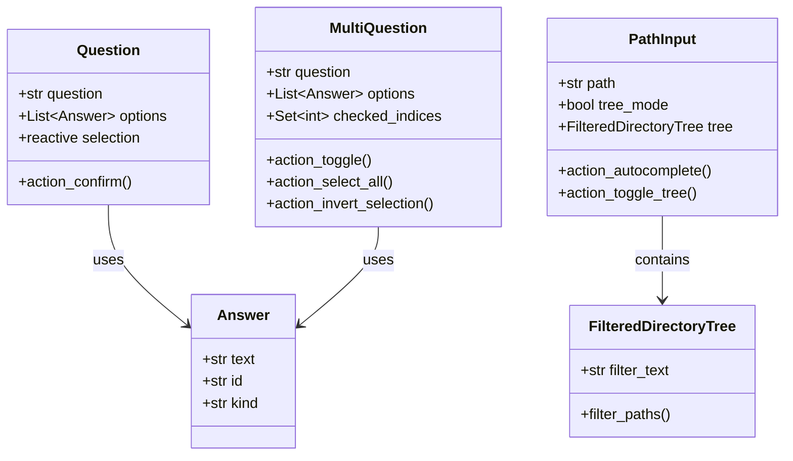

# Software Architecture

Rose is designed with a layered architecture focusing on modularity, performance, and aesthetic consistency.

## Overview

The system is divided into three main layers:
1.  **Core Layer**: Handles data processing, caching, and ROS bag interaction.
2.  **CLI Layer**: Provides command-line interface and terminal output styling.
3.  **TUI Layer**: Offers interactive visual inspection and widgets using Textual.

## System Diagram



## Component Details

### Core Layer

| Component             | File          | Description                                          |
| --------------------- | ------------- | ---------------------------------------------------- |
| Pipeline Orchestrator | `pipeline.py` | Generator-based pipelines for async event processing |
| Cache Manager         | `cache.py`    | Pickle-based caching with file hash validation       |
| Bag Reader            | `parser.py`   | Unified reader supporting ROS1/ROS2 formats          |
| Bag Writer            | `writer.py`   | Writing filtered/compressed bags                     |
| Output                | `output.py`   | Rich-based terminal output with theming              |
| Config                | `config.py`   | YAML configuration management                        |
| Model                 | `model.py`    | Data models (BagInfo, TopicInfo, etc.)               |

### CLI Layer

| Component   | File             | Description                    |
| ----------- | ---------------- | ------------------------------ |
| Load        | `load.py`        | Load bags into cache           |
| Extract     | `extract.py`     | Filter and extract topics      |
| Compress    | `compress.py`    | Compress bag files             |
| Inspect     | `inspect.py`     | Inspect bag contents (CLI/TUI) |
| List        | `list.py`        | Cache management               |
| Interactive | `interactive.py` | Interactive mode helpers       |

### TUI Layer

| Component     | File                        | Description                             |
| ------------- | --------------------------- | --------------------------------------- |
| InspectApp    | `inspect_app.py`            | Main TUI inspector application          |
| ConfigApp     | `config_app.py`             | Configuration management TUI            |
| ListApp       | `list_app.py`               | Cache management TUI                    |
| Dialogs       | `dialogs.py`                | Modal dialogs for user interaction      |
| Question      | `widgets/question.py`       | Single-select prompt widget             |
| MultiQuestion | `widgets/multi_question.py` | Multi-select prompt widget              |
| PathInput     | `widgets/path_search.py`    | File picker with tree view              |
| Theme Manager | `theme.py`                  | Centralized theme loading & application |

## Widget Architecture



## Key Design Patterns

### Generator-Based Pipelines

All heavy operations use generator pipelines that yield events:

```python
for event in load_orchestrator(bag_path):
    if isinstance(event, LogEvent):
        # Handle log messages
    elif isinstance(event, ProgressEvent):
        # Update progress bar
    elif isinstance(event, ResultEvent):
        # Process result
```

### Reactive Widget State

TUI widgets use Textual's reactive properties for automatic UI updates:

```python
class Question(Widget):
    selection: reactive[int] = reactive(0)
    
    def watch_selection(self, old, new):
        # Automatically called when selection changes
        self._update_highlight()
```

### Event-Driven Architecture

Components communicate via Textual messages:

```python
@dataclass
class Answers(Message):
    indices: List[int]
    answers: List[Answer]

# Post message when user confirms
self.post_message(self.Answers(indices=selected, answers=selected_answers))
```

### Theming Architecture

The application supports a centralized theming system driven by YAML configuration files.

- **Theme Definition**: Themes are defined in `roseApp/config/themes/*.yaml`.
- **Loading**: `theme.py` scans and loads available themes at startup.
- **Application**: The `setup_app_theme` utility injects the selected theme into Textual apps (`InspectApp`, `ConfigApp`, etc.).
- **Consistency**: All widgets reference the global theme object for coloring (e.g., `theme.primary`, `theme.surface`), ensuring visual consistency across the TUI.

