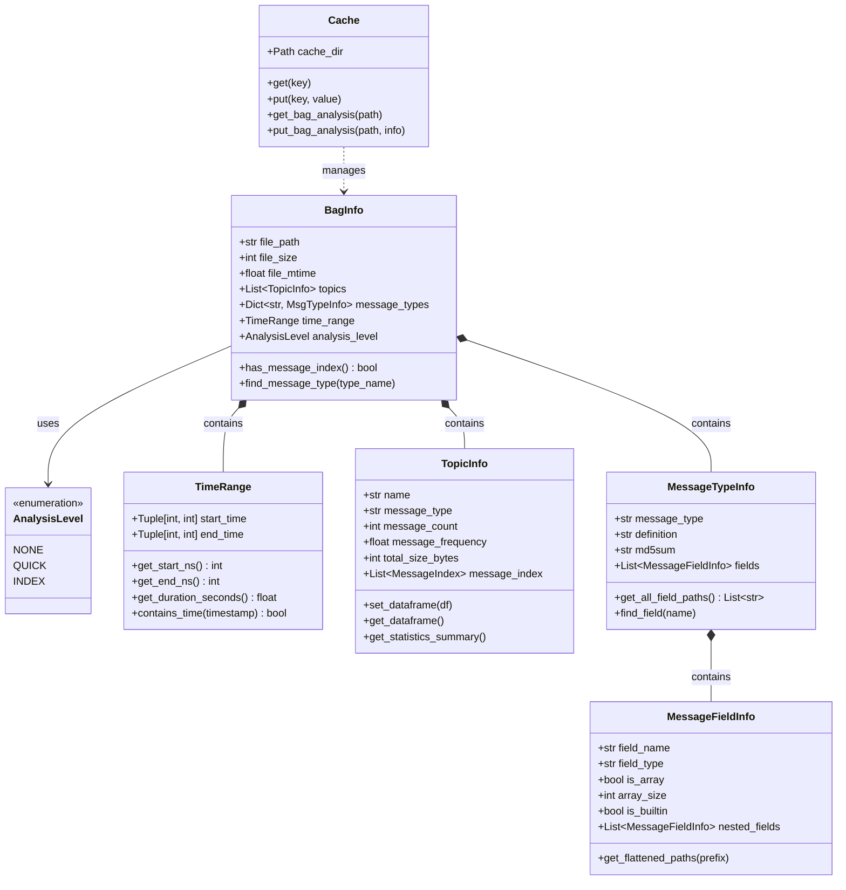
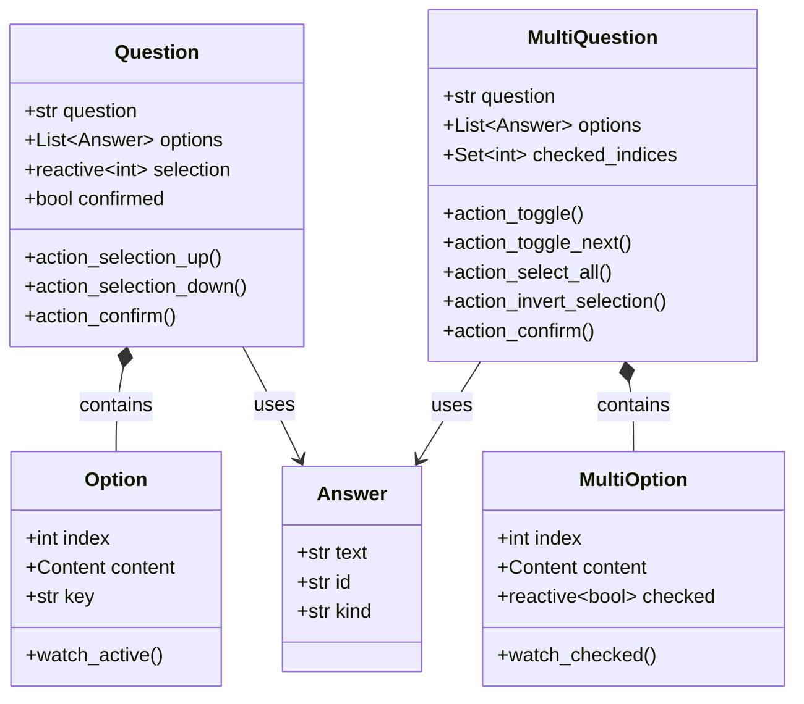
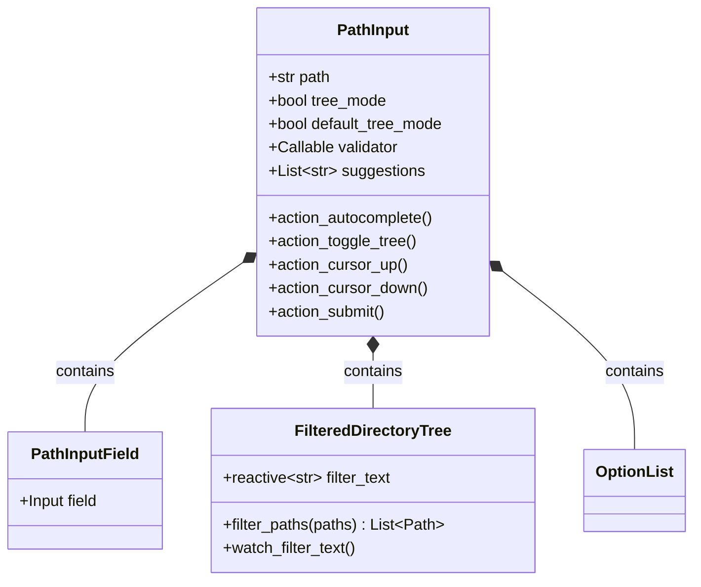
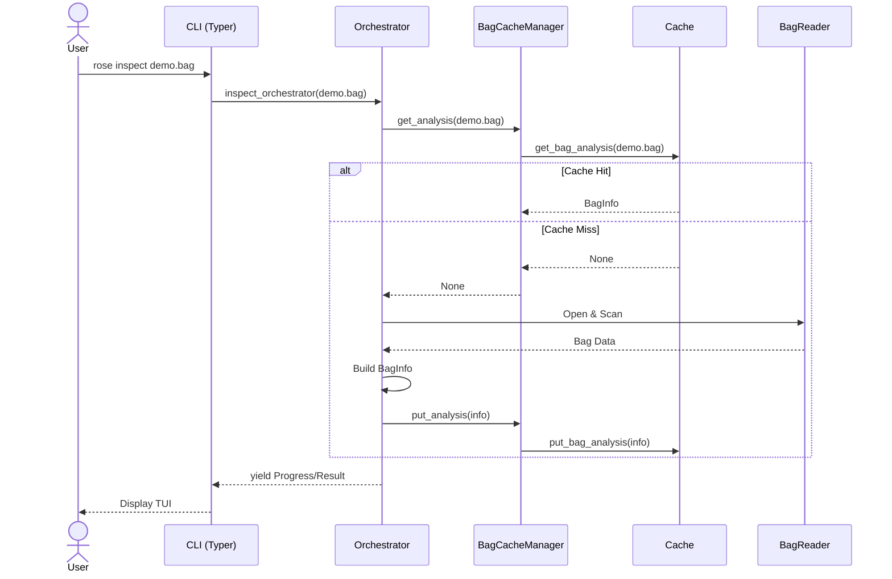
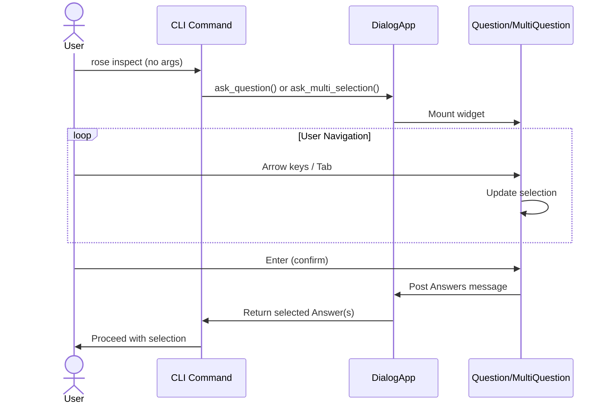
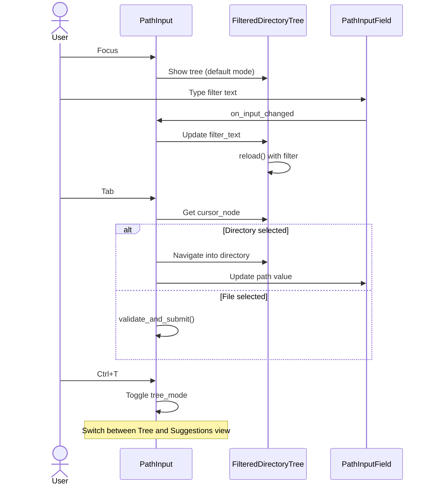
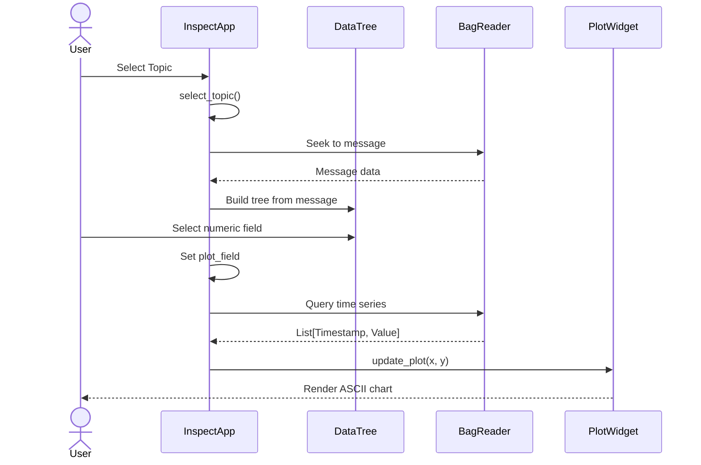
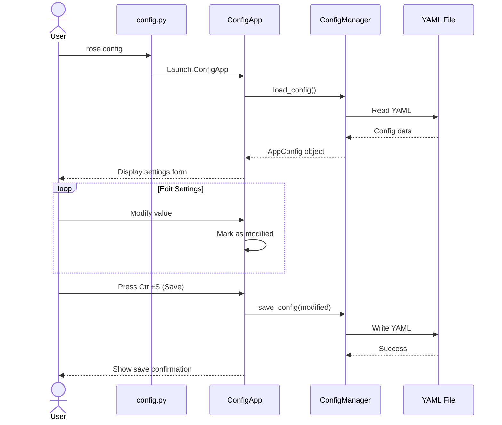
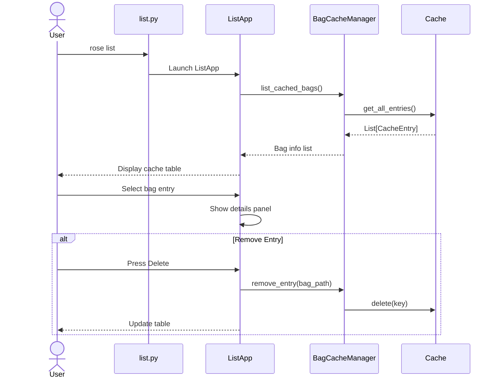
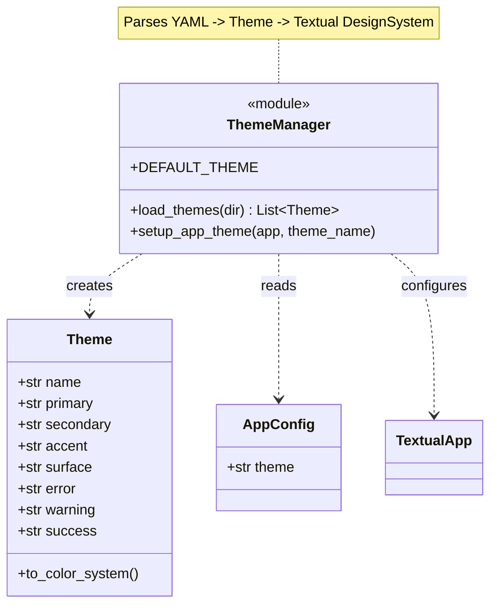

# Detailed Design

This document covers the low-level design of the Rose application, including class structures and sequence diagrams for key workflows.

## Data Models

### Core Models

## TUI Widget Design

### Selection Widgets

### PathInput Widget

## Workflows

### 1. Load / Analysis Workflow

### 2. Interactive Selection Flow

### 3. PathInput File Selection

### 4. TUI Data Inspection

### 5. Config TUI Workflow

### 6. List TUI Workflow

## Key Bindings Summary

### Question Widget

| Key      | Action            |
| -------- | ----------------- |
| `↑/↓`    | Navigate options  |
| `Enter`  | Confirm selection |
| `Escape` | Cancel            |

### MultiQuestion Widget

| Key      | Action                              |
| -------- | ----------------------------------- |
| `↑/↓`    | Navigate options                    |
| `Space`  | Toggle current option               |
| `Tab`    | Toggle + move to next (wrap-around) |
| `Ctrl+A` | Select all                          |
| `Ctrl+I` | Invert selection                    |
| `Enter`  | Confirm selection                   |
| `Escape` | Cancel                              |

### PathInput Widget

| Key      | Action                          |
| -------- | ------------------------------- |
| `↑/↓`    | Navigate suggestions/tree       |
| `Tab`    | Auto-complete / Enter directory |
| `Enter`  | Select file / Enter directory   |
| `Ctrl+T` | Toggle tree/suggestion view     |
| `Escape` | Cancel                          |

## Theme System Design

