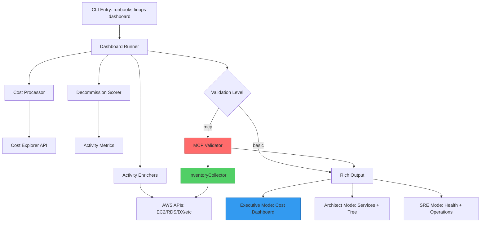

# FinOps Dashboard

## 1. Persona Modes – Current Behavior & Roadmap 🎭

### 1.1 Current Mode Implementation (v1.1.x)

Each mode uses **the same underlying data** with the following differentiation:

| Mode Flag          | Current Differentiation                                          | Implementation Status | Output Characteristics                                                                                                     |
| ------------------ | ---------------------------------------------------------------- | --------------------- | -------------------------------------------------------------------------------------------------------------------------- |
| `--mode executive` | **Auto-enables `--activity-analysis`** + daily average metrics   | ✅ **IMPLEMENTED**    | Monthly cost dashboard + Activity Health Tree (E1-E7, R1-R7, S1-S7 signals) + daily spending averages                      |
| `--mode architect` | Standard infrastructure rendering (services table + cost tree)   | ✅ **IMPLEMENTED**    | Service cost breakdown + hierarchical category tree (manually enable `--activity-analysis` for enrichment)                 |
| `--mode sre`       | **Anomaly detection table** (20% threshold spike/drop detection) | ✅ **IMPLEMENTED**    | Operations dashboard with anomaly alerts (🔴 SPIKE, 🟢 DROP, 🟡 WATCH, ✅ NORMAL) + recommended actions + optional tree view |

**Key Implementation Details**:

**Executive Mode** (lines 1367-1370, 1989-2023 in `finops.py`):
```python
# Auto-enable activity analysis for executive mode
if mode == "executive" and not activity_analysis:
    activity_analysis = True
    logger.info("Activity analysis auto-enabled for executive mode")

# Executive mode: Business-focused summary with daily averages
# Calculates fair daily comparison accounting for partial months
```

**SRE Mode** (lines 1130-1202 in `finops.py`):
```python
# SRE mode: Operations-focused with anomaly detection
# Creates dedicated anomaly detection table with:
# - 🔴 SPIKE: >20% cost increase → Investigation recommended
# - 🟢 DROP: >20% cost decrease → Operational verification needed
# - 🟡 WATCH: 10-20% increase → Monitoring advised
# - ✅ NORMAL: <10% variance → No action required
```

**Architect Mode** (lines 1074-1128 in `finops.py`):
```python
# Architect mode: Infrastructure-focused, full detailed output
# Renders services table + cost breakdown tree
# Includes mathematical consistency checks (services ≤ account total)
```

---

### 1.2 Mode Differentiation Roadmap (2025 Q4)

**Planned Enhancements** - Phase 2 implementation targeting 3-5 days effort:

#### 🏗️ Architect Mode Enhancements

- **Infrastructure Dependency Mapping**: Visualize resource relationships (EC2→RDS, ELB→EC2, NAT→VPC)
- **Service Cost Breakdown**: Categorized analysis (Compute/Network/Database/Storage/Edge)
- **Rightsizing Recommendations**: AWS Compute Optimizer integration for cost optimization
- **Network Topology Cost**: VPC endpoint costs, NAT Gateway analysis, data transfer breakdown
- **Multi-tier Architecture View**: Cost distribution across application tiers

#### 🔧 SRE Mode Enhancements

- **Enhanced Anomaly Detection**: Cost change alerts with configurable thresholds
- **Resource Health Correlation**: Operational risk scoring based on activity patterns
- **Service Availability Analysis**: Cost vs uptime correlation for SLA optimization
- **Operational Runbook Integration**: Automated recommendations for cost spike investigation
- **Real-time Cost Tracking**: Daily/hourly granularity for incident response

**Timeline**: Targeting Week 3-6 of Phase 2 implementation cycle

---

### 1.3 Conceptual Model (Target State)

| Persona                           | Mode Flag          | Primary Questions                                  | Typical Timeframe            | Target Outputs                                                                              |
| --------------------------------- | ------------------ | -------------------------------------------------- | ---------------------------- | ------------------------------------------------------------------------------------------- |
| 🧑‍💼 Executive (CEO / CFO / COO) | `--mode executive` | "Where is our money going? Are we on target?"      | Monthly / Quarterly          | Summarised tables, PDF/Markdown packs, cost-threshold filtered views + Activity Health Tree |
| 🏗️ Architect / Head of Platform  | `--mode architect` | "How is cost distributed across infra patterns?"   | Weekly / Monthly / Quarterly | Service breakdowns, dependency maps, rightsizing recommendations, CSV/Markdown exports      |
| 🔧 SRE / CloudOps                 | `--mode sre`       | "What changed, and where did the spike come from?" | Daily / Weekly               | Anomaly alerts, health correlation, operational runbooks, CSV/JSON/Markdown for incidents   |

---

## 2. FinOps Dashboard Architecture



---


## 5. Runbooks by Persona & Scope 🧪

> 🧩 **Naming Convention For Scripts / Notebooks**
>
> * Single account: `*_single_account.ipynb`
> * Multi-account LZ: `*_multi_account_lz.ipynb`
>
> The CLI commands below serve as the **source of truth** for the notebook behaviours.

---

### 5.1 Executive Mode Runbooks 🧑‍💼

<details>
<summary><strong>🧑‍💼 Executive — Single AWS Account</strong></summary>

#### Goal

Provide a **clear, validated** monthly or quarterly cost view for a **single account**, suitable for C-suite consumption.

#### Canonical CLI pattern

```bash
runbooks finops dashboard \
  --mode executive \
  --profile $AWS_PROFILE \
  --timeframe monthly \
  --cost-metric amortized \
  --summary-mode table \
  --output-format table \
  --export pdf \
  --export markdown \
  --validation-level mcp
```

* `--profile $AWS_PROFILE` → Single-account billing/profile context.
* `--timeframe monthly` → Aligned with monthly reporting.
* `--cost-metric amortized` → Uses amortized cost where commitments exist.
* `--summary-mode table` / `--output-format table` → Tabular executive view.
* `--export pdf` / `--export markdown` → Directly shareable formats.
* `--validation-level mcp` → High validation level per help text.

#### Notebook design blueprint (single account)

| Aspect             | Design Guidance                                                                                                                                                             |
| ------------------ | --------------------------------------------------------------------------------------------------------------------------------------------------------------------------- |
| Name               | `finops_executive_single_account.ipynb`                                                                                                                                     |
| Inputs             | Profile selector, timeframe selector (`daily/weekly/monthly/quarterly`), cost metric selector, optional filter text, optional cost threshold & top-N.                       |
| Core Steps         | 1. Load data for chosen profile/timeframe. 2. Apply cost metric. 3. Apply optional filters / thresholds. 4. Render **summary table(s)** consistent with `--mode executive`. |
| Outputs            | At minimum: executive summary tables, plus cells that save to PDF / Markdown using the same dataset as the CLI.                                                             |
| Alignment with CLI | All notebook parameters map 1:1 to CLI options; no additional hidden parameters.                                                                                            |

</details>

---

<details>
<summary><strong>🧑‍💼 Executive — Multi-Account Landing Zone</strong></summary>

#### Goal

Deliver a **consolidated, org-level** cost overview using a **management or billing profile**.

#### Canonical CLI pattern

```bash
runbooks finops dashboard \
  --mode executive \
  --all-profile $MANAGEMENT_PROFILE \
  --timeframe monthly \
  --cost-metric amortized \
  --summary-mode table \
  --output-format table \
  --export pdf \
  --export markdown \
  --validation-level mcp
```

* `--all-profile $MANAGEMENT_PROFILE` → Management profile for Organizations scope.
* Remaining flags stay aligned with the single-account run.

#### Notebook design blueprint (multi-account LZ)

| Aspect             | Design Guidance                                                                                                                                                                                                      |
| ------------------ | -------------------------------------------------------------------------------------------------------------------------------------------------------------------------------------------------------------------- |
| Name               | `finops_executive_multi_account_lz.ipynb`                                                                                                                                                                            |
| Inputs             | Management profile selector, timeframe, cost metric, optional filters by account, OU, service, and cost threshold / top-N.                                                                                           |
| Core Steps         | 1. Load org-level data via management profile. 2. Aggregate by business dimensions (e.g. account groupings) according to tags/metadata you configure outside this doc. 3. Render tables suitable for C-suite review. |
| Outputs            | Consolidated tables for the landing zone, plus export cells (PDF/Markdown) aligned with CLI usage.                                                                                                                   |
| Alignment with CLI | Notebook calls the same underlying data path as the CLI when `--all-profile` is used.                                                                                                                                |

</details>

---

### 5.2 Architect Mode Runbooks 🏗️

<details>
<summary><strong>🏗️ Architect — Single AWS Account</strong></summary>

#### Goal

Provide **infrastructure-focused** cost breakdown for a single account, highlighting **compute + data + edge** services and activity signals.

#### Canonical CLI pattern

```bash
runbooks finops dashboard \
  --mode architect \
  --profile $AWS_PROFILE \
  --timeframe monthly \
  --cost-metric blended \
  --services EC2,RDS,S3,ELB \
  --activity-analysis \
  --top-n 50 \
  --sort-by change \
  --summary-mode both \
  --output-format both \
  --export csv \
  --export markdown \
  --validation-level mcp
```

All options are from the CLI help:

* `--mode architect` → Infrastructure analysis presentation.
* `--services ...` → Service subset.
* `--activity-analysis` → E1–E7, R1–7, S1–7 signals.
* `--top-n`, `--sort-by` → Focus on meaningful infra changes.
* `--summary-mode both`, `--output-format both` → Table + tree views.
* `--export csv`, `--export markdown` → Dev & documentation workflows.

#### Notebook design blueprint (single account)

| Aspect             | Design Guidance                                                                                                                                                                                         |
| ------------------ | ------------------------------------------------------------------------------------------------------------------------------------------------------------------------------------------------------- |
| Name               | `finops_architect_single_account.ipynb`                                                                                                                                                                 |
| Inputs             | Profile, timeframe, cost metric, list of services, optional cost threshold, top-N, sort-by, toggles for `activity-analysis`.                                                                            |
| Core Steps         | 1. Load & filter data by services. 2. Compute per-service and per-pattern aggregates. 3. Attach activity signals as provided by the underlying tool. 4. Render both tabular and hierarchical summaries. |
| Outputs            | CSV-ready tables for architecture reviews and Markdown-ready summaries.                                                                                                                                 |
| Alignment with CLI | The notebook should mirror the CLI call with `--mode architect` and the same option set.                                                                                                                |

</details>

---

<details>
<summary><strong>🏗️ Architect — Multi-Account Landing Zone</strong></summary>

#### Goal

Expose **platform-wide infra patterns** and their costs across **multiple accounts** in the landing zone.

#### Canonical CLI pattern

```bash
runbooks finops dashboard \
  --mode architect \
  --all-profile $CENTRALISED_OPS_PROFILE \
  --timeframe monthly \
  --cost-metric blended \
  --services EC2,RDS,S3,ELB \
  --activity-analysis \
  --top-n 50 \
  --sort-by change \
  --summary-mode both \
  --output-format both \
  --export csv \
  --export markdown \
  --validation-level mcp
```

* `--all-profile $CENTRALISED_OPS_PROFILE` → Centralised operations/org view.
* Remaining flags as in single-account pattern.

#### Notebook design blueprint (multi-account LZ)

| Aspect             | Design Guidance                                                                                                                                                                 |
| ------------------ | ------------------------------------------------------------------------------------------------------------------------------------------------------------------------------- |
| Name               | `finops_architect_multi_account_lz.ipynb`                                                                                                                                       |
| Inputs             | Centralised ops / management profile, timeframe, services, optional account filters, cost threshold, top-N, sort-by.                                                            |
| Core Steps         | 1. Load data via management/ops profile. 2. Group by infra pattern and account. 3. Attach activity signals. 4. Render dual views (tables + trees) for cross-account comparison. |
| Outputs            | Cross-account CSV exports and Markdown summaries for ADRs & platform backlogs.                                                                                                  |
| Alignment with CLI | Behavior remains consistent with `--mode architect` + `--all-profile`.                                                                                                          |

</details>

---

### 5.3 SRE / CloudOps Mode Runbooks 🔧

<details>
<summary><strong>🔧 SRE — Single AWS Account</strong></summary>

#### Goal

Support SREs in **investigating cost spikes and anomalies** in a single account, with MCP validation and verbose logging where needed.

#### Canonical CLI pattern

```bash
runbooks finops dashboard \
  --mode sre \
  --profile $AWS_PROFILE \
  --timeframe daily \
  --cost-metric unblended \
  --cost-threshold 1000 \
  --top-n 50 \
  --sort-by change \
  --activity-analysis \
  --summary-mode table \
  --output-format table \
  --validation-level mcp \
  --verbose \
  --export csv \
  --export json \
  --export markdown
```

All flags are from CLI help:

* `--mode sre` → Operations deep-dive.
* `--timeframe daily` → Short window for spike analysis.
* `--cost-metric unblended` → Raw, current-period charges.
* `--cost-threshold`, `--top-n`, `--sort-by change` → Focus on meaningful contributors to change.
* `--activity-analysis` → Behaviour indicators.
* `--validation-level mcp` → Strong validation.
* `--verbose` → Diagnostic logging.
* `--export csv/json/markdown` → For automation, scripting, and documentation.

#### Notebook design blueprint (single account)

| Aspect             | Design Guidance                                                                                                                                                                                                            |
| ------------------ | -------------------------------------------------------------------------------------------------------------------------------------------------------------------------------------------------------------------------- |
| Name               | `finops_sre_single_account.ipynb`                                                                                                                                                                                          |
| Inputs             | Profile, timeframe, cost metric, cost threshold, top-N, sort-by, toggles for `activity-analysis` and verbose diagnostics.                                                                                                  |
| Core Steps         | 1. Load recent data (e.g. daily) for the specified profile. 2. Filter by threshold and sort by change. 3. Attach activity signals. 4. Provide cells that generate CSV/JSON/Markdown outputs for use in incident workflows. |
| Outputs            | Tables showing spike contributors, exported files for incident tickets and deeper analysis.                                                                                                                                |
| Alignment with CLI | Parameter mapping matches `--mode sre`, including validation level and logging settings.                                                                                                                                   |

</details>

---

<details>
<summary><strong>🔧 SRE — Multi-Account Landing Zone</strong></summary>

#### Goal

Allow operations teams to perform **org-wide anomaly checks** and **cost spike analysis** across the landing zone using a management/ops profile.

#### Canonical CLI pattern

```bash
runbooks finops dashboard \
  --mode sre \
  --all-profile <MANAGEMENT_OR_OPS_PROFILE> \
  --timeframe daily \
  --cost-metric unblended \
  --cost-threshold 1000 \
  --top-n 50 \
  --sort-by change \
  --activity-analysis \
  --summary-mode table \
  --output-format table \
  --validation-level mcp \
  --verbose \
  --export csv \
  --export json \
  --export markdown
```

* `--all-profile <MANAGEMENT_OR_OPS_PROFILE>` → Cross-account operations scope.

#### Notebook design blueprint (multi-account LZ)

| Aspect             | Design Guidance                                                                                                                                                                                    |
| ------------------ | -------------------------------------------------------------------------------------------------------------------------------------------------------------------------------------------------- |
| Name               | `finops_sre_multi_account_lz.ipynb`                                                                                                                                                                |
| Inputs             | Management/operations profile, timeframe, cost metric, threshold, top-N, sort-by, optional account/service filters.                                                                                |
| Core Steps         | 1. Load org-level data. 2. Filter based on threshold and sort by change. 3. Highlight accounts/services with significant deltas. 4. Export CSV/JSON/Markdown for follow-up actions and automation. |
| Outputs            | Spike lists across accounts, exportable into incident tooling and FinOps workflows.                                                                                                                |
| Alignment with CLI | Same behaviour as the CLI call with `--mode sre` + `--all-profile`.                                                                                                                                |

</details>

---

## 6. Cross-Persona Notebook Design Matrix 📚

This section summarises how the **6 notebooks** relate to the CLI behaviours.

| Persona         | Scope            | Notebook Name                             | Core CLI Mapping                                           |
| --------------- | ---------------- | ----------------------------------------- | ---------------------------------------------------------- |
| 🧑‍💼 Executive | Single account   | `finops_executive_single_account.ipynb`   | `--mode executive --profile $AWS_PROFILE`             |
| 🧑‍💼 Executive | Multi-account LZ | `finops_executive_multi_account_lz.ipynb` | `--mode executive --all-profile $MANAGEMENT_PROFILE`      |
| 🏗️ Architect   | Single account   | `finops_architect_single_account.ipynb`   | `--mode architect --profile $AWS_PROFILE`             |
| 🏗️ Architect   | Multi-account LZ | `finops_architect_multi_account_lz.ipynb` | `--mode architect --all-profile $CENTRALISED_OPS_PROFILE` |
| 🔧 SRE          | Single account   | `finops_sre_single_account.ipynb`         | `--mode sre --profile $AWS_PROFILE`                   |
| 🔧 SRE          | Multi-account LZ | `finops_sre_multi_account_lz.ipynb`       | `--mode sre --all-profile <MANAGEMENT_OR_OPS_PROFILE>`     |

> ✅ **Design Principle**
>
> * **No new business logic in notebooks.**
> * Notebooks are **orchestration & visualisation layers** over the same logic used by `runbooks finops dashboard`.
> * All parameters should map directly to documented CLI options.

---

## 7. Current Implementation Notes ⚠️

### 7.1 Mode Behavior Transparency (v1.1.x)

**Executive Mode** (Business-Focused with Auto-Enrichment):
```bash
# Auto-enables activity-analysis + daily average calculations
runbooks finops dashboard --mode executive --profile $AWS_PROFILE

# Output: Monthly cost dashboard + Activity Health Tree + Daily spending metrics
# Best for: C-suite reviews, board presentations, financial governance
```

**Architect Mode** (Infrastructure-Focused, Manual Enrichment):
```bash
# Standard services table + cost breakdown tree
runbooks finops dashboard --mode architect --profile $AWS_PROFILE

# To add activity signals (E1-E7, R1-R7, S1-S7):
runbooks finops dashboard --mode architect --activity-analysis --profile $AWS_PROFILE

# Output: Service cost breakdown + hierarchical category tree + (optional) activity signals
# Best for: Architecture reviews, platform cost analysis, infrastructure planning
```

**SRE Mode** (Operations-Focused with Anomaly Detection):
```bash
# Dedicated anomaly detection table with actionable alerts
runbooks finops dashboard --mode sre --profile $AWS_PROFILE

# To add activity signals on top of anomaly detection:
runbooks finops dashboard --mode sre --activity-analysis --profile $AWS_PROFILE

# Output: Anomaly detection dashboard (🔴 SPIKE, 🟢 DROP, 🟡 WATCH, ✅ NORMAL) + recommended actions
# Best for: Cost spike investigations, operational troubleshooting, incident response
```

**Key Differences**:

| Mode      | Auto-Enabled Features          | Unique Presentation                                  | Manual Flags Needed              |
| --------- | ------------------------------ | ---------------------------------------------------- | -------------------------------- |
| Executive | ✅ Activity-analysis           | Daily average metrics, business-focused layout       | None (fully automated)           |
| Architect | ❌ None                        | Services table + cost tree + consistency checks      | `--activity-analysis` (optional) |
| SRE       | ❌ None                        | Anomaly detection table (20% threshold) + alerts     | `--activity-analysis` (optional) |

**Implementation Reality** (v1.1.x):
- **Executive**: 3 distinct features (auto activity-analysis + daily averages + error suppression)
- **SRE**: 2 distinct features (anomaly detection table + recommended actions)
- **Architect**: Standard rendering (services table + cost tree)

**Roadmap**: Phase 2 (2025 Q4) will enhance architect (dependency mapping, rightsizing) and sre (health correlation, real-time tracking) modes with additional differentiation.

---

## 8. Governance & Quality Checklist ✅

Use this checklist when introducing this CLI and the 6 notebooks into your environment.

### 8.1 Common Standards (All Personas)

* [ ] Profiles used in CLI & notebooks map to **documented AWS named profiles**.
* [ ] `--timeframe`, `--cost-metric`, and `--validation-level` choices are documented in your internal FinOps standards.
* [ ] `--filter`, `--services`, `--accounts`, and `--cost-threshold` patterns are reviewed and agreed.
* [ ] Exports (`csv`, `json`, `pdf`, `markdown`) are stored and shared according to your internal policies.

### 8.2 Executive Mode

* [ ] Exec views use **C-suite friendly summaries** (tables only or minimal tree).
* [ ] Only **validated** (`mcp` or `strict`) outputs are used for governance reports.
* [ ] Profiles used (e.g. **billing/management**) are clearly owned and maintained.
* [ ] ✅ Activity-analysis **automatically enabled** (no manual flag required).

### 8.3 Architect Mode

* [ ] Service subsets in `--services` reflect your current **infrastructure patterns**.
* [ ] ⚠️ **Manually enable** `--activity-analysis` for behavior signals (not auto-enabled).
* [ ] CSV exports are integrated into **architecture review** and **platform backlog** workflows.
* [ ] Understand current mode shares default rendering (see Section 7.1 for transparency).

### 8.4 SRE / CloudOps Mode

* [ ] Timeframes and thresholds support **rapid anomaly detection**.
* [ ] ⚠️ **Manually enable** `--activity-analysis` for enriched operational insights.
* [ ] JSON/CSV exports are integrated into **incident management** and **automation** where appropriate.
* [ ] `--verbose` logs are used during investigations and managed according to logging policies.
* [ ] Understand current mode shares default rendering (see Section 7.1 for transparency).

---

## 9. Next Steps 🧱

This document establishes:

* A **consistent CLI pattern** for each persona and scope.
* A **clear blueprint** for the 6 Jupyter notebooks to be built next.

Recommended next actions:

1. **Create the six notebooks** using the naming and parameter mappings in this file.
2. **Wire notebooks and CLI** to the same underlying data-access and validation layer.
3. **Embed this markdown as `RUNBOOKS_FINOPS_DASHBOARD.md`** at the root of your `runbooks` FinOps section or docs folder.

Once the notebooks exist, you can extend this document with:

* Direct links to each notebook.
* Screenshots created using the `--screenshot` flag and equivalent notebook functionality.
* Persona-specific runbooks for review meetings and incident playbooks.

```

::contentReference[oaicite:0]{index=0}
```

---
