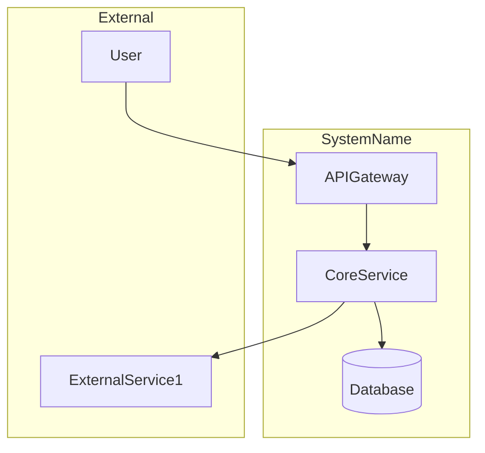
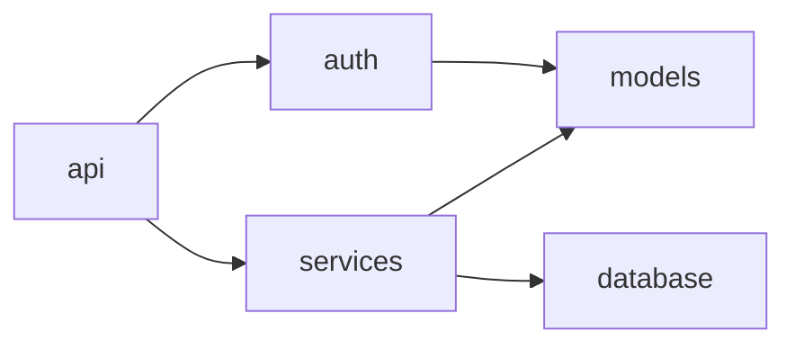
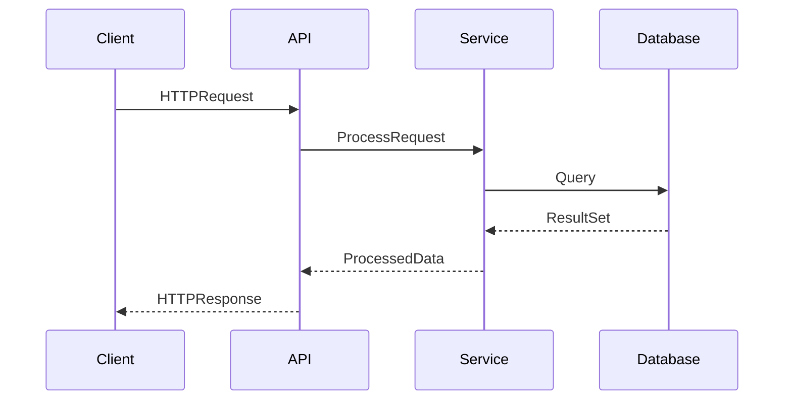
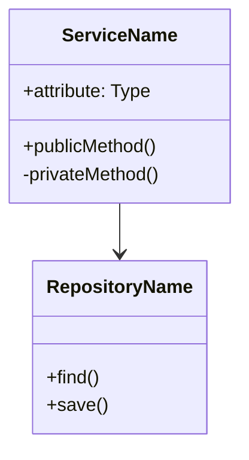
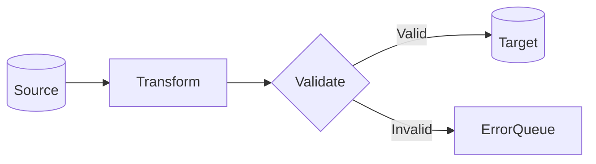
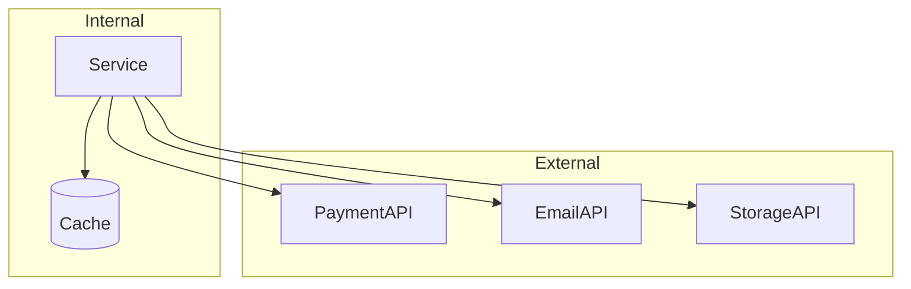

# Mermaid Templates (Pre-Validated)

## Rule: Use ONLY These Templates

Do NOT freestyle Mermaid. Fill placeholders in these pre-validated templates only.

---

## Template 1: System Context

Use for high-level system overview showing external actors and boundaries.



**Placeholders to replace:**
- `SystemName` → Your system name (alphanumeric only)
- `ExternalService1` → External service name
- `APIGateway`, `CoreService`, `Database` → Your component names

---

## Template 2: Module Dependencies

Use for showing internal module relationships.




---

## Template 3: Request Flow (Sequence)

Use for showing request/response lifecycle.




---

## Template 4: Component Diagram (Classes)

Use for showing class/component relationships.




---

## Template 5: Data Flow (Simple)

Use for ETL or data pipeline visualization.




---

## Template 6: External Integrations

Use for showing third-party API boundaries.



---

## Syntax Rules (MANDATORY)

### Node IDs
✅ Alphanumeric only: `UserSvc`, `DB1`, `API`
❌ No hyphens: `user-svc`
❌ No underscores: `user_svc`
❌ No spaces: `user svc`

### Labels with Special Characters
✅ Use quotes: `A["Label (with parens)"]`
✅ Use quotes: `B["Items: 5"]`
❌ No quotes: `A[Label (breaks)]`

### Arrows
| Diagram | Solid | Dashed | With Label |
|---------|-------|--------|------------|
| Flowchart | `-->` | `-.->` | `-->\|label\|` |
| Sequence | `->>` | `-->>` | `->>` with `: label` |
| Class | `-->` | `..>` | N/A |

### Size Limits
- Max 10 nodes per diagram
- Max 15 edges per diagram
- Split larger diagrams into multiple

---

## Fallback: Use Tables

When diagram is complex or uncertain, use tables instead:

```markdown
## Module Dependencies

| Module | Depends On | Relationship |
|--------|------------|--------------|
| `api.routes` | `services.core` | Import |
| `services.core` | `models.user` | Import |
| `services.core` | `clients.db` | Composition |
```

Tables have zero syntax risk and render everywhere.

---

## Validation Checklist

Before including ANY Mermaid diagram:

- [ ] Template matches one of the 6 above
- [ ] Node IDs: alphanumeric only
- [ ] Labels with special chars: quoted `["..."]`
- [ ] Arrow syntax: matches table above
- [ ] Node count: ≤ 10
- [ ] Edge count: ≤ 15

If ANY check fails → use TABLE format instead.
