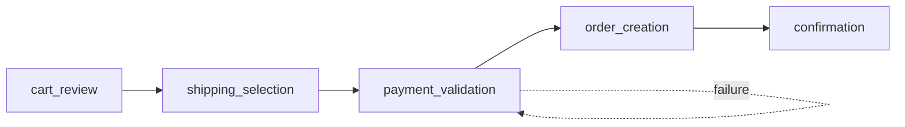

# Business Flows Registry

> **Purpose:** Define E2E business flows and their steps for traceability and gap detection.
> Auto-scanned by `flow_mapper.py` and `flow_gap_detector.py`.

**Last Updated:** YYYY-MM-DD
**Last Modified By:** [git user email]

---

## Flow: checkout_flow

**Process:** Order Processing
**Description:** Complete checkout from cart to order confirmation.
**Owner:** [Responsible Team or Individual]

### Steps

| Step | Name | Description | Story ID | Status |
|------|------|-------------|----------|--------|
| 1 | cart_review | User reviews cart contents | STORY-001 | Done |
| 2 | shipping_selection | User selects shipping method | STORY-002 | Done |
| 3 | payment_validation | Validate payment details | STORY-003 | In Progress |
| 4 | order_creation | Create order in system | STORY-004 | Draft |
| 5 | confirmation | Display order confirmation | STORY-005 | Draft |

### Entry/Exit Points

| Type | Condition | Notes |
|------|-----------|-------|
| Entry | User clicks "Checkout" from cart | Cart must have items |
| Exit (Success) | Order confirmed | Redirect to confirmation page |
| Exit (Failure) | Payment declined | Show error, return to step 3 |

### Flow Diagram



---

## Flow: user_registration

**Process:** User Onboarding
**Description:** New user registration and activation.
**Owner:** [Responsible Team or Individual]

### Steps

| Step | Name | Description | Story ID | Status |
|------|------|-------------|----------|--------|
| 1 | form_input | User enters registration details | STORY-010 | Done |
| 2 | email_verification | Send and verify email | STORY-011 | In Progress |
| 3 | profile_setup | User completes profile | STORY-012 | Draft |
| 4 | welcome | Show welcome screen | - | Not Started |

### Entry/Exit Points

| Type | Condition | Notes |
|------|-----------|-------|
| Entry | User clicks "Sign Up" | From login page or marketing |
| Exit (Success) | Profile complete | Redirect to dashboard |
| Exit (Failure) | Email not verified (timeout) | Account pending |

---

## Schema Reference

### Flow Definition

```yaml
flow_name:
  process: "Parent business process"
  description: "What this flow accomplishes"
  owner: "[Optional - leave blank if unknown]"
  steps:
    - step: 1
      name: "step_name"
      description: "What happens"
      story_id: "STORY-XXX"  # or "-" if no story yet
      status: "Done|In Progress|Draft|Not Started"
```

### Linking Stories to Flows

In `docs/requirements/STORY-XXX.md`, set:

```markdown
## Flow Context

| Field | Value |
|-------|-------|
| **Business Process** | Order Processing |
| **Flow** | checkout_flow |
| **Flow Step** | payment_validation |
| **Upstream Step** | shipping_selection |
| **Downstream Step** | order_creation |
```

### Gap Detection Rules

The `flow_gap_detector` tool checks:
1. **Missing Stories:** Flow step has no linked story
2. **Orphan Stories:** Story claims flow step that doesn't exist in FLOWS.md
3. **Broken Links:** Upstream/downstream steps don't match flow definition
4. **Status Mismatch:** Story status vs flow step status inconsistent
