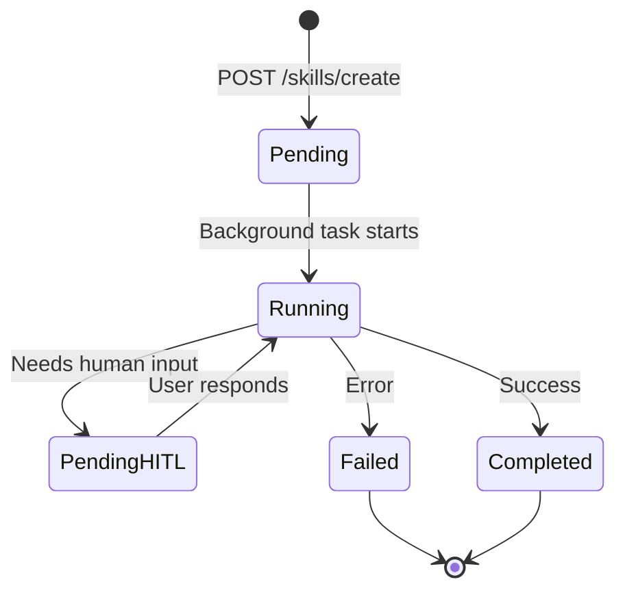
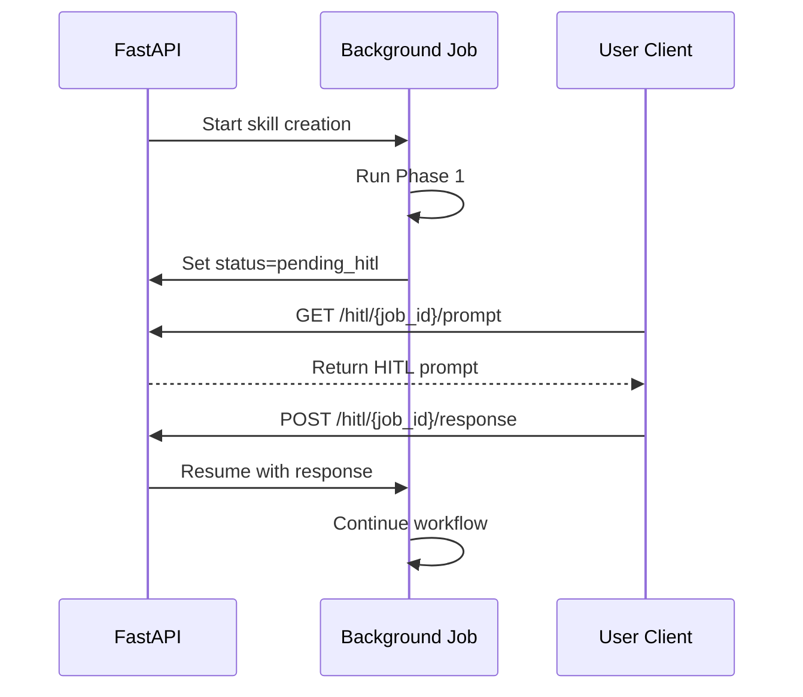

# Background Jobs System

**Last Updated**: 2026-01-12
**Location**: `src/skill_fleet/api/jobs.py`

## Overview

Skills Fleet uses a job-based architecture for long-running skill creation workflows. Jobs are executed asynchronously in the background, allowing the API to respond immediately while the skill is created over time.

`★ Insight ─────────────────────────────────────`
Background jobs are essential for skill creation because the workflow involves multiple LLM calls (taking seconds to minutes) and HITL checkpoints (requiring human interaction). Without jobs, HTTP requests would timeout or block the server.
`─────────────────────────────────────────────────`

## Job Architecture



## Job Lifecycle

### States

| State | Description |
|-------|-------------|
| **pending** | Job created, waiting to start |
| **running** | Job is processing |
| **pending_hitl** | Awaiting human input |
| **completed** | Job finished successfully |
| **failed** | Job failed with error |

### JobState Model

```python
from pydantic import BaseModel
from typing import Any

class JobState(BaseModel):
    """Represents the current state of a background job."""

    job_id: str
    status: str = "pending"
    hitl_type: str | None = None      # Type of HITL interaction
    hitl_data: dict[str, Any] | None = None  # HITL prompt data
    hitl_response: dict[str, Any] | None = None  # User's response
    result: Any | None = None          # Final result
    error: str | None = None           # Error message if failed
    saved_path: str | None = None      # Where skill was saved
```

---

## Job Creation

### Creating a Job

```python
from skill_fleet.api.jobs import create_job

job_id = create_job()
# Returns: "f47ac10b-58cc-4372-a567-0e02b2c3d479"
```

**Job Storage:**
- Current: In-memory dictionary (`JOBS = {}`)
- Production: Use Redis or database

### From API Endpoint

```http
POST /api/v2/skills/create
Content-Type: application/json

{
    "task_description": "Create a Python async skill",
    "user_id": "user_123"
}
```

**Response:**
```json
{
    "job_id": "f47ac10b-58cc-4372-a567-0e02b2c3d479",
    "status": "accepted"
}
```

---

## Job Execution

### Background Task

```python
async def run_skill_creation(job_id: str, task_description: str, user_id: str):
    """Background task to run the skill creation program."""
    job = JOBS[job_id]
    job.status = "running"

    async def hitl_callback(interaction_type: str, data: dict):
        """Handle Human-in-the-Loop interactions."""
        job.status = "pending_hitl"
        job.hitl_type = interaction_type
        job.hitl_data = data

        # Wait for user response via API
        try:
            response = await wait_for_hitl_response(job_id)
            job.status = "running"
            return response
        except TimeoutError:
            job.status = "failed"
            job.error = "HITL interaction timed out"
            raise

    try:
        program = SkillCreationProgram()
        result = await program.aforward(
            task_description=task_description,
            user_context={"user_id": user_id},
            taxonomy_structure="{}",
            existing_skills="[]",
            hitl_callback=hitl_callback,
        )

        job.status = result.status  # completed/failed
        job.result = result

        # Auto-save to taxonomy
        if result.status == "completed":
            saved_path = save_skill_to_taxonomy(result)
            job.saved_path = saved_path

    except Exception as e:
        job.status = "failed"
        job.error = str(e)
```

---

## HITL Interactions

### HITL Flow



### Waiting for Response

```python
async def wait_for_hitl_response(job_id: str, timeout: float = 3600.0) -> dict[str, Any]:
    """Wait for user to provide HITL response via API."""
    job = JOBS[job_id]
    start_time = asyncio.get_event_loop().time()

    while job.hitl_response is None:
        if asyncio.get_event_loop().time() - start_time > timeout:
            raise TimeoutError("HITL response timed out")
        await asyncio.sleep(1)

    response = job.hitl_response
    job.hitl_response = None  # Clear for next interaction
    return response
```

`★ Insight ─────────────────────────────────────`
The timeout defaults to 1 hour (3600 seconds) which is generous for HITL interactions. This allows users time to review generated content and provide thoughtful feedback. Adjust based on your use case.
`─────────────────────────────────────────────────`

---

## Job Polling

### Client-Side Polling

```python
import requests
import time

JOB_ID = "f47ac10b-58cc-4372-a567-0e02b2c3d479"
BASE_URL = "http://localhost:8000/api/v2"

while True:
    response = requests.get(f"{BASE_URL}/hitl/{JOB_ID}/prompt")
    data = response.json()
    status = data["status"]

    if status == "pending_hitl":
        # Show HITL prompt to user
        handle_hitl_prompt(data)

    elif status == "completed":
        skill_content = data["skill_content"]
        print("Skill created!")
        print(skill_content)
        break

    elif status == "failed":
        print(f"Job failed: {data['error']}")
        break

    time.sleep(2)
```

### Webhook Alternative (Future)

```python
# When creating skill, provide webhook URL
{
    "task_description": "...",
    "webhook_url": "https://your-app.com/webhooks/skill-complete",
    "webhook_secret": "your-secret"
}

# Server POSTs to webhook when job completes
{
    "job_id": "...",
    "status": "completed",
    "result": {...},
    "signature": "hmac-sha256"
}
```

---

## Job Storage

### Current Implementation

In-memory dictionary (not suitable for production):

```python
# src/skill_fleet/api/jobs.py

JOBS: dict[str, JobState] = {}
```

### Production: Redis

```python
import redis
import json

redis_client = redis.Redis(host='localhost', port=6379, db=0)

def save_job(job_id: str, job: JobState):
    """Save job to Redis."""
    redis_client.setex(
        f"job:{job_id}",
        3600,  # 1 hour TTL
        job.json()
    )

def load_job(job_id: str) -> JobState | None:
    """Load job from Redis."""
    data = redis_client.get(f"job:{job_id}")
    if data:
        return JobState.parse_raw(data)
    return None
```

### Production: Database

```python
from sqlalchemy import Column, String, JSON
from sqlalchemy.ext.declarative import declarative_base

Base = declarative_base()

class Job(Base):
    __tablename__ = "jobs"

    job_id = Column(String, primary_key=True)
    status = Column(String)
    hitl_type = Column(String, nullable=True)
    hitl_data = Column(JSON, nullable=True)
    result = Column(JSON, nullable=True)
    error = Column(String, nullable=True)
    created_at = Column(DateTime, default=datetime.utcnow)
    updated_at = Column(DateTime, onupdate=datetime.utcnow)
```

---

## Job Cleanup

### Automatic Cleanup

```python
import asyncio
from datetime import datetime, timedelta

async def cleanup_old_jobs():
    """Remove completed jobs older than 1 hour."""
    cutoff = datetime.utcnow() - timedelta(hours=1)

    for job_id, job in list(JOBS.items()):
        if job.status in ["completed", "failed"]:
            # Check last updated time
            if job.last_updated < cutoff:
                del JOBS[job_id]
                logger.info(f"Cleaned up old job: {job_id}")

# Run every 10 minutes
asyncio.create_task(cleanup_old_jobs())
```

---

## Monitoring Jobs

### Job Statistics

```python
def get_job_stats() -> dict[str, Any]:
    """Get statistics about all jobs."""
    total = len(JOBS)
    by_status = {}

    for job in JOBS.values():
        status = job.status
        by_status[status] = by_status.get(status, 0) + 1

    return {
        "total": total,
        "by_status": by_status,
        "pending_hitl": by_status.get("pending_hitl", 0),
    }
```

### Metrics Endpoint

```python
@app.get("/jobs/stats")
async def job_stats():
    """Get job statistics."""
    stats = get_job_stats()

    # Calculate completion rate
    completed = stats["by_status"].get("completed", 0)
    failed = stats["by_status"].get("failed", 0)
    total_finished = completed + failed

    completion_rate = completed / total_finished if total_finished > 0 else 0

    return {
        **stats,
        "completion_rate": f"{completion_rate:.1%}",
    }
```

---

## Best Practices

1. **Always Poll**: Don't assume jobs complete quickly
2. **Handle Timeouts**: Set appropriate timeouts for HITL
3. **Cleanup**: Remove old jobs to prevent memory leaks
4. **Logging**: Log job state transitions for debugging
5. **Error Handling**: Always handle exceptions in background tasks
6. **Persistence**: Use Redis/database for production deployments

---

## See Also

- **[API Overview](index.md)** - Architecture and setup
- **[Endpoints Documentation](endpoints.md)** - HITL endpoints
- **[HITL System](../hitl/)** - Human-in-the-Loop details
