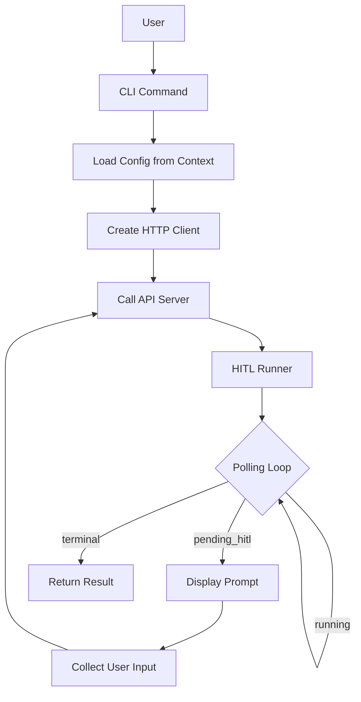

# CLI Architecture

**Last Updated**: 2026-01-12
**Location**: `src/skill_fleet/cli/`

## Overview

This document covers the internal architecture of the Skills Fleet CLI, including the Typer application structure, HTTP client, HITL runner, and command organization.

`★ Insight ─────────────────────────────────────`
The CLI follows a **client-server architecture** where the CLI is a thin client that communicates with a FastAPI server. This separation allows the CLI to remain lightweight while the server handles heavy LLM operations.
`─────────────────────────────────────────────────`

## Directory Structure

```
src/skill_fleet/cli/
├── app.py                    # Main Typer application
├── client.py                 # HTTP client for API communication
├── exceptions.py             # CLI-specific exceptions
├── commands/                 # Command implementations
│   ├── __init__.py
│   ├── create.py             # Create skill command
│   ├── chat.py               # Interactive chat command
│   ├── list_skills.py        # List skills command
│   ├── validate.py           # Validate skill command
│   ├── serve.py              # Serve API server command
│   ├── onboard.py            # Onboarding command
│   ├── analytics.py          # Analytics command
│   ├── migrate.py            # Migration utilities
│   ├── generate_xml.py       # XML generation command
│   └── optimize.py           # Optimization command
├── hitl/                    # HITL components
│   ├── __init__.py
│   └── runner.py             # HITL interaction runner
└── utils/                   # Shared utilities
    ├── __init__.py
    ├── constants.py          # Constants (poll intervals, etc.)
    └── security.py           # Security utilities
```

## Main Application

### File: `app.py`

The main Typer application that registers all commands and global options.

```python
import typer
from rich.console import Console

app = typer.Typer(
    name="skill-fleet",
    help="Hierarchical AI skill management and creation system.",
    add_completion=False,
)

console = Console()

class CLIConfig:
    """Container for CLI configuration and shared state."""
    def __init__(self, api_url: str, user_id: str):
        self.api_url = api_url
        self.user_id = user_id
        self.client = SkillFleetClient(base_url=api_url)

@app.callback()
def main_callback(
    ctx: typer.Context,
    api_url: str = typer.Option(..., envvar="SKILL_FLEET_API_URL"),
    user_id: str = typer.Option(..., envvar="SKILL_FLEET_USER_ID"),
):
    """Global configuration for Skill Fleet CLI."""
    ctx.obj = CLIConfig(api_url=api_url, user_id=user_id)

# Register commands
app.command(name="create")(create_command)
app.command(name="chat")(chat_command)
# ... other commands
```

**Key Points:**
- **Typer** framework for CLI interface
- **Rich** for beautiful terminal output
- **Context object** stores shared state (config, client)
- **Environment variables** for defaults
- **Callback function** runs before all commands

## HTTP Client

### File: `client.py`

Async HTTP client for communicating with the FastAPI server.

```python
import httpx

class SkillFleetClient:
    """HTTP client for Skills Fleet API."""

    def __init__(self, base_url: str = "http://localhost:8000"):
        self.base_url = base_url
        self.client = httpx.AsyncClient(timeout=300.0)

    async def create_skill(self, task: str, user_id: str) -> dict:
        """Create a new skill creation job."""
        response = await self.client.post(
            f"{self.base_url}/api/v2/skills/create",
            json={"task_description": task, "user_id": user_id}
        )
        response.raise_for_status()
        return response.json()

    async def get_hitl_prompt(self, job_id: str) -> dict:
        """Get current HITL prompt for a job."""
        response = await self.client.get(
            f"{self.base_url}/api/v2/hitl/{job_id}/prompt"
        )
        response.raise_for_status()
        return response.json()

    async def post_hitl_response(self, job_id: str, response: dict) -> dict:
        """Submit HITL response."""
        resp = await self.client.post(
            f"{self.base_url}/api/v2/hitl/{job_id}/response",
            json=response
        )
        resp.raise_for_status()
        return resp.json()

    async def close(self):
        """Close the HTTP client."""
        await self.client.aclose()
```

`★ Insight ─────────────────────────────────────`
Using **httpx.AsyncClient** enables non-blocking HTTP requests. This is crucial for the CLI because skill creation involves long-running jobs. The async client allows the CLI to poll for status without blocking.
`─────────────────────────────────────────────────`

## HITL Runner

### File: `hitl/runner.py`

Centralized HITL interaction handler shared by `create` and `chat` commands.

```python
async def run_hitl_job(
    *,
    console: Console,
    client: SkillFleetClient,
    job_id: str,
    auto_approve: bool = False,
    poll_interval: float = HITL_POLL_INTERVAL,
) -> dict[str, Any]:
    """Poll and satisfy HITL prompts until job reaches terminal state."""
    while True:
        prompt_data = await client.get_hitl_prompt(job_id)
        status = prompt_data.get("status")

        # Terminal states
        if status in {"completed", "failed", "cancelled"}:
            return prompt_data

        # Not ready for HITL yet
        if status != "pending_hitl":
            await asyncio.sleep(poll_interval)
            continue

        # Handle HITL interaction
        interaction_type = prompt_data.get("type")

        if auto_approve:
            # Auto-approve all interactions
            await client.post_hitl_response(job_id, {"action": "proceed"})
            continue

        # Interactive handling based on interaction type
        if interaction_type == "clarify":
            # Show questions and collect answers
            ...
        elif interaction_type == "confirm":
            # Show summary and ask for approval
            ...
        elif interaction_type == "preview":
            # Show preview and ask for feedback
            ...
        elif interaction_type == "validate":
            # Show validation report and ask for acceptance
            ...
```

**Key Features:**
- **Polling loop**: Continuously checks job status
- **Interaction handling**: Displays appropriate UI for each HITL type
- **Auto-approve mode**: Skips all prompts for automation
- **Rich panels**: Beautiful formatted output

## Command Structure

Each command follows this pattern:

```python
from rich.console import Console
import typer

console = Console()

def command_name(
    ctx: typer.Context,
    argument: type = typer.Argument(...),
    option: type = typer.Option(default, "--option"),
):
    """Command description."""
    config = ctx.obj  # Access CLIConfig

    async def _run():
        # Command logic here
        await config.client.close()

    asyncio.run(_run())
```

**Best Practices:**
1. **Async wrapper**: All commands use `asyncio.run(_run())` for async operations
2. **Context access**: Use `ctx.obj` to access shared config
3. **Rich console**: Use `console.print()` for formatted output
4. **Error handling**: Catch and display errors gracefully
5. **Cleanup**: Always `await client.close()` in `finally` block

## Adding New Commands

### Step 1: Create Command File

```bash
# src/skill_fleet/cli/commands/mycommand.py
```

### Step 2: Implement Command

```python
"""My custom command."""

from rich.console import Console
import typer

console = Console()

def mycommand_command(
    ctx: typer.Context,
    my_arg: str = typer.Argument(...),
    my_option: str = typer.Option("default", "--my-option"),
):
    """Command description."""
    config = ctx.obj

    # Command logic
    console.print(f"[green]Processing: {my_arg}[/green]")

    # If using API
    async def _run():
        try:
            result = await config.client.some_api_call(my_arg)
            console.print(result)
        finally:
            await config.client.close()

    asyncio.run(_run())
```

### Step 3: Register in `app.py`

```python
from .commands.mycommand import mycommand_command

app.command(name="mycommand")(mycommand_command)
```

## Utility Modules

### Constants (`utils/constants.py`)

```python
# Polling interval for HITL prompts
HITL_POLL_INTERVAL = 2.0  # seconds

# API timeout
API_TIMEOUT = 300.0  # 5 minutes

# Output formats
FORMAT_PRETTY = "pretty"
FORMAT_JSON = "json"
FORMAT_CSV = "csv"
```

### Security (`utils/security.py`)

```python
import os

def get_api_key() -> str | None:
    """Get API key from environment."""
    return os.environ.get("SKILL_FLEET_API_KEY")

def sanitize_output(text: str) -> str:
    """Sanitize sensitive data from output."""
    # Remove API keys, tokens, etc.
    ...
```

## Exception Handling

### File: `exceptions.py`

```python
class SkillFleetCLIError(Exception):
    """Base exception for CLI errors."""
    pass

class APIServerError(SkillFleetCLIError):
    """Raised when API server is unreachable."""
    pass

class JobFailedError(SkillFleetCLIError):
    """Raised when a job fails."""
    pass

class ValidationError(SkillFleetCLIError):
    """Raised when validation fails."""
    pass
```

## Flow Diagrams

### Command Execution Flow



### HITL Flow

```mermaid
sequenceDiagram
    participant C as CLI Command
    participant R as HITL Runner
    participant A as API Server
    participant U as User

    C->>R: run_hitl_job(job_id)
    R->>A: GET /hitl/{job_id}/prompt
    A-->>R: {status: "pending_hitl", type: "clarify"}
    R->>U: Display questions panel
    U->>R: User response
    R->>A: POST /hitl/{job_id}/response
    A-->>R: {status: "accepted"}
    R->>A: GET /hitl/{job_id}/prompt
    A-->>R: {status: "running"}
    ... (loop until terminal)
    A-->>R: {status: "completed"}
    R-->>C: Final result
```

## Testing CLI Commands

```python
from typer.testing import CliRunner
from skill_fleet.cli.app import app

runner = CliRunner()

def test_create_command():
    result = runner.invoke(app, ["create", "test task"])
    assert result.exit_code == 0
    assert "Job created" in result.stdout
```

## See Also

- **[CLI Overview](index.md)** - User-facing documentation
- **[Commands Reference](commands.md)** - Command reference
- **[API Documentation](../api/)** - Server-side API
- **[HITL System](../hitl/)** - Human-in-the-Loop details
