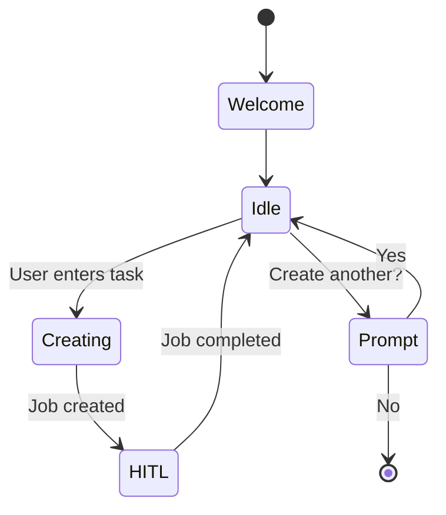

# CLI Commands Reference

**Last Updated**: 2026-01-14

## Overview

Complete reference for all Skills Fleet CLI commands with options, usage examples, and exit codes.

`★ Insight ─────────────────────────────────────`
Commands are organized by function: creation (`create`, `chat`), management (`list`, `validate`), utilities (`migrate`, `optimize`), and server (`serve`). Each command is implemented in a separate file under `src/skill_fleet/cli/commands/`.
`─────────────────────────────────────────────────`

## create

Create a new skill using the 3-phase workflow.

```bash
skill-fleet create [OPTIONS] TASK
```

### Arguments

| Argument | Type     | Required | Description                        |
| -------- | -------- | -------- | ---------------------------------- |
| `TASK`   | `string` | Yes      | Description of the skill to create |

### Options

| Option           | Short | Default                | Description              |
| ---------------- | ----- | ---------------------- | ------------------------ |
| `--auto-approve` | -     | `false`                | Skip interactive prompts |
| `--api-url`      | `-a`  | `$SKILL_FLEET_API_URL` | API server URL           |
| `--user`         | `-u`  | `$SKILL_FLEET_USER_ID` | User ID                  |

### Examples

```bash
# Basic usage
skill-fleet create "Create a Python async/await programming skill"

# Auto-approve (no HITL)
skill-fleet create "task" --auto-approve

# With custom user ID
skill-fleet create "task" --user myuser

# Remote API server
skill-fleet create "task" --api-url https://api.example.com
```

### Workflow

1. Create skill creation job on API server
2. Poll for HITL checkpoints
3. Display prompts and collect user input
4. Show final result when complete

### Exit Codes

| Code  | Meaning                                            |
| ----- | -------------------------------------------------- |
| `0`   | Skill created successfully                         |
| `1`   | Error (API connection, job failed, user cancelled) |
| `130` | Interrupted (Ctrl+C)                               |

---

## chat

Interactive chat mode for skill creation.

```bash
skill-fleet chat [OPTIONS] [TASK]
```

### Arguments

| Argument | Type     | Required | Description                      |
| -------- | -------- | -------- | -------------------------------- |
| `TASK`   | `string` | No       | Optional task to run immediately |

### Options

| Option                               | Short | Default                | Description                                          |
| ------------------------------------ | ----- | ---------------------- | ---------------------------------------------------- |
| `--auto-approve`                     | -     | `false`                | Skip interactive prompts                             |
| `--show-thinking/--no-show-thinking` | -     | `true`                 | Show rationale/thinking panels when provided         |
| `--force-plain-text`                 | -     | `false`                | Disable arrow-key dialogs and use plain-text prompts |
| `--api-url`                          | `-a`  | `$SKILL_FLEET_API_URL` | API server URL                                       |
| `--user`                             | `-u`  | `$SKILL_FLEET_USER_ID` | User ID                                              |

### Chat Commands

| Command          | Description        |
| ---------------- | ------------------ |
| `/help`          | Show help message  |
| `/exit`, `/quit` | Exit chat          |
| `/cancel`        | Cancel current job |

### Examples

```bash
# Start interactive chat
skill-fleet chat

# Start with a task
skill-fleet chat "Create a Python skill"

# Auto-approve mode
skill-fleet chat --auto-approve
```

### Session Flow



---

## promote

Promote a completed job’s draft into the taxonomy.

```bash
skill-fleet promote [OPTIONS] JOB_ID
```

### Arguments

| Argument | Type     | Required | Description            |
| -------- | -------- | -------- | ---------------------- |
| `JOB_ID` | `string` | Yes      | Job ID to promote      |

### Options

| Option                         | Default | Description                                           |
| ------------------------------ | ------- | ----------------------------------------------------- |
| `--overwrite/--no-overwrite`   | `true`  | Overwrite existing skill at the intended taxonomy path |
| `--delete-draft`               | `false` | Delete the draft directory after successful promotion  |
| `--force`                      | `false` | Promote even if workflow validation failed             |

Tip: `--api-url/-a` and `--user/-u` are global options available on all commands.

### Examples

```bash
# Promote a draft created by chat/create
skill-fleet promote 6f1198b1-5791-4981-986e-7ad8188724ac

# Keep the existing taxonomy entry (do not overwrite)
skill-fleet promote 6f1198b1-5791-4981-986e-7ad8188724ac --no-overwrite

# Promote a failed-validation draft (use sparingly; review content first)
skill-fleet promote 6f1198b1-5791-4981-986e-7ad8188724ac --force
```

---

## list

List all skills in the taxonomy.

```bash
skill-fleet list [OPTIONS]
```

### Options

| Option     | Short | Default  | Description                            |
| ---------- | ----- | -------- | -------------------------------------- |
| `--filter` | `-f`  | None     | Filter by pattern                      |
| `--format` | -     | `pretty` | Output format: `pretty`, `json`, `csv` |
| `--sort`   | -     | `name`   | Sort by: `name`, `path`, `created`     |

### Examples

```bash
# List all skills
skill-fleet list

# Filter by pattern
skill-fleet list --filter "python"

# JSON output
skill-fleet list --format json

# Sort by creation date
skill-fleet list --sort created
```

---

## validate

Validate a skill against taxonomy standards.

```bash
skill-fleet validate [OPTIONS] SKILL_PATH
```

### Arguments

| Argument     | Type     | Required | Description             |
| ------------ | -------- | -------- | ----------------------- |
| `SKILL_PATH` | `string` | Yes      | Path to skill directory |

### Options

| Option     | Short | Default | Description                    |
| ---------- | ----- | ------- | ------------------------------ |
| `--strict` | `-s`  | `false` | Treat warnings as errors       |
| `--fix`    | -     | `false` | Auto-fix issues where possible |

### Examples

```bash
# Validate a skill
skill-fleet validate skills/technical_skills/programming/python

# Strict mode
skill-fleet validate path/to/skill --strict

# Auto-fix
skill-fleet validate path/to/skill --fix
```

### Validation Checks

| Check                    | Description               |
| ------------------------ | ------------------------- |
| `metadata_exists`        | metadata.json exists      |
| `frontmatter_valid`      | YAML frontmatter is valid |
| `yaml_frontmatter`       | Proper YAML frontmatter   |
| `documentation_complete` | All sections present      |
| `examples_present`       | Usage examples exist      |

---

## serve

Start the FastAPI API server.

```bash
skill-fleet serve [OPTIONS]
```

### Options

| Option      | Short | Default     | Description                        |
| ----------- | ----- | ----------- | ---------------------------------- |
| `--host`    | `-H`  | `127.0.0.1` | Host to bind to                    |
| `--port`    | `-p`  | `8000`      | Port to bind to                    |
| `--reload`  | `-r`  | `false`     | Enable auto-reload for development |
| `--workers` | `-w`  | `1`         | Number of worker processes         |

### Examples

```bash
# Start server (default: localhost:8000)
skill-fleet serve

# Custom host and port
skill-fleet serve --host 0.0.0.0 --port 9000

# Development mode with auto-reload
skill-fleet serve --reload

# Production mode with 4 workers
skill-fleet serve --workers 4
```

### Server Endpoints

| Endpoint    | Description                                |
| ----------- | ------------------------------------------ |
| `/health`   | Health check                               |
| `/docs`     | Interactive API documentation (Swagger UI) |
| `/redoc`    | Alternative API documentation (ReDoc)      |
| `/api/v2/*` | API endpoints                              |

---

## onboard

First-time setup and configuration.

```bash
skill-fleet onboard [OPTIONS]
```

### Options

| Option          | Short | Default | Description              |
| --------------- | ----- | ------- | ------------------------ |
| `--skip-api`    | -     | `false` | Skip API server check    |
| `--config-only` | -     | `false` | Only create config files |

### Examples

```bash
# Run onboarding
skill-fleet onboard

# Skip API check
skill-fleet onboard --skip-api
```

---

## analytics

Show usage statistics.

```bash
skill-fleet analytics [OPTIONS]
```

### Options

| Option     | Short | Default | Description                           |
| ---------- | ----- | ------- | ------------------------------------- |
| `--period` | `-p`  | `7d`    | Time period: `1d`, `7d`, `30d`, `all` |
| `--format` | -     | `table` | Output format: `table`, `json`        |

### Examples

```bash
# Last 7 days
skill-fleet analytics

# Last 30 days
skill-fleet analytics --period 30d

# JSON output
skill-fleet analytics --format json
```

---

## migrate

Migration utilities for taxonomy updates.

```bash
skill-fleet migrate [OPTIONS] COMMAND
```

### Commands

| Command           | Description                      |
| ----------------- | -------------------------------- |
| `agentskills-io`  | Migrate to agentskills.io format |
| `add-frontmatter` | Add YAML frontmatter to skills   |
| `restructure`     | Restructure taxonomy paths       |

### Options

| Option      | Short | Default | Description                    |
| ----------- | ----- | ------- | ------------------------------ |
| `--dry-run` | `-d`  | `false` | Show changes without applying  |
| `--backup`  | `-b`  | `true`  | Create backup before migrating |

### Examples

```bash
# Migrate to agentskills.io
skill-fleet migrate agentskills-io

# Dry run
skill-fleet migrate agentskills-io --dry-run

# Skip backup
skill-fleet migrate agentskills-io --backup=false
```

---

## generate-xml

Generate `<available_skills>` XML for agent context injection.

```bash
skill-fleet generate-xml [OPTIONS]
```

### Options

| Option     | Short | Default | Description                   |
| ---------- | ----- | ------- | ----------------------------- |
| `--output` | `-o`  | `-`     | Output file (default: stdout) |
| `--filter` | `-f`  | None    | Filter by taxonomy path       |

### Examples

```bash
# Print to stdout
skill-fleet generate-xml

# Save to file
skill-fleet generate-xml --output skills.xml

# Filter by path
skill-fleet generate-xml --filter "python"
```

---

## optimize

Optimize DSPy programs using training data.

```bash
skill-fleet optimize [OPTIONS] PROGRAM
```

### Arguments

| Argument  | Type     | Required | Description                   |
| --------- | -------- | -------- | ----------------------------- |
| `PROGRAM` | `string` | Yes      | DSPy program name to optimize |

### Options

| Option        | Short | Default      | Description                   |
| ------------- | ----- | ------------ | ----------------------------- |
| `--data`      | `-d`  | Required     | Training data file            |
| `--optimizer` | `-O`  | `miprov2`    | Optimizer: `miprov2`, `gepa`  |
| `--rounds`    | `-r`  | `2`          | Number of optimization rounds |
| `--output`    | `-o`  | `optimized/` | Output directory              |

### Examples

```bash
# Optimize with MIPROv2
skill-fleet optimize SkillCreationProgram --data trainset.json

# Use GEPA optimizer
skill-fleet optimize SkillCreationProgram --optimizer gepa --data trainset.json

# Custom output directory
skill-fleet optimize SkillCreationProgram --data trainset.json --output my-optimized/
```

---

## Global Options

These options work with all commands:

| Option      | Short | Environment Variable  | Default                 | Description       |
| ----------- | ----- | --------------------- | ----------------------- | ----------------- |
| `--api-url` | `-a`  | `SKILL_FLEET_API_URL` | `http://localhost:8000` | API server URL    |
| `--user`    | `-u`  | `SKILL_FLEET_USER_ID` | `default`               | User ID           |
| `--help`    | `-h`  | -                     | -                       | Show help message |
| `--version` | `-V`  | -                     | -                       | Show version      |

### Examples

```bash
# Use custom API server
skill-fleet --api-url https://api.example.com create "task"

# Set user ID
skill-fleet --user myuser list

# Show version
skill-fleet --version
```

---

## Error Handling

All commands handle errors consistently:

```bash
# API server not running
skill-fleet create "task"
# Error: Could not connect to API server at http://localhost:8000
# Make sure the server is running:
#   uv run skill-fleet serve

# Invalid input
skill-fleet create ""
# Error: task_description is required

# Job failed
skill-fleet create "task"
# Job failed: [error message]
```

---

## See Also

- **[CLI Overview](index.md)** - Architecture and setup
- **[Interactive Chat Documentation](interactive-chat.md)** - Chat mode deep dive
- **[CLI Architecture](architecture.md)** - Internal structure
- **[API Documentation](../api/)** - REST API reference
