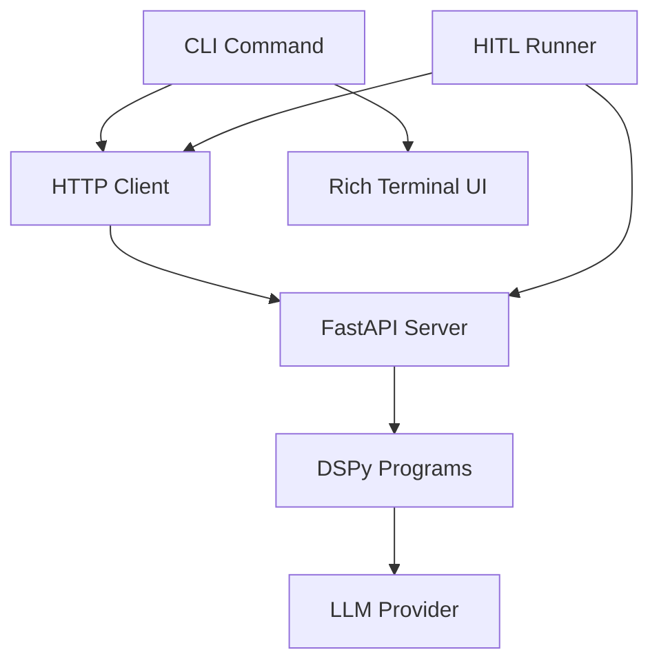

# CLI Documentation

**Last Updated**: 2026-01-14
**Location**: `src/skill_fleet/cli/`

## Overview

The Skills Fleet CLI provides a command-line interface for creating, managing, and validating skills. Built with Typer and Rich for a beautiful terminal experience, the CLI supports both one-shot commands and interactive chat mode.

`★ Insight ─────────────────────────────────────`
The CLI uses a **client-server architecture**. Commands communicate with a running FastAPI server via HTTP, enabling both local and remote skill creation. The server handles the heavy LLM operations while the CLI handles user interaction.
`─────────────────────────────────────────────────`

## Installation

For local development, run CLI commands via `uv run` from the repo root:

```bash
# Install Python deps (incl. CLI + dev tools)
uv sync --group dev

# Run via the project environment
uv run skill-fleet --help
```

If you want a globally-installed `skill-fleet` binary, you can also install the package editable (optional):

```bash
uv pip install -e .
```

## Quick Start

### 1. Start the API Server

```bash
# In one terminal
uv run skill-fleet serve
```

The server starts on `http://localhost:8000`

### 2. Create a Skill

```bash
# One-shot creation
uv run skill-fleet create "Create a Python async/await programming skill"

# Interactive chat mode
uv run skill-fleet chat
```

## Drafts & Promotion

Skill creation is **draft-first**:

- The API writes drafts under `skills/_drafts/<job_id>/...`.
- Promote into the taxonomy when ready:
  - `uv run skill-fleet promote <job_id>`
  - (API) `POST /api/v2/drafts/{job_id}/promote`

## Command Reference

| Command | Description | Usage |
|---------|-------------|-------|
| **create** | Create a skill (one-shot) | `skill-fleet create "task"` |
| **chat** | Interactive chat mode | `skill-fleet chat` |
| **promote** | Promote a draft into taxonomy | `skill-fleet promote <job_id>` |
| **list** | List all skills | `skill-fleet list` |
| **validate** | Validate a skill | `skill-fleet validate <path>` |
| **serve** | Start API server | `skill-fleet serve` |
| **onboard** | First-time setup | `skill-fleet onboard` |
| **analytics** | Usage statistics | `skill-fleet analytics` |
| **migrate** | Migration utilities | `skill-fleet migrate` |
| **generate-xml** | Generate agentskills.io XML | `skill-fleet generate-xml` |
| **optimize** | Optimize DSPy programs | `skill-fleet optimize` |

## Global Options

Options available for all commands:

| Option | Short | Environment Variable | Default | Description |
|--------|-------|---------------------|---------|-------------|
| `--api-url` | `-a` | `SKILL_FLEET_API_URL` | `http://localhost:8000` | API server URL |
| `--user` | `-u` | `SKILL_FLEET_USER_ID` | `default` | User ID for context |

**Example:**
```bash
# Use custom API server
skill-fleet --api-url https://api.example.com create "task"

# Use environment variables
export SKILL_FLEET_API_URL=https://api.example.com
skill-fleet create "task"
```

## CLI Architecture



### Components

| Component | Location | Description |
|-----------|----------|-------------|
| **App** | `app.py` | Main Typer application |
| **Commands** | `commands/` | Individual command implementations |
| **Client** | `client.py` | HTTP client for API communication |
| **HITL Runner** | `hitl/runner.py` | Human-in-the-Loop interaction handler |
| **Utils** | `utils/` | Shared utilities and constants |

## Output Format

The CLI uses Rich for beautiful terminal output:

- **Colors**: Cyan for info, green for success, yellow for warnings, red for errors
- **Panels**: Grouped content with borders
- **Markdown**: Rendered markdown for long text
- **Progress**: Spinners for long operations

**Example:**
```
🚀 Starting skill creation job...
✓ Job created: f47ac10b-58cc-4372-a567-0e02b2c3d479

╭─ 🤔 Clarification Needed ─────────╮
│ What level of detail should this   │
│ skill cover?                       │
╰────────────────────────────────────╯
```

## Exit Codes

| Code | Meaning |
|------|---------|
| **0** | Success |
| **1** | Error (API connection, validation failure, etc.) |
| **130** | Interrupted (Ctrl+C) |

## Configuration

### Environment Variables

| Variable | Description |
|----------|-------------|
| `SKILL_FLEET_API_URL` | Default API server URL |
| `SKILL_FLEET_USER_ID` | Default user ID |
| `SKILL_FLEET_SKILLS_ROOT` | Skills directory root (default: `skills`) |
| `SKILL_FLEET_CORS_ORIGINS` | CORS allowed origins (server) |

### Config File (Future)

```yaml
# ~/.skill-fleet/config.yaml
api:
  url: http://localhost:8000
  timeout: 300

user:
  id: default

preferences:
  auto_approve: false
  output_format: markdown
```

## Usage Patterns

### One-Shot Creation

Quick skill creation without interaction:

```bash
skill-fleet create "Create a Python decorators skill"
```

The CLI will:
1. Create a job on the server
2. Poll for HITL prompts
3. Ask for user input at checkpoints
4. Display final result

### Auto-Approve Mode

Skip all interactive prompts (useful for CI/CD):

```bash
skill-fleet create "task" --auto-approve
```

### Interactive Chat

Conversational skill creation:

```bash
skill-fleet chat
```

The chat session supports:
- Multiple skills in one session
- `/help` - Show help
- `/exit` - Exit chat

### Pipeline Integration

Use exit codes for scripting:

```bash
#!/bin/bash
skill-fleet create "task" && echo "Success" || echo "Failed"
```

## Next Steps

- **[Commands Documentation](commands.md)** - Detailed command reference
- **[Interactive Chat Documentation](interactive-chat.md)** - Chat mode deep dive
- **[CLI Architecture](architecture.md)** - Internal structure

## Related Documentation

- **[API Documentation](../api/)** - REST API reference
- **[DSPy Overview](../dspy/)** - DSPy architecture
- **[HITL System](../hitl/)** - Human-in-the-Loop details
