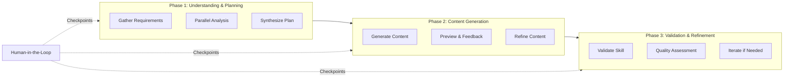

# DSPy in Skills Fleet

**Last Updated**: 2026-01-15

## Overview

Skills Fleet uses [DSPy](https://github.com/stanfordnlp/dspy) as its core framework for declarative self-improving language model programs. DSPy provides the foundation for the 3-phase skill creation workflow, enabling structured, testable, and optimized AI interactions.

`★ Insight ─────────────────────────────────────`
DSPy separates the **what** (signatures defining input/output contracts) from the **how** (modules implementing the logic). This decoupling allows skills-fleet to swap implementations, optimize prompts, and maintain type safety throughout the workflow.
`─────────────────────────────────────────────────`

## Why DSPy?

| Aspect | Traditional Approach | DSPy Approach |
|--------|---------------------|---------------|
| **Prompt Engineering** | Manual prompt tweaking | Declarative signatures |
| **Optimization** | Manual iteration | Built-in MIPROv2, GEPA |
| **Type Safety** | String-based | Pydantic models |
| **Testing** | Ad-hoc | Predictable outputs |
| **Maintainability** | Prompt spaghetti | Modular, composable |

## 3-Phase Architecture

Skills Fleet implements a 3-phase workflow orchestrated by DSPy:



### Phase 1: Understanding & Planning

**Location**: `src/skill_fleet/core/signatures/phase1_understanding.py`

Parallel analysis of:
- **Intent**: Why is this skill needed? Who is it for?
- **Taxonomy**: Where does it belong in the hierarchy?
- **Dependencies**: What prerequisites are required?

**Output**: `SkillMetadata`, content plan, generation instructions

### Phase 2: Content Generation

**Location**: `src/skill_fleet/core/signatures/phase2_generation.py`

Generates the actual skill content:
- **SKILL.md**: Full markdown with YAML frontmatter
- **Examples**: Concrete usage examples
- **Best Practices**: Gotchas and recommendations
- **Test Cases**: Verification examples

### Phase 3: Validation & Refinement

**Location**: `src/skill_fleet/core/signatures/phase3_validation.py`

Validates and iteratively refines:
- **agentskills.io Compliance**: YAML frontmatter, naming
- **Content Quality**: Completeness, clarity, accuracy
- **Structural Integrity**: Markdown formatting, links

## File Organization

```
src/skill_fleet/core/dspy/
├── signatures/           # DSPy signatures (input/output contracts)
│   ├── phase1_understanding.py
│   ├── phase2_generation.py
│   ├── phase3_validation.py
│   ├── chat.py           # Chat mode signatures
│   └── hitl.py           # Human-in-the-loop signatures
├── modules/              # DSPy modules (implementations)
│   ├── phase1_understanding.py
│   ├── phase2_generation.py
│   ├── phase3_validation.py
│   └── hitl.py
├── metrics/              # Quality metrics for evaluation
│   ├── __init__.py
│   └── skill_quality.py  # Multi-dimensional skill quality assessment
├── training/             # Training data management
│   ├── __init__.py
│   └── gold_standards.py # Gold-standard skill loader
├── evaluation.py         # DSPy Evaluate integration
├── optimization.py       # MIPROv2/BootstrapFewShot optimizers
├── skill_creator.py      # Main skill creation program
└── conversational.py     # Conversational agent program

config/
├── config.yaml           # Main LLM configuration
└── training/
    ├── gold_skills.json      # Curated excellent skills
    └── quality_criteria.yaml # Quality scoring rubric
```

## Key DSPy Concepts in Skills Fleet

### Signatures

Signatures define the **contract** between inputs and outputs:

```python
class AnalyzeIntent(dspy.Signature):
    """Deeply analyze user intent to understand what skill is needed."""

    # Inputs
    task_description: str = dspy.InputField(
        desc="User's task description with any clarifications"
    )
    user_context: str = dspy.InputField(
        desc="JSON user context (user_id, existing skills, preferences)"
    )

    # Outputs
    task_intent: TaskIntent = dspy.OutputField(
        desc="Structured intent with: purpose, problem_statement, target_audience"
    )
    skill_type: str = dspy.OutputField(
        desc="Type of skill: 'how_to', 'reference', 'concept', 'workflow'"
    )
```

See [Signatures Documentation](signatures.md) for all signatures.

### Modules

Modules implement the **logic** using signatures:

```python
class IntentAnalyzerModule(dspy.Module):
    """Module for analyzing user intent."""

    def __init__(self):
        super().__init__()
        self.analyze = dspy.ChainOfThought(AnalyzeIntent)

    def forward(self, task_description: str, user_context: str) -> dict[str, Any]:
        """Analyze intent."""
        result = self.analyze(task_description=task_description, user_context=user_context)
        return {
            "task_intent": result.task_intent,
            "skill_type": result.skill_type,
            "rationale": getattr(result, "rationale", ""),
        }
```

DSPy provides several module types:
- **`dspy.Predict`**: Direct input→output transformation
- **`dspy.ChainOfThought`**: Adds reasoning before output
- **`dspy.Refine`**: Iterative improvement
- **`dspy.BestOfN`**: Generate N candidates, pick best

See [Modules Documentation](modules.md) for all modules.

### Programs

Programs **orchestrate** multiple modules:

```python
class SkillCreationProgram(dspy.Module):
    """Complete 3-phase skill creation orchestrator with integrated HITL."""

    def __init__(self, quality_assured: bool = True, hitl_enabled: bool = True):
        super().__init__()
        self.phase1 = Phase1UnderstandingModule()
        self.phase2 = Phase2GenerationModule(quality_assured=quality_assured)
        self.phase3 = Phase3ValidationModule()
        # ... HITL modules
```

See [Programs Documentation](programs.md) for all programs.

## Async Support

All modules support async execution via `aforward()`:

```python
# Async execution (preferred for API/CLI)
result = await module.aforward(input="...")

# Sync wrapper (for scripting)
result = module.forward(input="...")
```

`★ Insight ─────────────────────────────────────`
Async support is critical for the CLI and API servers. The `aforward()` methods use `asyncio.to_thread()` to run synchronous DSPy operations in thread pools, enabling concurrent requests without blocking the event loop.
`─────────────────────────────────────────────────`

## Evaluation & Optimization

Skills Fleet includes comprehensive evaluation and optimization capabilities:

### Evaluation

Quality metrics calibrated against golden skills from [Obra/superpowers](https://github.com/obra/superpowers):

- **Multi-dimensional scoring**: Pattern count, code quality, structure completeness
- **Obra quality indicators**: Core principle, strong guidance, good/bad contrast
- **Penalty multipliers**: Stricter scoring for missing critical elements
- **API-first**: Available via `/api/v2/evaluation` endpoints

See [Evaluation Documentation](evaluation.md) for details.

### Optimization

DSPy provides built-in optimizers:

- **MIPROv2**: Multi-step instruction optimization with profiling
- **BootstrapFewShot**: Simple few-shot learning with bootstrapping
- **Caching**: Automatic caching of LM responses
- **API-first**: Available via `/api/v2/optimization` endpoints

See [Optimization Documentation](optimization.md) for details.

## Usage Examples

### Basic Skill Creation

```python
from skill_fleet.llm.dspy_config import configure_dspy
from skill_fleet.core.programs.skill_creator import SkillCreationProgram

# Configure DSPy once
configure_dspy()

# Create the program
program = SkillCreationProgram()

# Run skill creation
result = await program.aforward(
    task_description="Create a Python async programming skill",
    user_context={"user_id": "user_123"},
    taxonomy_structure="{...}",
    existing_skills="[...]",
)
```

### Task-Specific LMs

```python
from skill_fleet.llm.dspy_config import get_task_lm
import dspy

# Get task-specific LM
edit_lm = get_task_lm("skill_edit")

# Use temporarily
with dspy.context(lm=edit_lm):
    result = await module.aforward(...)
```

## Next Steps

- **[Signatures Documentation](signatures.md)** - All DSPy signatures
- **[Modules Documentation](modules.md)** - All DSPy modules
- **[Programs Documentation](programs.md)** - Orchestrator programs
- **[Evaluation Documentation](evaluation.md)** - Quality metrics and assessment
- **[Optimization Documentation](optimization.md)** - MIPROv2, BootstrapFewShot, caching

## Related Documentation

- **[LLM Configuration](../llm/dspy-config.md)** - Centralized DSPy configuration
- **[HITL System](../hitl/)** - Human-in-the-Loop interactions
- **[API Endpoints](../api/endpoints.md)** - REST API usage (includes evaluation & optimization)
